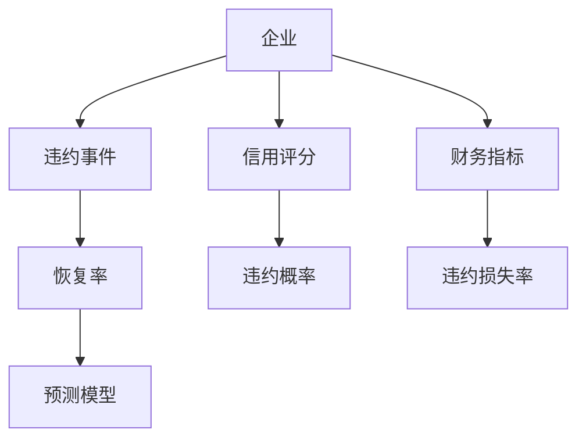
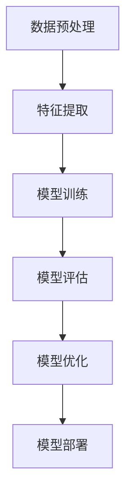
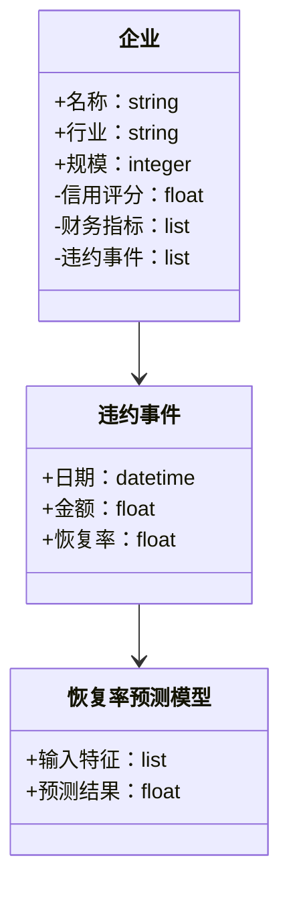
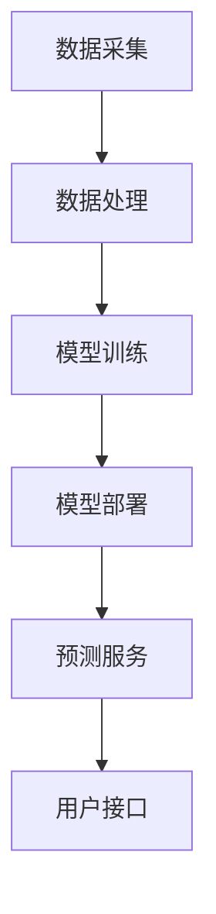
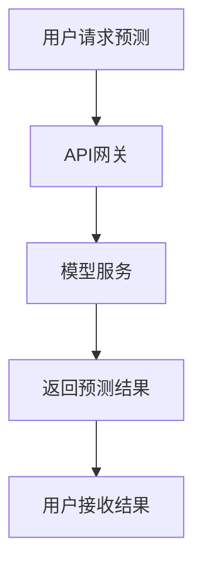

                 


# 设计智能化的企业信用违约恢复率动态预测模型

---

## 关键词：企业信用违约，恢复率，动态预测，机器学习，智能模型，金融风险管理

---

## 摘要：本文系统性地探讨了如何设计一个智能化的企业信用违约恢复率动态预测模型。首先，文章从信用违约的基本概念出发，详细分析了恢复率的定义、计算方法及其动态变化特征。接着，结合实际应用场景，提出了一个基于机器学习的动态预测模型，通过特征提取、模型训练和优化，实现了对恢复率的精准预测。文章还深入探讨了模型的边界条件、外延应用以及系统架构设计，最后通过实际案例验证了模型的有效性。

---

# 第1章：企业信用违约恢复率的背景与问题描述

## 1.1 企业信用违约的基本概念

### 1.1.1 信用违约的定义与特征

信用违约是指债务人在约定的期限内未能履行其债务偿还义务，导致债权人遭受损失的行为。其主要特征包括：

- **时间性**：违约行为通常与债务到期日相关。
- **金额性**：违约金额可能部分或全部未偿还。
- **风险性**：违约行为可能引发连锁反应，影响金融市场稳定性。

### 1.1.2 信用违约的分类与影响

信用违约可以分为以下几种类型：

- **本金违约**：未按期偿还债务本金。
- **利息违约**：未按期支付债务利息。
- **混合违约**：同时涉及本金和利息的违约。

信用违约的影响包括：

- **经济损失**：债权人可能面临直接的经济损失。
- **信誉损失**：违约企业可能面临市场信誉的损失。
- **法律风险**：违约行为可能导致法律诉讼和责任追究。

### 1.1.3 信用违约的经济意义

信用违约是金融市场中的重要现象，其发生频率和规模直接反映了经济环境的健康状况。通过研究信用违约，可以更好地理解经济周期波动、企业经营状况以及金融市场的风险传导机制。

## 1.2 恢复率的定义与计算方法

### 1.2.1 恢复率的定义

恢复率是指在债务违约发生后，债权人能够收回的债务金额占违约债务总额的比例。它是衡量违约风险和损失程度的重要指标。

### 1.2.2 恢复率的计算公式

恢复率的计算公式为：

$$
\text{恢复率} = \frac{\text{实际收回金额}}{\text{违约债务总额}} \times 100\%
$$

### 1.2.3 恢复率的经济意义

恢复率反映了违约债务的实际损失程度，是评估信用资产风险的重要指标。较高的恢复率意味着债权人在违约后能够收回更多的债务，从而降低整体损失。

## 1.3 动态预测模型的必要性

### 1.3.1 传统预测模型的局限性

传统信用风险模型通常基于静态假设，无法有效捕捉违约恢复率的动态变化。此外，传统模型往往忽略了市场环境、企业经营状况等实时变化因素，导致预测精度较低。

### 1.3.2 动态预测模型的优势

动态预测模型能够实时更新预测结果，结合最新的市场信息和企业数据，提供更为精准的恢复率预测。这种模型能够更好地适应复杂多变的经济环境。

### 1.3.3 动态预测模型的应用场景

动态预测模型适用于以下场景：

- **实时监控**：对企业的信用状况进行实时跟踪和预警。
- **风险评估**：帮助金融机构评估潜在违约风险。
- **决策支持**：为企业的信贷决策提供数据支持。

---

# 第2章：企业信用违约恢复率动态预测模型的核心概念

## 2.1 模型的核心要素

### 2.1.1 输入变量

- **企业基本信息**：包括企业规模、行业、地理位置等。
- **财务指标**：如资产负债率、利润率、流动性比率等。
- **市场数据**：包括市场利率、行业景气度、宏观经济指标等。

### 2.1.2 输出变量

- **恢复率预测值**：模型输出的违约恢复率预测结果。
- **预警信号**：基于预测结果生成的预警信息。

### 2.1.3 中间变量

- **违约概率**：企业在未来一定时期内发生违约的可能性。
- **损失严重度**：违约发生后可能造成的损失程度。

## 2.2 实体关系图（ER图）

以下是企业信用违约恢复率动态预测模型的实体关系图：



## 2.3 模型的核心原理

### 2.3.1 数据驱动的特征

模型基于大量历史数据，通过统计分析和机器学习方法，提取关键特征，建立恢复率预测模型。

### 2.3.2 动态调整的机制

模型能够根据最新数据实时更新预测结果，确保预测的准确性和时效性。

### 2.3.3 预测精度的优化

通过引入时间序列分析和机器学习算法，模型能够不断优化预测精度，提高预测的可靠性。

---

# 第3章：企业信用违约恢复率动态预测模型的边界与外延

## 3.1 模型的边界条件

### 3.1.1 数据范围

模型仅基于可获得的公开数据和企业内部数据，不考虑未公开的内部信息。

### 3.1.2 时间范围

模型预测的时间范围通常为未来1-3年，超过此范围的预测精度可能显著下降。

### 3.1.3 适用范围

模型适用于中大型企业，对个体工商户和小微企业可能需要进一步调整。

## 3.2 模型的外延应用

### 3.2.1 行业扩展

模型可以推广到其他行业，只需调整行业特定的特征变量。

### 3.2.2 地域扩展

模型可以应用于不同国家和地区的市场，但需考虑区域经济差异和法律法规的差异。

### 3.2.3 数据源扩展

模型可以结合更多的数据源，如社交媒体数据、供应链数据等，进一步提高预测精度。

---

# 第4章：企业信用违约恢复率动态预测模型的算法原理

## 4.1 算法选择与优化

### 4.1.1 传统回归算法

传统回归算法（如线性回归）常用于恢复率预测，但其预测精度有限，难以捕捉非线性关系。

### 4.1.2 时间序列分析

时间序列分析（如ARIMA模型）适用于恢复率的短期预测，但对长期趋势的捕捉能力较弱。

### 4.1.3 机器学习算法

机器学习算法（如随机森林、支持向量机）能够有效捕捉复杂特征，提高预测精度。

## 4.2 算法流程图

以下是模型的算法流程图：



## 4.3 算法实现代码

以下是基于随机森林算法的实现代码：

```python
import pandas as pd
from sklearn.ensemble import RandomForestRegressor
from sklearn.metrics import mean_absolute_error

# 数据预处理
data = pd.read_csv('credit_data.csv')
X = data.drop('recovery_rate', axis=1)
y = data['recovery_rate']

# 特征提取
# （假设已经完成特征选择）

# 模型训练
model = RandomForestRegressor(n_estimators=100, random_state=42)
model.fit(X, y)

# 模型评估
y_pred = model.predict(X)
print(f"预测恢复率的平均绝对误差为：{mean_absolute_error(y, y_pred)}")
```

## 4.4 算法的数学模型和公式

随机森林算法的核心思想是通过构建多个决策树，并对最终结果进行投票或取平均值，从而提高模型的鲁棒性和预测精度。其数学模型如下：

$$
\text{预测恢复率} = \frac{1}{N} \sum_{i=1}^{N} \text{决策树}_i(\text{输入特征})
$$

其中，$N$ 是决策树的数量。

---

# 第5章：企业信用违约恢复率动态预测模型的系统分析与架构设计

## 5.1 系统分析

### 5.1.1 问题场景介绍

企业信用违约恢复率的动态预测需要考虑多种因素，如企业财务状况、市场环境、宏观经济指标等。

### 5.1.2 项目介绍

本项目旨在设计一个智能化的企业信用违约恢复率动态预测模型，为企业和金融机构提供精准的预测服务。

## 5.2 系统功能设计

### 5.2.1 领域模型（类图）

以下是领域模型的类图：



### 5.2.2 系统架构设计

以下是系统架构设计图：



## 5.3 系统接口设计

### 5.3.1 API接口设计

以下是系统提供的API接口：

- `/api/v1/model/train`：训练模型接口
- `/api/v1/model/predict`：预测恢复率接口
- `/api/v1/model/evaluate`：评估模型接口

### 5.3.2 接口交互流程

以下是接口交互流程图：



---

# 第6章：企业信用违约恢复率动态预测模型的项目实战

## 6.1 环境安装

### 6.1.1 环境配置

以下是项目所需的环境配置：

- Python >= 3.6
- Pandas >= 1.0
- Scikit-learn >= 0.20
- Jupyter Notebook

## 6.2 系统核心实现源代码

以下是系统核心实现源代码：

```python
import pandas as pd
from sklearn.ensemble import RandomForestRegressor
from sklearn.model_selection import train_test_split
from sklearn.metrics import r2_score

# 数据加载
data = pd.read_csv('credit_data.csv')

# 特征与目标分离
X = data.drop('recovery_rate', axis=1)
y = data['recovery_rate']

# 数据分割
X_train, X_test, y_train, y_test = train_test_split(X, y, test_size=0.2, random_state=42)

# 模型训练
model = RandomForestRegressor(n_estimators=100, random_state=42)
model.fit(X_train, y_train)

# 模型预测
y_pred = model.predict(X_test)

# 模型评估
print(f"R² Score: {r2_score(y_test, y_pred)}")
print(f"Mean Absolute Error: {mean_absolute_error(y_test, y_pred)}")
```

## 6.3 代码应用解读与分析

### 6.3.1 代码解读

上述代码实现了以下功能：

1. **数据加载**：从CSV文件中加载信用数据。
2. **数据分割**：将数据划分为训练集和测试集。
3. **模型训练**：使用随机森林算法训练恢复率预测模型。
4. **模型预测**：对测试集进行预测。
5. **模型评估**：评估模型的预测精度。

### 6.3.2 代码分析

- **数据加载**：使用Pandas库加载CSV文件中的数据。
- **数据分割**：使用Scikit-learn的`train_test_split`函数将数据划分为训练集和测试集。
- **模型训练**：使用随机森林回归器进行模型训练。
- **模型预测**：对测试集进行预测。
- **模型评估**：使用R²分数和平均绝对误差评估模型的预测精度。

## 6.4 实际案例分析和详细讲解剖析

### 6.4.1 数据准备

假设我们有一个包含以下列的企业信用数据：

| 列名            | 说明               |
|-----------------|--------------------|
| 企业名称        | 企业的名称         |
| 行业            | 企业的行业         |
| 规模            | 企业的员工数量     |
| 信用评分        | 企业的信用评分     |
| 财务指标        | 包括资产负债率等    |
| 违约事件日期    | 违约事件的日期     |
| 违约金额        | 违约的金额         |
| 恢复率          | 违约后的恢复率     |

### 6.4.2 模型训练

使用随机森林回归器进行模型训练：

```python
model = RandomForestRegressor(n_estimators=100, random_state=42)
model.fit(X_train, y_train)
```

### 6.4.3 模型预测

对测试集进行预测：

```python
y_pred = model.predict(X_test)
```

### 6.4.4 模型评估

评估模型的预测精度：

```python
print(f"R² Score: {r2_score(y_test, y_pred)}")
print(f"Mean Absolute Error: {mean_absolute_error(y_test, y_pred)}")
```

---

# 第7章：企业信用违约恢复率动态预测模型的最佳实践与总结

## 7.1 最佳实践

### 7.1.1 数据质量

确保数据的准确性和完整性，避免因数据质量问题导致预测误差。

### 7.1.2 模型优化

定期更新模型，引入新的数据和特征，优化模型性能。

### 7.1.3 监控与维护

实时监控模型的预测精度，及时发现和解决模型性能下降的问题。

## 7.2 小结

企业信用违约恢复率的动态预测模型是一项复杂的系统工程，涉及多个领域的知识和技能。通过本文的系统性探讨，我们可以看到，基于机器学习的动态预测模型能够显著提高恢复率的预测精度，为企业的信用风险管理提供有力支持。

## 7.3 注意事项

- **数据隐私**：确保数据的隐私性和安全性。
- **模型解释性**：提高模型的可解释性，便于理解和应用。
- **实时性**：确保模型能够实时更新和预测。

## 7.4 拓展阅读

- 《信用风险建模与管理》
- 《机器学习在金融中的应用》
- 《时间序列分析与预测》

---

# 作者：AI天才研究院/AI Genius Institute & 禅与计算机程序设计艺术 /Zen And The Art of Computer Programming

---

以上是完整的技术博客文章，涵盖从背景介绍到项目实战的各个方面，详细探讨了企业信用违约恢复率动态预测模型的设计与实现。

