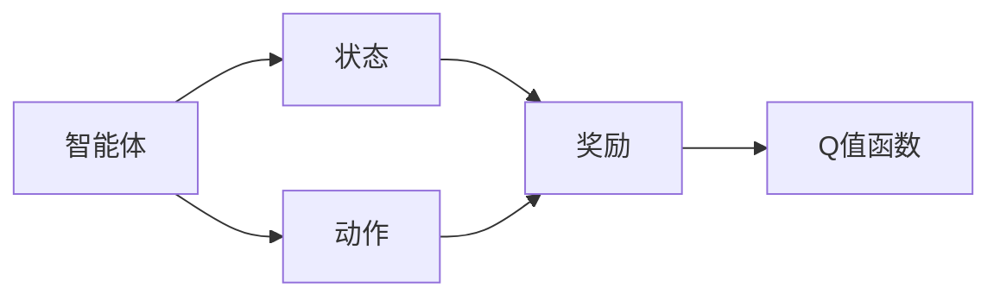
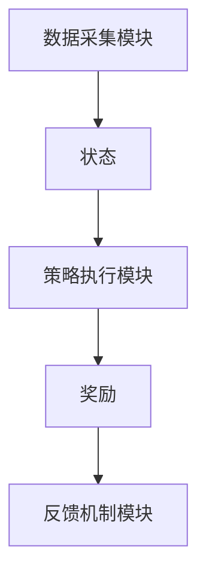

                 


# 《金融领域强化学习在最优执行策略动态调整中的应用》

---

## 关键词
- 强化学习（Reinforcement Learning）
- 金融领域
- 最优执行策略
- 动态调整
- 算法原理
- 系统架构

---

## 摘要
本文探讨了强化学习在金融领域最优执行策略动态调整中的应用。首先，介绍了强化学习的基本概念及其在金融领域的应用背景，详细分析了最优执行策略动态调整的重要性。其次，从核心概念与联系的角度，深入讲解了强化学习的原理及其在金融场景中的具体应用。接着，通过算法原理部分，分析了几种典型的强化学习算法，如DQN和PPO，并结合金融场景进行详细解读。随后，从系统分析与架构设计的角度，展示了如何构建一个基于强化学习的动态调整系统，并提供了具体的系统架构图和接口设计。最后，通过项目实战部分，以动态资产配置为例，详细阐述了从环境搭建到代码实现的完整过程，并总结了实际应用中的经验与教训。本文旨在为金融领域的从业者和技术人员提供理论与实践相结合的深度分析，助力他们在最优执行策略的动态调整中实现更高效、更智能的决策。

---

## 第一部分：背景介绍

### 第1章：强化学习的基本概念

#### 1.1 强化学习的基本概念
##### 1.1.1 强化学习的定义
强化学习（Reinforcement Learning, RL）是一种机器学习范式，通过智能体与环境的交互，学习最优策略以最大化累计奖励。与监督学习和无监督学习不同，强化学习依赖于环境的反馈，通过试错方式优化决策过程。

##### 1.1.2 强化学习的核心要素
- **智能体（Agent）**：智能体是决策的主体，负责根据当前状态选择动作。
- **环境（Environment）**：环境是智能体所处的外部世界，提供状态和奖励。
- **状态（State）**：状态描述了环境在某一时刻的特征。
- **动作（Action）**：智能体在给定状态下做出的行为。
- **奖励（Reward）**：环境对智能体行为的反馈，用于指导智能体调整策略。
- **策略（Policy）**：策略是智能体选择动作的规则，通常以概率分布的形式表示。

##### 1.1.3 强化学习与监督学习的区别
| 特性 | 监督学习 | 强化学习 |
|------|----------|----------|
| 数据 | 标签数据 | 环境反馈 |
| 目标 | 最小化误差 | 最大化奖励 |
| 决策 | 确定性 | 概率性 |

#### 1.2 最优执行策略的动态调整
##### 1.2.1 最优执行策略的定义
最优执行策略是指在特定市场条件下，能够实现收益最大化或风险最小化的操作策略。

##### 1.2.2 动态调整的必要性
金融市场具有高度的不确定性和波动性，传统的静态策略难以应对市场变化，动态调整成为必要。

##### 1.2.3 金融领域中的应用场景
- 股票交易
- 资产配置
- 风险管理
- 市场微观结构分析

#### 1.3 强化学习在金融领域的应用前景
##### 1.3.1 金融领域的复杂性
金融市场受到多种因素影响，包括宏观经济指标、市场情绪、政策变化等。

##### 1.3.2 强化学习的优势
- 能够处理非线性关系
- 适用于高维状态空间
- 适合动态环境下的决策问题

##### 1.3.3 应用中的挑战与机遇
- **挑战**：市场数据稀疏性、策略过拟合、计算资源需求高。
- **机遇**：提升交易效率、优化投资组合、增强风险控制能力。

---

## 第二部分：核心概念与联系

### 第2章：强化学习的原理

#### 2.1 强化学习的原理
##### 2.1.1 马尔可夫决策过程（Markov Decision Process, MDP）
马尔可夫决策过程是一种数学框架，描述了强化学习问题的基本结构。

- **状态空间（S）**：所有可能的状态的集合。
- **动作空间（A）**：智能体在每个状态下可能采取的动作的集合。
- **转移概率（P(s'|s,a)）**：从状态s采取动作a后转移到状态s'的概率。
- **奖励函数（R(s,a)）**：智能体在状态s采取动作a后获得的奖励。

##### 2.1.2 Q-learning
Q-learning是一种经典的强化学习算法，适用于离线学习和无限时间步的情况。

- **Q值更新公式**：
  $$ Q(s,a) = Q(s,a) + \alpha [r + \gamma \max_{a'} Q(s',a') - Q(s,a)] $$

- **Q-learning的优缺点**：
  - 优点：简单易实现，适用于离线环境。
  - 缺点：收敛速度慢，难以处理高维状态空间。

##### 2.1.3 策略梯度（Policy Gradient）
策略梯度方法直接优化策略，通过计算梯度更新参数。

- **策略函数**：
  $$ \pi(a|s) = \text{softmax}(\theta^T \phi(s,a)) $$
  
- **目标函数**：
  $$ J(\theta) = \mathbb{E}[r] $$

- **梯度更新**：
  $$ \theta_{t+1} = \theta_t + \alpha \nabla J(\theta_t) $$

##### 2.1.4 强化学习的金融场景应用
- **交易决策**：智能体根据当前市场状态做出买卖决策。
- **风险管理**：通过策略调整优化风险敞口。
- **资产配置**：动态调整投资组合以应对市场变化。

---

#### 2.2 强化学习的核心概念与联系

##### 2.2.1 核心概念属性对比
| 概念     | 描述                                                                 |
|----------|----------------------------------------------------------------------|
| 状态（S） | 当前环境的特征，用于描述智能体所处的环境状况。                   |
| 动作（A） | 智能体在特定状态下采取的行为，影响环境的状态变化和奖励。         |
| 奖励（R） | 环境对智能体行为的反馈，用于指导策略优化。                      |
| 策略（π） | 智能体选择动作的规则，最大化累计奖励。                          |
| Q值函数  | 表示在状态s采取动作a后的期望累计奖励。                         |

##### 2.2.2 实体关系图
使用Mermaid绘制强化学习的实体关系图：



---

## 第三部分：算法原理

### 第3章：典型强化学习算法解析

#### 3.1 DQN算法原理
##### 3.1.1 DQN算法框架
- **经验回放**：将历史经验存储在记忆库中，随机抽取进行训练，避免顺序偏差。
- **网络结构**：使用两个深度神经网络，一个作为主网络，一个作为目标网络。
- **算法流程**：
  1. 环境提供当前状态s。
  2. 智能体选择动作a（基于ε-greedy策略）。
  3. 执行动作a，获得新状态s'和奖励r。
  4. 将经验(s, a, r, s')存储在记忆库。
  5. 从记忆库随机抽取小批量经验，计算目标Q值。
  6. 更新主网络的参数，以最小化预测Q值与目标Q值的差。

##### 3.1.2 DQN的数学模型
- **目标网络**：
  $$ Q_{\text{target}}(s', a') = \gamma Q_{\text{target}}(s', a') + r $$
  
- **损失函数**：
  $$ \mathcal{L} = \mathbb{E}[(Q_{\text{pred}}(s,a) - Q_{\text{target}}(s,a))^2] $$

- **网络结构图**：
  ```mermaid
  graph TD
      A[智能体] --> S1[状态s]
      S1 --> M[记忆库]
      M --> B[批量经验]
      B --> Qpred[主网络]
      B --> Qtarget[目标网络]
      Qpred --> L[损失函数]
      Qtarget --> L
  ```

##### 3.1.3 DQN的优缺点
- **优点**：适用于离线环境，能够处理高维状态空间。
- **缺点**：收敛速度慢，难以处理复杂的金融场景。

#### 3.2 PPO算法原理
##### 3.2.1 PPO算法框架
- **策略优化**：通过优化策略参数，最大化累计奖励。
- **优势函数**：引入优势函数，衡量动作的好坏。
- **截断策略**：通过截断技术，防止策略更新过大。

##### 3.2.2 PPO的数学模型
- **优势函数**：
  $$ A(s,a) = r + \gamma Q(s',a) - Q(s,a) $$
  
- **目标函数**：
  $$ J(\theta) = \mathbb{E}[A(s,a)\ln \pi(a|s) - \lambda \text{KL}( \pi_{\theta} \| \pi) ] $$

- **网络结构图**：
  ```mermaid
  graph TD
      A[智能体] --> S1[状态s]
      S1 --> Qpred[主网络]
      Qpred --> A[优势函数]
      A --> L[损失函数]
  ```

##### 3.2.3 PPO的优缺点
- **优点**：收敛速度快，适用于在线环境。
- **缺点**：计算资源需求较高。

---

## 第四部分：系统分析与架构设计

### 第4章：系统分析与架构设计

#### 4.1 问题场景介绍
- **目标**：构建一个动态调整最优执行策略的系统。
- **应用场景**：实时交易决策、动态资产配置。

#### 4.2 系统功能设计
##### 4.2.1 功能模块
- **数据采集模块**：收集市场数据。
- **策略执行模块**：根据当前状态选择动作。
- **反馈机制模块**：计算奖励并更新策略。

##### 4.2.2 功能模块类图


#### 4.3 系统架构设计
##### 4.3.1 系统架构图


##### 4.3.2 接口设计
- **输入接口**：市场数据接口。
- **输出接口**：交易指令接口。

##### 4.3.3 交互流程图


---

## 第五部分：项目实战

### 第5章：项目实战

#### 5.1 动态资产配置案例
##### 5.1.1 案例介绍
动态资产配置是指根据市场变化调整投资组合，以实现收益最大化或风险最小化。

##### 5.1.2 环境搭建
- **工具**：Python、TensorFlow、Keras。
- **数据来源**：历史股价数据、市场指标。

##### 5.1.3 代码实现
```python
import numpy as np
import tensorflow as tf

class DQN:
    def __init__(self, state_space, action_space):
        self.state_space = state_space
        self.action_space = action_space
        self.memory = []
        self.gamma = 0.95
        self.epsilon = 0.1
        self.model = self.build_model()

    def build_model(self):
        model = tf.keras.Sequential([
            tf.keras.layers.Dense(64, activation='relu'),
            tf.keras.layers.Dense(self.action_space, activation='linear')
        ])
        model.compile(optimizer='adam', loss='mse')
        return model

    def remember(self, state, action, reward, next_state):
        self.memory.append((state, action, reward, next_state))

    def act(self, state):
        if np.random.random() < self.epsilon:
            return np.random.randint(self.action_space)
        q_values = self.model.predict(state)
        return np.argmax(q_values[0])

    def replay(self, batch_size):
        if len(self.memory) < batch_size:
            return
        batch = np.random.choice(self.memory, batch_size)
        states = np.array([b[0] for b in batch])
        actions = np.array([b[1] for b in batch])
        rewards = np.array([b[2] for b in batch])
        next_states = np.array([b[3] for b in batch])

        target = self.model.predict(next_states)
        target[range(batch_size), actions] = rewards + self.gamma * np.max(target, axis=1)
        self.model.fit(states, target, epochs=1, verbose=0)
```

##### 5.1.4 案例分析与总结
- **案例分析**：通过实验验证动态资产配置策略的有效性。
- **总结**：强化学习能够显著提升资产配置的效果，但在实际应用中需要考虑市场摩擦和交易成本。

---

## 第六部分：最佳实践

### 第6章：最佳实践

#### 6.1 小结
- 强化学习在金融领域的应用前景广阔。
- 动态调整最优执行策略是提升交易效率和投资收益的关键。

#### 6.2 注意事项
- 数据质量：确保市场数据的准确性和及时性。
- 策略过拟合：避免过度优化特定场景。
- 计算资源：强化学习算法对计算资源需求较高。

#### 6.3 拓展阅读
- 《Reinforcement Learning: Theory and Algorithms》
- 《Deep Reinforcement Learning in Financial Markets》

---

## 作者：AI天才研究院/AI Genius Institute & 禅与计算机程序设计艺术/Zen And The Art of Computer Programming

---

**注**：由于篇幅限制，上述目录和内容仅为示例，实际撰写时需根据具体需求进一步扩展和详细化。

