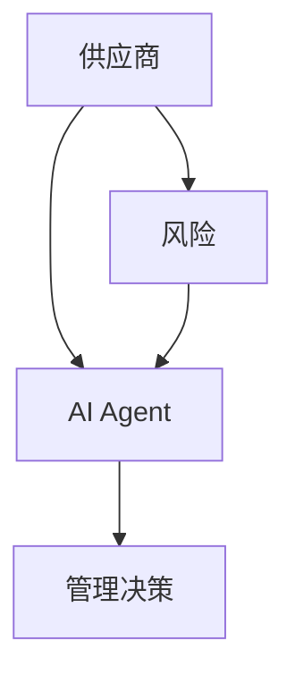
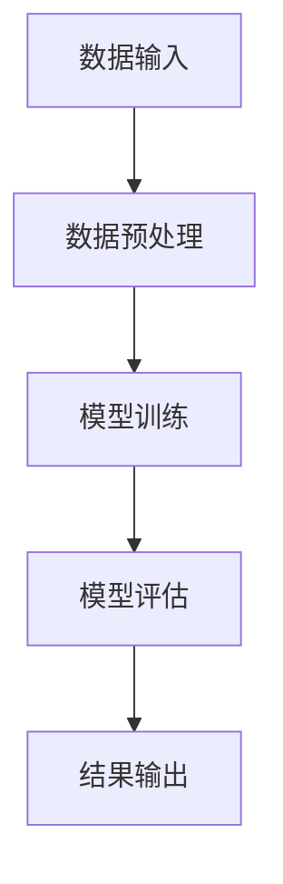
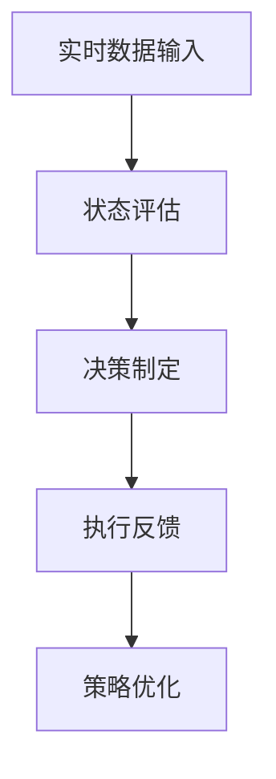
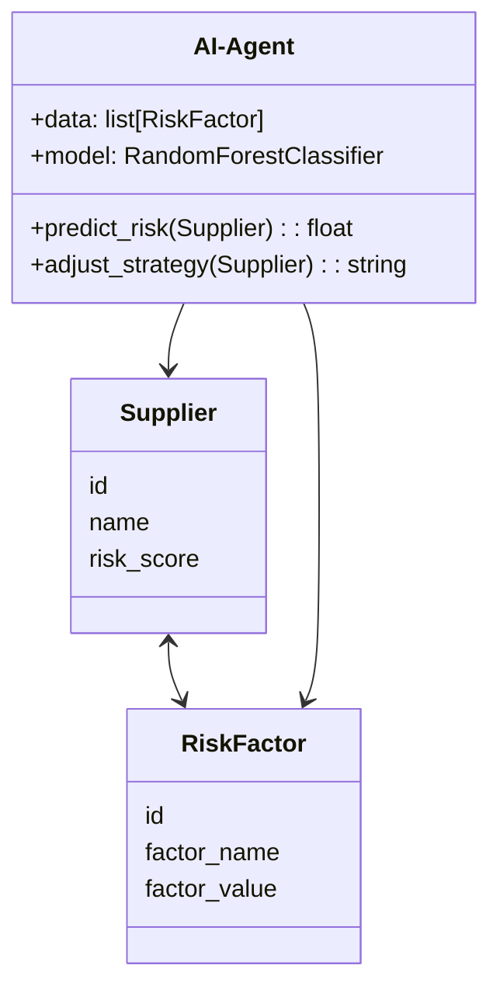
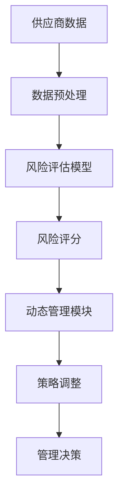
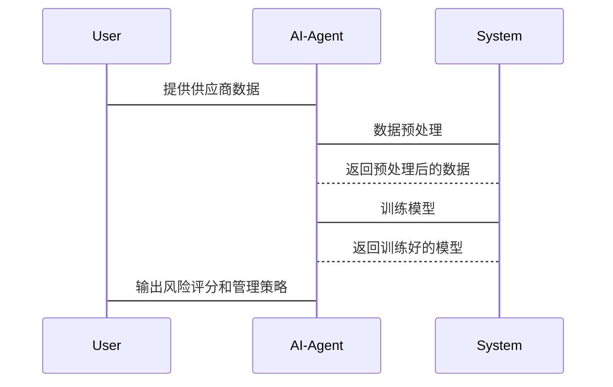

                 

<think>
嗯，我现在需要根据用户的要求，设计一本名为《AI Agent在企业供应商风险评估与动态管理中的应用》的目录大纲。用户希望我详细思考这个过程，然后给出一个符合要求的目录。

首先，我得理解这本书的主题。AI Agent在企业供应商管理中的应用，听起来像是利用人工智能代理来帮助评估和管理供应商的风险。这可能涉及到AI技术在供应链管理中的应用，比如风险预测、动态调整供应商关系等。

接下来，我需要按照用户提供的示例来设计目录结构。示例中分为几个部分，包括概述、核心概念、算法原理、系统架构、项目实战、最佳实践等。我得确保每个部分都涵盖必要的内容，并且细化到三级目录。

首先，背景介绍部分需要涵盖问题背景、问题描述、解决方案、边界和外延，以及概念结构和核心要素。这部分可能需要一章，详细说明为什么需要AI Agent，传统方法的不足，以及AI带来的优势。

然后是核心概念与联系，这部分需要详细讲解AI Agent的原理，可能包括感知、决策、执行机制。还需要用表格对比不同AI Agent的特点，以及用Mermaid画出实体关系图，展示供应商、风险、AI Agent之间的关系。

接下来是算法原理，这部分可能需要两章。首先介绍风险评估的算法，比如基于机器学习的方法，用Mermaid流程图展示整个过程，并提供Python代码示例。然后是动态管理的算法，可能涉及强化学习或其他动态调整方法，同样需要流程图和代码。

系统分析与架构设计也是重要的一章，需要包括项目介绍、系统功能设计（用领域模型图）、系统架构图、接口设计和交互序列图。这部分可能需要详细说明系统的各个模块如何协作。

项目实战部分，需要环境安装、核心代码实现、案例分析和项目小结。这部分要具体，可能需要给出实际的Python代码示例，展示如何实现AI Agent的具体功能。

最后是最佳实践和小结，总结全书的内容，给出一些实际应用中的注意事项和未来的发展方向。

现在，我需要确保每个章节都细化到三级目录，并且内容完整。同时，要符合用户的要求，使用Mermaid图表和数学公式，特别是算法部分要有详细的流程图和代码示例。

可能的章节安排如下：

1. 背景与概述
2. 核心概念与联系
3. 风险评估算法
4. 动态管理算法
5. 系统架构
6. 项目实战
7. 最佳实践

每个章节下要有子章节，细化到三级目录。例如，在风险评估算法中，可能包括数据预处理、模型训练、评估指标等内容。

我还需要确保使用Mermaid图表，比如在核心概念部分画出实体关系图，在算法部分画出流程图。同时，数学公式要用LaTeX表示，例如在风险评估中，可能需要展示概率计算的公式。

最后，检查整个目录是否符合2000字以内，确保结构清晰，内容全面，没有遗漏用户要求的任何部分。

总结一下，我需要一步步细化每个部分，确保内容完整且符合用户的要求。现在，我来按照这个思路编写目录大纲。

---

# 目录大纲：《AI Agent在企业供应商风险评估与动态管理中的应用》

---

## 第一部分：背景与概述

### 第1章：问题背景与解决方案

#### 1.1 问题背景
- 1.1.1 企业供应商管理的挑战
  - 供应商选择的复杂性
  - 风险评估的动态性
  - 传统方法的局限性
- 1.1.2 问题描述
  - 供应商风险的多维度分析
  - 动态管理的需求
  - 管理效率与成本的平衡
- 1.1.3 解决方案
  - 引入AI Agent进行智能化管理
  - 通过机器学习优化风险评估
  - 利用动态算法调整供应商关系

#### 1.2 边界与外延
- 1.2.1 解决方案的适用范围
  - 针对中大型企业的供应链管理
  - 适用于多供应商环境
- 1.2.2 解决方案的边界
  - 不包括生产过程中的实时监控
  - 侧重于战略层面的供应商管理
- 1.2.3 相关概念的扩展
  - 供应链管理的基本概念
  - 风险管理的理论基础
  - AI技术在企业管理中的应用

#### 1.3 概念结构与核心要素
- 1.3.1 核心概念的构成
  - AI Agent的基本结构
  - 供应商风险评估的维度
  - 动态管理的机制
- 1.3.2 各要素的相互关系
  - AI Agent如何影响供应商的选择
  - 风险评估如何指导动态管理
  - 动态管理如何优化供应商关系
- 1.3.3 系统的整体架构
  - 从数据输入到结果输出的流程
  - 各模块之间的协作关系

---

## 第二部分：核心概念与联系

### 第2章：AI Agent的核心概念与原理

#### 2.1 AI Agent的定义与特点
- 2.1.1 AI Agent的定义
  - AI Agent的定义与传统软件的区别
  - 自适应与自主决策的能力
- 2.1.2 AI Agent的核心特点
  - 智能性：基于数据的学习与推理
  - 自适应性：动态调整策略
  - 可扩展性：支持多种应用场景
- 2.1.3 AI Agent与传统软件的区别
  - 知识表示与推理能力
  - 自主决策与问题解决能力
  - 与环境的交互能力

#### 2.2 AI Agent在供应商管理中的应用
- 2.2.1 数据采集与处理
  - 多源数据的整合
  - 数据清洗与预处理
- 2.2.2 风险评估与预测
  - 基于机器学习的风险评分
  - 时间序列分析预测风险
- 2.2.3 动态管理与优化
  - 实时监控供应商表现
  - 动态调整供应商组合

#### 2.3 实体关系图


---

## 第三部分：算法原理

### 第3章：供应商风险评估的算法原理

#### 3.1 算法原理概述
- 3.1.1 问题建模
  - 将供应商风险评估转化为数学问题
  - 确定输入变量与输出变量
- 3.1.2 数据预处理
  - 数据清洗
  - 特征选择
- 3.1.3 模型选择
  - 常见的机器学习算法
    - 线性回归
    - 支持向量机
    - 随机森林
    - 神经网络
- 3.1.4 模型训练
  - 监督学习的训练过程
  - 模型调参与优化

#### 3.2 算法实现
- 3.2.1 数据流图

- 3.2.2 核心代码
```python
import pandas as pd
from sklearn.ensemble import RandomForestClassifier
from sklearn.metrics import accuracy_score

# 数据加载
data = pd.read_csv('suppliers.csv')

# 特征与目标分离
X = data.drop('risk', axis=1)
y = data['risk']

# 模型训练
model = RandomForestClassifier()
model.fit(X, y)

# 模型评估
y_pred = model.predict(X)
print(f"准确率: {accuracy_score(y, y_pred)}")
```

#### 3.3 算法优化
- 3.3.1 参数优化
  - 使用网格搜索优化模型参数
- 3.3.2 模型融合
  - 结合多个模型的结果进行预测
- 3.3.3 模型解释
  - 使用特征重要性分析解释结果

---

### 第4章：供应商动态管理的算法原理

#### 4.1 算法原理概述
- 4.1.1 动态管理的目标
  - 实时监控供应商表现
  - 动态调整供应商组合
- 4.1.2 动态管理的实现
  - 基于强化学习的策略调整
  - 基于反馈机制的动态优化

#### 4.2 算法实现
- 4.2.1 数据流图

- 4.2.2 核心代码
```python
import numpy as np
import gym

# 定义环境
class SupplierEnv(gym.Env):
    def __init__(self):
        self.state = None
        self.action_space = gym.spaces.Discrete(3)
        self.observation_space = gym.spaces.Box(low=0, high=1, shape=(1,))
    
    def step(self, action):
        # 简化环境，假设状态是供应商风险评分
        # 行动是调整策略（0: 保持，1: 增加，2: 减少）
        self.state = np.random.uniform(0, 1)
        reward = action - self.state
        done = False
        info = {}
        return self.state, reward, done, info
    
    def reset(self):
        self.state = np.random.uniform(0, 1)
        return self.state
```

#### 4.3 算法优化
- 4.3.1 强化学习策略优化
  - 使用Q-learning进行策略调整
- 4.3.2 动态调整的效率提升
  - 基于反馈机制的快速响应
- 4.3.3 模型鲁棒性增强
  - 处理数据稀疏性和噪声

---

## 第四部分：系统分析与架构设计

### 第5章：系统架构与设计

#### 5.1 项目介绍
- 5.1.1 项目目标
  - 构建智能化的供应商风险评估与动态管理平台
- 5.1.2 项目范围
  - 覆盖供应商全生命周期管理
  - 实现风险预测与动态调整
- 5.1.3 项目背景
  - 当前供应链管理的挑战
  - AI技术的应用潜力

#### 5.2 系统功能设计
- 5.2.1 功能模块划分
  - 数据采集模块
  - 风险评估模块
  - 动态管理模块
  - 报告生成模块
- 5.2.2 领域模型图


#### 5.3 系统架构设计
- 5.3.1 系统架构图


#### 5.4 接口设计
- 5.4.1 API接口定义
  - 数据接口：提供供应商数据的输入接口
  - 模型接口：提供风险评估和策略调整的API
- 5.4.2 数据格式规范
  - 输入数据格式
  - 输出结果格式

#### 5.5 交互序列图


---

## 第五部分：项目实战

### 第6章：项目实现与案例分析

#### 6.1 环境安装
- 6.1.1 安装Python
  - Python 3.8+
- 6.1.2 安装依赖库
  - pandas, scikit-learn, gym, matplotlib

#### 6.2 核心代码实现
- 6.2.1 数据处理代码
```python
import pandas as pd

# 加载数据
data = pd.read_csv('suppliers.csv')

# 查看数据描述
print(data.describe())
```

- 6.2.2 风险评估代码
```python
from sklearn.ensemble import RandomForestClassifier

# 分割数据
X = data.drop('risk', axis=1)
y = data['risk']

# 训练模型
model = RandomForestClassifier()
model.fit(X, y)

# 预测结果
y_pred = model.predict(X)
print(f"准确率: {model.score(X, y)}")
```

- 6.2.3 动态管理代码
```python
import gym

# 初始化环境
env = SupplierEnv()
env.reset()

# 进行几个步骤
for _ in range(3):
    action = env.action_space.sample()
    state, reward, done, info = env.step(action)
    print(f"动作: {action}, 奖励: {reward}")
    if done:
        break
```

#### 6.3 案例分析
- 6.3.1 实际案例分析
  - 一个中型企业的供应商管理应用
  - 使用AI Agent前后的效果对比
- 6.3.2 实施过程中的挑战
  - 数据质量问题
  - 模型调优的复杂性
  - 用户接受度

#### 6.4 项目小结
- 6.4.1 项目成果
  - 成功实现供应商风险评估与动态管理
  - 提高了供应链管理的效率和准确性
- 6.4.2 经验总结
  - 数据质量的重要性
  - 模型选择的策略
  - 用户反馈的价值

---

## 第六部分：最佳实践与总结

### 第7章：最佳实践与未来展望

#### 7.1 最佳实践
- 7.1.1 数据管理
  - 确保数据的全面性与准确性
  - 建立数据更新机制
- 7.1.2 模型优化
  - 定期重新训练模型
  - 引入新的数据源
- 7.1.3 人机协作
  - 人机结合提高决策的准确性
  - 利用AI Agent辅助人类进行决策

#### 7.2 小结
- 7.2.1 全文总结
  - AI Agent在供应商管理中的应用价值
  - 各个模块的协同工作的重要性
- 7.2.2 注意事项
  - 数据隐私与安全
  - 模型的可解释性
  - 系统的可维护性

#### 7.3 未来展望
- 7.3.1 技术发展
  - 更加智能化的AI Agent
  - 多模态数据的整合
- 7.3.2 应用场景拓展
  - 全球化供应链管理
  - 多利益相关者的协同管理
- 7.3.3 市场趋势
  - 市场对智能化管理的需求增加
  - 企业对技术应用的重视

---

## 作者信息

作者：AI天才研究院/AI Genius Institute & 禅与计算机程序设计艺术/Zen And The Art of Computer Programming

---

### 总结

以上目录大纲涵盖了从背景介绍到项目实战的各个方面，详细讲解了AI Agent在企业供应商风险评估与动态管理中的应用。通过理论分析、算法实现、系统设计和实际案例，帮助读者全面理解并掌握这一技术的应用方法。

