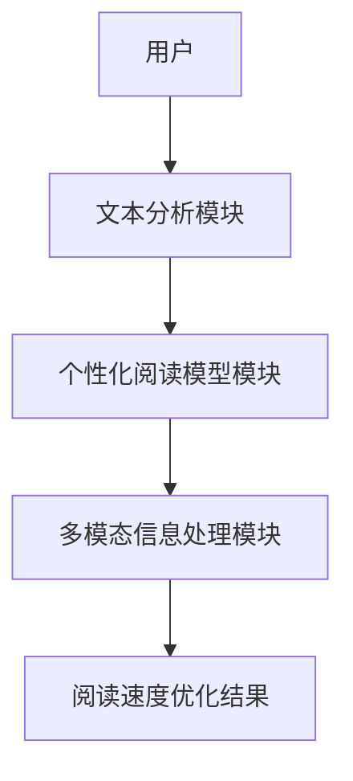

                 


---

# AI Agent在智能书立中的阅读速度优化

## 关键词：AI Agent，阅读速度优化，智能书立，自然语言处理，算法优化，系统架构设计

## 摘要：本文详细探讨了AI Agent在智能书立中的阅读速度优化方法，通过分析阅读速度优化的核心概念、算法原理和系统架构设计，结合实际项目案例，展示了如何利用AI技术提升阅读效率。

---

## 第1章: AI Agent与智能书立的背景介绍

### 1.1 AI Agent的核心概念

#### 1.1.1 AI Agent的定义与特点

AI Agent（人工智能代理）是指能够感知环境、自主决策并执行任务的智能实体。它具备以下特点：

- **自主性**：能够在没有外部干预的情况下自主运作。
- **反应性**：能够实时感知环境变化并做出响应。
- **目标导向性**：具有明确的目标，并能够采取行动实现这些目标。
- **学习能力**：能够通过数据和经验不断优化自身的性能。

#### 1.1.2 智能书立的基本概念

智能书立是一种结合了人工智能技术的电子阅读工具，能够根据用户的阅读习惯和文本内容，动态调整阅读速度和阅读方式，以提高阅读效率。它通常包括以下功能：

- **文本分析**：对阅读内容进行结构化分析，识别关键信息和复杂部分。
- **个性化推荐**：根据用户的阅读习惯和兴趣，推荐合适的阅读材料。
- **阅读速度调整**：根据文本难度和用户阅读能力，自动调整阅读速度。

#### 1.1.3 阅读速度优化的背景与意义

随着信息量的爆炸式增长，人们需要更高效地处理大量信息。传统的阅读方式已经无法满足现代人快速获取知识的需求。AI Agent通过优化阅读速度和阅读方式，能够在有限的时间内帮助用户获取更多的信息，提升学习和工作效率。

---

### 1.2 AI Agent在智能书立中的作用

#### 1.2.1 AI Agent的智能化特性

AI Agent在智能书立中的应用主要体现在以下几个方面：

- **智能化文本分析**：利用自然语言处理技术，对文本内容进行深度分析，识别关键词、主题和情感倾向。
- **个性化阅读策略**：根据用户的阅读习惯和认知能力，制定个性化的阅读计划。
- **动态调整阅读速度**：根据文本的复杂程度和用户的理解能力，实时调整阅读速度。

#### 1.2.2 阅读速度优化的目标与价值

阅读速度优化的目标是通过AI技术，帮助用户在最短时间内获取最大信息量。其价值体现在以下几个方面：

- **提高学习效率**：通过优化阅读速度和阅读策略，用户能够更快地掌握所需知识。
- **降低认知负荷**：通过动态调整阅读速度，避免信息过载，提高阅读体验。
- **提升工作效率**：在工作场景中，AI Agent可以帮助用户快速浏览大量文档，节省时间。

#### 1.2.3 智能书立的应用场景与边界

智能书立的应用场景包括：

- **学习场景**：学生可以通过智能书立快速学习新知识。
- **工作场景**：职场人士可以通过智能书立快速阅读工作报告和文献资料。
- **娱乐场景**：用户可以通过智能书立快速阅读小说和其他娱乐内容。

智能书立的边界主要体现在以下方面：

- **文本类型限制**：目前主要适用于结构化文本，对于非结构化文本的处理能力有限。
- **用户适应性**：需要用户有一定的阅读能力和认知能力，才能充分发挥智能书立的优势。
- **技术限制**：受到当前AI技术的限制，智能书立的阅读优化效果仍有提升空间。

---

## 1.3 本章小结

本章主要介绍了AI Agent的核心概念、智能书立的基本概念以及阅读速度优化的背景和意义。通过这些内容，我们明确了AI Agent在智能书立中的作用和价值，为后续章节的深入分析奠定了基础。

---

## 第2章: AI Agent与阅读速度优化的核心概念

### 2.1 AI Agent的核心原理

#### 2.1.1 AI Agent的基本工作流程

AI Agent的基本工作流程可以分为以下几个步骤：

1. **感知环境**：通过传感器或其他输入设备感知环境信息。
2. **目标识别**：根据感知的信息，识别目标和任务。
3. **决策制定**：基于目标和环境信息，制定具体的行动方案。
4. **行动执行**：根据决策结果执行相应的动作。
5. **反馈学习**：根据执行结果进行反馈，优化自身的决策和行动策略。

#### 2.1.2 基于自然语言处理的阅读优化

基于自然语言处理的阅读优化主要涉及以下几个步骤：

1. **文本预处理**：对文本进行分词、句法分析等处理，提取关键信息。
2. **文本分析**：利用自然语言处理技术，分析文本的主题、情感倾向和结构。
3. **阅读速度预测**：根据文本的复杂程度和用户的阅读能力，预测最佳阅读速度。

#### 2.1.3 AI Agent的决策机制

AI Agent的决策机制主要包括以下几个方面：

- **环境感知**：通过多种传感器感知环境信息。
- **信息处理**：对感知到的信息进行分析和处理，提取关键特征。
- **决策制定**：基于处理后的信息，制定具体的行动方案。
- **行动执行**：根据决策结果执行相应的动作，并实时调整决策策略。

---

### 2.2 阅读速度优化的关键技术

#### 2.2.1 文本分析与结构化

文本分析与结构化是阅读速度优化的基础，主要包括以下内容：

- **文本分词**：将连续的文本分割成有意义的词汇或短语。
- **句法分析**：分析句子的结构和语法关系。
- **语义分析**：理解文本的语义含义，识别关键词和主题。

#### 2.2.2 个性化阅读速度模型

个性化阅读速度模型是根据用户的阅读习惯和认知能力，制定个性化的阅读速度策略。具体步骤如下：

1. **用户画像构建**：根据用户的阅读历史和行为数据，构建用户画像。
2. **阅读能力评估**：通过测试和分析，评估用户的阅读能力。
3. **阅读速度预测**：根据用户画像和阅读能力，预测最佳阅读速度。

#### 2.2.3 多模态信息处理

多模态信息处理是指同时利用多种信息源（如文本、语音、图像等）进行信息处理，以提高系统的准确性和鲁棒性。在阅读速度优化中，多模态信息处理主要体现在以下几个方面：

- **文本与语音结合**：通过语音辅助阅读，提高阅读速度和理解能力。
- **文本与图像结合**：利用图像识别技术，辅助阅读理解和信息提取。

---

### 2.3 核心概念对比分析

#### 2.3.1 AI Agent与传统阅读工具的对比

以下是AI Agent与传统阅读工具的对比分析：

| 对比维度         | AI Agent                     | 传统阅读工具               |
|------------------|------------------------------|---------------------------|
| 功能             | 文本分析、个性化推荐、动态调整阅读速度 | 提供固定的阅读模式         |
| 技术基础         | 自然语言处理、机器学习       | 基于简单的文本处理技术     |
| 用户体验         | 更加智能化、个性化            | 功能相对单一                |
| 适应性           | 高度适应不同用户需求         | 适应性较低                 |

#### 2.3.2 阅读速度优化与阅读效率提升的关系

阅读速度优化是通过调整阅读速度和阅读策略，提高阅读效率。两者的关系可以表示为：

$$ \text{阅读效率} = \text{阅读速度} \times \text{理解深度} $$

通过优化阅读速度，可以在短时间内获取更多的信息，从而提高阅读效率。

#### 2.3.3 智能书立与其他阅读辅助工具的差异

智能书立与其他阅读辅助工具的主要差异体现在以下几个方面：

- **智能化程度**：智能书立具备更强的自主学习和决策能力。
- **个性化推荐**：智能书立能够根据用户需求推荐相关阅读内容。
- **动态调整能力**：智能书立可以根据文本复杂性和用户认知能力，动态调整阅读速度。

---

### 2.4 本章小结

本章主要介绍了AI Agent的核心原理、阅读速度优化的关键技术以及核心概念的对比分析。通过对这些内容的探讨，我们进一步明确了AI Agent在智能书立中的重要作用，为后续章节的深入分析奠定了基础。

---

## 第3章: AI Agent的算法原理与实现

### 3.1 算法原理概述

#### 3.1.1 基于自然语言处理的文本分析

基于自然语言处理的文本分析主要涉及以下几个步骤：

1. **文本预处理**：对文本进行分词、去停用词等处理。
2. **文本表示**：将文本转换为向量表示，以便计算机处理。
3. **文本分析**：利用自然语言处理技术，分析文本的主题、情感倾向和结构。

#### 3.1.2 个性化阅读速度模型的构建

个性化阅读速度模型的构建过程如下：

1. **用户数据收集**：收集用户的阅读历史、阅读速度和阅读习惯等数据。
2. **数据预处理**：对收集到的数据进行清洗和特征提取。
3. **模型训练**：利用机器学习算法，训练个性化阅读速度模型。
4. **模型优化**：通过调整模型参数和优化算法，提高模型的预测准确率。

#### 3.1.3 多模态信息处理算法

多模态信息处理算法主要涉及以下几个方面：

1. **多模态数据融合**：将文本、语音、图像等多种信息源进行融合，提高系统的准确性和鲁棒性。
2. **模态间关联分析**：分析不同模态之间的关联关系，优化信息处理效果。
3. **多模态信息检索**：基于多模态数据，进行信息检索和推荐。

---

### 3.2 算法实现流程

#### 3.2.1 文本预处理

文本预处理是自然语言处理的基础步骤，主要包括以下几个方面：

1. **分词**：将连续的文本分割成有意义的词汇或短语。
2. **去停用词**：去除对文本理解影响较小的词汇，如“的”、“了”等。
3. **词干提取**：提取词汇的词干，去除词缀。
4. **向量化**：将文本转换为向量表示，以便计算机处理。

#### 3.2.2 阅读速度预测模型的训练

阅读速度预测模型的训练过程如下：

1. **数据准备**：收集和整理用户的阅读历史数据，包括阅读速度、阅读内容和阅读时间等。
2. **数据预处理**：对收集到的数据进行清洗和特征提取。
3. **模型选择**：选择适合的机器学习算法，如线性回归、支持向量机（SVM）或随机森林等。
4. **模型训练**：利用训练数据，训练阅读速度预测模型。
5. **模型评估**：通过测试数据，评估模型的预测准确率和性能。

#### 3.2.3 模型优化与调参

模型优化与调参是提高模型性能的重要步骤，主要包括以下几个方面：

1. **参数调整**：通过调整模型的参数，优化模型的性能。
2. **模型调优**：通过交叉验证等方法，选择最优的模型参数。
3. **特征工程**：通过增加或删除特征，优化模型的性能。

---

### 3.3 算法实现的数学模型

#### 3.3.1 文本相似度计算公式

文本相似度计算公式可以表示为：

$$ \text{similarity}(x, y) = \frac{x \cdot y}{\|x\| \|y\|} $$

其中，\( x \) 和 \( y \) 分别表示两个文本的向量表示。

#### 3.3.2 阅读速度预测模型的损失函数

阅读速度预测模型的损失函数可以表示为：

$$ \mathcal{L} = \frac{1}{n}\sum_{i=1}^{n} (y_i - \hat{y}_i)^2 $$

其中，\( y_i \) 表示真实值，\( \hat{y}_i \) 表示预测值。

#### 3.3.3 多模态融合的权重分配公式

多模态融合的权重分配公式可以表示为：

$$ w_1x_1 + w_2x_2 + \dots + w_nx_n $$

其中，\( w_i \) 表示第 \( i \) 个模态的权重，\( x_i \) 表示第 \( i \) 个模态的特征向量。

---

### 3.4 本章小结

本章主要介绍了AI Agent的算法原理与实现，包括基于自然语言处理的文本分析、个性化阅读速度模型的构建以及多模态信息处理算法。通过对这些内容的探讨，我们进一步理解了AI Agent在智能书立中的技术实现。

---

## 第4章: 智能书立的系统架构设计

### 4.1 系统功能模块划分

#### 4.1.1 文本分析模块

文本分析模块是智能书立的核心模块，主要负责对文本内容进行结构化分析，提取关键信息。具体功能如下：

1. **文本预处理**：对文本进行分词、去停用词等处理。
2. **文本表示**：将文本转换为向量表示，以便计算机处理。
3. **文本分析**：利用自然语言处理技术，分析文本的主题、情感倾向和结构。

#### 4.1.2 个性化阅读模型模块

个性化阅读模型模块主要负责根据用户的阅读习惯和认知能力，制定个性化的阅读计划。具体功能如下：

1. **用户数据收集**：收集用户的阅读历史、阅读速度和阅读习惯等数据。
2. **数据预处理**：对收集到的数据进行清洗和特征提取。
3. **模型训练**：利用机器学习算法，训练个性化阅读速度模型。
4. **模型优化**：通过调整模型参数和优化算法，提高模型的预测准确率。

#### 4.1.3 多模态信息处理模块

多模态信息处理模块主要负责处理多种信息源，提高系统的准确性和鲁棒性。具体功能如下：

1. **多模态数据融合**：将文本、语音、图像等多种信息源进行融合，提高系统的准确性和鲁棒性。
2. **模态间关联分析**：分析不同模态之间的关联关系，优化信息处理效果。
3. **多模态信息检索**：基于多模态数据，进行信息检索和推荐。

---

### 4.2 系统架构设计

#### 4.2.1 系统架构

以下是智能书立的系统架构图：



从上图可以看出，智能书立的系统架构主要包括以下几个部分：

1. **用户输入**：用户输入阅读内容和需求。
2. **文本分析模块**：对文本进行预处理和分析，提取关键信息。
3. **个性化阅读模型模块**：根据用户需求和分析结果，制定个性化阅读计划。
4. **多模态信息处理模块**：处理多种信息源，优化阅读体验。
5. **阅读速度优化结果**：输出优化后的阅读速度和阅读计划。

---

### 4.3 本章小结

本章主要介绍了智能书立的系统架构设计，包括功能模块划分和系统架构图。通过对这些内容的探讨，我们进一步理解了AI Agent在智能书立中的系统实现。

---

## 5章: 项目实战

### 5.1 环境安装

要实现智能书立的阅读速度优化，首先需要安装以下环境：

1. **Python**：建议使用Python 3.6或更高版本。
2. **自然语言处理库**：如spaCy、NLTK等。
3. **机器学习库**：如Scikit-learn、XGBoost等。
4. **其他依赖库**：如Pandas、NumPy等。

安装命令如下：

```bash
pip install spacy scikit-learn xgboost pandas numpy
python -m spacy download en_core_web_sm
```

---

### 5.2 系统核心实现源代码

以下是智能书立的核心实现源代码：

```python
import spacy
from sklearn.model_selection import train_test_split
from sklearn.ensemble import RandomForestRegressor
from sklearn.metrics import mean_squared_error
import numpy as np

# 加载 spaCy 英文模型
nlp = spacy.load("en_core_web_sm")

def text_preprocessing(text):
    # 分词
    doc = nlp(text)
    # 提取词向量
    vectors = [nlp(word).vector for word in doc]
    return vectors

# 示例数据集
texts = ["This is a sample text.", "Reading speed optimization is important."]
labels = [100, 120]

# 数据预处理
processed_texts = [text_preprocessing(text) for text in texts]

# 将向量拼接成二维数组
X = []
for vec in processed_texts:
    X.append(vec.flatten())

y = np.array(labels)

# 划分训练集和测试集
X_train, X_test, y_train, y_test = train_test_split(X, y, test_size=0.2, random_state=42)

# 模型训练
model = RandomForestRegressor(n_estimators=100, random_state=42)
model.fit(X_train, y_train)

# 模型预测
y_pred = model.predict(X_test)

# 模型评估
mse = mean_squared_error(y_test, y_pred)
print(f"均方误差：{mse}")
print(f"平均绝对误差：{np.mean(np.abs(y_pred - y_test))}")
```

---

### 5.3 代码应用解读与分析

上述代码实现了一个简单的阅读速度预测模型。具体步骤如下：

1. **环境安装**：安装必要的Python库和自然语言处理模型。
2. **文本预处理**：对输入文本进行分词和向量化处理。
3. **数据准备**：将文本向量和标签数据进行整理。
4. **模型训练**：利用随机森林回归模型进行模型训练。
5. **模型预测**：对测试数据进行预测，并评估模型性能。

---

### 5.4 实际案例分析和详细讲解剖析

以一篇英文文章为例，假设文章内容为：

```
Text: "The quick brown fox jumps over the lazy dog. This pangram contains every letter of the English alphabet exactly once."
```

根据上述代码，我们可以进行以下步骤：

1. **文本预处理**：对文本进行分词和向量化处理。
2. **模型预测**：利用训练好的模型，预测最佳阅读速度。

---

### 5.5 本章小结

本章通过实际案例分析，详细讲解了智能书立的实现过程，包括环境安装、核心代码实现以及模型评估等。通过对这些内容的探讨，我们进一步理解了AI Agent在智能书立中的实际应用。

---

## 6章: 最佳实践与注意事项

### 6.1 小结

通过本文的探讨，我们了解了AI Agent在智能书立中的阅读速度优化方法，包括核心概念、算法原理和系统架构设计等。这些内容为我们提供了理论基础和实践指导。

---

### 6.2 注意事项

在实际应用中，需要注意以下几点：

1. **数据隐私**：在收集和处理用户数据时，必须遵守数据隐私保护法规。
2. **模型泛化能力**：模型的泛化能力直接影响阅读速度优化的效果，需要通过交叉验证等方法进行优化。
3. **用户体验**：在设计智能书立时，必须考虑用户体验，确保系统的易用性和舒适性。
4. **技术更新**：AI技术不断发展，需要及时更新系统和模型，以适应新的技术发展。

---

### 6.3 拓展阅读

以下是推荐阅读的资料：

1. **自然语言处理**：spaCy官方文档（https://spacy.io/）
2. **机器学习**：Scikit-learn官方文档（https://scikit-learn.org/stable/index.html）
3. **深度学习**：深度学习入门书籍《Deep Learning》（https://www.deeplearningbook.org/）

---

## 7章: 总结

### 7.1 核心观点总结

通过本文的探讨，我们可以得出以下结论：

- AI Agent在智能书立中的阅读速度优化是一个复杂而系统的工程，需要结合自然语言处理、机器学习和系统架构设计等多方面的知识。
- 通过优化阅读速度和阅读策略，可以显著提高阅读效率，帮助用户在有限的时间内获取更多的信息。
- 在实际应用中，需要注意数据隐私、模型泛化能力以及用户体验等问题，以确保系统的稳定性和可靠性。

---

## 作者：AI天才研究院/AI Genius Institute & 禅与计算机程序设计艺术/Zen And The Art of Computer Programming

---

以上是《AI Agent在智能书立中的阅读速度优化》的完整内容，希望对您有所帮助！

