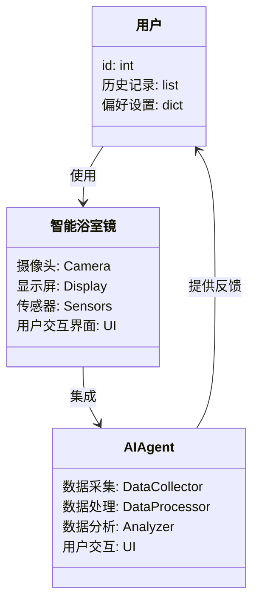

                 


# AI Agent在智能浴室镜中的肤质分析

---

## 关键词：AI Agent, 智能浴室镜, 肤质分析, 图像处理, 机器学习, 肤质检测

---

## 摘要：  
本文探讨了AI Agent在智能浴室镜中的应用，重点分析其在肤质检测中的技术实现。通过结合图像处理、机器学习和传感器数据，AI Agent能够实时分析用户的肤质状况，并提供个性化的护肤建议。文章详细介绍了AI Agent的核心算法、系统架构、项目实战及最佳实践，帮助读者全面理解其在智能浴室镜中的应用。

---

# 第1章 背景介绍

## 1.1 问题背景

### 1.1.1 智能浴室镜的发展现状  
随着智能家居的普及，浴室镜逐渐从单纯的反射工具演变为多功能的智能设备。现代智能浴室镜不仅可以显示时间、天气等信息，还可以集成AI技术，提供个性化的护肤建议。

### 1.1.2 肤质分析的市场需求  
用户对个性化护肤的需求日益增长，尤其是通过智能设备实时了解肤质状况。AI技术能够帮助用户分析皮肤健康状况，提供科学的护肤建议。

### 1.1.3 AI Agent在智能设备中的应用趋势  
AI Agent（智能体）作为能够自主决策和执行任务的智能系统，在智能家居、医疗健康等领域得到了广泛应用。智能浴室镜作为智能家居的一部分，自然也成为AI Agent的重要应用场景。

## 1.2 问题描述

### 1.2.1 肤质分析的核心问题  
如何通过AI技术实时分析用户的肤质状况，包括皮肤颜色、纹理、水分含量等指标。

### 1.2.2 AI Agent在肤质分析中的作用  
AI Agent需要能够采集、处理和分析肤质数据，并根据分析结果提供个性化的护肤建议。

### 1.2.3 智能浴室镜的交互特点  
智能浴室镜需要与用户进行实时交互，用户可以通过语音或触控操作获取肤质分析结果和护肤建议。

## 1.3 问题解决

### 1.3.1 AI Agent在肤质分析中的解决方案  
通过图像处理技术和机器学习算法，AI Agent可以实时分析用户的肤质状况，并根据数据提供个性化建议。

### 1.3.2 智能浴室镜的硬件与软件结合  
智能浴室镜需要结合摄像头、传感器等硬件设备，以及AI算法和用户界面设计，才能实现完整的肤质分析功能。

### 1.3.3 用户隐私与数据安全的保障  
用户隐私是智能设备的重要问题，AI Agent需要确保用户数据的安全性和隐私性。

## 1.4 边界与外延

### 1.4.1 肤质分析的边界条件  
肤质分析的范围和限制，例如仅支持正面拍摄、光照条件要求等。

### 1.4.2 AI Agent的功能范围  
AI Agent在肤质分析中的功能边界，例如不支持诊断严重皮肤病等。

### 1.4.3 智能浴室镜的使用场景限制  
智能浴室镜适用于家庭和个人用户，不适用于医疗机构等专业场景。

## 1.5 概念结构与核心要素

### 1.5.1 肤质分析的核心要素  
- 数据采集：通过摄像头和传感器获取用户肤质数据。  
- 数据处理：图像处理、特征提取。  
- 数据分析：机器学习模型预测肤质状况。  

### 1.5.2 AI Agent的功能模块  
- 数据采集模块：采集用户肤质数据。  
- 数据处理模块：对数据进行预处理和特征提取。  
- 数据分析模块：使用机器学习模型分析肤质。  
- 用户交互模块：输出分析结果和建议。  

### 1.5.3 智能浴室镜的系统架构  
- 硬件部分：摄像头、传感器、显示屏等。  
- 软件部分：AI算法、用户界面、数据存储等。  

---

# 第2章 核心概念与联系

## 2.1 核心概念原理

### 2.1.1 AI Agent的基本原理  
AI Agent通过感知环境、分析数据、做出决策并执行任务。在智能浴室镜中，AI Agent负责采集数据、分析肤质并提供交互建议。

### 2.1.2 肤质分析的算法原理  
基于图像处理和机器学习的算法，通过训练模型识别肤质特征。

### 2.1.3 智能浴室镜的交互机制  
用户通过语音或触控操作与智能浴室镜交互，AI Agent实时响应并提供反馈。

## 2.2 核心概念对比表

| 概念         | 描述                                                                 | 属性                     |
|--------------|----------------------------------------------------------------------|--------------------------|
| AI Agent     | 自主决策的智能体，能够感知环境并执行任务。                           | 学习能力、推理能力、交互能力 |
| 肤质分析     | 基于图像和传感器数据的肤质检测技术。                                   | 精准度、实时性、数据依赖性 |
| 智能浴室镜   | 集成AI技术的智能硬件设备，提供交互式肤质分析功能。                     | 显示功能、数据采集、用户交互 |

## 2.3 ER实体关系图

```mermaid
er
  actor: 用户
  mirror: 智能浴室镜
  agent: AI Agent
  data: 肤质数据
  relation: 属于
  actor -[通过镜面进行交互]-> mirror
  mirror -[采集数据]-> data

  agent -[分析数据]-> data
  agent -[提供反馈]-> actor
```

---

# 第3章 算法原理

## 3.1 算法流程

### 3.1.1 图像处理流程  
1. 数据采集：通过摄像头获取用户面部图像。  
2. 图像预处理：调整亮度、对比度，去除噪声。  
3. 特征提取：提取皮肤颜色、纹理、水分含量等特征。  

### 3.1.2 机器学习模型  
使用卷积神经网络（CNN）对图像进行分类，预测肤质状况。

## 3.2 算法实现代码

```python
import cv2
import numpy as np
from tensorflow.keras.models import load_model

# 加载预训练模型
model = load_model('skin_analysis_model.h5')

# 图像预处理
def preprocess_image(image):
    image = cv2.resize(image, (224, 224))
    image = image / 255.0  # 归一化处理
    return image

# 肤质分析
def analyze_skin(image_path):
    image = cv2.imread(image_path)
    preprocessed = preprocess_image(image)
    prediction = model.predict(np.array([preprocessed]))
    return prediction[0]

# 示例运行
image_path = 'test_image.jpg'
result = analyze_skin(image_path)
print(result)
```

## 3.3 数学模型

### 3.3.1 卷积神经网络模型  
$$ \text{预测概率} = \text{softmax}(Wx + b) $$  

其中，$W$ 是权重矩阵，$x$ 是输入图像的特征向量，$b$ 是偏置项。

### 3.3.2 损失函数  
使用交叉熵损失函数：  
$$ \text{损失} = -\sum_{i=1}^{n} y_i \log(\hat{y}_i) + (1 - y_i) \log(1 - \hat{y}_i) $$  

---

# 第4章 系统分析与架构设计

## 4.1 项目介绍

### 4.1.1 项目目标  
开发一款集成AI Agent的智能浴室镜，能够实时分析用户肤质并提供个性化建议。

## 4.2 系统功能设计

### 4.2.1 领域模型



### 4.2.2 系统架构设计


### 4.2.3 接口设计  
- 用户接口：语音和触控交互。  
- 系统接口：与摄像头、传感器的硬件接口。  

### 4.2.4 交互流程图

```mermaid
sequenceDiagram
    actor 用户 -> mirror 智能浴室镜: 通过语音指令查询肤质
    mirror 智能浴室镜 -> agent AI Agent: 请求分析肤质
    agent AI Agent -> 摄像头: 采集图像数据
    agent AI Agent -> 传感器: 采集环境数据
    agent AI Agent -> 数据处理层: 处理数据
    数据处理层 -> 神经网络模型: 分析数据
    神经网络模型 -> agent AI Agent: 返回分析结果
    agent AI Agent -> 用户: 提供反馈
```

---

# 第5章 项目实战

## 5.1 环境安装

### 5.1.1 系统要求  
- 操作系统：Windows/Mac/Linux  
- 开发工具：Python 3.8+，TensorFlow 2.0+，OpenCV 4.0+  

### 5.1.2 安装依赖  
```bash
pip install tensorflow numpy opencv-python
```

## 5.2 核心代码实现

### 5.2.1 数据采集模块

```python
import cv2

def capture_image(output_path):
    camera = cv2.VideoCapture(0)
    ret, frame = camera.read()
    if ret:
        cv2.imwrite(output_path, frame)
    camera.release()
```

### 5.2.2 数据处理模块

```python
import cv2
import numpy as np

def preprocess_image(image_path):
    image = cv2.imread(image_path)
    image = cv2.resize(image, (224, 224))
    image = image / 255.0
    return image
```

### 5.2.3 AI分析模块

```python
import tensorflow as tf

model = tf.keras.models.load_model('skin_analysis_model.h5')

def analyze_image(image):
    preprocessed = preprocess_image(image)
    prediction = model.predict(tf.expand_dims(preprocessed, axis=0))
    return prediction[0]
```

### 5.2.4 用户交互模块

```python
import speech_recognition as sr
import pyttsx3

def text_to_speech(text):
    engine = pyttsx3.init()
    engine.say(text)
    engine.runAndWait()

def speech_to_text():
    recognizer = sr.Recognizer()
    microphone = sr.AudioFile('input.wav')
    with microphone as source:
        audio = recognizer.record(source)
    try:
        text = recognizer.recognize_google(audio)
        return text
    except Exception as e:
        return str(e)
```

## 5.3 实际案例分析

### 5.3.1 案例背景  
用户通过智能浴室镜查询肤质状况，系统采集图像并分析。

### 5.3.2 数据处理与分析  
1. 采集图像：拍摄用户面部图像并保存为 `test_image.jpg`。  
2. 预处理图像：调整大小并归一化。  
3. 分析图像：使用预训练模型预测肤质状况。  

### 5.3.3 系统反馈  
AI Agent通过语音或文字形式反馈分析结果，例如：  
- “您的皮肤目前状况良好，建议继续使用当前护肤品。”  

## 5.4 项目小结  
通过本项目，我们实现了AI Agent在智能浴室镜中的肤质分析功能，验证了算法的有效性和系统的可行性。

---

# 第6章 最佳实践

## 6.1 小结  
本文详细介绍了AI Agent在智能浴室镜中的肤质分析技术，涵盖了算法原理、系统架构和项目实战。

## 6.2 注意事项  
- 确保用户数据的隐私和安全。  
- 系统需定期更新模型以提高分析精度。  

## 6.3 拓展阅读  
- 《深度学习实战》  
- 《Python图像处理》  
- 《智能硬件开发指南》  

---

# 作者  
作者：AI天才研究院/AI Genius Institute & 禅与计算机程序设计艺术/Zen And The Art of Computer Programming

