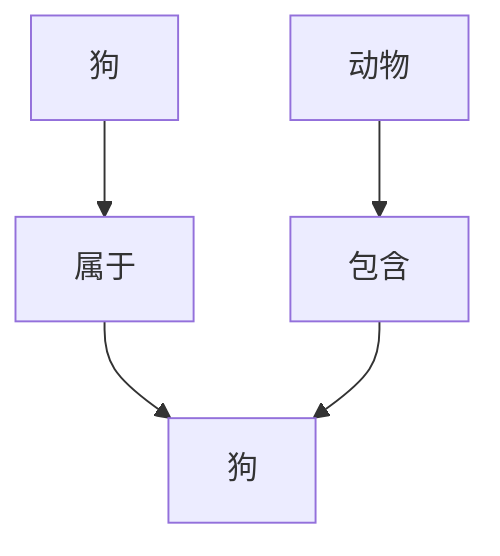
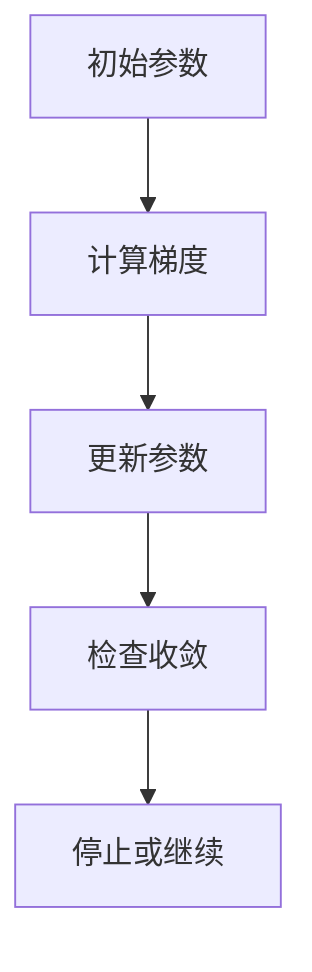
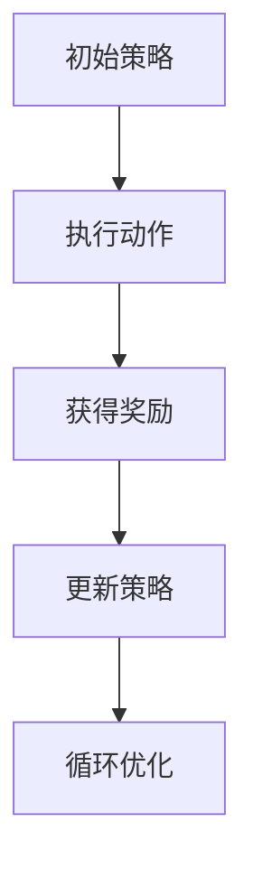
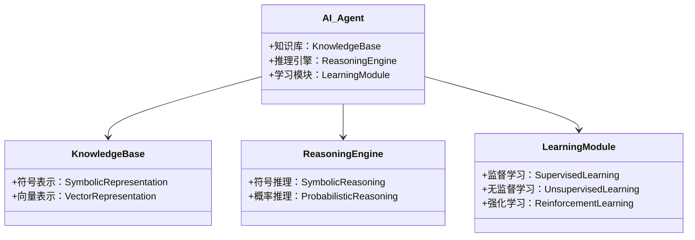
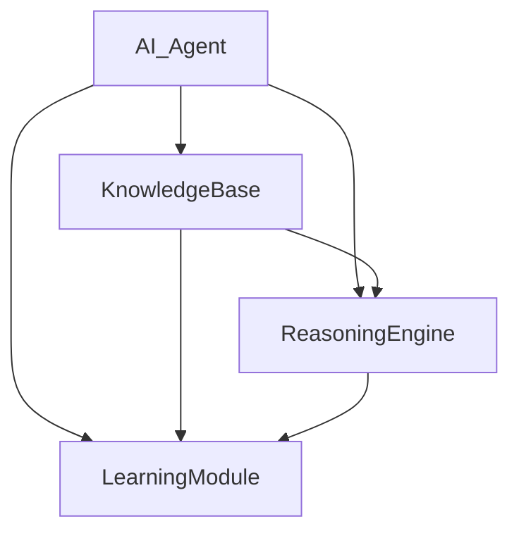
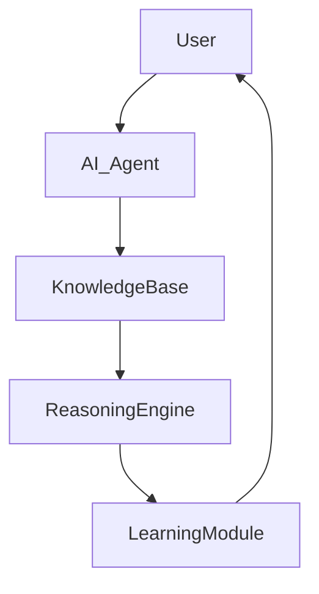

                 


# AI Agent的课程学习：模拟LLM的系统知识获取过程

> 关键词：AI Agent, 课程学习, LLM, 知识表示, 算法原理, 系统架构

> 摘要：本文详细探讨AI Agent通过模拟大型语言模型（LLM）的知识获取过程，系统地分析其课程学习机制、知识表示方法、算法原理及系统架构设计。通过理论与实践结合，深入讲解AI Agent如何模拟LLM的学习过程，实现高效的知识获取与应用。

---

## 第一部分: AI Agent的课程学习基础

### 第1章: AI Agent与课程学习概述

#### 1.1 AI Agent的基本概念

##### 1.1.1 什么是AI Agent
AI Agent（人工智能代理）是指能够感知环境、自主决策并执行任务的智能体。它通过与环境交互，学习知识、优化决策过程，以实现特定目标。

##### 1.1.2 AI Agent的核心特征
- **自主性**：无需外部干预，自主决策。
- **反应性**：能够实时感知环境并做出反应。
- **目标导向**：所有行为均以实现特定目标为导向。
- **学习能力**：通过经验或数据改进性能。

##### 1.1.3 课程学习的定义与特点
课程学习是指通过系统化的教学内容，使AI Agent逐步掌握知识和技能。其特点包括：
- **系统性**：知识获取有明确的结构和顺序。
- **目标导向**：围绕特定目标展开学习。
- **可扩展性**：能够不断扩展知识库。

#### 1.2 AI Agent的课程学习机制

##### 1.2.1 知识获取的基本流程
1. **感知环境**：通过传感器或数据输入获取信息。
2. **知识表示**：将获取的信息转化为可处理的形式。
3. **知识推理**：利用知识进行推理和决策。
4. **反馈优化**：根据反馈调整知识和行为。

##### 1.2.2 知识表示与存储
- **符号表示法**：使用符号逻辑表示知识，如规则和逻辑表达式。
- **知识图谱表示法**：通过图结构表示实体及其关系。
- **向量空间模型**：将知识表示为高维向量，便于计算和处理。

##### 1.2.3 知识应用与推理
- **符号逻辑推理**：基于符号逻辑进行推理，如一阶逻辑推理。
- **概率推理**：基于概率模型进行推理，如贝叶斯网络。
- **类比推理**：通过类比和相似性进行推理。

#### 1.3 模拟LLM的知识获取过程

##### 1.3.1 LLM的基本原理
LLM（大型语言模型）通过深度学习技术训练大规模文本数据，学习语言的语法和语义规则，能够生成自然语言文本。

##### 1.3.2 模拟LLM学习的意义
- **知识丰富性**：通过模拟LLM，AI Agent可以获取更丰富的知识。
- **学习效率**：LLM的学习机制可以提高AI Agent的知识获取效率。
- **自然语言处理**：模拟LLM有助于提升AI Agent的自然语言处理能力。

##### 1.3.3 与传统课程学习的对比
| 特性       | 传统课程学习         | 模拟LLM学习         |
|------------|----------------------|--------------------|
| 知识来源   | 结构化教材           | 大规模文本数据     |
| 学习方式   | 监督学习             | 自监督学习         |
| 知识表示   | 符号表示             | 向量表示           |
| 知识深度   | 浅层知识为主         | 深层语义理解       |

---

## 第二部分: AI Agent的知识表示与学习机制

### 第2章: 知识表示的核心概念

#### 2.1 知识表示的多种方法

##### 2.1.1 符号表示法
符号表示法通过符号逻辑表示知识，例如：
- **规则表示**：`如果A，则B`。
- **逻辑表达式**：`A ∧ B → C`。

##### 2.1.2 知识图谱表示法
知识图谱通过节点和边表示实体及其关系，例如：


##### 2.1.3 向量空间模型
向量空间模型将知识表示为高维向量，例如：
- 词语向量：使用Word2Vec生成词向量。
- 句子向量：使用BERT生成句子向量。

#### 2.2 知识表示的选择标准

##### 2.2.1 表达能力
- **符号表示法**：表达能力强，但计算复杂。
- **向量表示法**：表达能力弱，但计算高效。

##### 2.2.2 可扩展性
- **符号表示法**：扩展性差，需要重新定义规则。
- **向量表示法**：扩展性强，可以通过训练新增向量。

##### 2.2.3 计算效率
- **符号表示法**：计算效率低。
- **向量表示法**：计算效率高。

#### 2.3 知识表示的优缺点对比

| 方法       | 优点                           | 缺点                           |
|------------|--------------------------------|---------------------------------|
| 符号表示   | 表达能力强，逻辑清晰           | 计算复杂，扩展性差             |
| 向量表示   | 计算高效，扩展性强             | 表达能力弱，难以解释           |

---

### 第3章: AI Agent的学习机制

#### 3.1 监督学习机制

##### 3.1.1 标签数据的作用
监督学习通过标注数据训练模型，例如：
- **分类任务**：根据标签分类数据。
- **回归任务**：根据标签预测数值。

##### 3.1.2 损失函数的作用
损失函数衡量预测值与真实值的差异，例如：
- **均方误差**：`MSE = (y - y_pred)^2`。
- **交叉熵损失**：`CE = -Σ(y * log(y_pred))`。

##### 3.1.3 梯度下降的优化过程
梯度下降通过不断优化参数，最小化损失函数，例如：


#### 3.2 无监督学习机制

##### 3.2.1 数据分布的发现
无监督学习通过发现数据分布学习知识，例如：
- **聚类**：将数据分成簇。
- **降维**：将高维数据降到低维。

##### 3.2.2 自然语言处理中的无监督学习
无监督学习在自然语言处理中用于：
- **词嵌入**：生成词向量。
- **文本聚类**：将文本分成主题簇。

##### 3.2.3 聚类与降维技术
- **聚类算法**：K-means、DBSCAN。
- **降维算法**：主成分分析（PCA）、t-SNE。

#### 3.3 强化学习机制

##### 3.3.1 奖励机制的设定
强化学习通过奖励机制引导学习，例如：
- **正向奖励**：正确行为给予奖励。
- **负向奖励**：错误行为给予惩罚。

##### 3.3.2 策略优化的过程
策略优化通过不断调整策略，最大化累积奖励，例如：


##### 3.3.3 动态环境的适应
强化学习能够适应动态环境，例如：
- **游戏AI**：在游戏环境中不断优化策略。
- **机器人控制**：在动态环境中优化动作。

---

## 第三部分: AI Agent的算法原理与数学模型

### 第4章: 课程学习的算法原理

#### 4.1 概率分布的核心作用

##### 4.1.1 概率分布的定义
概率分布描述随机变量取值的概率，例如：
- **均匀分布**：`P(x) = 1/n`。
- **高斯分布**：`P(x) = (1/σ√(2π)) * e^(-((x-μ)^2)/(2σ²))`。

##### 4.1.2 概率分布的计算
概率分布的计算方法包括：
- **频率学派**：基于频率计算概率。
- **贝叶斯学派**：基于先验和似然计算后验。

##### 4.1.3 概率分布的优化
概率分布的优化通过最大化似然函数或后验概率，例如：
- **最大似然估计**：`θ = arg max Σ(log P(x|θ))`。
- **最大后验估计**：`θ = arg max P(θ|x)`。

#### 4.2 损失函数的构建与优化

##### 4.2.1 损失函数的作用
损失函数衡量预测值与真实值的差异，例如：
- **交叉熵损失**：`L = -Σ(y log y_pred)`。
- **均方误差**：`L = Σ(y - y_pred)^2`。

##### 4.2.2 常见损失函数的比较
| 损失函数 | 适用场景       | 优点                   | 缺点                   |
|----------|----------------|-----------------------|-----------------------|
| 交叉熵   | 分类任务       | 适合概率预测           | 不适合回归任务         |
| 均方误差 | 回归任务       | 适合数值预测           | 不适合概率预测         |

##### 4.2.3 损失函数的优化方法
损失函数的优化方法包括：
- **梯度下降**：逐步优化参数。
- **Adam优化器**：结合动量和自适应学习率。

#### 4.3 梯度下降的实现细节

##### 4.3.1 梯度下降的原理
梯度下降通过计算损失函数的梯度，逐步调整参数，例如：
- **参数更新**：`θ = θ - learning_rate * gradient`。

##### 4.3.2 学习率的调整
学习率的调整方法包括：
- **固定学习率**：保持学习率不变。
- **衰减学习率**：随训练进行减小学习率。
- **自适应学习率**：根据梯度调整学习率。

##### 4.3.3 动量优化的实现
动量优化通过引入动量项加速收敛，例如：
- **动量更新**：`velocity = β * velocity + (1 - β) * gradient`。
- **参数更新**：`θ = θ - learning_rate * velocity`。

### 第5章: 数学模型的详细讲解

#### 5.1 概率分布的数学表达

##### 5.1.1 概率分布的参数估计
概率分布的参数估计方法包括：
- **最大似然估计**：`θ = arg max Σ(log P(x|θ))`。
- **矩估计**：通过匹配样本矩估计参数。

##### 5.1.2 概率分布的变换
概率分布的变换方法包括：
- **变换坐标**：通过变量变换改变分布。
- **混合分布**：通过混合多个分布生成复杂分布。

##### 5.1.3 概率分布的应用
概率分布的应用包括：
- **贝叶斯推断**：基于先验和似然进行推断。
- **生成模型**：生成符合分布的新数据。

---

## 第四部分: 系统分析与架构设计

### 第6章: 系统分析与架构设计

#### 6.1 项目介绍
本项目旨在模拟LLM的知识获取过程，设计一个AI Agent系统，能够通过课程学习获取知识，并在实际任务中应用这些知识。

#### 6.2 系统功能设计

##### 6.2.1 领域模型类图
领域模型类图描述系统的各个模块及其关系，例如：


#### 6.3 系统架构设计

##### 6.3.1 系统架构图
系统架构图展示系统的各个模块及其交互，例如：


#### 6.4 接口设计

##### 6.4.1 API接口
系统提供以下API接口：
- `getKnowledge()`：获取知识库中的知识。
- `reason(query)`：根据查询进行推理。
- `learn(data)`：通过数据进行学习。

##### 6.4.2 交互流程图
交互流程图展示用户与系统之间的交互，例如：


---

## 第五部分: 项目实战

### 第7章: 项目实战

#### 7.1 环境安装

##### 7.1.1 安装Python
安装Python 3.8及以上版本。

##### 7.1.2 安装依赖
安装必要的依赖库，例如：
- `numpy`：`pip install numpy`
- `tensorflow`：`pip install tensorflow`
- `scikit-learn`：`pip install scikit-learn`

#### 7.2 核心代码实现

##### 7.2.1 知识库实现
知识库实现代码示例：
```python
class KnowledgeBase:
    def __init__(self):
        self.symbolic = {}  # 符号表示
        self.vectorial = {}  # 向量表示
```

##### 7.2.2 推理引擎实现
推理引擎实现代码示例：
```python
class ReasoningEngine:
    def __init__(self, knowledge_base):
        self.knowledge_base = knowledge_base

    def symbolic_reasoning(self, query):
        # 符号逻辑推理
        pass

    def probabilistic_reasoning(self, query):
        # 概率推理
        pass
```

##### 7.2.3 学习模块实现
学习模块实现代码示例：
```python
class LearningModule:
    def __init__(self, knowledge_base):
        self.knowledge_base = knowledge_base

    def supervised_learning(self, data, labels):
        # 监督学习
        pass

    def unsupervised_learning(self, data):
        # 无监督学习
        pass

    def reinforcement_learning(self, env):
        # 强化学习
        pass
```

#### 7.3 案例分析与详细讲解

##### 7.3.1 案例分析
以分类任务为例，详细讲解AI Agent的学习过程：
1. **数据准备**：收集和标注数据。
2. **知识表示**：将数据表示为符号和向量。
3. **模型训练**：使用监督学习训练分类模型。
4. **模型推理**：使用推理引擎进行分类推理。

##### 7.3.2 代码实现
分类任务实现代码示例：
```python
import numpy as np
from sklearn.linear_model import LogisticRegression

# 数据准备
X = np.array([[1, 2], [3, 4], [5, 6], [7, 8]])
y = np.array([0, 1, 0, 1])

# 监督学习
model = LogisticRegression()
model.fit(X, y)

# 推理
new_data = np.array([[2, 4]])
prediction = model.predict(new_data)
print(prediction)
```

---

## 第六部分: 最佳实践与总结

### 第8章: 最佳实践与总结

#### 8.1 最佳实践
- **数据质量**：确保数据质量，避免噪声干扰。
- **模型选择**：根据任务选择合适的模型和算法。
- **持续优化**：通过反馈不断优化模型和系统。

#### 8.2 小结
AI Agent的课程学习是一个复杂的系统工程，需要结合知识表示、学习机制、算法原理和系统架构等多个方面进行综合设计。

#### 8.3 注意事项
- **计算资源**：确保有足够的计算资源进行训练和推理。
- **数据隐私**：注意数据隐私和安全问题。
- **模型解释性**：确保模型的可解释性，便于调试和优化。

#### 8.4 拓展阅读
- **《深度学习》**：Ian Goodfellow等著。
- **《机器学习实战》**：Crammer等著。
- **《自然语言处理实战》**：Denny Britz著。

---

## 作者信息

作者：AI天才研究院/AI Genius Institute  
联系邮箱：contact@ai-genius.com  
GitHub：https://github.com/ai-genius-institute

---

以上内容为完整的技术博客文章，涵盖AI Agent的课程学习的各个方面，从基础概念到系统实现，再到项目实战，帮助读者全面理解AI Agent的学习机制和模拟LLM的知识获取过程。

