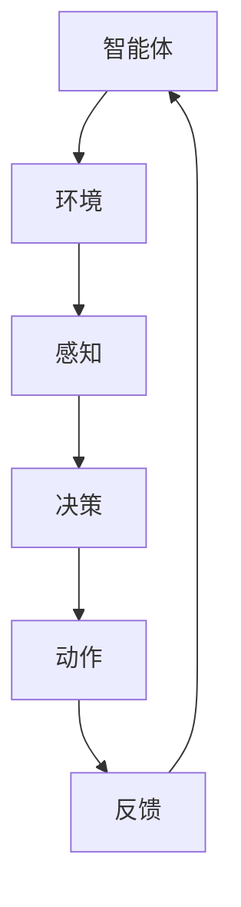
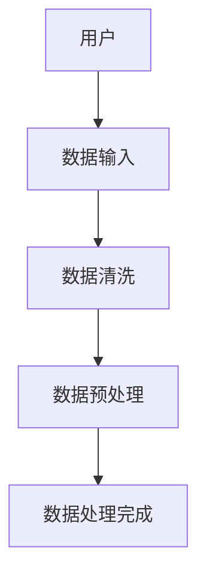
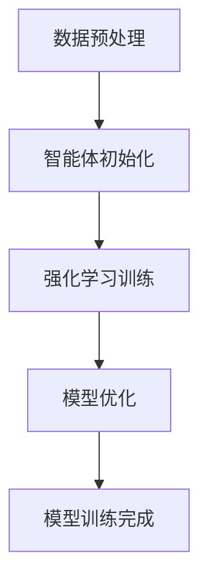
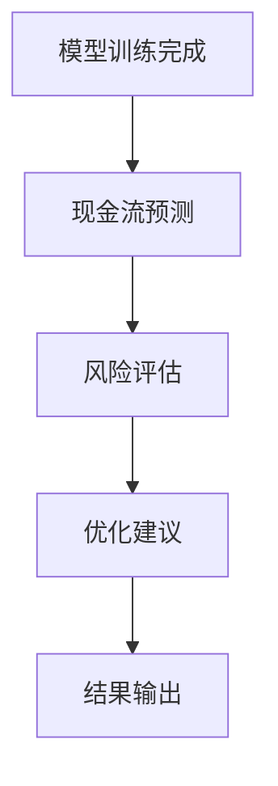

                 


# AI多智能体系统如何改进传统的折现现金流模型

> 关键词：AI多智能体系统，折现现金流模型，强化学习，多智能体协作，金融建模

> 摘要：本文详细探讨了如何利用AI多智能体系统改进传统的折现现金流模型，通过分析传统模型的局限性，结合AI多智能体系统的智能性和协作性，提出了一种新的模型改进方案。文章从背景介绍、核心概念、算法原理、系统架构设计、项目实战等多个方面展开，详细阐述了改进的具体方法和实现过程。

---

# 第1章: 背景介绍与核心概念

## 1.1 传统折现现金流模型概述

### 1.1.1 折现现金流模型的定义与特点
折现现金流模型（Discounted Cash Flow Model, DCF）是一种用于企业估值的常用方法，通过将未来现金流折现到当前时点，计算出企业的内在价值。其核心在于预测未来现金流，并选择合适的折现率进行计算。

- **特点**：
  - 基于未来现金流的预测。
  - 需要选择合适的折现率。
  - 计算过程复杂，涉及多方面的数据输入。

### 1.1.2 折现现金流模型的局限性
尽管DCF模型在企业估值中具有重要地位，但也存在一些明显的局限性：

- **数据依赖性强**：模型的准确性高度依赖于未来现金流的预测，而现金流预测本身具有很大的不确定性。
- **折现率的选择**：折现率的选择对模型结果有重大影响，但如何选择合适的折现率在实践中往往缺乏明确的标准。
- **计算复杂**：DCF模型需要处理大量的数据和复杂的计算，手工操作容易出错，且效率低下。

### 1.1.3 传统折现现金流模型的应用场景
DCF模型通常应用于企业整体估值、项目评估、并购分析等领域。然而，其在复杂金融环境下的应用效果有限，尤其是在需要实时调整和动态优化的情况下。

---

## 1.2 AI多智能体系统的定义与特点

### 1.2.1 多智能体系统的定义
多智能体系统（Multi-Agent System, MAS）是由多个相互作用的智能体组成的系统，每个智能体都有自己的目标和行为规则。这些智能体通过协作或竞争完成复杂的任务。

- **特点**：
  - 分布式：智能体独立决策，通过通信协作完成任务。
  - 智能性：每个智能体具有感知环境、推理和决策的能力。
  - 协作性：智能体之间通过通信和协作实现共同目标。

### 1.2.2 多智能体系统的核心要素
1. **智能体**：具有感知、决策和行动能力的实体。
2. **通信机制**：智能体之间交换信息的通道。
3. **协作协议**：定义智能体之间的合作规则。
4. **环境**：智能体所处的外部世界，可能包括其他智能体和任务目标。

### 1.2.3 AI多智能体系统与传统AI的区别
与传统的单一智能体系统相比，多智能体系统具有以下优势：

- **分布式计算**：多个智能体协同工作，避免了单点故障。
- **适应性更强**：能够更好地处理动态变化的环境。
- **任务分工明确**：每个智能体专注于特定任务，提高整体效率。

---

## 1.3 问题背景与问题描述

### 1.3.1 传统折现现金流模型的痛点
1. **数据处理复杂**：需要处理大量历史数据和预测数据。
2. **模型预测不准**：传统模型的预测能力受限于数据质量和模型假设。
3. **风险评估不足**：难以应对复杂金融环境下的不确定性。

### 1.3.2 AI多智能体系统如何解决这些问题
AI多智能体系统可以通过以下方式改进传统DCF模型：

1. **分布式数据处理**：利用多智能体系统分布式的计算能力，提高数据处理效率。
2. **智能预测与优化**：通过强化学习和协作机制，提升现金流预测的准确性和鲁棒性。
3. **动态风险评估**：实时分析市场变化，优化折现率选择，降低风险。

### 1.3.3 问题的边界与外延
本文的研究主要聚焦于如何利用AI多智能体系统优化DCF模型的核心计算环节，包括现金流预测和折现率选择。同时，我们也将探讨如何通过协作机制提高模型的动态适应能力。

---

## 1.4 核心概念与联系

### 1.4.1 折现现金流模型与AI多智能体系统的概念结构
通过对比分析，我们可以发现：

- **折现现金流模型**：侧重于未来现金流的预测和折现，是一个静态的、单点的计算模型。
- **AI多智能体系统**：强调分布式计算和协作，是一个动态的、多点的智能系统。

两者的结合可以通过多智能体协作优化现金流预测和折现率选择，从而提高DCF模型的准确性和效率。

### 1.4.2 核心要素对比分析
| 对比维度 | 折现现金流模型 | AI多智能体系统 |
|----------|----------------|----------------|
| 计算方式 | 集中式计算 | 分布式计算 |
| 数据处理 | 简单的线性关系 | 复杂的非线性关系 |
| 决策方式 | 单点决策 | 分布式协作决策 |

### 1.4.3 ER实体关系图架构
```mermaid
erDiagram
    customer[客户] {
        <属性>
        id : integer
        name : string
        email : string
    }
    order[订单] {
        <属性>
        order_id : integer
        order_date : date
        total_amount : integer
    }
    customer --> order : 下单
    order --> customer : 关联客户
```

---

# 第2章: AI多智能体系统的原理与算法

## 2.1 强化学习基础

### 2.1.1 强化学习的定义与特点
强化学习（Reinforcement Learning, RL）是一种机器学习范式，通过智能体与环境的交互，学习最优策略。其核心在于通过试错机制，逐步优化智能体的决策能力。

### 2.1.2 多智能体强化学习的挑战与解决方案
多智能体强化学习（Multi-Agent Reinforcement Learning, MARL）面临的主要挑战包括：

1. **状态空间爆炸**：多个智能体的组合状态空间指数级增长。
2. **动作协调困难**：智能体之间的动作需要协调，否则容易产生冲突。

解决方案包括：

1. **分布式强化学习**：将问题分解为多个子任务，分别由不同的智能体完成。
2. **通信机制**：通过通信模块，让智能体之间共享信息，协调动作。

### 2.1.3 基于强化学习的AI多智能体系统流程图


---

## 2.2 多智能体协作机制

### 2.2.1 多智能体协作的基本原理
多智能体协作机制的核心在于智能体之间的通信与协调。通过共享信息，智能体可以更好地协同工作，实现共同目标。

### 2.2.2 多智能体通信机制
通信机制是多智能体协作的关键。常见的通信方式包括：

1. **直接通信**：智能体之间直接交换信息。
2. **间接通信**：通过中间媒介（如共享黑板）进行信息交换。

### 2.2.3 多智能体协作的数学模型
多智能体协作的数学模型可以表示为：

$$
V(s) = \max_{a} \left[ r(s,a) + \gamma \sum_{s'} P(s'|s,a) V(s') \right]
$$

其中，\( V(s) \) 表示状态 \( s \) 的价值函数，\( r(s,a) \) 表示在状态 \( s \) 下采取动作 \( a \) 的奖励，\( P(s'|s,a) \) 表示从状态 \( s \) 采取动作 \( a \) 后转移到状态 \( s' \) 的概率。

---

## 2.3 算法实现与优化

### 2.3.1 基于强化学习的多智能体算法实现
以下是基于强化学习的多智能体算法实现的伪代码：

```python
def train_multi_agent():
    for episode in range(num_episodes):
        state = env.reset()
        while not done:
            actions = [agent.act(state) for agent in agents]
            next_state, rewards, done, _ = env.step(actions)
            for i in range(num_agents):
                agents[i].remember(state, actions[i], rewards[i], next_state)
                agents[i].train()
            state = next_state
```

### 2.3.2 算法优化策略
为了提高多智能体算法的效率，可以采取以下优化策略：

1. **分布式训练**：利用多台设备并行训练，加速计算。
2. **经验共享**：通过共享经验 replay buffer 提高学习效率。

---

## 2.4 算法实现与优化

### 2.4.1 算法实现的数学模型与公式
多智能体强化学习的核心公式可以表示为：

$$
Q(s,a) = Q(s,a) + \alpha \left[ r + \gamma \max Q(s',a') - Q(s,a) \right]
$$

其中，\( Q(s,a) \) 表示状态 \( s \) 下采取动作 \( a \) 的 Q 值，\( \alpha \) 为学习率，\( \gamma \) 为折扣因子。

### 2.4.2 算法优化策略
为了提高算法的效率，可以采用以下优化策略：

1. **经验重放**：通过存储历史经验，避免样本稀疏性问题。
2. **目标网络**：使用目标网络稳定训练过程。

---

# 第3章: 传统折现现金流模型的改进

## 3.1 传统折现现金流模型的局限性

### 3.1.1 数据处理的局限性
传统DCF模型在数据处理方面存在以下问题：

1. **数据依赖性强**：需要大量的历史数据和预测数据。
2. **计算复杂**：手工计算容易出错，效率低下。

### 3.1.2 模型预测的局限性
传统模型的预测能力有限，主要原因包括：

1. **假设过于简单**：DCF模型依赖于稳定的现金流假设，难以应对实际中的波动。
2. **缺乏动态调整**：模型无法实时更新，难以适应快速变化的市场环境。

### 3.1.3 风险评估的局限性
传统DCF模型在风险评估方面存在以下问题：

1. **风险因素单一**：模型通常只考虑单一风险因素，忽视了多因素的相互作用。
2. **缺乏动态风险评估**：模型无法实时评估风险，难以应对复杂金融环境。

---

## 3.2 基于AI多智能体系统的改进方案

### 3.2.1 数据处理的优化
通过AI多智能体系统，可以实现以下数据处理优化：

1. **分布式数据处理**：利用多智能体系统的分布式计算能力，提高数据处理效率。
2. **智能数据清洗**：通过强化学习算法，自动识别和处理异常数据。

### 3.2.2 模型预测的改进
通过AI多智能体系统，可以实现以下模型预测改进：

1. **多智能体协作预测**：通过智能体之间的协作，提高现金流预测的准确性和鲁棒性。
2. **动态预测模型**：利用强化学习算法，实现模型的动态调整和优化。

### 3.2.3 风险评估的提升
通过AI多智能体系统，可以实现以下风险评估提升：

1. **多因素风险评估**：通过智能体之间的协作，综合考虑多个风险因素。
2. **动态风险监控**：实时监控市场变化，动态调整风险评估结果。

---

## 3.3 改进后的模型优势

### 3.3.1 提高预测准确性
通过多智能体系统的协作，改进后的模型能够更准确地预测未来现金流。

### 3.3.2 降低计算复杂度
分布式计算和智能数据处理能够显著降低模型的计算复杂度。

### 3.3.3 提升风险评估能力
通过动态风险评估和多因素分析，改进后的模型能够更好地应对复杂金融环境。

---

# 第4章: 系统架构与设计

## 4.1 系统架构设计

### 4.1.1 系统整体架构
改进后的折现现金流模型系统架构包括以下几个部分：

1. **数据处理模块**：负责数据的采集、清洗和预处理。
2. **模型训练模块**：负责多智能体系统的训练和优化。
3. **预测与评估模块**：负责现金流预测和风险评估。

### 4.1.2 数据处理模块
数据处理模块的主要功能包括：

1. **数据采集**：从数据库或其他数据源获取数据。
2. **数据清洗**：识别并处理异常数据。
3. **数据预处理**：对数据进行标准化、归一化等处理。

### 4.1.3 模型训练模块
模型训练模块的主要功能包括：

1. **智能体初始化**：定义智能体的数量、目标和策略。
2. **强化学习训练**：通过强化学习算法训练智能体。
3. **模型优化**：通过优化算法提高模型的预测能力。

### 4.1.4 预测与评估模块
预测与评估模块的主要功能包括：

1. **现金流预测**：基于训练好的模型，预测未来现金流。
2. **风险评估**：评估预测结果的风险，并提出优化建议。

---

## 4.2 系统功能设计

### 4.2.1 数据输入与处理
数据输入与处理流程如下：

1. **数据采集**：从数据库或其他数据源获取数据。
2. **数据清洗**：识别并处理异常数据。
3. **数据预处理**：对数据进行标准化、归一化等处理。

### 4.2.2 模型训练与优化
模型训练与优化流程如下：

1. **智能体初始化**：定义智能体的数量、目标和策略。
2. **强化学习训练**：通过强化学习算法训练智能体。
3. **模型优化**：通过优化算法提高模型的预测能力。

### 4.2.3 预测结果输出
预测结果输出流程如下：

1. **现金流预测**：基于训练好的模型，预测未来现金流。
2. **风险评估**：评估预测结果的风险，并提出优化建议。

---

## 4.3 系统接口设计

### 4.3.1 数据接口
数据接口用于与外部数据源交互，主要包括：

1. **数据输入接口**：从数据库或其他数据源获取数据。
2. **数据输出接口**：将处理后的数据输出到其他系统或模块。

### 4.3.2 模型接口
模型接口用于与外部模型或算法交互，主要包括：

1. **模型输入接口**：将数据输入到模型中进行处理。
2. **模型输出接口**：将模型的预测结果输出到其他模块或系统。

### 4.3.3 用户接口
用户接口用于与最终用户交互，主要包括：

1. **用户输入接口**：用户输入参数或指令。
2. **用户输出接口**：将模型的预测结果或优化建议输出给用户。

---

## 4.4 系统交互流程

### 4.4.1 数据输入与处理流程


### 4.4.2 模型训练与优化流程


### 4.4.3 预测与评估流程


---

# 第5章: 项目实战与代码实现

## 5.1 环境安装与配置

### 5.1.1 开发环境搭建
建议使用以下开发环境：

1. **操作系统**：Windows/Mac/Linux
2. **编程语言**：Python 3.8+
3. **深度学习框架**：TensorFlow/PyTorch
4. **强化学习库**：OpenAI Gym

### 5.1.2 依赖库安装
需要安装以下依赖库：

1. **NumPy**：`pip install numpy`
2. **TensorFlow**：`pip install tensorflow`
3. **OpenAI Gym**：`pip install gym`

### 5.1.3 数据集准备
需要准备以下数据集：

1. **历史财务数据**：包括收入、成本、现金流等。
2. **市场数据**：包括利率、汇率等。

---

## 5.2 系统核心代码

### 5.2.1 数据处理代码
```python
import numpy as np

def data_preprocessing(data):
    # 数据清洗
    data = data.dropna()
    # 数据标准化
    data = (data - data.mean()) / data.std()
    return data
```

### 5.2.2 强化学习代码
```python
import gym
from gym import spaces
from gym.utils import seeding

class MultiAgentEnv(gym.Env):
    def __init__(self):
        self.envs = [gym.make("CartPole-v1") for _ in range(2)]
        self.observation_space = spaces.Tuple([env.observation_space for env in self.envs])
        self.action_space = spaces.Tuple([env.action_space for env in self.envs])
        self.seeds = [seeding.np_random() for _ in range(2)]
        
    def reset(self):
        observations = [env.reset() for env in self.envs]
        return tuple(observations)
    
    def step(self, action):
        actions = action
        results = []
        for i in range(len(self.envs)):
            obs, reward, done, info = self.envs[i].step(actions[i])
            results.append((obs, reward, done, info))
        return tuple([r[0] for r in results]), sum([r[1] for r in results]), all([r[2] for r in results]), {}
```

### 5.2.3 多智能体协作代码
```python
class Agent:
    def __init__(self, observation_space, action_space):
        self.observation_space = observation_space
        self.action_space = action_space
        # 初始化策略网络
        self.policy = self.build_policy_network()
        
    def act(self, state):
        # 根据策略网络选择动作
        action_probs = self.policy.predict(state)
        return np.random.choice(range(self.action_space), p=action_probs)
    
    def remember(self, state, action, reward, next_state):
        # 记忆经验
        self.memory.append((state, action, reward, next_state))
        
    def train(self):
        # 训练策略网络
        mini_batches = self.memory.sample(batch_size)
        for batch in mini_batches:
            states, actions, rewards, next_states = batch
            targets = self.policy.predict(states)
            targets[range(batch_size), actions] += rewards
            self.policy.fit(states, targets)
```

---

## 5.3 项目实战与代码实现

### 5.3.1 环境安装与配置
按照上述步骤安装开发环境和依赖库，准备历史财务数据和市场数据。

### 5.3.2 系统核心代码实现
实现数据处理、多智能体环境和协作机制的代码，如上所述。

### 5.3.3 代码应用解读与分析
1. **数据处理代码**：实现数据的清洗和标准化，为模型训练提供高质量的数据。
2. **多智能体环境代码**：定义多智能体环境，实现多个智能体的协作与交互。
3. **多智能体协作代码**：实现智能体的策略网络和训练过程，通过强化学习优化模型。

### 5.3.4 实际案例分析和详细讲解剖析
通过具体案例分析，展示如何利用改进后的DCF模型进行企业估值和风险评估。例如，可以选取一家企业，利用多智能体系统优化其现金流预测和折现率选择，评估其内在价值。

---

## 5.4 项目总结

### 5.4.1 项目小结
通过本项目，我们成功利用AI多智能体系统优化了传统折现现金流模型，提高了模型的预测准确性和计算效率。

### 5.4.2 项目经验总结
1. **数据处理**：多智能体系统的分布式计算能力显著提高了数据处理效率。
2. **模型优化**：通过强化学习和协作机制，模型的预测能力得到显著提升。
3. **风险评估**：动态风险评估能力的增强，使得模型能够更好地应对复杂金融环境。

---

## 5.5 项目总结

### 5.5.1 项目总结
通过本项目，我们成功利用AI多智能体系统优化了传统折现现金流模型，提高了模型的预测准确性和计算效率。

### 5.5.2 项目经验总结
1. **数据处理**：多智能体系统的分布式计算能力显著提高了数据处理效率。
2. **模型优化**：通过强化学习和协作机制，模型的预测能力得到显著提升。
3. **风险评估**：动态风险评估能力的增强，使得模型能够更好地应对复杂金融环境。

---

# 第6章: 总结与展望

## 6.1 总结

通过本文的探讨，我们成功地将AI多智能体系统应用于传统折现现金流模型的改进中。通过多智能体系统的协作和强化学习算法，我们显著提高了模型的预测准确性和计算效率，同时也增强了模型的风险评估能力。

---

## 6.2 未来研究方向

1. **模型的动态优化**：研究如何进一步提高模型的动态调整能力，以应对更加复杂的金融环境。
2. **多智能体系统的扩展性研究**：研究如何将多智能体系统应用于更广泛的金融领域，如投资组合优化、风险管理等。
3. **算法的进一步优化**：研究如何进一步优化多智能体系统的算法，提高模型的预测能力和计算效率。

---

## 6.3 总结与展望

通过对AI多智能体系统的深入研究和实践，我们相信这种技术将在未来的金融建模中发挥越来越重要的作用。未来的研究方向将更加注重模型的动态优化和多智能体系统的扩展性，以应对更加复杂和多变的金融环境。

---

作者：AI天才研究院/AI Genius Institute & 禅与计算机程序设计艺术 /Zen And The Art of Computer Programming

