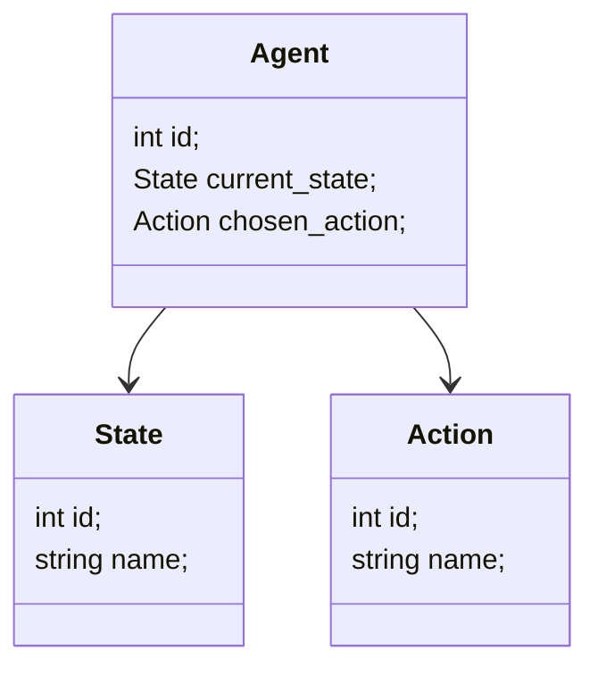
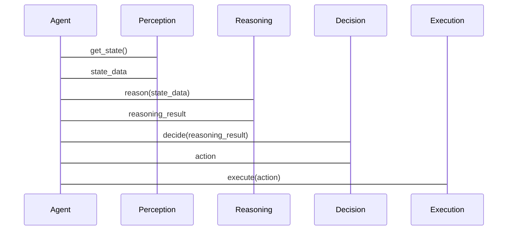

                 


# 从零开始：AI Agent的认知架构设计

> 关键词：AI Agent、认知架构、多智能体系统、人工智能、软件架构

> 摘要：本文将从AI Agent的基本概念出发，逐步深入探讨其认知架构设计的核心原理、算法实现、系统架构以及实际应用。通过系统化的分析和具体的代码实现，帮助读者全面理解AI Agent的设计与实现过程，掌握认知架构的核心要素与设计原则。

---

# 第1章: AI Agent的基本概念与背景

## 1.1 AI Agent的定义与特点

### 1.1.1 什么是AI Agent

AI Agent（人工智能代理）是一种能够感知环境、自主决策并执行任务的智能实体。它可以是一个软件程序、机器人或其他智能系统，具备以下核心能力：

- **自主性**：能够在没有外部干预的情况下独立运行。
- **反应性**：能够感知环境并实时响应变化。
- **目标导向**：具有明确的目标，并通过行动实现这些目标。

AI Agent的核心目标是通过感知、推理和行动来与环境交互，从而完成特定任务。

### 1.1.2 AI Agent的核心特点

AI Agent与传统程序的主要区别在于其智能化和自主性。以下是AI Agent的几个关键特点：

1. **自主性**：AI Agent能够独立决策和行动，无需外部干预。
2. **反应性**：能够实时感知环境并调整行为。
3. **目标导向**：通过目标驱动行动，优化决策过程。
4. **学习能力**：能够通过经验改进性能。

### 1.1.3 AI Agent与传统AI的区别

传统AI程序通常依赖于固定的规则和数据，而AI Agent具备更强的自主性和适应性。AI Agent能够根据环境动态调整行为，而传统AI程序则通常需要人工干预来修改规则。

---

## 1.2 AI Agent的认知架构

### 1.2.1 认知架构的定义

认知架构是AI Agent的核心部分，负责处理信息、做出决策并指导行动。它通常包括感知、推理、决策和执行四个模块。

### 1.2.2 AI Agent的认知模型

认知模型是AI Agent实现智能的关键。以下是认知模型的主要组成部分：

- **感知模块**：负责从环境中获取信息。
- **推理模块**：基于感知信息进行逻辑推理。
- **决策模块**：根据推理结果做出决策。
- **执行模块**：将决策转化为具体行动。

### 1.2.3 AI Agent的认知架构分类

AI Agent的认知架构可以分为以下几类：

1. **基于规则的架构**：通过预定义的规则进行推理和决策。
2. **基于模型的架构**：依赖于环境的模型进行推理和决策。
3. **基于学习的架构**：通过机器学习算法进行推理和决策。

---

## 1.3 AI Agent的发展背景

### 1.3.1 AI技术的演进历程

AI技术的发展经历了多个阶段，从早期的符号逻辑推理到现在的深度学习，AI Agent的实现方式也在不断演变。

### 1.3.2 多智能体系统的兴起

随着AI技术的进步，多智能体系统逐渐兴起，AI Agent作为多智能体系统的核心单元，具备重要的地位。

### 1.3.3 当前AI Agent的应用场景

AI Agent已经在多个领域得到广泛应用，例如自动驾驶、智能助手、机器人控制等。

---

## 1.4 本章小结

本章介绍了AI Agent的基本概念、核心特点以及认知架构的设计原则。通过理解这些内容，我们可以为后续的深入学习打下基础。

---

# 第2章: AI Agent的认知架构设计

## 2.1 认知架构的核心要素

### 2.1.1 感知模块

感知模块负责从环境中获取信息，例如通过传感器或API接口获取数据。

### 2.1.2 推理模块

推理模块基于感知信息进行逻辑推理，通常使用贝叶斯网络或逻辑推理算法。

### 2.1.3 决策模块

决策模块根据推理结果做出最优决策，通常使用强化学习或贪心算法。

### 2.1.4 执行模块

执行模块将决策转化为具体行动，例如通过控制机器人或调用API接口。

---

## 2.2 AI Agent的认知架构设计原则

### 2.2.1 可扩展性

设计时应考虑系统的可扩展性，以便在未来添加新的功能或模块。

### 2.2.2 可解释性

AI Agent的决策过程应具有可解释性，以便于调试和优化。

### 2.2.3 实时性

AI Agent需要在实时环境下运行，因此设计时应考虑系统的响应速度。

### 2.2.4 稳定性

系统应具备良好的稳定性，能够在复杂环境中正常运行。

---

## 2.3 AI Agent的认知架构实现框架

### 2.3.1 基于规则的架构

基于规则的架构通过预定义的规则进行推理和决策，适用于简单的任务。

### 2.3.2 基于模型的架构

基于模型的架构依赖于环境的模型进行推理和决策，适用于复杂任务。

### 2.3.3 基于学习的架构

基于学习的架构通过机器学习算法进行推理和决策，适用于需要自适应的任务。

---

## 2.4 本章小结

本章详细介绍了AI Agent的认知架构设计的核心要素和实现框架，为后续的实现奠定了理论基础。

---

# 第3章: AI Agent的认知模型与数学基础

## 3.1 认知模型的数学表示

### 3.1.1 状态空间模型

状态空间模型将环境表示为一个状态空间，AI Agent通过状态转移进行推理和决策。

### 3.1.2 行为空间模型

行为空间模型将环境表示为一个动作空间，AI Agent通过选择动作进行推理和决策。

### 3.1.3 信念空间模型

信念空间模型将环境表示为一个信念空间，AI Agent通过信念更新进行推理和决策。

---

## 3.2 基于概率论的推理

### 3.2.1 贝叶斯网络

贝叶斯网络是一种概率推理模型，适用于处理不确定性问题。

### 3.2.2 马尔可夫决策过程

马尔可夫决策过程是一种基于概率的决策模型，适用于动态环境。

### 3.2.3 贝叶斯推理在AI Agent中的应用

贝叶斯推理可以用于AI Agent的感知和决策过程，帮助其在不确定性环境中做出最优决策。

---

## 3.3 本章小结

本章介绍了AI Agent认知模型的数学表示和基于概率论的推理方法，为后续的算法实现提供了理论支持。

---

# 第4章: AI Agent的算法原理

## 4.1 强化学习算法

### 4.1.1 Q-learning算法

Q-learning是一种经典的强化学习算法，适用于离散动作空间。

### 4.1.2 Deep Q-Networks (DQN)算法

DQN算法通过深度神经网络近似Q值函数，适用于连续动作空间。

### 4.1.3 算法实现

以下是一个简单的Q-learning实现示例：

```python
import numpy as np

class QAgent:
    def __init__(self, state_size, action_size):
        self.q_table = np.zeros((state_size, action_size))
    
    def choose_action(self, state, epsilon=0.1):
        if np.random.random() < epsilon:
            return np.random.randint(action_size)
        return np.argmax(self.q_table[state])
    
    def learn(self, state, action, reward, next_state):
        self.q_table[state, action] = reward + np.max(self.q_table[next_state])
```

---

## 4.2 图神经网络

### 4.2.1 图神经网络的原理

图神经网络通过图结构处理数据，适用于复杂的交互关系。

### 4.2.2 图神经网络的实现

以下是一个简单的图神经网络实现示例：

```python
import tensorflow as tf
from tensorflow.keras import layers

class GraphNN:
    def __init__(self, input_dim):
        self.model = tf.keras.Sequential([
            layers.Dense(64, activation='relu', input_dim=input_dim),
            layers.Dense(32, activation='relu'),
            layers.Dense(1, activation='sigmoid')
        ])
    
    def call(self, inputs):
        return self.model(inputs)
```

---

## 4.3 注意力机制

### 4.3.1 注意力机制的原理

注意力机制通过关注输入中的重要部分，提高模型的性能。

### 4.3.2 注意力机制的实现

以下是一个简单的注意力机制实现示例：

```python
import tensorflow as tf

class AttentionLayer(tf.keras.layers.Layer):
    def __init__(self, input_dim, output_dim):
        super(AttentionLayer, self).__init__()
        self.W = tf.keras.layers.Dense(output_dim, activation='softmax')
    
    def call(self, inputs):
        weights = self.W(inputs)
        output = tf.reduce_sum(inputs * weights, axis=-1)
        return output
```

---

## 4.4 本章小结

本章详细介绍了AI Agent中常用的几种算法，包括强化学习、图神经网络和注意力机制，并给出了具体的实现示例。

---

# 第5章: AI Agent的系统架构设计

## 5.1 系统功能设计

### 5.1.1 领域模型

以下是一个简单的领域模型类图：



### 5.1.2 系统架构设计

以下是一个简单的系统架构图：


### 5.1.3 接口设计

以下是一个简单的接口设计序列图：



---

## 5.2 本章小结

本章详细介绍了AI Agent的系统架构设计，包括领域模型、系统架构和接口设计。

---

# 第6章: AI Agent的项目实战

## 6.1 环境搭建

### 6.1.1 安装Python和相关库

安装Python和以下库：

```bash
pip install numpy tensorflow scikit-learn
```

---

## 6.2 系统核心实现

### 6.2.1 多模态感知实现

```python
import numpy as np

class MultiModalPerception:
    def __init__(self):
        self.sensors = []
    
    def add_sensor(self, sensor):
        self.sensors.append(sensor)
    
    def perceive(self):
        return [s感知]，例如：

        return np.concatenate([s感知 for s in self.sensors])
```

---

## 6.3 代码应用解读

### 6.3.1 知识推理实现

```python
import numpy as np

class KnowledgeReasoning:
    def __init__(self, knowledge_base):
        self.knowledge_base = knowledge_base
    
    def infer(self, query):
        # 假设knowledge_base是一个图数据库
        return self.knowledge_base.query(query)
```

### 6.3.2 智能决策实现

```python
import numpy as np

class IntelligentDecision:
    def __init__(self, model):
        self.model = model
    
    def decide(self, state):
        return self.model.predict(state)
```

---

## 6.4 案例分析

### 6.4.1 应用场景

例如，自动驾驶中的路径规划问题。

### 6.4.2 具体实现

```python
import numpy as np

class AutonomousVehicle:
    def __init__(self):
        self.agent = QAgent(state_size=10, action_size=4)
    
    def run(self):
        while True:
            state = self.perceive()
            action = self.agent.choose_action(state)
            self.execute(action)
```

---

## 6.5 本章小结

本章通过具体的项目实战，详细介绍了AI Agent的实现过程，包括环境搭建、核心实现和案例分析。

---

# 第7章: 最佳实践与小结

## 7.1 最佳实践

### 7.1.1 系统设计

- 保持模块化，便于扩展和维护。
- 确保系统的可解释性，便于调试和优化。
- 考虑系统的实时性，优化响应速度。

### 7.1.2 算法选择

- 根据任务需求选择合适的算法。
- 结合数据量和计算资源选择算法。

### 7.1.3 系统优化

- 通过日志和监控工具优化系统性能。
- 使用分布式架构提高系统的扩展性。

---

## 7.2 小结

通过本文的介绍，我们从AI Agent的基本概念出发，逐步深入探讨了其认知架构设计的核心原理、算法实现、系统架构以及实际应用。希望读者能够通过本文的指导，掌握AI Agent的设计与实现过程。

---

## 7.3 注意事项

- 在实际应用中，需注意系统的安全性和隐私保护。
- 确保算法的可解释性和透明性。
- 及时监控和优化系统的性能。

---

## 7.4 拓展阅读

- 推荐阅读《Deep Learning》、《Reinforcement Learning》等相关书籍。
- 关注最新的AI Agent研究进展。

---

# 作者

作者：AI天才研究院/AI Genius Institute & 禅与计算机程序设计艺术 /Zen And The Art of Computer Programming

---

通过本文的详细讲解，读者可以系统地学习AI Agent的认知架构设计，从理论到实践，全面掌握其核心原理和实现方法。

