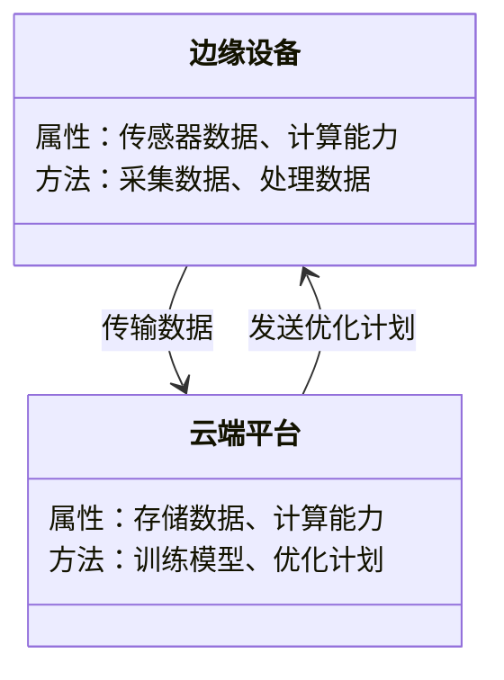
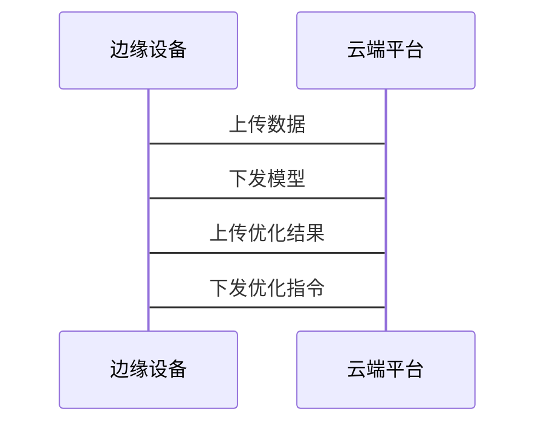

                 


# 企业AI Agent的边缘智能与云智能协同策略

> 关键词：企业AI Agent，边缘智能，云智能，协同策略，系统架构，算法优化

> 摘要：本文深入探讨了企业AI Agent在边缘智能与云智能协同中的应用策略，从背景、核心概念、算法原理、系统架构到项目实战，全面分析了边缘与云协同的核心问题、解决方法及优化策略。通过详细的技术分析和案例解读，为读者提供了一套完整的协同方案。

---

## 第一部分: 企业AI Agent的边缘智能与云智能协同策略背景介绍

### 第1章: 企业AI Agent的概述

#### 1.1 AI Agent的基本概念

##### 1.1.1 AI Agent的定义与特点
AI Agent（人工智能代理）是一种能够感知环境、自主决策并执行任务的智能实体。它具备以下特点：
- **自主性**：能够独立决策和行动。
- **反应性**：能够实时感知环境并做出响应。
- **目标导向性**：通过目标驱动行为。
- **学习能力**：能够通过数据优化自身的决策能力。

##### 1.1.2 企业级AI Agent的应用场景
企业AI Agent广泛应用于以下场景：
- **智能客服**：通过自然语言处理提供个性化服务。
- **智能制造**：优化生产流程和设备管理。
- **金融风控**：实时监测和分析金融数据。
- **供应链管理**：优化物流和库存管理。

##### 1.1.3 AI Agent与传统AI的区别
AI Agent与传统AI的主要区别在于：
- **自主性**：AI Agent能够自主决策，而传统AI通常需要人工干预。
- **实时性**：AI Agent能够实时响应，而传统AI通常是批量处理。
- **目标导向性**：AI Agent以目标为导向，而传统AI更多是任务导向。

#### 1.2 边缘智能与云智能的定义

##### 1.2.1 边缘智能的基本概念
边缘智能是指在靠近数据源的边缘设备上进行智能计算和决策的过程。其特点包括：
- **低延迟**：数据在本地处理，减少传输延迟。
- **高实时性**：能够快速响应实时需求。
- **分布式计算**：计算资源分布在网络边缘。

##### 1.2.2 云智能的基本概念
云智能是指在云端进行大规模数据存储和智能计算的过程。其特点包括：
- **高计算能力**：利用云计算资源进行大规模数据处理。
- **弹性扩展**：根据需求动态调整计算资源。
- **集中化管理**：数据和计算集中在云端。

##### 1.2.3 边缘智能与云智能的对比分析
| 特性 | 边缘智能 | 云智能 |
|------|----------|--------|
| 计算资源 | 分布式，靠近数据源 | 集中式，云端 |
| 延迟 | 低延迟 | 高延迟 |
| 数据量 | 处理小数据 | 处理大数据 |
| 适用场景 | 实时性要求高，本地处理需求强 | 数据集中处理，资源需求高 |

#### 1.3 企业AI Agent的边缘与云协同背景

##### 1.3.1 企业AI Agent的演进历程
AI Agent从单点智能到分布式智能的演进历程：
1. **单点智能**：AI Agent独立运行，无法与其他设备协同。
2. **分布式智能**：AI Agent通过边缘和云协同，实现数据共享和计算协同。

##### 1.3.2 边缘与云协同的必要性
边缘与云协同的必要性体现在：
- **资源优化**：通过边缘和云协同，实现资源的最优分配。
- **实时性与可靠性**：边缘处理实时任务，云端提供计算支持，提高系统的可靠性和响应速度。
- **数据隐私**：边缘处理敏感数据，云端存储和分析非敏感数据，保护数据隐私。

##### 1.3.3 当前行业面临的挑战与机遇
当前行业面临的挑战：
- **数据孤岛**：不同设备和系统之间的数据无法有效共享。
- **计算资源分配**：如何高效分配边缘和云的计算资源。
- **安全与隐私**：边缘和云协同过程中，如何保障数据安全和隐私。

当前行业面临的机遇：
- **技术创新**：边缘计算和云计算技术的不断进步，为AI Agent的协同提供了技术基础。
- **应用场景扩展**：边缘与云协同的应用场景不断扩展，推动企业智能化转型。

---

## 第二部分: 核心概念与联系

### 第2章: 企业AI Agent的边缘与云协同机制

#### 2.1 边缘智能的核心原理

##### 2.1.1 边缘计算的基本原理
边缘计算的基本原理是将计算能力从云端推向网络边缘，实现数据的本地处理和分析。其核心流程包括：
1. 数据采集：通过传感器或设备采集数据。
2. 数据处理：在边缘设备上进行初步的数据处理和分析。
3. 数据传输：将处理后的数据传输到云端或其他边缘设备。

##### 2.1.2 边缘智能的实现方式
边缘智能的实现方式包括：
- **边缘服务器**：在靠近数据源的地方部署服务器，进行数据处理和分析。
- **边缘计算网关**：通过网关设备将边缘数据进行汇总和处理。
- **边缘终端**：在设备端直接进行数据处理和分析。

##### 2.1.3 边缘智能的关键技术
边缘智能的关键技术包括：
- **边缘计算技术**：如雾计算、边缘云计算等。
- **边缘存储技术**：如分布式存储、本地缓存等。
- **边缘安全技术**：如边缘设备的安全防护、数据加密等。

#### 2.2 云智能的核心原理

##### 2.2.1 云计算的基本原理
云计算的基本原理是通过互联网提供计算资源和服务，实现数据的集中处理和分析。其核心流程包括：
1. 数据采集：通过各种设备和传感器采集数据。
2. 数据传输：将数据传输到云端。
3. 数据处理：在云端进行大规模数据处理和分析。
4. 结果返回：将处理结果返回给用户或边缘设备。

##### 2.2.2 云智能的实现方式
云智能的实现方式包括：
- **IaaS（基础设施即服务）**：提供虚拟化的计算资源。
- **PaaS（平台即服务）**：提供开发和部署平台。
- **SaaS（软件即服务）**：提供具体的应用服务。

##### 2.2.3 云智能的关键技术
云智能的关键技术包括：
- **分布式计算技术**：如MapReduce、Spark等。
- **大数据处理技术**：如Hadoop、Hive等。
- **云计算技术**：如虚拟化、容器化等。

#### 2.3 边缘与云协同的机制

##### 2.3.1 数据协同机制
数据协同机制包括：
- **数据共享**：边缘设备将数据传输到云端，云端进行分析和处理。
- **数据分发**：云端将分析结果分发给边缘设备，供其使用。

##### 2.3.2 计算协同机制
计算协同机制包括：
- **边缘计算与云计算协同**：边缘设备处理实时任务，云端处理复杂任务。
- **任务分配**：根据计算资源和任务需求，动态分配计算任务。

##### 2.3.3 服务协同机制
服务协同机制包括：
- **服务发现**：边缘设备发现云端服务，并进行交互。
- **服务调用**：边缘设备调用云端服务，完成特定任务。

---

### 第3章: 边缘与云协同的核心要素

#### 3.1 数据协同的核心要素

##### 3.1.1 数据一致性
数据一致性是指边缘和云端数据的统一性和准确性。实现数据一致性需要考虑：
- **数据同步机制**：确保边缘和云端数据同步。
- **数据版本控制**：管理不同版本的数据。

##### 3.1.2 数据隐私与安全
数据隐私与安全是边缘与云协同的重要考虑因素。需要采取以下措施：
- **数据加密**：对敏感数据进行加密处理。
- **访问控制**：限制对数据的访问权限。

##### 3.1.3 数据存储与管理
数据存储与管理包括：
- **分布式存储**：在边缘和云端实现分布式存储。
- **数据索引**：建立数据索引，提高查询效率。

#### 3.2 计算协同的核心要素

##### 3.2.1 计算资源分配
计算资源分配需要考虑：
- **资源调度**：根据任务需求动态分配计算资源。
- **负载均衡**：确保计算资源的均衡使用。

##### 3.2.2 计算任务调度
计算任务调度包括：
- **任务分配**：将任务分配给合适的计算资源。
- **任务监控**：实时监控任务执行情况，及时调整资源分配。

##### 3.2.3 计算性能优化
计算性能优化需要考虑：
- **并行计算**：利用多核处理器进行并行计算。
- **分布式计算**：将任务分解成多个子任务，分布式执行。

#### 3.3 服务协同的核心要素

##### 3.3.1 服务发现与注册
服务发现与注册包括：
- **服务注册**：将边缘设备和服务注册到云端。
- **服务发现**：边缘设备通过服务发现机制找到需要的服务。

##### 3.3.2 服务调用与交互
服务调用与交互包括：
- **服务调用**：边缘设备调用云端服务。
- **服务交互**：边缘设备与云端服务进行数据交互。

##### 3.3.3 服务容错与恢复
服务容错与恢复需要考虑：
- **故障容错**：在服务故障时，能够自动切换到备用服务。
- **服务恢复**：在故障恢复后，重新建立服务连接。

---

## 第三部分: 算法原理讲解

### 第4章: 边缘与云协同的算法优化

#### 4.1 分布式优化算法

##### 4.1.1 分布式优化的基本原理
分布式优化的基本原理是将优化问题分解成多个子问题，分别在不同的计算节点上进行求解。其核心流程包括：
1. **问题分解**：将优化问题分解成多个子问题。
2. **子问题求解**：分别在边缘和云端求解子问题。
3. **结果整合**：将子问题的结果整合成最终的优化解。

##### 4.1.2 分布式优化的数学模型
分布式优化的数学模型可以表示为：
$$
\min_{x_i} \sum_{i=1}^n f_i(x_i) \quad \text{subject to} \quad g(x_1, x_2, \dots, x_n) \leq 0
$$
其中，$x_i$表示第$i$个节点的变量，$f_i(x_i)$表示第$i$个节点的优化目标，$g$表示全局约束条件。

##### 4.1.3 分布式优化的算法实现
分布式优化的算法实现可以采用以下步骤：
1. **初始化**：设置初始变量值。
2. **迭代优化**：在每个节点上进行局部优化。
3. **同步更新**：将各节点的优化结果同步到全局变量。
4. **检查收敛性**：判断是否收敛，若收敛则结束，否则继续迭代。

##### 4.1.4 分布式优化的实际应用
分布式优化的实际应用包括：
- **边缘与云协同的资源分配**：通过分布式优化算法实现计算资源的最优分配。
- **多目标优化**：在边缘和云端协同优化多个目标函数。

#### 4.2 联邦学习算法

##### 4.2.1 联邦学习的基本原理
联邦学习是一种分布式机器学习方法，允许多个边缘设备在不共享原始数据的情况下共同训练模型。其核心流程包括：
1. **模型初始化**：在云端初始化模型参数。
2. **模型分发**：将模型参数分发给边缘设备。
3. **局部训练**：边缘设备在本地数据上训练模型。
4. **模型聚合**：将各边缘设备的模型参数聚合到云端。
5. **模型更新**：云端更新全局模型参数。

##### 4.2.2 联邦学习的数学模型
联邦学习的数学模型可以表示为：
$$
\theta_{t+1} = \frac{1}{n} \sum_{i=1}^n \theta_i^{(t)}
$$
其中，$\theta_{t+1}$表示更新后的全局模型参数，$\theta_i^{(t)}$表示第$i$个边缘设备的模型参数，$n$表示边缘设备的数量。

##### 4.2.3 联邦学习的算法实现
联邦学习的算法实现可以采用以下步骤：
1. **模型初始化**：在云端初始化模型参数。
2. **模型分发**：将模型参数分发给边缘设备。
3. **局部训练**：边缘设备在本地数据上训练模型，并更新模型参数。
4. **模型聚合**：将各边缘设备的模型参数聚合到云端，得到新的全局模型参数。
5. **模型更新**：云端更新全局模型参数，并将新的参数分发给边缘设备。

##### 4.2.4 联邦学习的实际应用
联邦学习的实际应用包括：
- **边缘设备的协同训练**：多个边缘设备协同训练模型，提高模型的泛化能力。
- **数据隐私保护**：通过联邦学习，可以在不共享原始数据的情况下训练模型，保护数据隐私。

---

## 第四部分: 系统分析与架构设计方案

### 第5章: 边缘与云协同的系统架构设计

#### 5.1 问题场景介绍

##### 5.1.1 问题背景
在一个智能制造工厂中，边缘设备需要实时监控生产过程，并与云端协同优化生产计划。

##### 5.1.2 项目介绍
本项目旨在设计一个基于边缘与云协同的智能制造系统，实现生产过程的实时监控和优化。

#### 5.2 系统功能设计

##### 5.2.1 系统功能需求
系统功能需求包括：
- **数据采集**：采集生产过程中的各种数据。
- **数据处理**：在边缘设备上进行数据预处理和分析。
- **数据传输**：将处理后的数据传输到云端。
- **数据存储**：在云端存储和管理数据。
- **模型训练**：在云端训练预测模型。
- **预测与优化**：基于模型预测结果优化生产计划。

##### 5.2.2 系统功能流程
系统功能流程包括：
1. **数据采集**：通过传感器采集生产数据。
2. **数据处理**：在边缘设备上进行数据预处理和分析。
3. **数据传输**：将处理后的数据传输到云端。
4. **数据存储**：在云端存储和管理数据。
5. **模型训练**：在云端训练预测模型。
6. **预测与优化**：基于模型预测结果优化生产计划。

##### 5.2.3 系统功能设计的领域模型
领域模型设计如图所示：



#### 5.3 系统架构设计

##### 5.3.1 系统架构设计
系统架构设计如图所示：


##### 5.3.2 系统架构的实现方式
系统架构的实现方式包括：
- **边缘服务器**：部署在靠近生产现场的边缘服务器，负责数据处理和本地优化。
- **云端平台**：部署在数据中心，负责大规模数据存储和模型训练。

#### 5.4 系统接口设计

##### 5.4.1 边缘设备与云端平台的接口
边缘设备与云端平台的接口包括：
- **数据接口**：用于数据的上传和下载。
- **指令接口**：用于接收云端平台的优化指令。
- **模型接口**：用于模型的下载和上传。

##### 5.4.2 云端平台与边缘设备的交互流程
云端平台与边缘设备的交互流程包括：
1. **数据上传**：边缘设备将处理后的数据上传到云端平台。
2. **模型训练**：云端平台基于上传的数据训练预测模型。
3. **模型下发**：云端平台将训练好的模型下发给边缘设备。
4. **优化计划**：边缘设备基于模型预测结果优化生产计划。

#### 5.5 系统交互流程

##### 5.5.1 边缘设备与云端平台的交互流程
边缘设备与云端平台的交互流程如图所示：



##### 5.5.2 系统整体交互流程
系统整体交互流程包括：
1. **数据采集**：边缘设备采集生产数据。
2. **数据处理**：边缘设备对数据进行预处理和分析。
3. **数据上传**：边缘设备将处理后的数据上传到云端平台。
4. **模型训练**：云端平台基于上传的数据训练预测模型。
5. **模型下发**：云端平台将训练好的模型下发给边缘设备。
6. **优化计划**：边缘设备基于模型预测结果优化生产计划。
7. **优化结果反馈**：边缘设备将优化结果反馈到云端平台。

---

## 第五部分: 项目实战

### 第6章: 边缘与云协同的项目实现

#### 6.1 环境安装

##### 6.1.1 系统环境
- **操作系统**：Linux（如Ubuntu 20.04）
- **开发工具**：Python 3.8+

##### 6.1.2 依赖安装
- **边缘设备**：安装Python和必要的库（如flask、numpy）。
- **云端平台**：安装Python和必要的库（如flask、numpy、tensorflow）。

##### 6.1.3 网络配置
- **本地网络**：确保边缘设备和云端平台在同一局域网内。
- **公网访问**：如果需要公网访问，配置云服务器的公网IP和端口。

#### 6.2 系统核心实现

##### 6.2.1 边缘设备的核心代码
边缘设备的核心代码如下：

```python
import requests
import json
import numpy as np

class EdgeDevice:
    def __init__(self, server_url):
        self.server_url = server_url
        self.data = None

    def collect_data(self):
        # 模拟数据采集
        self.data = np.random.rand(10, 10)

    def process_data(self):
        # 数据处理
        processed_data = self.data.mean()
        return processed_data

    def send_data_to_cloud(self):
        # 数据传输到云端
        payload = json.dumps({"data": self.process_data()})
        response = requests.post(f"{self.server_url}/api/upload", json=payload)
        return response.status_code

    def receive_model(self):
        # 接收云端下发的模型
        response = requests.get(f"{self.server_url}/api/model")
        return response.json()

# 示例用法
edge_device = EdgeDevice("http://localhost:5000")
edge_device.collect_data()
edge_device.process_data()
edge_device.send_data_to_cloud()
```

##### 6.2.2 云端平台的核心代码
云端平台的核心代码如下：

```python
from flask import Flask, request, jsonify
import json
import numpy as np

app = Flask(__name__)

@app.route('/api/upload', methods=['POST'])
def upload_data():
    data = request.json['data']
    # 数据存储和分析
    print(f"接收到数据：{data}")
    return jsonify({"status": "success"})

@app.route('/api/model', methods=['GET'])
def get_model():
    # 返回训练好的模型
    return jsonify({"model": "trained_model"})

if __name__ == "__main__":
    app.run(debug=True)
```

##### 6.2.3 系统交互流程实现
系统交互流程实现包括：
1. 边缘设备采集数据。
2. 边缘设备处理数据。
3. 边缘设备将数据传输到云端平台。
4. 云端平台训练模型。
5. 云端平台将模型下发给边缘设备。
6. 边缘设备基于模型优化生产计划。

#### 6.3 项目小结

##### 6.3.1 项目实现的关键点
- **数据传输**：确保边缘设备与云端平台之间的数据传输高效可靠。
- **模型训练**：在云端平台训练预测模型，提高模型的准确性和泛化能力。
- **优化计划**：基于模型预测结果优化生产计划，提高生产效率。

##### 6.3.2 项目实现的难点
- **数据一致性**：如何保证边缘和云端数据的一致性。
- **计算资源分配**：如何高效分配边缘和云端的计算资源。
- **安全与隐私**：如何保障数据的安全与隐私。

---

## 第六部分: 最佳实践

### 第7章: 边缘与云协同的最佳实践

#### 7.1 小结

##### 7.1.1 本文的核心内容
本文的核心内容包括：
- **背景介绍**：介绍了企业AI Agent的边缘智能与云智能协同策略的背景和意义。
- **核心概念**：详细讲解了边缘智能和云智能的核心概念和协同机制。
- **算法优化**：提出了分布式优化算法和联邦学习算法，并进行了详细的数学推导和代码实现。
- **系统架构设计**：设计了一个基于边缘与云协同的智能制造系统架构，并进行了详细的系统分析和交互设计。
- **项目实战**：通过具体的项目实现，验证了本文提出的方法和策略的有效性。

##### 7.1.2 本文的核心创新点
本文的核心创新点包括：
- **分布式优化算法**：提出了一种基于分布式优化的算法，用于边缘与云协同的资源分配和任务调度。
- **联邦学习算法**：提出了一种基于联邦学习的算法，用于边缘设备的协同训练和数据隐私保护。
- **系统架构设计**：设计了一种基于边缘与云协同的智能制造系统架构，并进行了详细的系统分析和交互设计。

#### 7.2 注意事项

##### 7.2.1 数据一致性
在边缘与云协同中，数据一致性是一个重要的问题。需要采取以下措施：
- **数据同步机制**：确保边缘和云端数据的同步。
- **数据版本控制**：管理不同版本的数据，确保数据的准确性和一致性。

##### 7.2.2 计算资源分配
在计算资源分配中，需要注意以下几点：
- **资源调度**：根据任务需求动态分配计算资源。
- **负载均衡**：确保计算资源的均衡使用，避免资源浪费和瓶颈。

##### 7.2.3 安全与隐私
在边缘与云协同中，数据安全与隐私是一个重要的问题。需要采取以下措施：
- **数据加密**：对敏感数据进行加密处理。
- **访问控制**：限制对数据的访问权限，确保数据的安全性。

#### 7.3 拓展阅读

##### 7.3.1 相关书籍推荐
- **《边缘计算：原理与实践》**：深入讲解边缘计算的原理和实践。
- **《分布式系统：原理与设计》**：详细分析分布式系统的原理和设计。
- **《联邦学习：原理与应用》**：系统介绍联邦学习的原理和应用场景。

##### 7.3.2 相关技术博客推荐
- **Kubernetes官方博客**：了解容器化和分布式系统的最新技术动态。
- **TensorFlow官方博客**：了解机器学习和深度学习的最新技术动态。
- **Cloudflare官方博客**：了解边缘计算和网络安全的最新技术动态。

---

## 作者：AI天才研究院/AI Genius Institute & 禅与计算机程序设计艺术 /Zen And The Art of Computer Programming

