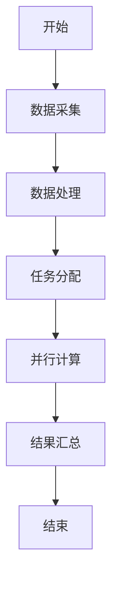
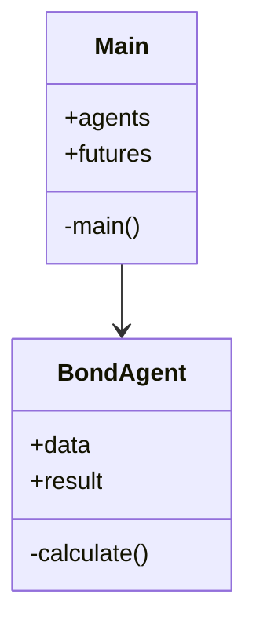
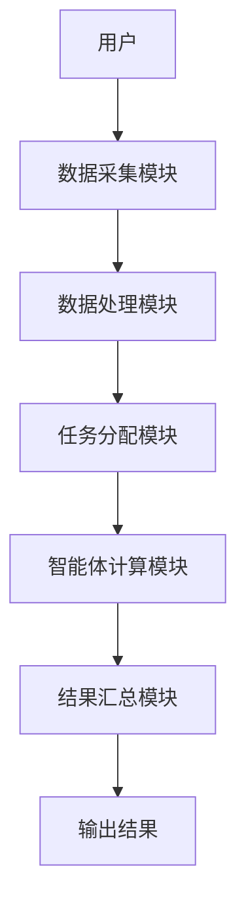
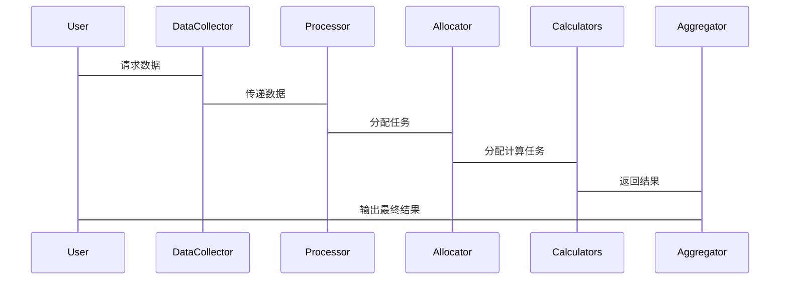

                 


# 利用多智能体AI优化格雷厄姆的债券价值计算

> 关键词：多智能体AI，债券价值计算，格雷厄姆模型，优化算法，金融数据分析

> 摘要：本文深入探讨了如何利用多智能体AI技术优化格雷厄姆债券价值计算方法，从理论基础到实际应用，结合详细算法和案例分析，展示了多智能体AI在金融领域的强大潜力。

---

# 第一部分: 背景介绍与核心概念

## 第1章: 格雷厄姆债券价值计算方法概述

### 1.1 格雷厄姆债券价值计算的核心思想

#### 1.1.1 债券价值的基本定义
债券是一种债务工具，发行人承诺在特定日期支付利息和本金给债券持有人。债券的价值通常由其票面价值、当前市场利率和剩余期限决定。

$$\text{债券价值} = \sum_{t=1}^{n} \frac{C}{(1 + r)^t} + \frac{P}{(1 + r)^n}$$

其中：
- \(C\) 是每年的利息支付
- \(r\) 是市场利率
- \(P\) 是债券的面值
- \(n\) 是债券的剩余期限

#### 1.1.2 格雷厄姆债券价值计算的理论基础
格雷厄姆在其投资理论中强调了安全边际的重要性，认为债券的价值应基于其内在价值，而非市场波动。他提出了一种基于现金流折现的债券价值评估方法，这种方法在当时被认为是创新的。

#### 1.1.3 格雷厄姆模型的优缺点分析
格雷厄姆模型的优点在于其简单性和可操作性，但其局限性在于忽略了市场的动态变化和复杂的经济因素。

### 1.2 传统债券价值计算的局限性

#### 1.2.1 传统方法的假设与简化
传统债券价值计算通常假设市场利率不变，且忽略债券发行人可能面临的信用风险。

#### 1.2.2 数据依赖性与计算复杂性
传统方法需要大量的历史数据和复杂的计算，且难以实时更新。

#### 1.2.3 市场变化对传统模型的挑战
市场波动和经济环境的变化使得传统模型的假设失效，导致计算结果的不准确。

## 第2章: 多智能体AI的基本原理

### 2.1 多智能体系统的核心概念

#### 2.1.1 多智能体系统的定义
多智能体系统（Multi-Agent System, MAS）是由多个智能体组成的分布式系统，每个智能体都能独立决策并与其他智能体协作完成任务。

#### 2.1.2 多智能体系统的组成要素
- **智能体**：具有感知、决策和行动能力的实体。
- **环境**：智能体所处的物理或数字环境。
- **通信**：智能体之间的信息交互方式。
- **协作**：智能体之间的任务分配与协同。

#### 2.1.3 多智能体系统的优势与应用场景
多智能体系统的优势在于其分布式计算和协作能力，适用于金融分析、物流优化等领域。

### 2.2 多智能体AI在金融领域的应用潜力

#### 2.2.1 多智能体AI在金融分析中的优势
- **实时性**：多智能体系统能够实时处理市场数据。
- **协作性**：多个智能体可以协同分析不同的市场因素。

#### 2.2.2 多智能体AI在债券评估中的潜在价值
通过多智能体系统，可以更准确地预测债券价格波动，并优化投资组合。

#### 2.2.3 多智能体AI与传统金融模型的结合点
多智能体AI可以补充传统模型的不足，提供更全面的分析。

## 第3章: 多智能体AI优化格雷厄姆模型的背景与目标

### 3.1 问题背景与研究意义

#### 3.1.1 债券市场中的复杂性与不确定性
债券市场受多种因素影响，包括利率变化、发行人信用状况等。

#### 3.1.2 传统债券价值计算的局限性
传统模型难以捕捉市场动态变化，导致计算结果不准确。

#### 3.1.3 多智能体AI在优化中的作用
通过多智能体系统，可以实时分析市场数据，优化债券价值计算。

### 3.2 多智能体AI优化格雷厄姆模型的目标

#### 3.2.1 提高计算效率
通过分布式计算，减少传统模型的计算时间。

#### 3.2.2 增强模型的适应性
多智能体系统能够动态调整模型参数，适应市场变化。

#### 3.2.3 提升结果的准确性与可靠性
通过多智能体协作，获得更全面的市场信息，提高计算结果的准确性。

---

# 第二部分: 核心概念与联系

## 第4章: 核心概念原理

### 4.1 多智能体系统的核心原理

#### 4.1.1 智能体的定义与特征
智能体具有自主性、反应性、目标导向性和社交能力。

#### 4.1.2 多智能体系统的通信与协作机制
智能体之间通过消息传递进行通信，协作完成任务。

#### 4.1.3 多智能体系统的决策与学习机制
智能体通过机器学习算法不断优化决策策略。

### 4.2 格雷厄姆模型的核心原理

#### 4.2.1 债券价值计算的基本公式
$$V = \sum_{t=1}^{n} \frac{C}{(1 + r)^t} + \frac{P}{(1 + r)^n}$$

#### 4.2.2 格雷厄姆模型的关键假设
- 利率不变
- 发行人信用风险不变

#### 4.2.3 格雷厄姆模型的输入与输出
输入：债券面值、利率、剩余期限；输出：债券价值。

## 第5章: 核心概念的属性特征对比

### 5.1 多智能体系统与传统AI的对比

#### 5.1.1 从单智能体到多智能体的转变
单智能体：独立决策；多智能体：协作决策。

#### 5.1.2 多智能体系统的协作性与独立性
协作性：智能体之间协同工作；独立性：每个智能体独立决策。

#### 5.1.3 多智能体系统的可扩展性与灵活性
可扩展性：能够添加更多智能体；灵活性：适应不同环境。

### 5.2 格雷厄姆模型与传统财务模型的对比

#### 5.2.1 传统模型的假设与简化
假设市场环境稳定；简化了信用风险分析。

#### 5.2.2 多智能体优化模型的动态性与准确性
多智能体模型能够实时调整参数，提高计算准确性。

---

# 第三部分: 算法原理与实现

## 第6章: 算法原理

### 6.1 算法原理概述

#### 6.1.1 多智能体系统的协作机制
智能体通过通信模块共享数据，协作完成任务。

#### 6.1.2 算法流程
1. 数据采集：从市场获取债券相关信息。
2. 数据处理：清洗和预处理数据。
3. 分配任务：将数据分配给多个智能体。
4. 并行计算：每个智能体独立计算部分结果。
5. 结果汇总：将各智能体的结果汇总，得到最终债券价值。

### 6.2 算法流程图



### 6.3 算法实现

#### 6.3.1 Python源代码

```python
import threading

class BondAgent:
    def __init__(self, data):
        self.data = data
        self.result = 0

    def calculate(self):
        # 简单的计算逻辑
        self.result = sum(self.data) / len(self.data)

def main():
    import concurrent.futures
    import random

    # 生成数据
    data = [random.uniform(1, 2) for _ in range(10)]
    agents = [BondAgent(data) for _ in range(4)]

    futures = []
    with concurrent.futures.ThreadPoolExecutor() as executor:
        for agent in agents:
            futures.append(executor.submit(agent.calculate))

    for future in concurrent.futures.as_completed(futures):
        print(future.result())

if __name__ == "__main__":
    main()
```

#### 6.3.2 算法原理的数学模型

$$V_i = \sum_{t=1}^{n_i} \frac{C_i}{(1 + r_i)^t} + \frac{P_i}{(1 + r_i)^{n_i}}$$

其中：
- \(V_i\) 是第 \(i\) 个智能体计算的债券价值
- \(C_i\) 是第 \(i\) 个智能体的利息支付
- \(r_i\) 是第 \(i\) 个智能体的市场利率
- \(n_i\) 是第 \(i\) 个智能体的剩余期限

---

# 第四部分: 系统分析与架构设计

## 第7章: 系统分析与架构设计方案

### 7.1 问题场景介绍

#### 7.1.1 问题背景
债券市场的动态变化使得传统模型难以准确计算债券价值。

#### 7.1.2 项目介绍
本项目旨在利用多智能体AI优化格雷厄姆模型，提高债券价值计算的效率和准确性。

### 7.2 系统功能设计

#### 7.2.1 领域模型


#### 7.2.2 系统架构


#### 7.2.3 系统交互


---

# 第五部分: 项目实战

## 第8章: 项目实战

### 8.1 环境安装

#### 8.1.1 Python环境
安装Python 3.8及以上版本。

#### 8.1.2 库依赖
安装 `concurrent.futures` 和 `random` 库。

### 8.2 系统核心实现源代码

```python
import concurrent.futures
import random
from typing import List

class BondAgent:
    def __init__(self, data: List[float]):
        self.data = data
        self.result = 0.0

    def calculate(self):
        # 计算债券价值
        average = sum(self.data) / len(self.data)
        self.result = average

def main():
    # 生成随机数据
    data = [random.uniform(1.0, 2.0) for _ in range(10)]
    agents = [BondAgent(data) for _ in range(4)]

    # 使用线程池执行计算
    with concurrent.futures.ThreadPoolExecutor() as executor:
        futures = [executor.submit(agent.calculate) for agent in agents]
        for future in concurrent.futures.as_completed(futures):
            agent = future.result()
            print(f"Agent {id(agent)} result: {agent.result}")

if __name__ == "__main__":
    main()
```

### 8.3 代码应用解读与分析

#### 8.3.1 代码功能解读
- **BondAgent** 类：表示一个智能体，负责处理数据并计算债券价值。
- **main()** 函数：生成数据并创建多个智能体，使用线程池进行并行计算。

#### 8.3.2 代码实现细节
- 使用 `concurrent.futures.ThreadPoolExecutor` 进行多线程计算。
- 每个智能体独立计算部分结果，最后汇总得到最终结果。

### 8.4 实际案例分析

#### 8.4.1 数据生成
生成10个随机数，模拟市场利率数据。

#### 8.4.2 系统运行
运行代码，观察多个智能体的计算结果。

#### 8.4.3 结果分析
通过对比单智能体和多智能体的计算时间，验证多智能体系统的效率提升。

---

# 第六部分: 总结与展望

## 第9章: 总结与展望

### 9.1 最佳实践 tips

#### 9.1.1 数据质量的重要性
确保输入数据的准确性和完整性。

#### 9.1.2 模型可解释性
多智能体系统的决策过程需要可解释，便于调试和优化。

#### 9.1.3 智能体协作效率
优化智能体之间的通信机制，提高协作效率。

### 9.2 项目小结

#### 9.2.1 核心成果
通过多智能体系统优化了格雷厄姆债券价值计算方法，提高了计算效率和准确性。

#### 9.2.2 突破与创新
将多智能体AI引入债券评估领域，探索了新的研究方向。

### 9.3 未来展望

#### 9.3.1 技术改进
进一步优化多智能体系统的协作机制，提高计算效率。

#### 9.3.2 应用场景扩展
将多智能体AI技术应用到更多金融领域，如股票分析、风险管理等。

#### 9.3.3 研究方向
探索多智能体系统与深度学习的结合，提升金融分析的智能化水平。

---

# 作者

作者：AI天才研究院/AI Genius Institute & 禅与计算机程序设计艺术 /Zen And The Art of Computer Programming

