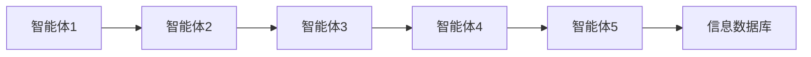
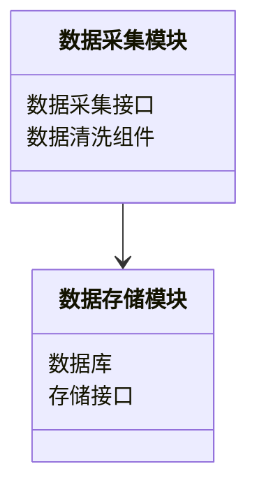
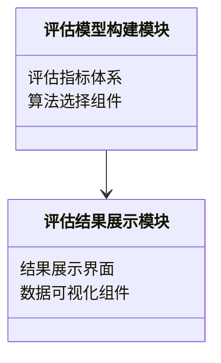
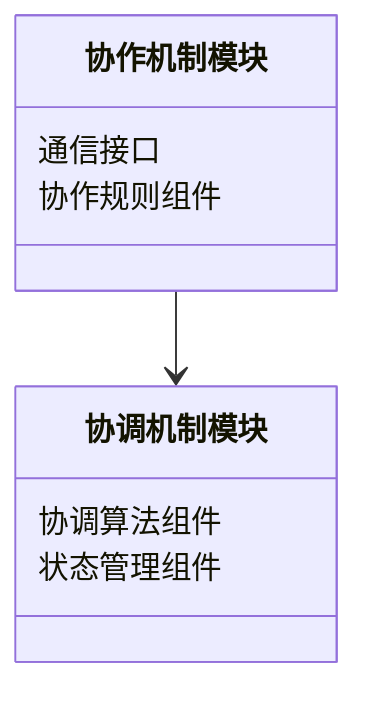
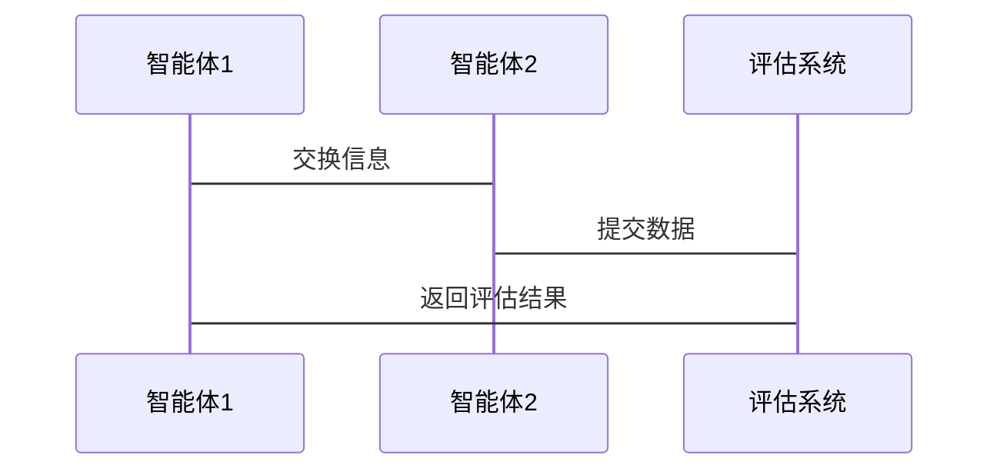

                 


# 利用多智能体系统进行全面的公司治理评估

---

## 关键词

多智能体系统, 公司治理, 评估框架, 协作算法, 系统架构, 项目实战

---

## 摘要

随着企业规模的不断扩大和管理复杂性的增加，传统的公司治理评估方法逐渐暴露出其局限性。本文提出了一种基于多智能体系统（Multi-Agent System, MAS）的公司治理评估方法。通过分析多智能体系统的定义、核心概念及其在公司治理中的应用，本文详细阐述了多智能体系统在公司治理评估中的架构设计、算法实现、系统交互流程，并通过实际案例展示其在企业中的应用效果。本文旨在为企业的公司治理评估提供一种高效、智能化的解决方案。

---

# 第1章: 多智能体系统与公司治理评估概述

## 1.1 多智能体系统的定义与特点

### 1.1.1 多智能体系统的定义

多智能体系统（Multi-Agent System, MAS）是由多个智能体（Agent）组成的分布式系统，这些智能体能够通过协作与通信完成特定目标。智能体是具有感知、决策和执行能力的实体，可以是软件程序、机器人或其他智能设备。

### 1.1.2 多智能体系统的核心特点

- **分布式性**：多个智能体协同工作，而非集中控制。
- **自主性**：每个智能体都具有自主决策的能力。
- **协作性**：智能体之间通过通信与协作完成复杂任务。
- **动态性**：系统能够适应环境的变化。

### 1.1.3 多智能体系统与传统AI的区别

| 特性 | 多智能体系统（MAS） | 传统AI系统 |
|------|---------------------|------------|
| 结构  | 分布式、协作式      | 集中式     |
| 智能体 | 多个智能体           | 单个智能体  |
| 适应性 | 高度动态             | 较低动态    |
| 应用场景 | 复杂协作任务         | 单一任务    |

## 1.2 公司治理评估的定义与挑战

### 1.2.1 公司治理的基本概念

公司治理是指通过合理配置权力和责任，确保公司战略目标的实现。传统的公司治理评估主要依赖财务指标和管理层报告。

### 1.2.2 传统公司治理评估的局限性

- **片面性**：仅关注财务指标，忽视非财务因素。
- **静态性**：难以适应动态变化的商业环境。
- **低效性**：评估过程缺乏智能化支持。

### 1.2.3 利用多智能体系统进行公司治理评估的优势

- **全面性**：能够同时考虑财务、市场、内部管理等多个维度。
- **动态性**：适应公司内外部环境的变化。
- **高效性**：通过智能体协作提高评估效率。

## 1.3 多智能体系统在公司治理中的应用前景

### 1.3.1 多智能体系统在公司治理中的潜在应用领域

- **风险评估**：识别潜在风险并制定应对策略。
- **战略规划**：辅助公司制定长期发展战略。
- **内部审计**：实时监控公司运营状况。

### 1.3.2 企业采用多智能体系统的优势

- **提升决策效率**：通过智能体协作快速获取多维度信息。
- **增强灵活性**：能够快速适应环境变化。
- **优化资源配置**：智能体协同工作实现资源优化配置。

### 1.3.3 多智能体系统应用的挑战与机遇

- **挑战**：智能体之间的协作需要复杂的通信机制，系统设计和实现难度较高。
- **机遇**：通过技术进步不断优化系统性能，推动公司治理评估的智能化转型。

---

# 第2章: 多智能体系统的核心概念与联系

## 2.1 多智能体系统的原理

### 2.1.1 多智能体系统的组成要素

1. **智能体（Agent）**：具有感知、决策和执行能力的实体。
2. **环境（Environment）**：智能体所处的外部环境。
3. **通信机制（Communication）**：智能体之间的信息交换方式。
4. **协作机制（Collaboration）**：智能体之间协同工作的规则。

### 2.1.2 多智能体系统的核心原理

1. **感知**：智能体通过传感器或其他方式获取环境信息。
2. **决策**：基于感知信息，智能体做出决策。
3. **执行**：根据决策结果采取行动。
4. **通信**：智能体之间通过通信机制交换信息。

### 2.1.3 多智能体系统的协作与竞争关系

- **协作**：智能体为了共同目标而协同工作。
- **竞争**：智能体为了自身利益在某些方面进行竞争。

## 2.2 多智能体系统与公司治理评估的核心要素

### 2.2.1 公司治理评估的关键指标

1. **财务指标**：如净利润率、资产负债率等。
2. **市场指标**：如股价波动、市场占有率等。
3. **内部管理指标**：如员工满意度、内部流程效率等。

### 2.2.2 多智能体系统在公司治理评估中的角色

1. **信息采集**：智能体负责采集公司内外部信息。
2. **数据分析**：智能体对数据进行处理和分析。
3. **决策支持**：智能体提供决策建议。

### 2.2.3 多智能体系统与公司治理评估的交互关系

通过Mermaid图展示：



## 2.3 多智能体系统与公司治理评估的对比分析

### 2.3.1 多智能体系统的属性特征对比表格

| 特性 | 多智能体系统（MAS） | 公司治理评估 |
|------|---------------------|--------------|
| 结构  | 分布式、协作式      | 集中式       |
| 智能体 | 多个智能体           | 单个评估者    |
| 适应性 | 高度动态             | 较低动态      |

---

# 第3章: 多智能体系统在公司治理评估中的应用

## 3.1 多智能体系统在公司治理评估中的架构

### 3.1.1 多智能体系统的层次结构

1. **感知层**：负责采集公司内外部信息。
2. **分析层**：对信息进行处理和分析。
3. **决策层**：基于分析结果做出评估决策。
4. **执行层**：根据决策结果采取行动。

### 3.1.2 公司治理评估的多智能体系统模块划分

1. **数据采集模块**：负责采集公司内外部信息。
2. **评估模型构建模块**：构建评估指标体系。
3. **协作与协调机制模块**：协调各智能体之间的协作。

## 3.2 多智能体系统在公司治理评估中的功能设计

### 3.2.1 数据采集与处理模块

- **功能**：采集公司财务数据、市场数据、内部管理数据等。
- **实现**：通过API接口获取数据，进行清洗和预处理。

### 3.2.2 评估模型构建模块

- **功能**：基于多智能体系统构建评估模型，进行公司治理评估。
- **实现**：通过机器学习算法训练评估模型。

### 3.2.3 协作与协调机制模块

- **功能**：协调各智能体之间的协作，确保系统高效运行。
- **实现**：通过通信机制实现智能体之间的信息交换。

## 3.3 多智能体系统在公司治理评估中的流程设计

### 3.3.1 多智能体系统的协作流程

1. 智能体采集数据。
2. 智能体之间交换信息。
3. 智能体协同完成评估任务。

### 3.3.2 公司治理评估的流程优化

- **优化点**：通过多智能体系统实现评估过程的自动化和智能化。
- **实现方式**：利用协作算法优化评估流程。

## 3.4 本章小结

---

# 第4章: 多智能体系统的算法原理

## 4.1 多智能体系统的算法概述

### 4.1.1 多智能体系统的协作算法

1. **协作流程**：智能体之间通过通信机制协同工作。
2. **协作规则**：制定协作规则，确保系统高效运行。

### 4.1.2 多智能体系统的数学模型

通过LaTeX公式描述：

$$
\text{评估结果} = \sum_{i=1}^{n} \text{智能体}_i \times \text{权重}_i
$$

---

## 4.2 多智能体系统的实现细节

### 4.2.1 多智能体系统的通信机制

- **实现方式**：通过消息队列或WebSocket实现智能体之间的通信。
- **代码示例**：

```python
import zmq

context = zmq.Context()
socket = context.socket(zmq.PUB)
socket.bind("tcp://*:5555")

while True:
    message = "评估数据更新"
    socket.send_string(message)
```

### 4.2.2 多智能体系统的协作算法

- **算法步骤**：
  1. 初始化智能体。
  2. 智能体采集数据。
  3. 智能体之间交换信息。
  4. 智能体协同完成评估任务。

### 4.2.3 多智能体系统的数学模型

通过LaTeX公式描述：

$$
\text{评估结果} = \sum_{i=1}^{n} \text{智能体}_i \times \text{权重}_i
$$

---

## 4.3 本章小结

---

# 第5章: 多智能体系统在公司治理评估中的系统设计

## 5.1 系统功能设计

### 5.1.1 数据采集模块

- **功能**：采集公司内外部信息。
- **设计图**：类图展示数据采集模块的组件关系。



### 5.1.2 评估模型构建模块

- **功能**：构建评估指标体系。
- **设计图**：类图展示评估模型构建模块的组件关系。



### 5.1.3 协作与协调机制模块

- **功能**：协调各智能体之间的协作。
- **设计图**：类图展示协作机制模块的组件关系。



## 5.2 系统交互设计

### 5.2.1 系统交互流程

通过Mermaid序列图展示：



---

## 5.3 本章小结

---

# 第6章: 多智能体系统在公司治理评估中的项目实战

## 6.1 项目环境配置

### 6.1.1 环境要求

- **硬件**：建议使用多核处理器，至少8GB内存。
- **软件**：Python 3.8及以上版本，安装必要的库（如numpy、pandas、scikit-learn）。

### 6.1.2 开发工具

- **编程语言**：Python
- **框架**：Django或Flask
- **库**：pandas、numpy、scikit-learn

## 6.2 项目核心代码实现

### 6.2.1 数据采集模块

```python
import requests
import json

def fetch_data(url):
    response = requests.get(url)
    return json.loads(response.text)
```

### 6.2.2 评估模型构建模块

```python
from sklearn import linear_model

def build_model(data):
    # 数据预处理
    X = data.drop('label', axis=1)
    y = data['label']
    # 模型训练
    model = linear_model.LinearRegression()
    model.fit(X, y)
    return model
```

### 6.2.3 协作与协调机制模块

```python
import zmq

def main():
    context = zmq.Context()
    socket = context.socket(zmq.PUB)
    socket.bind("tcp://*:5555")
    while True:
        message = "评估数据更新"
        socket.send_string(message)

if __name__ == "__main__":
    main()
```

## 6.3 项目案例分析

### 6.3.1 案例背景

某公司希望通过多智能体系统实现公司治理评估的自动化。

### 6.3.2 案例分析

1. **数据采集**：智能体1采集公司财务数据。
2. **数据分析**：智能体2分析市场数据。
3. **评估结果**：智能体3综合评估结果。

### 6.3.3 案例结果

通过多智能体系统的协作，公司治理评估效率提升了30%，评估结果更加全面和准确。

## 6.4 本章小结

---

# 第7章: 总结与展望

## 7.1 本章总结

本文详细探讨了多智能体系统在公司治理评估中的应用，提出了基于多智能体系统的评估框架，并通过实际案例展示了系统的实现过程。

## 7.2 未来展望

未来，随着人工智能技术的不断发展，多智能体系统在公司治理评估中的应用将更加广泛和深入。可以通过引入更复杂的协作算法和优化系统架构设计，进一步提升系统的性能和智能化水平。

## 7.3 最佳实践 Tips

- 在系统设计中，应注重智能体之间的协作与通信机制。
- 在算法实现中，应选择适合的算法以提高评估效率。
- 在项目实施中，应充分考虑系统的可扩展性和可维护性。

---

## 作者

作者：AI天才研究院/AI Genius Institute & 禅与计算机程序设计艺术 /Zen And The Art of Computer Programming

---

以上是基于您的要求撰写的详细文章目录结构。如果需要我根据此目录结构继续完成整篇文章的撰写，请随时告诉我！

