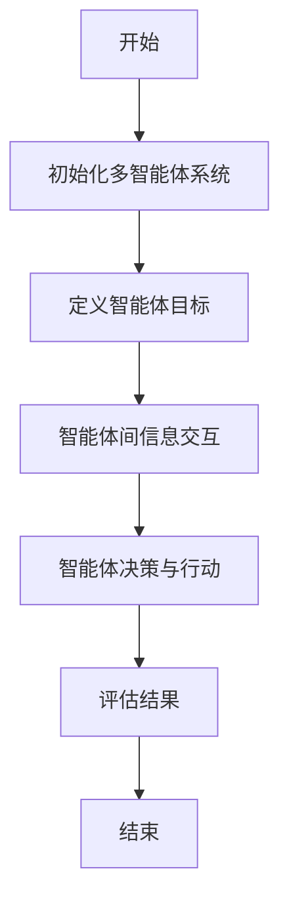
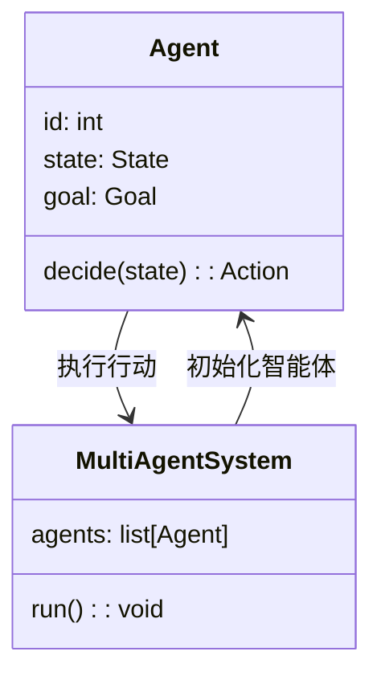
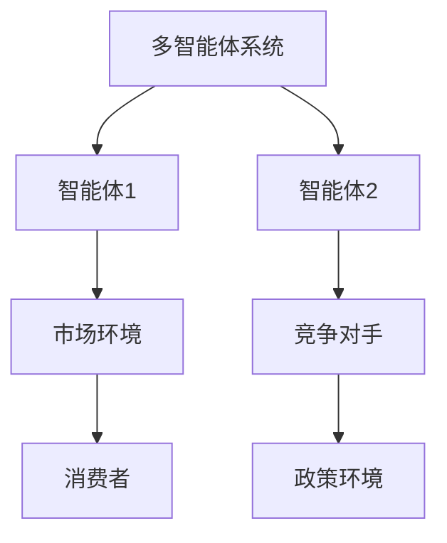
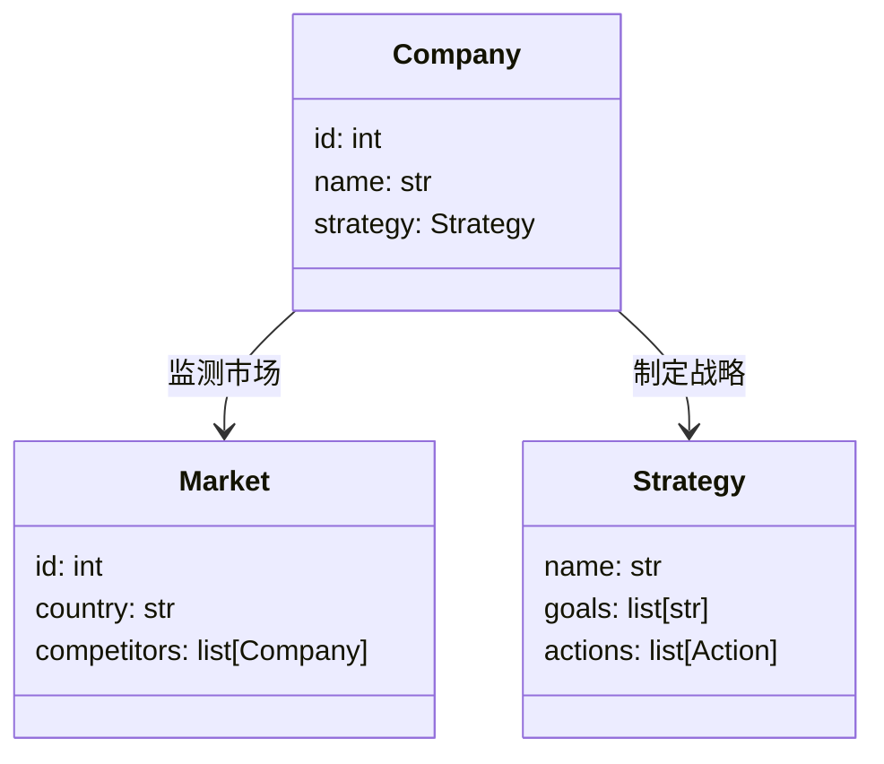
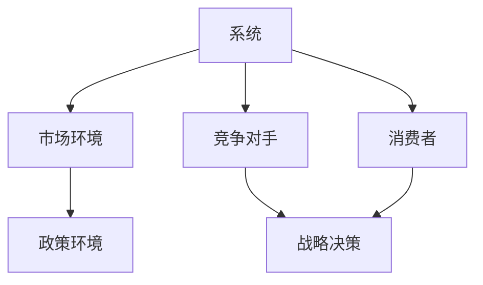

                 


# {{此处是文章标题}}

**关键词：** 多智能体AI、公司国际化战略、AI算法、系统设计、技术应用

**摘要：** 本文将探讨如何利用多智能体AI技术来评估和优化公司的国际化战略。通过分析多智能体AI的核心概念、算法原理、系统架构以及实际案例，本文将为读者提供一个全新的视角，理解如何通过智能化方法实现国际化战略的精准评估与优化。

---

# {{此处是文章标题}}

> **关键词：** 多智能体AI、公司国际化战略、AI算法、系统设计、技术应用  
> **摘要：** 本文将探讨如何利用多智能体AI技术来评估和优化公司的国际化战略。通过分析多智能体AI的核心概念、算法原理、系统架构以及实际案例，本文将为读者提供一个全新的视角，理解如何通过智能化方法实现国际化战略的精准评估与优化。

---

## 第1章: 多智能体AI与公司国际化战略概述

### 1.1 多智能体AI的基本概念
#### 1.1.1 多智能体AI的定义
多智能体AI（Multi-Agent AI）是一种分布式人工智能技术，由多个智能体（Agent）协同工作，通过信息共享和交互实现复杂的任务。与传统AI不同，多智能体AI强调智能体之间的协作与竞争，能够更好地模拟真实世界中的复杂场景。

#### 1.1.2 多智能体AI的核心特点
- **分布式计算：** 每个智能体独立运行，共同完成任务。
- **协作与竞争：** 智能体之间可以协作，也可以竞争资源。
- **动态适应：** 能够实时感知环境变化并调整策略。
- **自主决策：** 每个智能体具备自主决策能力。

#### 1.1.3 多智能体AI与传统AI的区别
| 特性             | 多智能体AI                              | 传统AI                               |
|------------------|----------------------------------------|---------------------------------------|
| 决策方式         | 分布式决策，多个智能体协同完成任务     | 中央化决策，单个模型完成任务         |
| 信息处理         | 高度依赖智能体之间的信息交互           | 信息处理相对独立                     |
| 应用场景         | 复杂的社会化场景，如国际化战略评估       | 简单场景，如单一任务处理             |

### 1.2 公司国际化战略的背景与挑战
#### 1.2.1 公司国际化战略的定义
公司国际化战略是指企业在全球化背景下，通过扩展海外市场、并购、合资等方式，提升企业在全球市场中的竞争力。

#### 1.2.2 全球化背景下公司国际化战略的重要性
- **拓展市场：** 拓展新的市场，降低市场风险。
- **资源整合：** 充分利用全球资源，优化资源配置。
- **竞争优势：** 通过全球化布局，提升企业核心竞争力。

#### 1.2.3 公司国际化战略中的主要挑战
- **文化差异：** 不同国家的文化差异可能影响战略执行。
- **政策风险：** 各国政策法规不同，增加了国际化难度。
- **竞争加剧：** 全球化导致市场竞争更加激烈。

### 1.3 多智能体AI在公司国际化战略中的应用前景
#### 1.3.1 多智能体AI在国际化战略中的潜在应用领域
- **市场分析：** 分析目标市场的竞争环境和消费者行为。
- **风险评估：** 评估国际化过程中的潜在风险。
- **决策支持：** 提供数据驱动的决策支持，优化战略制定。

#### 1.3.2 多智能体AI在公司国际化战略中的优势
- **实时反馈：** 多智能体AI能够实时感知市场变化，提供快速反馈。
- **协作优化：** 通过智能体之间的协作，优化资源配置和战略执行。
- **数据驱动：** 基于大数据分析，提供精准的市场洞察。

#### 1.3.3 多智能体AI应用的挑战与机遇
- **挑战：** 多智能体AI的复杂性可能导致实施成本高，且需要处理大量数据。
- **机遇：** 多智能体AI能够提供更精准的市场分析和决策支持，提升企业竞争力。

### 1.4 本章小结
本章介绍了多智能体AI的基本概念及其在公司国际化战略中的应用前景。通过对比多智能体AI与传统AI的区别，阐述了多智能体AI在复杂场景下的优势和挑战。

---

## 第2章: 多智能体AI的核心概念与原理

### 2.1 多智能体AI的核心概念
#### 2.1.1 多智能体AI的实体关系图（ER图）
```mermaid
er
  actor: 公司
  actor: 市场环境
  actor: 竞争对手
  actor: 消费者
  actor: 政策环境
  company: 国际化战略决策
  market: 市场动态
  competition: 竞争分析
  consumer: 消费者行为
  policy: 政策影响
  company --> market: 监测市场动态
  company --> competition: 分析竞争对手
  company --> consumer: 分析消费者行为
  company --> policy: 分析政策影响
```

#### 2.1.2 多智能体AI的算法流程图


### 2.2 多智能体AI的算法原理
#### 2.2.1 多智能体AI的数学模型
- **智能体的决策过程：** 每个智能体基于当前状态和目标，选择最优行动。
  $$ V(i) = \arg\max_{a} \sum_{j} w_{ij} \cdot U(j,a) $$
  其中，$V(i)$ 表示智能体i的最优行动，$U(j,a)$ 表示智能体j采取行动a的效用，$w_{ij}$ 表示智能体i对智能体j的权重。

- **多智能体协作的优化目标：**
  $$ \max \sum_{i=1}^{n} V(i) $$
  其中，$n$ 表示智能体的数量。

#### 2.2.2 多智能体AI的核心算法
```python
class Agent:
    def __init__(self, id):
        self.id = id
        self.state = None
        self.goal = None

    def decide(self, state):
        # 根据当前状态和目标，选择最优行动
        pass

class MultiAgentSystem:
    def __init__(self, agents):
        self.agents = agents

    def run(self):
        for agent in self.agents:
            state = self.get_global_state()
            action = agent.decide(state)
            self.execute_action(agent.id, action)

    def get_global_state(self):
        # 获取当前系统的全局状态
        pass

    def execute_action(self, agent_id, action):
        # 执行智能体的行动
        pass
```

### 2.3 多智能体AI的系统架构
#### 2.3.1 系统功能设计


#### 2.3.2 系统架构设计


### 2.4 本章小结
本章详细介绍了多智能体AI的核心概念与原理，包括智能体的实体关系图、算法流程图、数学模型以及系统架构设计。通过这些内容，读者可以更好地理解多智能体AI的理论基础和实现方式。

---

## 第3章: 多智能体AI在公司国际化战略中的应用

### 3.1 多智能体AI在市场分析中的应用
#### 3.1.1 市场环境的动态分析
- 多智能体AI可以实时监测市场动态，分析竞争对手的策略和消费者行为。

#### 3.1.2 市场风险的评估
- 通过多智能体AI的协作，可以评估国际化过程中可能面临的风险。

### 3.2 多智能体AI在资源整合中的应用
#### 3.2.1 全球资源的优化配置
- 多智能体AI可以帮助企业在全球范围内优化资源配置，降低运营成本。

#### 3.2.2 供应链管理
- 多智能体AI可以优化供应链管理，提高供应链的效率和稳定性。

### 3.3 多智能体AI在决策支持中的应用
#### 3.3.1 数据驱动的决策支持
- 多智能体AI可以通过大数据分析，提供精准的市场洞察和决策支持。

#### 3.3.2 智能决策系统
- 多智能体AI可以构建智能决策系统，帮助企业在复杂环境中做出最优决策。

### 3.4 本章小结
本章通过实际案例，详细介绍了多智能体AI在公司国际化战略中的应用，包括市场分析、资源整合和决策支持等方面。

---

## 第4章: 系统设计与实现

### 4.1 系统功能设计
#### 4.1.1 领域模型设计


#### 4.1.2 系统功能模块
- **市场分析模块：** 实时监测市场动态，分析竞争对手策略。
- **风险评估模块：** 评估国际化过程中的潜在风险。
- **决策支持模块：** 提供数据驱动的决策支持。

### 4.2 系统架构设计
#### 4.2.1 系统架构图


#### 4.2.2 系统接口设计
- **API接口：** 提供RESTful API，供其他系统调用。
- **数据接口：** 支持多种数据格式的导入和导出。

### 4.3 系统实现
#### 4.3.1 核心代码实现
```python
class Company:
    def __init__(self, id, name):
        self.id = id
        self.name = name
        self.strategy = None

class Market:
    def __init__(self, country):
        self.country = country
        self.competitors = []

class Strategy:
    def __init__(self, name, goals, actions):
        self.name = name
        self.goals = goals
        self.actions = actions

def main():
    company = Company(1, "Global Corp")
    market = Market("USA")
    strategy = Strategy("Market Expansion", ["Increase market share", "Enter new markets"], ["Analyze competitors", "Develop marketing plans"])
    company.strategy = strategy
    market.competitors.append(company)
    # 执行策略
    pass

if __name__ == "__main__":
    main()
```

### 4.4 本章小结
本章详细介绍了多智能体AI在公司国际化战略中的系统设计与实现，包括系统功能设计、架构设计和核心代码实现。

---

## 第5章: 项目实战与案例分析

### 5.1 环境安装与配置
- **安装Python：** 安装Python 3.8及以上版本。
- **安装依赖库：** 安装numpy、pandas、scikit-learn等库。

### 5.2 核心代码实现
#### 5.2.1 多智能体系统的实现
```python
class Agent:
    def __init__(self, id):
        self.id = id
        self.state = None
        self.goal = None

    def decide(self, state):
        # 简单的决策逻辑：根据当前状态选择行动
        if state['market_growth'] > 0:
            return 'expand'
        else:
            return 'retrench'

class MultiAgentSystem:
    def __init__(self, agents):
        self.agents = agents

    def run(self):
        for agent in self.agents:
            state = self.get_global_state()
            action = agent.decide(state)
            self.execute_action(agent.id, action)

    def get_global_state(self):
        # 简单的全局状态：市场增长率
        return {'market_growth': 5}

    def execute_action(self, agent_id, action):
        print(f"Agent {agent_id}执行了{action}行动")
```

#### 5.2.2 案例分析：假设一家公司进入新市场
- **市场环境：** 新市场增长率较高，竞争激烈。
- **智能体决策：** 各智能体根据市场增长率选择行动（如“扩展”或“收缩”）。

### 5.3 项目小结
本章通过实际案例，详细介绍了多智能体AI在公司国际化战略中的项目实战，包括环境安装、核心代码实现和案例分析。

---

## 第6章: 总结与展望

### 6.1 总结
- 多智能体AI在公司国际化战略中的应用前景广阔。
- 通过多智能体AI，企业可以更好地应对全球化挑战，优化资源配置，提升竞争力。

### 6.2 展望
- **技术进步：** 随着AI技术的不断发展，多智能体AI将更加智能化和高效。
- **应用拓展：** 多智能体AI将在更多领域得到应用，推动企业国际化战略的进一步发展。

### 6.3 最佳实践Tips
- 在实施多智能体AI之前，充分了解企业的实际需求和目标。
- 确保数据的准确性和完整性，以支持AI模型的训练和推理。
- 定期监控和优化系统，确保系统的稳定性和高效性。

### 6.4 本章小结
本章总结了全文的主要内容，并展望了多智能体AI在公司国际化战略中的未来发展。

---

## 作者：AI天才研究院/AI Genius Institute & 禅与计算机程序设计艺术/Zen And The Art of Computer Programming

---

**感谢您的阅读！希望本文能够为您的公司国际化战略评估提供新的思路和方法。**

