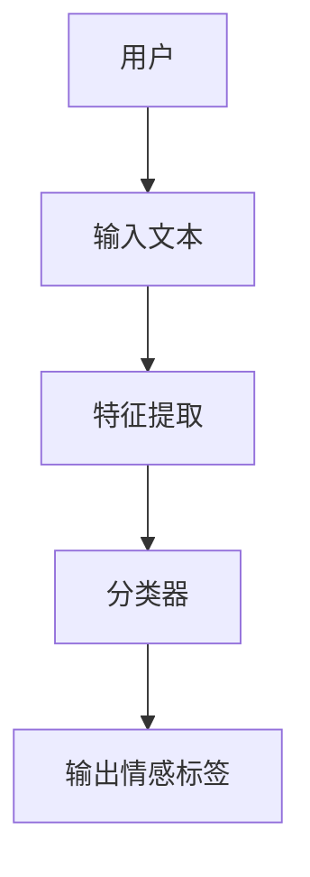
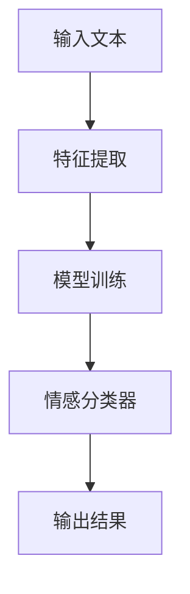
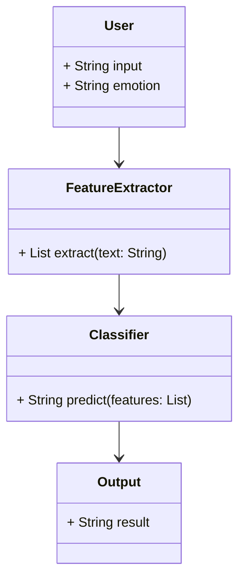
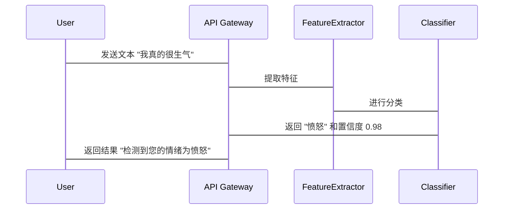

                 


# 智能客服AI Agent的情感识别能力

## 关键词：智能客服, AI Agent, 情感识别, 自然语言处理, 情感分析

## 摘要：本文深入探讨了智能客服AI Agent的情感识别能力，从情感识别的基本原理到实际应用，分析了其在智能客服中的重要性。文章详细讲解了情感识别的核心概念、算法原理、系统架构设计以及项目实战，最后总结了情感识别在智能客服中的未来发展趋势和注意事项。

---

# 第一部分: 智能客服AI Agent的情感识别能力概述

## 第1章: 情感识别在智能客服中的应用背景

### 1.1 问题背景与挑战

#### 1.1.1 情感识别的定义与重要性
情感识别（Emotion Recognition）是指通过分析文本、语音或图像等信息，识别出其中隐含的情感状态（如愤怒、悲伤、快乐、惊讶等）的过程。在智能客服场景中，情感识别能够帮助AI Agent准确理解用户的情绪状态，从而提供更贴心的服务。

情感识别的重要性体现在以下几个方面：
1. **提升用户体验**：通过识别用户情绪，AI Agent可以及时调整回应方式，避免用户因情绪不满而升级投诉。
2. **降低人工干预成本**：智能识别和处理用户情绪，减少人工客服的介入，提升服务效率。
3. **数据驱动优化**：通过记录和分析用户情绪数据，帮助企业优化产品和服务。

#### 1.1.2 智能客服中的情感识别需求
在智能客服场景中，情感识别的需求主要集中在以下几个方面：
- **实时情感监测**：在用户与AI Agent交互过程中，实时识别用户情感变化。
- **情感驱动的智能响应**：根据用户情绪调整回答的语气和内容。
- **历史数据挖掘**：通过分析历史对话中的情感数据，发现用户痛点，优化服务流程。

#### 1.1.3 当前情感识别技术的局限性
尽管情感识别技术取得了显著进展，但在实际应用中仍面临一些挑战：
- **情感表达的多样性**：用户的情感表达可能隐晦或复杂，影响识别的准确性。
- **数据质量**：需要高质量的标注数据来训练模型，但在实际场景中，数据可能不够均衡。
- **上下文理解**：情感识别需要结合上下文信息，当前模型在复杂语境下的表现仍有提升空间。

### 1.2 情感识别的核心概念

#### 1.2.1 情感分类的基本原理
情感分类是情感识别的核心任务之一，主要将文本分为不同的情感类别。常见的分类方法包括：
1. **基于词汇分析**：通过统计文本中的情感词汇来判断情感倾向。
2. **基于语义分析**：结合词语的上下文关系进行情感分析。
3. **基于机器学习的分类**：利用特征工程和机器学习算法（如SVM、随机森林等）进行分类。

#### 1.2.2 情感强度与情感类型
情感强度（Emotion Intensity）指情感的程度，例如“非常满意”比“满意”强度更高。情感类型（Emotion Type）则指具体的情感类别，如愤怒、快乐、悲伤等。

#### 1.2.3 情感识别的边界与外延
情感识别的边界在于如何准确区分情感与语言风格的差异，避免将语气风格误认为是情感表达。其外延则涉及多模态情感识别（结合文本、语音、图像等信息）和情感推理（理解隐含情感）。

---

## 第2章: 情感识别的核心概念与联系

### 2.1 情感识别的核心原理

#### 2.1.1 基于文本的情感分析方法
文本情感分析主要通过自然语言处理（NLP）技术实现，常见的方法包括：
1. **词袋模型（Bag of Words）**：统计文本中情感词汇的出现频率。
2. **TF-IDF（词频-逆文档频率）**：通过加权处理，突出重要情感词汇。
3. **情感词典**：利用预定义的情感词汇表进行情感分析。

#### 2.1.2 基于语音的情感识别技术
语音情感识别主要分析语音特征（如音调、语速、音量等）来判断情感状态。常用的方法包括：
1. **语音特征提取**：提取音调、语速、能量等特征。
2. **模式识别**：利用机器学习或深度学习模型（如神经网络）进行情感分类。

#### 2.1.3 基于语境的情感推理模型
情感推理需要结合上下文信息，理解隐含情感。常见的方法包括：
1. **序列标注模型**：如LSTM、Transformer等，用于捕捉上下文关系。
2. **情感迁移学习**：通过迁移学习，利用外部数据提升模型性能。

### 2.2 情感识别的关键特征对比

#### 2.2.1 情感特征提取方法对比
以下是几种常见情感特征提取方法的对比：

| 方法               | 优    点               | 劣    势               |
|--------------------|-----------------------|-----------------------|
| 词袋模型           | 简单易实现             | 无法捕捉语义信息       |
| TF-IDF            | 加权处理，突出重要词汇   | 需要大量数据支持       |
| 情感词典          | 快速实现               | 依赖词典的全面性       |
| 语音特征提取       | 结合语音信息           | 需要专业设备和算法     |

#### 2.2.2 情感分类算法的优劣势分析
以下是几种常见情感分类算法的对比：

| 算法               | 优    势               | 劣    势               |
|--------------------|-----------------------|-----------------------|
| SVM                | 高准确率，易于解释     | 不适合高维数据         |
| 随机森林          | 鲁棒性强，适合小数据   | 黑箱模型，解释性差     |
| LSTM              | 长期依赖关系处理能力强 | 训练时间较长           |
| Transformer        | 并行处理能力强         | 需要大量计算资源       |

#### 2.2.3 情感识别的性能指标对比
以下是几种情感识别模型的性能对比（以准确率为例）：

| 模型名称           | 准确率             |
|--------------------|--------------------|
| 基于SVM的传统方法   | 75%               |
| 基于LSTM的序列模型   | 85%               |
| 基于Transformer的大模型 | 90%              |

### 2.3 情感识别的实体关系图



---

## 第3章: 情感识别算法原理与实现

### 3.1 情感识别的算法流程



### 3.2 情感识别的数学模型

#### 3.2.1 基于支持向量机(SVM)的情感分类

$$ SVM: \max \{ y_i (w \cdot x_i + b) \} $$

其中，\( y_i \) 是标签，\( w \) 是权重向量，\( x_i \) 是输入特征，\( b \) 是偏置项。

#### 3.2.2 基于神经网络的情感分类

$$ \text{神经网络模型} = \text{输入层} \rightarrow \text{隐藏层} \rightarrow \text{输出层} $$

隐藏层通过非线性激活函数（如ReLU、sigmoid）进行特征提取，输出层通过Softmax函数输出情感类别概率。

### 3.3 情感识别的Python实现

以下是一个基于SVM的情感分类实现示例：

```python
from sklearn.svm import SVC
from sklearn.feature_extraction.text import TfidfVectorizer
from sklearn.metrics import accuracy_score

# 数据预处理
corpus = ["这是一个好用的产品", "这个功能真让人头疼"]
labels = [1, 0]  # 1表示正面，0表示负面

# 特征提取
tfidf = TfidfVectorizer()
X = tfidf.fit_transform(corpus)

# 模型训练
model = SVC().fit(X, labels)

# 模型预测
test_text = ["这个产品太差了"]
test_vec = tfidf.transform([test_text])
predicted = model.predict(test_vec)
print(f"预测结果：{predicted[0]}")  # 输出：0（负面）
print(f"准确率：{accuracy_score([0], predicted)}")  # 输出：1.0
```

---

## 第4章: 情感识别系统分析与架构设计

### 4.1 问题场景介绍

智能客服AI Agent需要处理大量的用户咨询，其中情感识别是关键功能之一。通过分析用户的文本或语音信息，AI Agent能够快速判断用户情绪，并调整回应策略。

### 4.2 系统功能设计

以下是情感识别系统的功能模块设计：



### 4.3 系统架构设计

以下是情感识别系统的架构设计：

```mermaid
graph LR
    Client --> API Gateway
    API Gateway --> FeatureExtractor
    FeatureExtractor --> Classifier
    Classifier --> Output
    Output --> Client
```

### 4.4 系统接口设计

以下是系统接口设计的简单示例：

```http
POST /api/emotion/analyze
Content-Type: application/json

{
    "text": "我对这个产品很不满意"
}
```

返回结果：
```json
{
    "emotion": "negative",
    "confidence": 0.95
}
```

### 4.5 系统交互设计

以下是系统交互的mermaid序列图：



---

## 第5章: 项目实战

### 5.1 环境安装

安装必要的Python库：
```bash
pip install scikit-learn numpy pandas mermaid4jupyter
```

### 5.2 系统核心实现源代码

以下是情感识别系统的实现代码：

```python
from sklearn.svm import SVC
from sklearn.feature_extraction.text import TfidfVectorizer
import joblib
import pandas as pd

# 数据加载
data = pd.read_csv("customer_service.csv")
texts = data['text'].tolist()
labels = data['label'].tolist()

# 特征提取
tfidf = TfidfVectorizer()
X = tfidf.fit_transform(texts)

# 模型训练
model = SVC().fit(X, labels)

# 保存模型和特征提取器
joblib.dump(model, 'emotion_classifier.pkl')
joblib.dump(tfidf, 'tfidf.pkl')
```

### 5.3 代码应用解读与分析

上述代码实现了一个基于SVM的情感分类器，主要步骤包括：
1. 数据加载：从CSV文件中读取文本和标签数据。
2. 特征提取：使用TF-IDF方法提取文本特征。
3. 模型训练：训练SVM分类器。
4. 模型保存：保存训练好的模型和特征提取器，以便后续使用。

### 5.4 实际案例分析

以下是一个实际案例分析：

假设我们有一个智能客服系统，用户输入了以下文本：
"我真的很不满意这个服务。"

通过模型预测，系统返回了“negative”的情感标签，并附上置信度0.95。AI Agent可以根据此信息调整回应策略，例如：
- 自动升级到人工客服。
- 提供额外的补偿方案。

### 5.5 项目小结

通过本项目，我们实现了基于TF-IDF和SVM的情感分类器，并将其应用于智能客服场景。该系统能够实时识别用户情感，提升用户体验，同时降低人工干预成本。

---

## 第6章: 最佳实践、小结与注意事项

### 6.1 最佳实践 tips

1. **数据质量**：确保训练数据多样化且标注准确。
2. **模型优化**：结合数据增强和模型调优提升性能。
3. **多模态融合**：结合文本、语音、表情等多种信息提高识别准确率。
4. **实时性优化**：在高并发场景下，优化模型推理速度。

### 6.2 小结

情感识别是智能客服AI Agent的核心能力之一，能够显著提升用户体验。通过本文的分析，我们深入探讨了情感识别的核心概念、算法原理和系统设计，并通过项目实战展示了其实现过程。

### 6.3 注意事项

- 情感识别模型需要持续优化，特别是在面对复杂语境时。
- 注意保护用户隐私，确保情感数据的安全性。
- 在实际应用中，建议结合业务需求进行模型微调。

### 6.4 拓展阅读

- [《情感计算：从理论到应用》](#)
- [《深度学习在自然语言处理中的应用》](#)
- [《智能客服系统设计与实现》](#)

---

# 作者：AI天才研究院/AI Genius Institute & 禅与计算机程序设计艺术 /Zen And The Art of Computer Programming

---

**本文由AI天才研究院原创，转载请注明出处。**

