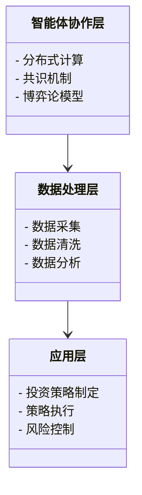
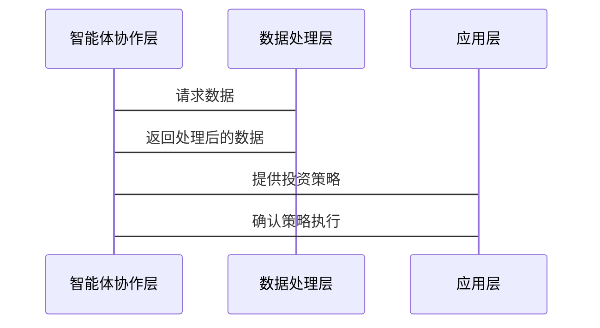

                 


# 智能金融中的多智能体协作：重塑价值投资流程

## 关键词：智能金融，多智能体协作，价值投资，分布式系统，博弈论

## 摘要：本文探讨了多智能体协作在智能金融中的应用，特别是如何通过多智能体协作重塑传统的价值投资流程。文章从背景、理论基础、算法原理、系统架构到项目实战，全面分析了多智能体协作在智能金融中的实现与应用，并通过实际案例展示了其在价值投资中的优势和潜力。

---

# 第1章: 多智能体协作的背景与意义

## 1.1 智能金融的定义与特点

### 1.1.1 什么是智能金融
智能金融是指利用人工智能、大数据、区块链等技术，通过智能化手段优化金融业务流程、提升金融服务效率和用户体验的金融模式。其核心在于将技术与金融业务深度融合，实现金融业务的自动化、智能化和个性化。

### 1.1.2 智能金融的核心特点
- **数据驱动**：依赖大数据分析，从海量数据中提取有价值的信息。
- **自动化**：通过自动化工具和算法，减少人工干预，提高效率。
- **智能化**：利用人工智能技术，实现预测、决策和优化。
- **个性化**：基于用户行为和需求，提供定制化的金融服务。

### 1.1.3 多智能体协作在智能金融中的作用
多智能体协作是指多个智能体（Agent）通过协同工作，共同完成复杂任务。在智能金融中，多智能体协作可以实现数据共享、任务分配、风险控制等功能，从而提升金融系统的整体效率和智能化水平。

---

## 1.2 价值投资流程的现状与挑战

### 1.2.1 传统价值投资流程的局限性
传统的价值投资流程依赖人工分析，存在以下问题：
- **效率低**：人工分析耗时长，难以应对海量数据。
- **主观性**：依赖分析师的个人经验和判断，存在主观偏差。
- **风险控制难**：难以实时监控和调整投资策略。

### 1.2.2 数据驱动投资的兴起
随着大数据和人工智能技术的发展，数据驱动投资逐渐兴起。通过分析海量数据，数据驱动投资能够发现潜在的投资机会，提高投资决策的科学性和准确性。

### 1.2.3 多智能体协作的优势
多智能体协作能够将多个智能体的优势结合起来，实现数据共享、任务分工和协同决策，从而克服传统投资流程的局限性。

---

## 1.3 多智能体协作的核心概念

### 1.3.1 多智能体协作的定义
多智能体协作是指多个智能体通过协同工作，共同完成复杂任务的过程。智能体是指具有感知环境、自主决策和执行任务能力的实体。

### 1.3.2 多智能体协作的特点
- **分布式**：智能体之间通过分布式通信进行协作。
- **自主性**：每个智能体都有一定的自主决策能力。
- **协同性**：智能体之间通过协同完成复杂任务。
- **动态性**：能够适应环境的变化和任务的需求。

### 1.3.3 多智能体协作与传统协作方式的对比

| 特性          | 多智能体协作             | 传统协作方式           |
|---------------|--------------------------|------------------------|
| 分布式        | 是                      | 否                    |
| 自主性        | 是                      | 否                    |
| 协同性        | 是                      | 是                    |
| 动态性        | 是                      | 否                    |

---

## 1.4 本章小结

本章介绍了智能金融的定义与特点，分析了传统价值投资流程的局限性，提出了多智能体协作在智能金融中的重要性，并详细阐述了多智能体协作的核心概念。

---

# 第2章: 多智能体协作的理论基础

## 2.1 分布式系统与多智能体协作

### 2.1.1 分布式系统的定义与特点
分布式系统是由多个独立的计算节点通过网络互联，协同完成任务的系统。其特点包括分布式计算、去中心化、容错性和高可用性。

### 2.1.2 多智能体协作与分布式系统的关系
多智能体协作可以看作是分布式系统的一种特殊形式，其中每个智能体相当于一个分布式节点，通过通信和协作完成任务。

### 2.1.3 分布式系统中的通信与协调
在分布式系统中，智能体之间的通信和协调是实现协作的关键。常用的技术包括消息队列、远程过程调用（RPC）和分布式事务管理。

---

## 2.2 博弈论与多智能体协作

### 2.2.1 博弈论的基本概念
博弈论是研究理性决策者在冲突与合作情境下的行为的理论。其核心概念包括策略、收益、纳什均衡等。

### 2.2.2 博弈论在多智能体协作中的应用
在多智能体协作中，博弈论可以用于分析智能体之间的互动关系，制定协作策略，实现共赢。

### 2.2.3 纳什均衡与多智能体协作
纳什均衡是指在博弈中，每个智能体都在给定其他智能体策略的情况下选择最优策略，从而达到一种稳定状态。

---

## 2.3 本章小结

本章介绍了分布式系统与多智能体协作的关系，分析了博弈论在多智能体协作中的应用，重点阐述了纳什均衡的概念及其在协作中的作用。

---

# 第3章: 多智能体协作的算法原理

## 3.1 分布式计算与多智能体协作

### 3.1.1 分布式计算的基本原理
分布式计算是将计算任务分解成多个子任务，分配给不同的计算节点执行，最终将结果汇总。其核心在于任务分解和节点协作。

### 3.1.2 多智能体协作中的分布式计算
在多智能体协作中，分布式计算用于实现任务的分解与分配，确保每个智能体都能高效完成自己的任务。

### 3.1.3 分布式计算的优缺点

| 特性          | 优点                     | 缺点                     |
|---------------|--------------------------|--------------------------|
| 可扩展性      | 高                      | 低                    |
| 可靠性        | 高                      | 低                    |
| 响应速度      | 中                      | 高                    |

---

## 3.2 协议与共识机制

### 3.2.1 协议的基本概念
协议是指智能体之间通信和协作的规则。其核心在于定义智能体之间的交互方式和数据格式。

### 3.2.2 共识机制的定义与特点
共识机制是指智能体之间达成一致的算法。其特点包括去中心化、高效性和安全性。

### 3.2.3 常见的共识机制
- **PoW（工作量证明）**：比特币采用的共识机制，通过计算找到特定的哈希值来验证交易。
- **PoS（权益证明）**：以太坊2.0采用的共识机制，通过质押代币来验证交易。

---

## 3.3 多智能体协作中的博弈论模型

### 3.3.1 博弈论模型的基本原理
博弈论模型通过定义智能体的策略和收益，模拟智能体之间的互动关系。

### 3.3.2 多智能体协作中的博弈论模型
在多智能体协作中，博弈论模型用于分析智能体之间的协作与竞争关系，制定最优策略。

### 3.3.3 博弈论模型的应用实例
例如，在股票交易中，多个智能体可以通过博弈论模型协调交易策略，避免市场操纵和过度波动。

---

## 3.4 本章小结

本章介绍了分布式计算与多智能体协作的关系，分析了共识机制在协作中的作用，并通过博弈论模型展示了多智能体协作的实现方式。

---

# 第4章: 价值投资流程的重构

## 4.1 传统价值投资流程的分析

### 4.1.1 传统价值投资流程的特点
传统价值投资流程依赖人工分析，流程复杂且耗时。

### 4.1.2 传统价值投资流程的不足
- **效率低**：人工分析耗时长，难以应对海量数据。
- **主观性强**：依赖分析师的个人经验和判断，存在主观偏差。
- **风险控制难**：难以实时监控和调整投资策略。

---

## 4.2 多智能体协作重构的价值投资流程

### 4.2.1 数据收集与预处理
通过多智能体协作，智能体可以实时采集和处理市场数据。

### 4.2.2 数据分析与策略制定
智能体通过分布式计算和博弈论模型，制定最优的投资策略。

### 4.2.3 策略执行与监控
智能体协同执行投资策略，并实时监控市场动态，及时调整策略。

---

## 4.3 重构后的价值投资流程的优势

### 4.3.1 高效性
通过多智能体协作，价值投资流程能够快速响应市场变化。

### 4.3.2 准确性
智能体通过分布式计算和数据分析，能够提高投资决策的准确性。

### 4.3.3 风险控制
通过实时监控和智能调整，多智能体协作能够有效控制投资风险。

---

## 4.4 本章小结

本章分析了传统价值投资流程的不足，提出了基于多智能体协作的重构方案，并展示了重构后的流程在效率、准确性和风险控制方面的优势。

---

# 第5章: 系统分析与架构设计

## 5.1 问题场景介绍

### 5.1.1 问题背景
在智能金融中，价值投资流程的重构需要一个高效、可靠的系统架构。

### 5.1.2 问题描述
传统的价值投资流程存在效率低、准确性差、风险控制难等问题。

### 5.1.3 问题解决
通过多智能体协作，构建一个分布式、智能化的价值投资系统。

---

## 5.2 系统功能设计

### 5.2.1 领域模型设计
通过Mermaid类图展示系统的功能模块及其交互关系。



---

## 5.3 系统架构设计

### 5.3.1 系统架构设计
通过Mermaid架构图展示系统的整体架构。


---

## 5.4 系统接口设计

### 5.4.1 接口描述
系统接口包括智能体协作层、数据处理层和应用层之间的交互接口。

### 5.4.2 接口协议
采用RESTful API作为接口协议，确保智能体之间的高效通信。

---

## 5.5 系统交互设计

### 5.5.1 交互流程
通过Mermaid序列图展示系统的交互流程。



---

## 5.6 本章小结

本章通过系统分析与架构设计，展示了如何通过多智能体协作重构价值投资流程，并通过图表展示了系统的功能模块、架构设计和交互流程。

---

# 第6章: 项目实战

## 6.1 环境安装

### 6.1.1 系统环境
- 操作系统：Linux/Windows/MacOS
- 开发工具：Python/Java/Go
- 数据库：MySQL/PostgreSQL
- 通信协议：HTTP/RESTful API

---

## 6.2 核心代码实现

### 6.2.1 分布式计算实现
使用Python编写分布式计算代码，实现任务的分解与分配。

```python
import threading

def task分配（）：
    # 分配任务给各个智能体
    pass

def task执行（）：
    # 执行分配的任务
    pass

# 创建多个线程，实现分布式计算
thread = threading.Thread(target=task分配)
thread.start()
```

---

## 6.3 代码解读与分析

### 6.3.1 分布式计算代码解读
上述代码通过多线程实现任务的分配与执行，确保任务的高效完成。

### 6.3.2 共识机制代码解读
通过Python编写共识机制代码，实现智能体之间的通信与协作。

```python
import hashlib

def 计算哈希（）：
    # 计算哈希值
    pass

def 达成共识（）：
    # 通过哈希值达成共识
    pass
```

---

## 6.4 案例分析

### 6.4.1 案例背景
假设我们有多个智能体，通过协作完成股票投资策略的制定。

### 6.4.2 案例实现
通过上述代码实现智能体之间的协作，制定最优的投资策略。

### 6.4.3 案例分析
分析智能体协作的效果，验证其在价值投资中的优势。

---

## 6.5 本章小结

本章通过项目实战，展示了如何通过多智能体协作实现价值投资流程的重构，并通过代码实现和案例分析，验证了其可行性和优势。

---

# 第7章: 总结与展望

## 7.1 本章总结

本文详细探讨了多智能体协作在智能金融中的应用，特别是如何通过多智能体协作重构价值投资流程。通过理论分析、系统设计和项目实战，展示了多智能体协作在智能金融中的巨大潜力。

---

## 7.2 注意事项

- 在实际应用中，需注意数据安全和隐私保护。
- 分布式系统的设计需考虑容错性和高可用性。
- 共识机制的实现需确保高效性和安全性。

---

## 7.3 未来展望

随着人工智能和分布式技术的不断发展，多智能体协作在智能金融中的应用前景广阔。未来的研究方向包括：
- 更高效的共识机制设计。
- 更智能的博弈论模型。
- 更安全的数据共享机制。

---

## 7.4 拓展阅读

- 《分布式系统：原理与设计》
- 《博弈论与经济行为》
- 《智能金融：理论与实践》

---

# 作者：AI天才研究院/AI Genius Institute & 禅与计算机程序设计艺术/Zen And The Art of Computer Programming

---

本文通过系统的分析与实践，详细探讨了多智能体协作在智能金融中的应用，展示了其在价值投资流程重构中的巨大潜力。希望本文能够为读者提供新的思路和启发，推动智能金融的发展。

