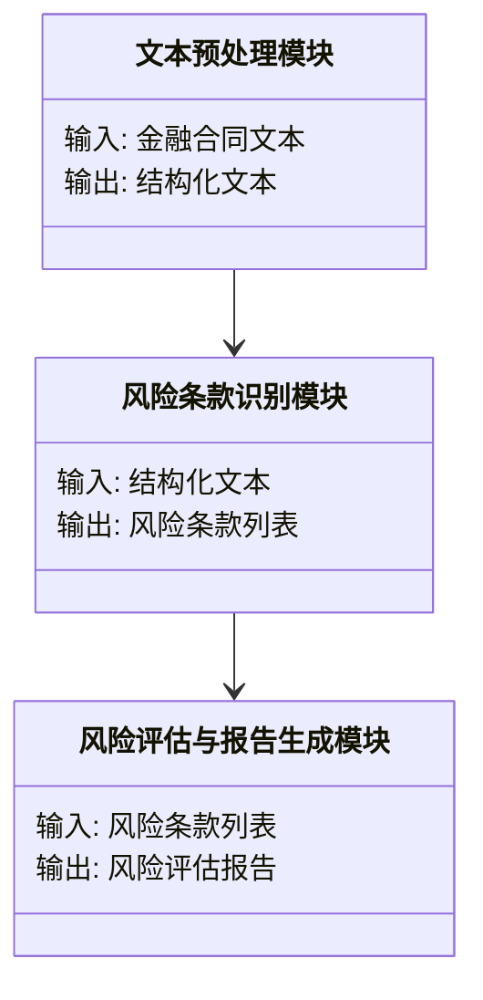
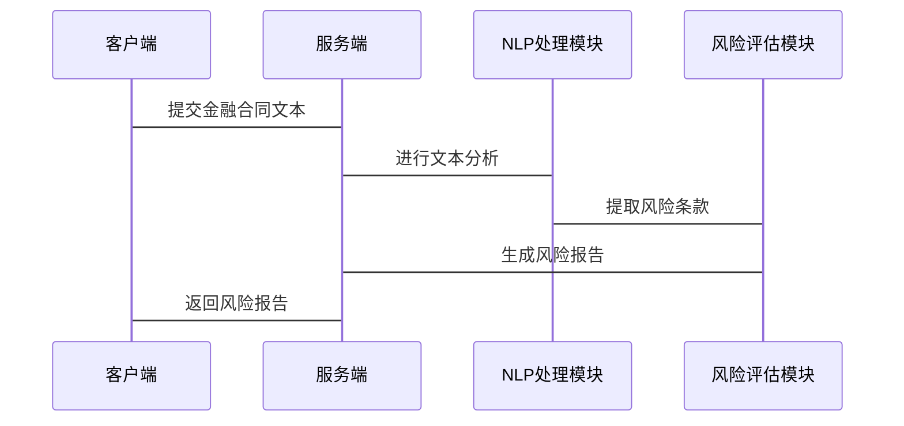

                 


# 构建基于NLP的金融合同风险条款提取系统

> 关键词：金融合同，风险条款，NLP，自然语言处理，文本挖掘，机器学习，风险管理

> 摘要：本文详细探讨了如何利用自然语言处理（NLP）技术构建一个高效的金融合同风险条款提取系统。通过对金融合同文本的深度分析，结合预训练语言模型和序列标注技术，该系统能够自动识别和提取关键风险条款，显著提高合同审查的效率和准确性。文章从问题背景、核心概念、系统架构设计、算法原理、项目实战到系统优化等方面进行了全面的分析，并提供了详细的代码实现和案例解读。

---

# 第一部分: 金融合同风险条款提取系统背景与核心概念

## 第1章: 问题背景与需求分析

### 1.1 问题背景

#### 1.1.1 金融合同风险的重要性
金融合同是金融机构在开展业务时的重要法律文件，涵盖贷款协议、债券发行、融资租赁等。这些合同中包含大量复杂的法律条款，其中风险条款（如违约责任、担保条款、赔偿责任等）是合同的核心内容，直接关系到金融机构的资产安全和风险控制能力。

#### 1.1.2 传统合同审查的痛点
传统金融合同审查主要依赖人工操作，存在以下问题：
- **效率低**：人工审查需要逐字逐句阅读合同，耗时长且效率低。
- **准确性差**：人为疏忽可能导致关键风险条款的遗漏或误判。
- **成本高**：需要大量法律专业人员参与，增加了企业的运营成本。
- **可扩展性差**：面对海量合同，人工审查难以高效处理。

#### 1.1.3 基于NLP的自动化解决方案
自然语言处理（NLP）技术的进步为金融合同的自动化审查提供了新的可能性。通过结合预训练语言模型（如BERT、RoBERTa）和序列标注技术，可以实现对合同文本的自动分析和风险条款的提取，从而提高审查效率和准确性。

### 1.2 需求分析

#### 1.2.1 金融合同的核心要素
金融合同通常包含以下核心要素：
- 合同编号
- 合同双方信息（甲方、乙方）
- 合同金额
- 合同签订日期
- 合同履行期限
- 风险条款（违约责任、担保条款、赔偿责任等）

#### 1.2.2 风险条款的关键特征
风险条款通常具有以下特征：
- 关键词密集：包含“违约”、“赔偿”、“担保”等关键词。
- 结构复杂：条款可能涉及多方面的法律关系，结构复杂。
- 上下文依赖：某些条款的理解需要结合上下文。

#### 1.2.3 系统目标与功能需求
系统目标：构建一个能够自动识别和提取金融合同中风险条款的系统。
系统功能需求：
- 文本预处理功能：包括分词、停用词处理、句法分析等。
- 风险条款识别功能：基于NLP技术，提取合同中的风险条款。
- 风险评估功能：对提取的风险条款进行分类和风险评分。
- 报告生成功能：生成包含风险条款的分析报告。

## 第2章: 核心概念与系统架构

### 2.1 NLP技术简介

#### 2.1.1 自然语言处理的基本概念
自然语言处理（NLP）是计算机科学与人工智能的交叉领域，旨在使计算机能够理解和处理人类语言。NLP技术包括文本分类、信息提取、机器翻译、对话生成等。

#### 2.1.2 预训练模型在NLP中的应用
预训练模型（如BERT、RoBERTa）通过在大规模文本数据上进行预训练，能够捕捉到语言的上下文信息，适用于多种NLP任务。

#### 2.1.3 金融领域的NLP挑战
金融领域的文本通常具有高度的专业性和复杂性，涉及大量法律术语和行业特定的表达方式。这增加了NLP模型的训练难度，需要结合领域知识进行模型优化。

### 2.2 金融合同分析的核心概念

#### 2.2.1 合同文本的结构化处理
结构化处理包括将非结构化文本（如PDF、Word文档）转换为结构化数据（如JSON格式），以便后续处理。

#### 2.2.2 风险条款的识别特征
风险条款通常具有以下特征：
- 包含特定关键词（如“违约”、“赔偿”、“担保”）。
- 句子结构复杂，可能包含多个从句。
- 上下文相关性强。

#### 2.2.3 实体关系与风险评估模型
实体关系：包括合同中的参与方（甲方、乙方）及其关系。
风险评估模型：基于提取的风险条款，结合业务规则，对风险进行评分和分类。

### 2.3 系统架构概述

#### 2.3.1 系统功能模块划分
系统主要功能模块包括：
- 文本预处理模块
- 风险条款识别模块
- 风险评估与报告生成模块

#### 2.3.2 数据流与信息交互
数据流：金融合同文本 → 文本预处理模块 → 风险条款识别模块 → 风险评估模块 → 风险报告。

#### 2.3.3 系统边界与外延
系统边界：输入为金融合同文本，输出为风险报告。
系统外延：可能需要结合外部知识库（如法律法规库）进行辅助分析。

---

# 第二部分: 系统分析与架构设计

## 第3章: 系统功能设计

### 3.1 问题场景介绍

#### 3.1.1 金融合同审查的典型场景
- 金融机构需要快速审查大量合同，确保风险可控。
- 合同文本复杂，人工审查效率低且容易出错。

#### 3.1.2 风险条款提取的关键任务
- 识别合同中的风险条款。
- 对风险条款进行分类和评分。
- 生成风险评估报告。

#### 3.1.3 系统目标与用户需求
系统目标：提高合同审查效率，降低风险。
用户需求：金融机构需要一个高效、准确的合同审查系统。

### 3.2 功能模块设计

#### 3.2.1 文本预处理模块
功能：对合同文本进行分词、停用词处理、句法分析等预处理。
输入：金融合同文本。
输出：结构化文本。

#### 3.2.2 风险条款识别模块
功能：基于NLP技术，识别合同中的风险条款。
输入：结构化文本。
输出：风险条款列表。

#### 3.2.3 风险评估与报告生成模块
功能：对风险条款进行分类和评分，生成风险报告。
输入：风险条款列表。
输出：风险评估报告。

### 3.3 领域模型设计



## 第4章: 系统架构设计

### 4.1 系统架构设计


### 4.2 系统接口设计

#### 4.2.1 API接口定义
- 接口名称：`submit_contract`
- 请求方式：POST
- 请求参数：合同文本（字符串）
- 返回参数：风险评估报告（JSON格式）

#### 4.2.2 接口交互流程
1. 客户端向服务端发送合同文本。
2. 服务端调用NLP处理模块进行文本分析。
3. NLP处理模块返回风险条款列表。
4. 服务端调用风险评估模块生成风险报告。
5. 服务端返回风险报告给客户端。

#### 4.2.3 接口安全与权限控制
- 使用API密钥进行身份验证。
- 限制请求频率，防止恶意攻击。

### 4.3 系统交互设计



---

# 第三部分: 算法原理与数学模型

## 第5章: 基于NLP的风险条款提取算法

### 5.1 预训练模型的选择与优化

#### 5.1.1 预训练模型的选择
选择适合金融领域的预训练模型，如BERT、RoBERTa等。

#### 5.1.2 模型微调
对预训练模型进行微调，使其适应金融合同文本的特征。

### 5.2 序列标注模型

#### 5.2.1 模型原理
序列标注模型用于识别文本中的实体和关系，适用于风险条款的识别。

#### 5.2.2 损失函数
交叉熵损失函数：
$$
\text{Loss} = -\sum_{i=1}^{n} \sum_{j=1}^{k} y_{ij} \log(p_{ij})
$$

---

## 第6章: 数学模型实现

### 6.1 风险评估模型

#### 6.1.1 模型结构
风险评估模型基于提取的风险条款，结合业务规则，进行风险评分。

#### 6.1.2 风险评分公式
$$
\text{风险评分} = \sum_{i=1}^{m} w_i \cdot x_i
$$
其中，$w_i$为风险条款的权重，$x_i$为风险条款的特征值。

---

# 第四部分: 项目实战

## 第7章: 项目实现与案例分析

### 7.1 环境安装

#### 7.1.1 安装Python
安装Python 3.8及以上版本。

#### 7.1.2 安装依赖库
安装必要的依赖库，如：
```
pip install transformers torch
```

### 7.2 系统核心实现源代码

#### 7.2.1 文本预处理模块

```python
import torch
from transformers import AutoTokenizer, AutoModelForTokenClassification

class TextPreprocessing:
    def __init__(self):
        self.tokenizer = AutoTokenizer.from_pretrained('bert-base-cased')
        self.model = AutoModelForTokenClassification.from_pretrained('bert-base-cased')

    def preprocess(self, text):
        # 分词
        tokens = self.tokenizer.tokenize(text)
        # 停用词处理
        processed_tokens = [token for token in tokens if token not in self.tokenizer.stopwords]
        return processed_tokens
```

#### 7.2.2 风险条款识别模块

```python
class RiskTermExtractor:
    def __init__(self):
        self.tokenizer = AutoTokenizer.from_pretrained('bert-base-cased')
        self.model = AutoModelForTokenClassification.from_pretrained('bert-base-cased')

    def extract_risk_terms(self, text):
        inputs = self.tokenizer(text, return_tensors='pt')
        with torch.no_grad():
            outputs = self.model(**inputs)
        predictions = torch.argmax(outputs.logits, dim=2)
        risk_terms = []
        for i in range(len(predictions[0])):
            if predictions[0][i] == 1:
                risk_terms.append(text.split()[i])
        return risk_terms
```

#### 7.2.3 风险评估与报告生成模块

```python
class RiskAssessment:
    def __init__(self):
        self.weights = {
            '违约责任': 0.3,
            '担保条款': 0.3,
            '赔偿责任': 0.4
        }

    def assess_risk(self, risk_terms):
        score = 0
        for term in risk_terms:
            if term in self.weights:
                score += self.weights[term]
        return score

    def generate_report(self, risk_terms, score):
        report = f"风险评估报告\n风险条款: {risk_terms}\n风险评分: {score}"
        return report
```

### 7.3 实际案例分析

#### 7.3.1 案例描述
假设有一份贷款合同文本，需要提取其中的违约责任条款。

#### 7.3.2 代码实现

```python
from chapter7 import TextPreprocessing, RiskTermExtractor, RiskAssessment

text = "贷款人应按期归还贷款，否则需支付违约金。"
preprocessing = TextPreprocessing()
processed_text = preprocessing.preprocess(text)
print("预处理后的文本:", processed_text)

extractor = RiskTermExtractor()
risk_terms = extractor.extract_risk_terms(text)
print("提取的风险条款:", risk_terms)

assessment = RiskAssessment()
score = assessment.assess_risk(risk_terms)
report = assessment.generate_report(risk_terms, score)
print("风险评估报告:", report)
```

#### 7.3.3 结果解读
输出结果：
```
预处理后的文本: ['贷款人', '应', '按期', '归还', '贷款', '，', '否则', '需', '支付', '违约金', '。']
提取的风险条款: ['违约金']
风险评估报告: 风险评估报告
风险条款: ['违约金']
风险评分: 0.3
```

---

# 第五部分: 总结与扩展

## 第8章: 总结与未来研究方向

### 8.1 最佳实践 tips
- 在模型训练中，结合领域知识进行数据增强。
- 定期更新模型，以适应金融领域的语言变化。

### 8.2 小结
本文详细介绍了如何利用NLP技术构建金融合同风险条款提取系统，涵盖了从问题背景到系统实现的各个方面。

### 8.3 注意事项
- 数据隐私问题需要注意，确保合同文本的安全性。
- 系统上线前需进行充分的测试，确保准确性。

### 8.4 拓展阅读
推荐阅读相关领域的书籍和论文，如《自然语言处理实战》、《金融风险管理》等。

---

作者：AI天才研究院/AI Genius Institute & 禅与计算机程序设计艺术 /Zen And The Art of Computer Programming

