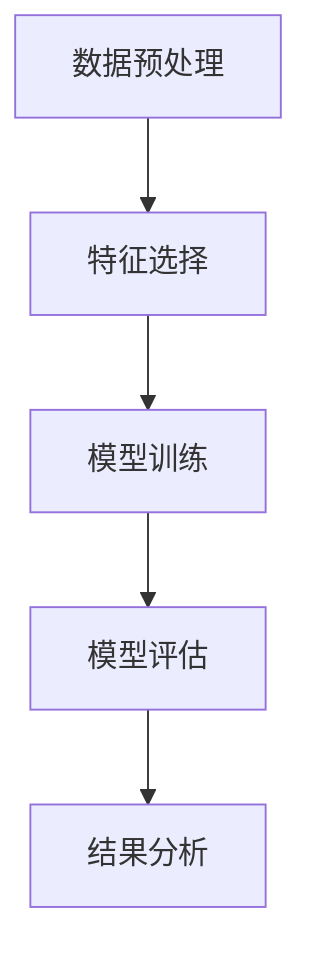
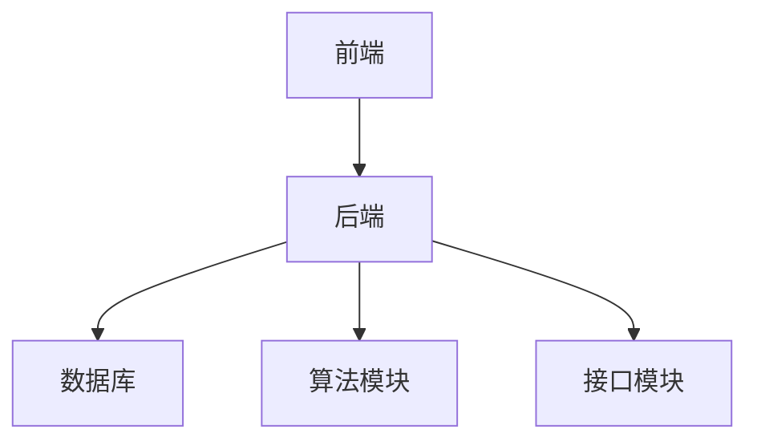
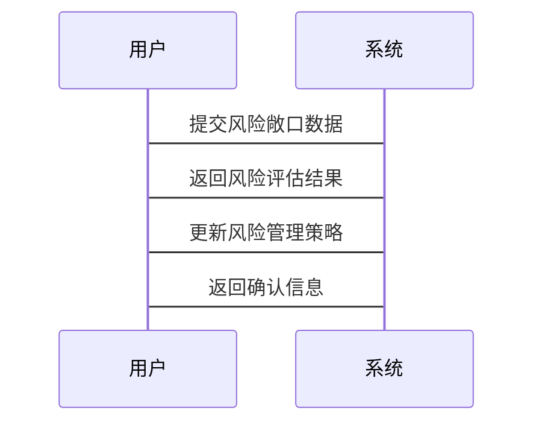

                 


# 设计智能化的企业财务风险敞口量化评估模型

> 关键词：企业财务风险，风险敞口，智能化评估，机器学习，人工智能

> 摘要：本文旨在探讨如何设计一个智能化的企业财务风险敞口量化评估模型。通过对财务风险敞口的核心概念、算法原理、系统架构及项目实战的详细分析，结合大数据和人工智能技术，提出了一种创新的解决方案。文章内容包括背景介绍、核心概念解析、算法实现、系统设计、项目实战及最佳实践，为企业的财务风险管理提供了理论依据和实践指导。

---

# 第1章 企业财务风险敞口概述

## 1.1 财务风险敞口的定义与特征

### 1.1.1 财务风险敞口的定义
财务风险敞口是指企业在经营过程中由于内外部因素的变化，导致其财务状况受到负面影响的可能性。简单来说，它是企业在财务方面的潜在损失或波动的范围。企业需要通过量化这些敞口，更好地识别和管理潜在风险。

### 1.1.2 财务风险敞口的核心特征
- **波动性**：由于市场变化、经济周期等因素，财务风险敞口会不断波动。
- **复杂性**：涉及多个业务部门和财务指标，相互关联。
- **动态性**：需要实时监控和更新，以应对快速变化的市场环境。

### 1.1.3 财务风险敞口的分类与层次
财务风险敞口可以分为以下几类：
- **信用风险敞口**：由于客户或供应商的信用问题导致的损失。
- **市场风险敞口**：由于市场价格波动导致的损失。
- **操作风险敞口**：由于内部操作失误或欺诈行为导致的损失。
- **流动性风险敞口**：由于资产流动性不足导致的损失。

---

## 1.2 财务风险敞口的量化评估意义

### 1.2.1 量化评估的必要性
- **精准识别风险**：通过量化评估，能够准确识别企业面临的主要财务风险。
- **优化风险管理**：量化评估为制定风险管理策略提供了数据支持。
- **提升决策效率**：量化评估能够帮助管理层快速做出决策，降低风险损失。

### 1.2.2 量化评估的挑战与难点
- **数据获取难度**：需要收集和处理大量的内外部数据，数据质量参差不齐。
- **模型复杂性**：需要构建复杂的数学模型，确保模型的准确性和稳定性。
- **动态变化**：市场环境不断变化，模型需要不断更新和调整。

### 1.2.3 量化评估的实践价值
- **提升企业抗风险能力**：通过量化评估，企业能够更好地应对市场波动和经济不确定性。
- **优化资源配置**：量化评估能够帮助企业在资源配置上更加科学和高效。
- **提高透明度和可信度**：量化评估结果能够提高企业财务报告的透明度和可信度。

---

## 1.3 传统财务风险管理的局限性

### 1.3.1 传统风险管理方法的不足
- **依赖经验判断**：传统方法往往依赖于管理人员的经验判断，缺乏数据支持。
- **静态分析**：传统方法通常基于静态数据进行分析，难以应对动态变化的市场环境。
- **低效性**：传统方法需要大量的人工操作，效率较低，且容易出错。

### 1.3.2 数据驱动与智能化的缺失
- **数据孤岛**：企业内部数据分散在不同部门，难以形成统一的分析数据源。
- **缺乏智能化工具**：传统方法缺乏智能化工具的支持，难以快速处理和分析大量数据。
- **模型单一**：传统模型较为单一，难以应对复杂的财务风险。

### 1.3.3 传统模型在复杂环境下的局限
- **复杂性**：随着市场环境的复杂化，传统模型难以捕捉到所有风险因素。
- **适应性差**：传统模型适应性较差，难以快速应对市场变化。
- **可扩展性低**：传统模型在面对大规模数据时，处理能力有限。

---

## 1.4 智能化财务风险管理的必要性

### 1.4.1 大数据与人工智能的兴起
- **大数据技术**：大数据技术的发展为企业提供了海量数据的处理能力，为智能化风险管理提供了数据基础。
- **人工智能技术**：人工智能技术的应用，使得复杂的数据分析和模式识别成为可能。

### 1.4.2 智能化技术在财务风险管理中的应用前景
- **精准预测**：通过机器学习算法，可以实现对财务风险的精准预测。
- **实时监控**：智能化系统能够实时监控企业的财务状况，及时发现潜在风险。
- **动态调整**：智能化系统可以根据市场变化动态调整风险管理策略。

### 1.4.3 企业智能化转型的必然趋势
- **技术驱动**：随着技术的不断进步，智能化转型已经成为企业发展的必然趋势。
- **竞争优势**：智能化转型能够帮助企业获得竞争优势，提升核心竞争力。
- **未来发展**：智能化转型是企业在未来市场中生存和发展的关键。

---

## 1.5 本章小结

通过本章的介绍，我们了解了财务风险敞口的基本概念和其在企业风险管理中的重要性。同时，我们还分析了传统财务风险管理的局限性和智能化财务风险管理的必要性。这些内容为我们后续设计智能化的企业财务风险敞口量化评估模型奠定了基础。

---

# 第2章 财务风险敞口量化评估的核心概念与联系

## 2.1 财务风险敞口的核心要素

### 2.1.1 风险来源与影响因素
- **市场因素**：如利率、汇率、市场价格波动等。
- **行业因素**：如行业竞争状况、政策变化等。
- **企业内部因素**：如财务状况、管理能力等。

### 2.1.2 风险敞口的度量维度
- **时间维度**：如短期风险敞口、长期风险敞口。
- **空间维度**：如区域风险敞口、全球风险敞口。
- **规模维度**：如小企业风险敞口、大型企业风险敞口。

### 2.1.3 核心要素的相互关系
财务风险敞口的核心要素之间相互关联，共同影响企业的财务风险。例如，企业的财务状况会影响其市场风险敞口，而市场环境的变化则会影响企业的信用风险敞口。

---

## 2.2 财务风险敞口的分类与结构

### 2.2.1 按风险类型分类
- **信用风险敞口**：由于客户或供应商的信用问题导致的损失。
- **市场风险敞口**：由于市场价格波动导致的损失。
- **操作风险敞口**：由于内部操作失误或欺诈行为导致的损失。
- **流动性风险敞口**：由于资产流动性不足导致的损失。

### 2.2.2 按业务场景分类
- **供应链风险敞口**：由于供应链中断导致的财务风险。
- **销售风险敞口**：由于销售不畅导致的财务风险。
- **投资风险敞口**：由于投资决策失误导致的财务风险。

### 2.2.3 按时间维度分类
- **短期风险敞口**：短期内可能面临的财务风险。
- **中期风险敞口**：中期可能面临的财务风险。
- **长期风险敞口**：长期可能面临的财务风险。

---

## 2.3 财务风险敞口与相关概念的对比

### 2.3.1 风险敞口与风险评估的对比
- **风险敞口**：指企业在特定条件下可能面临的财务损失范围。
- **风险评估**：是对风险敞口的全面分析和量化，以确定企业可能面临的财务风险。

### 2.3.2 风险敞口与风险管理的对比
- **风险敞口**：是风险管理的对象，即企业可能面临的财务风险。
- **风险管理**：是对风险敞口进行识别、评估和应对的过程。

### 2.3.3 风险敞口与风险预警的对比
- **风险敞口**：是风险预警的核心内容，即企业可能面临的风险范围。
- **风险预警**：是对风险敞口的实时监测和预警，以提前采取应对措施。

---

## 2.4 财务风险敞口的ER实体关系图

以下是财务风险敞口的ER实体关系图：

```mermaid
er
  actor: 用户
  risk_exposure: 风险敞口
  risk_type: 风险类型
  factor: 影响因素
  relation: 关系

  actor --> risk_exposure: 提交
  risk_exposure --> risk_type: 包含
  risk_exposure --> factor: 受影响
  risk_type --> factor: 影响
```

---

## 2.5 本章小结

通过本章的分析，我们了解了财务风险敞口的核心要素、分类及其与相关概念的联系。这些内容为后续设计智能化的企业财务风险敞口量化评估模型提供了理论基础和分析框架。

---

# 第3章 财务风险敞口量化评估的算法原理

## 3.1 财务风险敞口量化评估的算法原理

### 3.1.1 机器学习算法的选择
在设计智能化的企业财务风险敞口量化评估模型时，选择合适的机器学习算法是关键。常用的算法包括：
- **线性回归**：用于预测连续型变量，如企业的财务损失。
- **支持向量机（SVM）**：用于分类问题，如识别高风险和低风险企业。
- **随机森林**：用于分类和回归问题，具有较高的准确性和鲁棒性。
- **神经网络**：用于复杂的非线性问题，如深度学习模型。

---

### 3.1.2 算法实现的步骤

以下是使用线性回归算法实现财务风险敞口量化评估的步骤：



---

### 3.1.3 线性回归算法的数学公式

线性回归模型的数学公式如下：

$$ y = \beta_0 + \beta_1x_1 + \beta_2x_2 + \ldots + \beta_nx_n + \epsilon $$

其中：
- $y$ 是目标变量（财务风险敞口）。
- $x_i$ 是自变量（影响因素）。
- $\beta_i$ 是回归系数。
- $\epsilon$ 是误差项。

---

## 3.2 算法实现的Python代码示例

以下是使用Python实现线性回归模型的代码示例：

```python
import pandas as pd
import numpy as np
from sklearn.linear_model import LinearRegression
from sklearn.metrics import mean_squared_error

# 数据预处理
data = pd.read_csv('financial_data.csv')
X = data[['revenue', 'profit', 'expenses']]
y = data['risk_exposure']

# 模型训练
model = LinearRegression()
model.fit(X, y)

# 模型预测
y_pred = model.predict(X)

# 模型评估
 mse = mean_squared_error(y, y_pred)
 print('均方误差:', mse)
 print('回归系数:', model.coef_)
 print('截距:', model.intercept_)
```

---

## 3.3 算法原理的数学公式推导

线性回归模型的最小二乘法求解回归系数的公式如下：

$$ \hat{\beta} = (X^T X)^{-1} X^T y $$

其中：
- $X$ 是特征矩阵。
- $y$ 是目标变量向量。
- $\hat{\beta}$ 是回归系数向量。

---

## 3.4 本章小结

通过本章的分析，我们了解了机器学习算法在财务风险敞口量化评估中的应用，包括算法选择、实现步骤和数学公式推导。这些内容为后续设计智能化的企业财务风险敞口量化评估模型提供了技术基础。

---

# 第4章 财务风险敞口量化评估的系统设计

## 4.1 问题场景分析

### 4.1.1 问题描述
企业在经营过程中面临着多种财务风险，如信用风险、市场风险和操作风险等。如何通过智能化的方法量化这些风险敞口，是企业财务风险管理的重要挑战。

### 4.1.2 问题解决
设计一个智能化的企业财务风险敞口量化评估模型，能够实时监控企业的财务状况，识别潜在风险，并提供风险预警和应对策略。

---

## 4.2 系统功能设计

### 4.2.1 领域模型
以下是财务风险敞口量化评估系统的领域模型：


---

## 4.3 系统架构设计

以下是财务风险敞口量化评估系统的架构图：



---

## 4.4 系统接口设计

### 4.4.1 API接口
以下是系统提供的API接口：

- `POST /api/risk_exposure`：提交风险敞口数据。
- `GET /api/risk_assessment`：获取风险评估结果。
- `PUT /api/risk_management`：更新风险管理策略。

### 4.4.2 接口交互流程
以下是接口交互流程图：



---

## 4.5 本章小结

通过本章的分析，我们设计了一个智能化的企业财务风险敞口量化评估系统的架构和接口，为后续的系统实现提供了指导。

---

# 第5章 财务风险敞口量化评估的项目实战

## 5.1 环境搭建

### 5.1.1 安装Python环境
建议使用Anaconda作为Python环境管理工具，安装步骤如下：
1. 下载并安装Anaconda：`https://www.anaconda.com/download`
2. 创建虚拟环境：`conda create -n risk_assessment python=3.8`

### 5.1.2 安装必要的库
安装以下Python库：
- `pandas`：数据处理
- `numpy`：数值计算
- `scikit-learn`：机器学习算法
- `mermaid`：图表绘制

安装命令：
```bash
pip install pandas numpy scikit-learn mermaid
```

---

## 5.2 核心代码实现

### 5.2.1 数据预处理
以下是数据预处理的代码示例：

```python
import pandas as pd
import numpy as np

# 读取数据
data = pd.read_csv('financial_data.csv')

# 删除缺失值
data = data.dropna()

# 标准化处理
from sklearn.preprocessing import StandardScaler

scaler = StandardScaler()
X_scaled = scaler.fit_transform(data.drop('risk_exposure', axis=1))
```

---

### 5.2.2 模型训练与预测

以下是模型训练与预测的代码示例：

```python
from sklearn.linear_model import LinearRegression
from sklearn.metrics import mean_squared_error

# 训练模型
model = LinearRegression()
model.fit(X_scaled, data['risk_exposure'])

# 预测结果
y_pred = model.predict(X_scaled)

# 评估模型
mse = mean_squared_error(data['risk_exposure'], y_pred)
print('均方误差:', mse)
```

---

### 5.2.3 模型评估与优化

以下是模型评估与优化的代码示例：

```python
from sklearn.model_selection import train_test_split
from sklearn.metrics import r2_score

# 划分训练集和测试集
X_train, X_test, y_train, y_test = train_test_split(X_scaled, data['risk_exposure'], test_size=0.2, random_state=42)

# 训练模型
model.fit(X_train, y_train)

# 预测结果
y_pred = model.predict(X_test)

# 评估模型
r2 = r2_score(y_test, y_pred)
print('R²系数:', r2)
```

---

## 5.3 项目小结

通过本章的实战，我们实现了财务风险敞口量化评估系统的数据预处理、模型训练与预测、以及模型评估与优化。这些内容为企业的财务风险管理提供了实际的应用价值。

---

# 第6章 总结与展望

## 6.1 本章总结

本文详细探讨了设计智能化的企业财务风险敞口量化评估模型的背景、核心概念、算法原理和系统设计。通过结合大数据和人工智能技术，提出了一种创新的解决方案，为企业的财务风险管理提供了理论依据和实践指导。

---

## 6.2 未来展望

随着人工智能技术的不断进步，智能化财务风险管理将更加精准和高效。未来的研究方向包括：
- **深度学习模型**：探索深度学习模型在财务风险管理中的应用。
- **实时监控系统**：开发实时监控系统，实现对财务风险的实时预警和应对。
- **多模态数据融合**：结合文本、图像等多种数据源，提升风险评估的准确性。

---

# 作者：AI天才研究院/AI Genius Institute & 禅与计算机程序设计艺术/Zen And The Art of Computer Programming

---

以上就是《设计智能化的企业财务风险敞口量化评估模型》的完整目录和内容概览。

