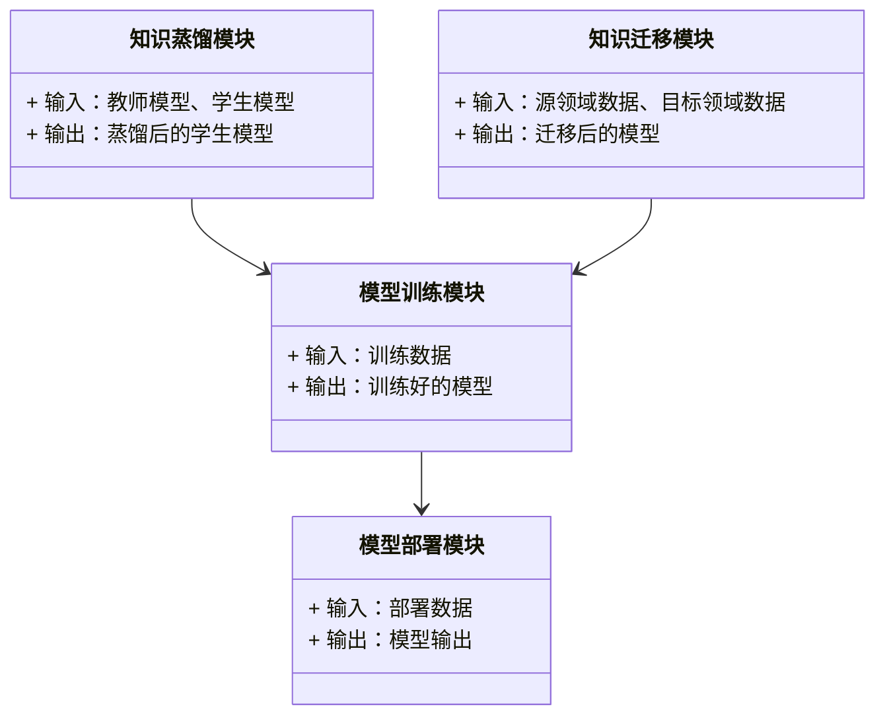
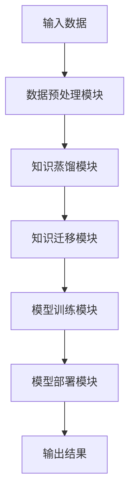
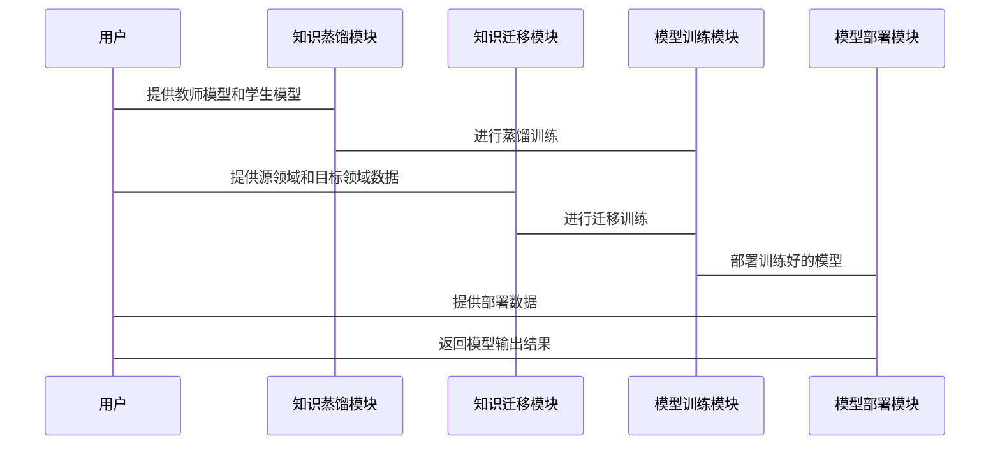

                 


# AI Agent 的知识蒸馏与迁移：从通用 LLM 到专业领域模型

---

## 关键词：AI Agent, 知识蒸馏, 知识迁移, 通用 LLM, 专业领域模型

---

## 摘要

AI Agent 作为人工智能领域的核心技术，其知识蒸馏与迁移能力是实现从通用大语言模型（LLM）到专业领域模型的关键。本文将从 AI Agent 的基本概念出发，详细探讨知识蒸馏与迁移的理论基础、算法实现以及系统架构设计。通过实际案例分析，本文旨在为读者提供从理论到实践的全面指导，帮助他们理解如何通过知识蒸馏与迁移技术，将通用 LLM 的强大能力应用到具体的专业领域中。

---

## 第1章 AI Agent 的背景与概念

### 1.1 AI Agent 的基本概念

#### 1.1.1 什么是 AI Agent

AI Agent（人工智能代理）是指能够感知环境、自主决策并执行任务的智能体。它具备以下核心特征：

- **自主性**：能够在没有外部干预的情况下独立运作。
- **反应性**：能够根据环境的变化调整自身的行为。
- **目标导向**：通过设定目标来驱动行动。
- **学习能力**：能够通过经验改进自身的性能。

AI Agent 可以分为以下几类：

- **简单反射型 Agent**：基于当前输入做出固定反应。
- **基于模型的反射型 Agent**：利用内部模型进行决策。
- **目标驱动型 Agent**：根据目标选择最优行动。
- **效用驱动型 Agent**：通过最大化效用函数来优化决策。

#### 1.1.2 AI Agent 的核心特征

- **知识表示**：AI Agent 需要能够表示和处理知识，包括领域知识和经验。
- **推理能力**：能够根据知识和环境信息进行推理，得出合理的决策。
- **学习机制**：能够通过经验改进自身的知识和能力。
- **交互能力**：能够与人类或其他系统进行有效交互。

#### 1.1.3 AI Agent 的分类与应用场景

- **简单反射型 Agent**：适用于规则明确、任务简单的场景，如自动门禁系统。
- **基于模型的反射型 Agent**：适用于需要内部模型和复杂决策的场景，如自动驾驶。
- **目标驱动型 Agent**：适用于需要长期规划和策略的场景，如金融投资。
- **效用驱动型 Agent**：适用于需要优化决策的场景，如资源分配。

---

### 1.2 知识蒸馏与迁移的背景

#### 1.2.1 知识蒸馏的定义与作用

知识蒸馏（Knowledge Distillation）是一种将复杂模型的知识迁移到简单模型的技术。其核心作用包括：

- **模型压缩**：将大型模型的知识提取出来，用于训练更小、更高效的模型。
- **知识传递**：将专家经验或大型模型的知识传递给其他模型。
- **提升泛化能力**：通过蒸馏，模型能够更好地适应新数据和场景。

#### 1.2.2 知识迁移的定义与目标

知识迁移（Knowledge Transfer）是指将一个领域或任务中学到的知识应用到另一个领域或任务的过程。其目标包括：

- **减少数据依赖**：在目标领域数据有限的情况下，利用源领域的知识进行模型训练。
- **提升模型性能**：通过迁移学习，提升目标领域模型的性能和泛化能力。
- **降低训练成本**：减少从头训练模型所需的时间和资源。

#### 1.2.3 知识蒸馏与迁移的必要性

在实际应用中，从通用 LLM 到专业领域模型的过程中，知识蒸馏与迁移技术能够帮助我们：

- **降低训练成本**：避免在每个领域从头训练大型模型。
- **提升模型适应性**：通过迁移学习，使模型更好地适应特定领域的需求。
- **加速模型部署**：通过蒸馏技术，快速部署适用于特定领域的高效模型。

---

### 1.3 从通用 LLM 到专业领域模型

#### 1.3.1 通用 LLM 的特点与局限

通用 LLM（Large Language Model）如 GPT 系列，具有以下特点：

- **强大的语言理解能力**：能够处理复杂的自然语言任务。
- **广泛的知识覆盖**：通过海量数据训练，具备广泛的知识储备。
- **强大的生成能力**：能够生成高质量的文本内容。

然而，通用 LLM 也存在以下局限：

- **领域适应性不足**：在特定领域中，可能缺乏深度专业知识。
- **计算资源消耗大**：训练和推理过程需要大量计算资源。
- **难以实时更新**：难以快速适应领域中的新知识和变化。

#### 1.3.2 专业领域模型的优势

专业领域模型专注于特定领域，具有以下优势：

- **领域适应性强**：能够更好地处理特定领域的任务。
- **资源效率高**：相对于通用模型，专业模型的训练和推理成本更低。
- **快速更新能力**：可以根据领域变化快速更新模型。

#### 1.3.3 知识蒸馏与迁移在领域模型中的作用

通过知识蒸馏与迁移技术，可以从通用 LLM 中提取知识，用于训练专业领域模型。其作用包括：

- **快速构建领域模型**：利用通用模型的知识，快速训练适用于特定领域的模型。
- **提升领域模型性能**：通过迁移学习，提升领域模型的准确性和泛化能力。
- **降低训练成本**：减少从头训练领域模型所需的时间和资源。

---

### 1.4 本章小结

本章介绍了 AI Agent 的基本概念、知识蒸馏与迁移的背景，以及从通用 LLM 到专业领域模型的必要性。通过本章内容，读者可以理解 AI Agent 的核心特征、知识蒸馏与迁移的定义与作用，以及它们在领域模型中的重要性。

---

## 第2章 知识蒸馏与迁移的核心概念

### 2.1 知识蒸馏的理论基础

#### 2.1.1 知识蒸馏的定义

知识蒸馏是一种通过将大型模型的知识迁移到小型模型的技术，其核心在于将大型模型的决策过程和内部表示提取出来，用于指导小型模型的训练。

#### 2.1.2 知识蒸馏的核心原理

知识蒸馏的核心原理包括：

- **软目标标签**：将大型模型的预测结果作为软标签，用于指导小型模型的训练。
- **蒸馏损失函数**：通过定义合适的损失函数，衡量小型模型与大型模型之间的差异。
- **温度调整**：通过调整温度参数，控制蒸馏过程中的信息传递。

#### 2.1.3 知识蒸馏的关键要素

- **教师模型**：提供知识的大型模型。
- **学生模型**：接收知识的小型模型。
- **蒸馏损失函数**：衡量学生模型与教师模型之间的差异。
- **温度参数**：控制蒸馏过程中信息的软化程度。

---

### 2.2 知识迁移的理论基础

#### 2.2.1 知识迁移的定义

知识迁移是指将一个领域或任务中学到的知识应用到另一个领域或任务的过程，其核心在于利用源领域中的知识，提升目标领域模型的性能。

#### 2.2.2 知识迁移的核心原理

知识迁移的核心原理包括：

- **特征提取**：提取源领域中的特征，用于目标领域的训练。
- **领域适应**：通过调整模型参数，使模型能够适应目标领域。
- **迁移损失函数**：衡量源领域和目标领域之间的差异。

#### 2.2.3 知识迁移的关键要素

- **源领域数据**：提供知识的数据集。
- **目标领域数据**：需要提升的领域数据集。
- **迁移学习算法**：实现知识迁移的具体方法。
- **领域适应策略**：调整模型以适应目标领域的方法。

---

### 2.3 知识蒸馏与迁移的关系

#### 2.3.1 知识蒸馏与迁移的区别

- **目标不同**：知识蒸馏旨在将大型模型的知识迁移到小型模型，而知识迁移旨在将一个领域中的知识应用到另一个领域。
- **应用场景不同**：知识蒸馏适用于模型压缩和知识传递，而知识迁移适用于领域适应和任务迁移。

#### 2.3.2 知识蒸馏与迁移的联系

- **协同作用**：知识蒸馏与迁移可以结合使用，通过蒸馏过程将教师模型的知识迁移到学生模型，再通过迁移学习使学生模型适应目标领域。
- **互补性**：知识蒸馏可以作为知识迁移的前期步骤，为迁移学习提供更好的初始模型。

#### 2.3.3 知识蒸馏与迁移的协同作用

通过结合知识蒸馏与迁移，可以实现以下协同作用：

- **提升模型性能**：通过蒸馏和迁移，模型能够更好地利用教师模型和源领域的知识，提升目标领域的性能。
- **降低训练成本**：通过蒸馏技术，减少从头训练模型的时间和资源，同时通过迁移学习，减少目标领域数据的需求。
- **加速部署**：通过蒸馏和迁移，可以快速部署适用于特定领域的高效模型。

---

### 2.4 本章小结

本章详细探讨了知识蒸馏与迁移的核心概念，包括知识蒸馏和迁移的定义、原理、关键要素以及它们之间的关系。通过本章内容，读者可以理解知识蒸馏与迁移的核心思想，并为后续的算法实现和系统设计奠定基础。

---

## 第3章 知识蒸馏的算法原理

### 3.1 知识蒸馏的基本算法

#### 3.1.1 蒸馏损失函数

蒸馏损失函数是衡量学生模型与教师模型之间差异的核心公式。常见的蒸馏损失函数包括：

$$ \text{Distillation Loss} = -\sum_{i} y_{\text{teacher}, i} \log y_{\text{student}, i} $$

其中，$y_{\text{teacher}, i}$ 和 $y_{\text{student}, i}$ 分别表示教师模型和学生模型在第 $i$ 个类别的概率。

#### 3.1.2 蒸馏过程中的温度调整

温度参数 $\tau$ 用于控制蒸馏过程中的信息软化程度。通过调整 $\tau$，可以实现以下效果：

- **信息软化**：增加 $\tau$ 可以使软标签更加平滑，减少学生模型对教师模型具体预测的依赖。
- **信息硬化**：减少 $\tau$ 可以使软标签更加集中，增强学生模型对教师模型具体预测的捕捉能力。

#### 3.1.3 蒸馏的优化策略

蒸馏的优化策略包括：

- **逐步降温**：在训练过程中逐步减小温度参数 $\tau$，以实现从信息软化到信息硬化的过渡。
- **多教师蒸馏**：利用多个教师模型的知识进行蒸馏，提升学生模型的多样性和鲁棒性。
- **自适应蒸馏**：根据目标领域的需求，动态调整蒸馏过程中的参数和策略。

---

### 3.2 知识蒸馏的数学模型

#### 3.2.1 蒸馏损失函数的数学表达

蒸馏损失函数可以表示为：

$$ L_{\text{distill}} = -\sum_{i} y_{\text{teacher}, i} \log y_{\text{student}, i} $$

其中，$y_{\text{teacher}, i}$ 和 $y_{\text{student}, i}$ 分别表示教师模型和学生模型在第 $i$ 个类别的概率。

#### 3.2.2 温度调整的数学公式

软标签的计算公式为：

$$ y_{\text{teacher}, i}^{( \tau)} = \frac{y_{\text{teacher}, i}^{\tau}}{\sum_{j} y_{\text{teacher}, j}^{\tau}} $$

其中，$\tau$ 是温度参数，用于控制软标签的分布。

#### 3.2.3 蒸馏过程的数学推导

通过优化蒸馏损失函数，可以得到学生模型的最优参数 $\theta_{\text{student}}$：

$$ \theta_{\text{student}} = \arg\min L_{\text{distill}} $$

---

### 3.3 知识蒸馏的实现细节

#### 3.3.1 蒸馏过程中的数据预处理

在蒸馏过程中，需要对教师模型的输出进行软化处理，得到软标签。具体步骤如下：

1. 对教师模型的输出进行温度软化：
   $$ y_{\text{teacher}, i}^{( \tau)} = \frac{y_{\text{teacher}, i}^{\tau}}{\sum_{j} y_{\text{teacher}, j}^{\tau}} $$

2. 使用软标签作为学生模型的训练目标。

#### 3.3.2 蒸馏过程中的模型选择

选择合适的教师模型和学生模型是蒸馏成功的关键。通常，教师模型选择较大的模型，而学生模型选择较小的模型。

#### 3.3.3 蒸馏过程中的训练优化

在蒸馏过程中，可以通过以下优化策略提升模型性能：

- **联合优化**：同时优化蒸馏损失和其他任务损失（如分类损失）。
- **逐步降温**：在训练过程中逐步减小温度参数 $\tau$。
- **动态调整**：根据训练过程中的损失变化，动态调整蒸馏相关的参数。

---

### 3.4 本章小结

本章详细探讨了知识蒸馏的基本算法和数学模型，包括蒸馏损失函数、温度调整以及蒸馏过程中的实现细节。通过本章内容，读者可以理解知识蒸馏的核心算法，并为后续的系统设计和项目实战奠定基础。

---

## 第4章 知识迁移的算法原理

### 4.1 知识迁移的基本算法

#### 4.1.1 迁移学习的定义

迁移学习是一种通过利用源领域数据来提升目标领域模型性能的技术。其核心在于将源领域的知识迁移到目标领域。

#### 4.1.2 迁移学习的核心原理

迁移学习的核心原理包括：

- **特征提取**：提取源领域和目标领域中的共有特征。
- **领域适应**：通过调整模型参数，使模型能够适应目标领域。
- **迁移损失函数**：衡量源领域和目标领域之间的差异。

#### 4.1.3 迁移学习的关键要素

- **源领域数据**：提供知识的数据集。
- **目标领域数据**：需要提升的领域数据集。
- **迁移学习算法**：实现知识迁移的具体方法。
- **领域适应策略**：调整模型以适应目标领域的方法。

---

### 4.2 知识迁移的数学模型

#### 4.2.1 迁移学习的数学表达

迁移学习的目标是通过优化以下目标函数，提升目标领域模型的性能：

$$ \min_{\theta} L_{\text{source}}(\theta) + \lambda L_{\text{target}}(\theta) $$

其中，$L_{\text{source}}$ 是源领域的损失函数，$L_{\text{target}}$ 是目标领域的损失函数，$\lambda$ 是调节参数。

#### 4.2.2 迁移学习的优化策略

优化策略包括：

- **领域适应**：通过调整模型参数，使模型能够适应目标领域。
- **特征对齐**：通过提取源领域和目标领域中的共有特征，减少领域差异。
- **自适应迁移**：根据目标领域的数据分布，动态调整迁移过程中的参数。

---

### 4.3 知识迁移的实现细

#### 4.3.1 迁移过程中的数据预处理

在迁移学习中，通常需要对源领域和目标领域的数据进行预处理，提取共有特征或进行数据增强。

#### 4.3.2 迁移过程中的模型选择

选择合适的迁移学习算法和模型是关键。常见的迁移学习算法包括：

- **领域适应网络（DA）**：通过对抗训练实现领域适应。
- **迁移组件分析（TCA）**：通过线性变换提取共有特征。
- **自适应交叉训练（ADAC）**：通过交叉训练实现领域适应。

#### 4.3.3 迁移过程中的训练优化

在迁移学习中，可以通过以下优化策略提升模型性能：

- **联合优化**：同时优化源领域和目标领域的损失函数。
- **自适应调整**：根据目标领域的数据分布，动态调整迁移过程中的参数。
- **对抗训练**：通过对抗训练，增强模型的领域适应能力。

---

### 4.4 本章小结

本章详细探讨了知识迁移的基本算法和数学模型，包括迁移学习的定义、核心原理以及实现细节。通过本章内容，读者可以理解知识迁移的核心算法，并为后续的系统设计和项目实战奠定基础。

---

## 第5章 系统架构与设计

### 5.1 问题场景介绍

在实际应用中，从通用 LLM 到专业领域模型的过程中，需要设计一个高效的系统架构，以实现知识蒸馏与迁移的技术目标。系统架构设计需要考虑以下方面：

- **系统功能设计**：包括知识蒸馏、知识迁移、模型训练和模型部署等功能。
- **系统架构设计**：包括数据流、模型交互和功能模块的设计。
- **系统接口设计**：包括输入输出接口和模块之间的接口设计。
- **系统交互设计**：包括用户与系统之间的交互流程设计。

---

### 5.2 系统功能设计

#### 5.2.1 系统功能模块

系统功能模块包括：

1. **知识蒸馏模块**：负责将教师模型的知识迁移到学生模型。
2. **知识迁移模块**：负责将源领域的知识迁移到目标领域。
3. **模型训练模块**：负责训练适用于特定领域的模型。
4. **模型部署模块**：负责将训练好的模型部署到实际应用中。

#### 5.2.2 功能模块之间的关系

功能模块之间的关系可以通过类图表示，如下：



---

### 5.3 系统架构设计

#### 5.3.1 系统架构图

系统架构可以通过以下 Mermaid 图表示：



---

### 5.4 系统接口设计

系统接口设计需要考虑以下方面：

- **输入接口**：包括教师模型、学生模型、源领域数据和目标领域数据。
- **输出接口**：包括蒸馏后的学生模型、迁移后的模型和模型部署模块的输出结果。
- **模块间接口**：包括知识蒸馏模块与模型训练模块之间的接口，知识迁移模块与模型训练模块之间的接口。

---

### 5.5 系统交互设计

系统交互可以通过以下 Mermaid 序列图表示：



---

### 5.6 本章小结

本章详细探讨了系统架构与设计，包括问题场景介绍、系统功能设计、系统架构设计、系统接口设计和系统交互设计。通过本章内容，读者可以理解如何设计一个高效的系统架构，以实现知识蒸馏与迁移的技术目标。

---

## 第6章 项目实战与案例分析

### 6.1 项目环境配置

#### 6.1.1 环境要求

- **操作系统**：Linux 或 Windows
- **编程语言**：Python 3.8 以上
- **深度学习框架**：TensorFlow 或 PyTorch
- **其他依赖**：根据具体项目需求安装相应的库。

#### 6.1.2 环境安装

以下是 Python 环境的安装步骤：

1. 安装 Python 和 pip：
   ```bash
   # 在 Linux 或 macOS 上
   apt-get install python3 python3-pip
   # 在 Windows 上
   winget install Python.Python.3
   ```

2. 安装深度学习框架（以 TensorFlow 为例）：
   ```bash
   pip install tensorflow
   ```

3. 安装其他依赖库：
   ```bash
   pip install numpy pandas scikit-learn
   ```

---

### 6.2 系统核心实现

#### 6.2.1 知识蒸馏模块的实现

以下是知识蒸馏模块的 Python 实现示例：

```python
import tensorflow as tf
import numpy as np

def teacher_model(input_shape):
    model = tf.keras.Sequential()
    model.add(tf.keras.layers.Dense(64, activation='relu', input_shape=input_shape))
    model.add(tf.keras.layers.Dense(10, activation='softmax'))
    model.compile(optimizer='adam', loss='categorical_crossentropy', metrics=['accuracy'])
    return model

def student_model(input_shape):
    model = tf.keras.Sequential()
    model.add(tf.keras.layers.Dense(32, activation='relu', input_shape=input_shape))
    model.add(tf.keras.layers.Dense(10, activation='softmax'))
    model.compile(optimizer='adam', loss='categorical_crossentropy', metrics=['accuracy'])
    return model

def distillation_loss(teacher_logits, student_logits, temperature=1.0):
    soft_labels = tf.nn.softmax(teacher_logits / temperature)
    loss = tf.reduce_mean(tf.keras.losses.KLDivergence()(soft_labels, student_logits))
    return loss

# 训练教师模型
teacher = teacher_model((input_shape,))
teacher.fit(X_teacher, y_teacher, epochs=10, batch_size=32)

# 定义蒸馏损失函数
def custom_loss(y_true, y_pred):
    return distillation_loss(teacher_logits, y_pred)

# 训练学生模型
student = student_model((input_shape,))
student.compile(optimizer='adam', loss=custom_loss, metrics=['accuracy'])
student.fit(X_student, y_student, epochs=10, batch_size=32)
```

#### 6.2.2 知识迁移模块的实现

以下是知识迁移模块的 Python 实现示例：

```python
import tensorflow as tf
import numpy as np

def source_model(input_shape):
    model = tf.keras.Sequential()
    model.add(tf.keras.layers.Dense(64, activation='relu', input_shape=input_shape))
    model.add(tf.keras.layers.Dense(10, activation='softmax'))
    model.compile(optimizer='adam', loss='categorical_crossentropy', metrics=['accuracy'])
    return model

def target_model(input_shape):
    model = tf.keras.Sequential()
    model.add(tf.keras.layers.Dense(32, activation='relu', input_shape=input_shape))
    model.add(tf.keras.layers.Dense(10, activation='softmax'))
    model.compile(optimizer='adam', loss='categorical_crossentropy', metrics=['accuracy'])
    return model

def transfer_loss(source_logits, target_logits):
    loss = tf.reduce_mean(tf.keras.losses.KLDivergence()(source_logits, target_logits))
    return loss

# 训练源领域模型
source = source_model((input_shape,))
source.fit(X_source, y_source, epochs=10, batch_size=32)

# 定义迁移损失函数
def custom_loss(y_true, y_pred):
    return transfer_loss(source_logits, y_pred)

# 训练目标领域模型
target = target_model((input_shape,))
target.compile(optimizer='adam', loss=custom_loss, metrics=['accuracy'])
target.fit(X_target, y_target, epochs=10, batch_size=32)
```

---

### 6.3 项目实战分析

#### 6.3.1 案例分析

以下是一个具体的案例分析：

- **任务目标**：将通用 LLM 的知识迁移到特定领域模型。
- **数据准备**：准备通用 LLM 的输出和特定领域的数据。
- **模型训练**：使用知识蒸馏和迁移技术，训练适用于特定领域的模型。
- **性能评估**：通过准确率、召回率等指标评估模型的性能。

#### 6.3.2 代码实现与解读

以下是知识蒸馏与迁移的代码实现示例：

```python
# 知识蒸馏模块
teacher = teacher_model((input_shape,))
teacher.fit(X_teacher, y_teacher, epochs=10, batch_size=32)

student = student_model((input_shape,))
student.compile(optimizer='adam', loss=custom_loss, metrics=['accuracy'])
student.fit(X_student, y_student, epochs=10, batch_size=32)

# 知识迁移模块
source = source_model((input_shape,))
source.fit(X_source, y_source, epochs=10, batch_size=32)

target = target_model((input_shape,))
target.compile(optimizer='adam', loss=custom_loss, metrics=['accuracy'])
target.fit(X_target, y_target, epochs=10, batch_size=32)
```

---

### 6.4 本章小结

本章通过具体案例分析和代码实现，详细探讨了知识蒸馏与迁移技术的实际应用。通过本章内容，读者可以理解如何在实际项目中应用这些技术，并为后续的研究和开发提供参考。

---

## 第7章 总结与未来展望

### 7.1 本章总结

通过本文的探讨，我们深入分析了 AI Agent 的知识蒸馏与迁移技术，从理论到实践，详细探讨了其核心概念、算法原理、系统架构设计和项目实战。我们发现，知识蒸馏与迁移技术在将通用 LLM 迁移到专业领域模型中具有重要的作用，能够有效降低训练成本，提升模型性能。

---

### 7.2 未来展望

未来，知识蒸馏与迁移技术将在以下几个方面得到进一步发展：

1. **更高效的蒸馏算法**：研究更高效的蒸馏算法，进一步降低蒸馏过程中的计算成本。
2. **更智能的迁移策略**：研究更智能的迁移策略，提升模型的领域适应能力和泛化能力。
3. **跨领域迁移**：研究跨领域的知识迁移技术，实现从多个领域到目标领域的知识迁移。
4. **实时迁移**：研究实时迁移技术，使模型能够动态适应领域变化。

---

## 作者：AI天才研究院/AI Genius Institute & 禅与计算机程序设计艺术 /Zen And The Art of Computer Programming

---

**结束语**：通过本文的探讨，我们深入分析了 AI Agent 的知识蒸馏与迁移技术，从理论到实践，详细探讨了其核心概念、算法原理、系统架构设计和项目实战。我们相信，随着技术的不断发展，知识蒸馏与迁移技术将在更多领域得到广泛应用，为 AI Agent 的发展注入新的活力。

