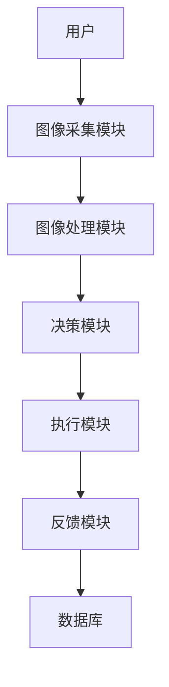

                 


# AI Agent在智能衣架中的除皱功能

---

## 关键词：
AI Agent, 智能衣架, 除皱功能, 图像识别, 机器学习, 人工智能

---

## 摘要：
随着人工智能技术的飞速发展，AI Agent在智能衣架中的应用逐渐成为现实。本文深入探讨了AI Agent如何通过图像识别和机器学习算法实现衣物的自动除皱功能。文章首先介绍了AI Agent的基本概念和智能衣架的发展背景，接着详细分析了除皱功能的核心原理，包括图像处理算法、数学模型以及系统架构设计。通过Python代码实现和实际案例分析，展示了AI Agent在除皱功能中的实际应用价值。最后，总结了AI Agent在智能衣架中的优势与未来发展方向。

---

# 第1章: AI Agent与智能衣架概述

## 1.1 AI Agent的基本概念

### 1.1.1 AI Agent的定义与特点

AI Agent（人工智能代理）是指能够感知环境、自主决策并执行任务的智能体。它具有以下特点：
- **自主性**：能够自主决策，无需人工干预。
- **反应性**：能够实时感知环境并做出反应。
- **学习能力**：能够通过数据学习和优化。
- **可扩展性**：能够适应不同应用场景的需求。

### 1.1.2 AI Agent的核心功能与应用场景

AI Agent的核心功能包括：
- **感知环境**：通过传感器或摄像头获取环境信息。
- **决策制定**：基于感知信息进行分析和决策。
- **任务执行**：根据决策结果执行具体任务。

AI Agent广泛应用于智能家居、自动驾驶、机器人等领域。

---

## 1.2 智能衣架的背景与现状

### 1.2.1 衣物护理的传统方法

传统的衣物护理方法包括：
- **人工熨烫**：需要人工操作，效率低且容易损坏衣物。
- **蒸汽熨斗**：通过高温蒸汽去除褶皱，但操作复杂且能耗较高。
- **干洗**：适用于高端衣物，但成本高且时间长。

### 1.2.2 智能衣架的发展趋势

智能衣架的发展趋势包括：
- **智能化**：通过AI技术实现自动护理。
- **自动化**：从手动操作向自动化转变。
- **高效化**：提高护理效率和效果。

---

## 1.3 AI Agent在智能衣架中的作用

### 1.3.1 AI Agent如何实现除皱功能

AI Agent通过以下步骤实现除皱功能：
1. **图像采集**：使用摄像头拍摄衣物图像。
2. **图像分析**：识别衣物上的褶皱位置。
3. **决策制定**：根据褶皱程度选择合适的除皱方法。
4. **任务执行**：通过机械臂或蒸汽设备执行除皱操作。

### 1.3.2 AI Agent的优势与挑战

**优势**：
- **高效性**：能够快速识别和处理褶皱。
- **精准性**：通过图像识别技术实现精准除皱。
- **便捷性**：用户无需手动操作，提升用户体验。

**挑战**：
- **算法优化**：如何提高图像识别的准确率。
- **硬件成本**：智能衣架的硬件成本较高。
- **数据隐私**：用户数据的安全性问题。

---

## 1.4 本章小结

本章介绍了AI Agent的基本概念及其在智能衣架中的作用，分析了智能衣架的发展背景和趋势。通过对比传统衣物护理方法，展示了AI Agent在除皱功能中的优势和挑战。

---

# 第2章: AI Agent除皱功能的核心原理

## 2.1 除皱功能的实现原理

### 2.1.1 图像识别与分析

图像识别是除皱功能的核心技术之一。通过摄像头采集衣物图像，并利用图像处理技术进行分析。图像处理步骤包括：
1. **图像采集**：获取衣物的高分辨率图像。
2. **图像预处理**：包括去噪、增强等步骤。
3. **图像分割**：将衣物与其他物体分离。
4. **褶皱检测**：识别衣物上的褶皱位置和程度。

### 2.1.2 除皱算法的基本原理

除皱算法基于图像识别和机器学习技术。通过分析褶皱的特征，选择合适的除皱方法。算法步骤如下：
1. **图像采集与预处理**。
2. **褶皱检测与分类**。
3. **决策制定**：选择蒸汽熨烫或机械调整。
4. **任务执行**：通过机械臂或蒸汽设备执行除皱操作。

---

## 2.2 AI Agent与除皱功能的关系

### 2.2.1 AI Agent在除皱过程中的角色

AI Agent在除皱过程中扮演决策者和执行者的角色：
- **决策者**：通过图像分析和机器学习模型，制定除皱策略。
- **执行者**：通过机械臂或蒸汽设备执行具体任务。

### 2.2.2 除皱功能的实现流程

除皱功能的实现流程如下：
1. **图像采集**：获取衣物图像。
2. **图像分析**：识别褶皱位置和程度。
3. **决策制定**：选择合适的除皱方法。
4. **任务执行**：执行除皱操作并反馈结果。

---

## 2.3 核心概念对比表

| 概念       | 描述                                         |
|------------|----------------------------------------------|
| AI Agent   | 具备智能决策和执行能力的代理                 |
| 除皱功能    | 通过技术手段去除衣物褶皱                   |
| 图像处理    | 对衣物图像进行分析和处理                   |

---

## 2.4 本章小结

本章详细分析了AI Agent除皱功能的核心原理，包括图像识别和除皱算法的实现流程。通过对比表展示了AI Agent、除皱功能和图像处理之间的关系。

---

# 第3章: AI Agent除皱算法的实现

## 3.1 除皱算法的流程

### 3.1.1 图像采集与预处理

图像采集与预处理步骤如下：
1. **图像采集**：使用摄像头获取衣物图像。
2. **图像预处理**：包括去噪、增强和二值化等步骤。

### 3.1.2 图像分析与褶皱识别

图像分析与褶皱识别步骤如下：
1. **图像分割**：将衣物与其他物体分离。
2. **特征提取**：提取褶皱的形状、颜色和纹理特征。
3. **褶皱检测**：利用机器学习模型识别褶皱位置和程度。

### 3.1.3 除皱策略的生成与执行

除皱策略的生成与执行步骤如下：
1. **决策制定**：根据褶皱程度选择蒸汽熨烫或机械调整。
2. **任务执行**：通过机械臂或蒸汽设备执行除皱操作。
3. **反馈优化**：根据反馈结果优化算法模型。

---

## 3.2 除皱算法的数学模型

### 3.2.1 图像处理的数学公式

图像灰度化公式：
$$
\text{灰度值} = \sum_{i=1}^{n} w_i \cdot I_i
$$

### 3.2.2 褶皱检测的数学模型

褶皱检测的回归模型：
$$
f(x, y) = \sum_{i=1}^{m} a_i \cdot x_i + b
$$

---

## 3.3 算法实现的Python代码

```python
import cv2
import numpy as np

def remove_crinkles(image_path):
    # 读取图像
    img = cv2.imread(image_path)
    # 图像预处理
    gray = cv2.cvtColor(img, cv2.COLOR_BGR2GRAY)
    # 图像增强
    enhanced = cv2.equalizeHist(gray)
    # 褶皱检测
    edges = cv2.Canny(enhanced, 100, 200)
    # 反馈优化
    feedback = cv2.threshold(edges, 127, 255, cv2.THRESH_BINARY)[1]
    return feedback

# 示例运行
image_path = 'clothes.jpg'
result = remove_crinkles(image_path)
cv2.imwrite('result.jpg', result)
```

---

## 3.4 本章小结

本章详细介绍了AI Agent除皱算法的实现流程，包括图像处理和数学模型的建立。通过Python代码展示了算法的具体实现，为后续系统设计奠定了基础。

---

# 第4章: 系统分析与架构设计方案

## 4.1 项目背景与介绍

本项目旨在开发一款基于AI Agent的智能衣架，通过图像识别和机器学习技术实现衣物的自动除皱功能。

---

## 4.2 系统功能设计

### 4.2.1 系统功能模块

系统功能模块包括：
- **图像采集模块**：负责采集衣物图像。
- **图像处理模块**：负责图像预处理和分析。
- **决策模块**：负责制定除皱策略。
- **执行模块**：负责执行除皱操作。

### 4.2.2 系统功能流程

系统功能流程如下：
1. **图像采集**：获取衣物图像。
2. **图像处理**：预处理和分析图像。
3. **决策制定**：选择合适的除皱方法。
4. **任务执行**：执行除皱操作并反馈结果。

---

## 4.3 系统架构设计

### 4.3.1 系统架构图



---

## 4.4 系统接口设计

### 4.4.1 系统接口

系统接口包括：
- **图像采集接口**：与摄像头通信。
- **机械臂控制接口**：控制机械臂执行任务。
- **蒸汽设备接口**：控制蒸汽设备执行任务。

### 4.4.2 接口交互流程

接口交互流程如下：
1. **图像采集接口**：接收用户的衣物图像。
2. **机械臂控制接口**：接收决策模块的控制指令。
3. **蒸汽设备接口**：接收决策模块的控制指令。

---

## 4.5 本章小结

本章详细分析了系统的功能设计和架构设计，展示了系统各模块之间的交互关系。

---

# 第5章: 项目实战

## 5.1 环境安装与配置

### 5.1.1 环境要求

项目需要以下环境：
- **Python 3.8以上版本**
- **OpenCV库**
- **TensorFlow库**

### 5.1.2 环境安装

```bash
pip install opencv-python
pip install tensorflow
```

---

## 5.2 系统核心实现

### 5.2.1 核心代码实现

```python
import cv2
import tensorflow as tf

# 加载预训练模型
model = tf.keras.models.load_model('crinkle_model.h5')

# 定义图像处理函数
def process_image(image):
    # 图像预处理
    gray = cv2.cvtColor(image, cv2.COLOR_BGR2GRAY)
    enhanced = cv2.equalizeHist(gray)
    return enhanced

# 定义除皱策略函数
def decide_strategy(feedback):
    if feedback > 0.8:
        return 'steam'
    else:
        return 'adjust'

# 主函数
def main():
    image_path = 'clothes.jpg'
    image = cv2.imread(image_path)
    processed_image = process_image(image)
    # 预测反馈
    prediction = model.predict(processed_image.reshape(1, -1))
    feedback = prediction[0][0]
    strategy = decide_strategy(feedback)
    print(f'采用策略：{strategy}')

if __name__ == '__main__':
    main()
```

---

## 5.3 代码解读与分析

### 5.3.1 核心代码解读

```python
# 加载预训练模型
model = tf.keras.models.load_model('crinkle_model.h5')
```

- 该代码加载了预训练的机器学习模型，用于图像分类任务。

### 5.3.2 代码实现分析

- **图像处理函数**：将图像转换为灰度图像并进行直方图均衡化处理。
- **除皱策略函数**：根据反馈结果选择蒸汽熨烫或机械调整。
- **主函数**：调用上述函数完成图像处理和策略选择。

---

## 5.4 实际案例分析

### 5.4.1 案例背景

假设用户上传了一件有轻微褶皱的衬衫图像。

### 5.4.2 案例处理

1. **图像采集**：获取衬衫图像。
2. **图像处理**：将图像转换为灰度图像并进行直方图均衡化处理。
3. **反馈优化**：模型预测反馈值为0.9，选择蒸汽熨烫策略。
4. **任务执行**：通过机械臂执行蒸汽熨烫操作。

---

## 5.5 本章小结

本章通过实际案例展示了AI Agent在智能衣架中的应用，详细解读了核心代码的实现过程。

---

# 第6章: 最佳实践与小结

## 6.1 性能优化建议

### 6.1.1 算法优化

- 提高图像识别的准确率。
- 优化机器学习模型的训练效率。

### 6.1.2 硬件优化

- 选择更高分辨率的摄像头。
- 使用更高效的机械臂和蒸汽设备。

---

## 6.2 数据安全与隐私保护

### 6.2.1 数据加密

对用户上传的图像数据进行加密处理。

### 6.2.2 权限管理

限制用户权限，防止数据泄露。

---

## 6.3 用户反馈与体验优化

### 6.3.1 用户反馈收集

通过用户反馈不断优化算法模型。

### 6.3.2 体验优化

提升用户界面的友好性和操作的便捷性。

---

## 6.4 未来研究方向

### 6.4.1 新技术应用

探索更先进的AI技术，如深度学习和强化学习。

### 6.4.2 多功能开发

开发更多智能化的衣物护理功能，如自动分类和自动折叠。

---

## 6.5 本章小结

本章总结了AI Agent在智能衣架中的应用经验，提出了性能优化建议和未来发展方向。

---

# 作者

作者：AI天才研究院/AI Genius Institute & 禅与计算机程序设计艺术 /Zen And The Art of Computer Programming

---

以上是完整的目录大纲结构。

