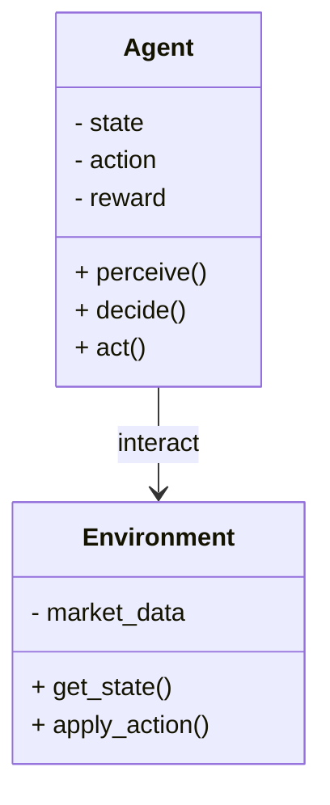
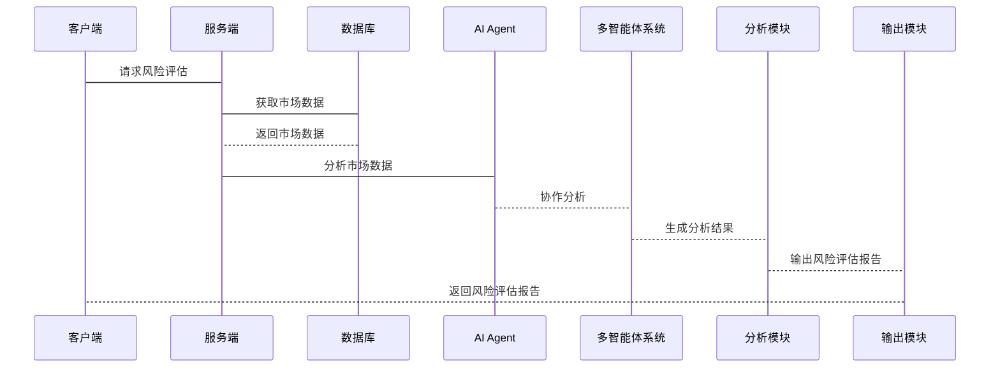

                 


# AI Agent在金融风险分析中的应用

> 关键词：AI Agent，金融风险分析，强化学习，深度学习，多智能体系统

> 摘要：本文详细探讨了AI Agent在金融风险分析中的应用，从基本概念、核心原理到具体算法和系统架构，再到实际案例分析，系统地阐述了AI Agent如何通过强化学习、深度学习和多智能体系统等技术手段，提升金融风险分析的准确性和效率。本文旨在为金融领域的技术从业者提供理论支持和实践指导，帮助他们更好地理解和应用AI Agent技术。

---

## 第1章: AI Agent与金融风险分析概述

### 1.1 AI Agent的基本概念

#### 1.1.1 AI Agent的定义与特点
AI Agent（人工智能代理）是指能够感知环境、自主决策并采取行动的智能实体。AI Agent的特点包括：
- **自主性**：能够在没有外部干预的情况下独立运行。
- **反应性**：能够根据环境的变化实时调整行为。
- **学习性**：能够通过经验改进自身的决策能力。
- **协作性**：能够在多智能体系统中与其他Agent协作完成复杂任务。

#### 1.1.2 AI Agent的核心原理
AI Agent的核心原理包括：
1. **感知**：通过传感器或数据源获取环境信息。
2. **推理**：基于感知信息进行逻辑推理或模式识别。
3. **决策**：根据推理结果制定行动策略。
4. **行动**：执行决策并影响环境。

#### 1.1.3 AI Agent在金融领域的应用潜力
在金融领域，AI Agent可以应用于股票交易、风险管理、信用评估等多个方面。其潜力主要体现在：
- **实时决策**：能够在毫秒级别做出交易决策。
- **复杂场景处理**：能够处理多变量的金融数据和复杂的市场环境。
- **自我优化**：能够通过强化学习不断优化自身的交易策略。

### 1.2 金融风险分析的基本概念

#### 1.2.1 金融风险的定义与分类
金融风险是指由于市场波动、经济变化或其他不确定性因素，导致金融资产或金融系统遭受损失的可能性。常见的金融风险包括：
- **市场风险**：由于市场波动导致的资产价格变化。
- **信用风险**：由于债务人违约导致的损失。
- **流动性风险**：由于资产无法快速变现导致的损失。
- **操作风险**：由于内部操作失误导致的损失。

#### 1.2.2 金融风险分析的常见方法
常见的金融风险分析方法包括：
1. **VaR（Value at Risk）**：衡量在一定置信水平下的最大损失。
2. **CVaR（Conditional Value at Risk）**：衡量在VaR水平下的平均损失。
3. **压力测试**：模拟极端市场条件下的资产损失情况。
4. **历史模拟法**：基于历史数据进行风险评估。

#### 1.2.3 金融风险分析的挑战与痛点
金融风险分析的主要挑战包括：
- **数据复杂性**：金融市场数据具有高度的不确定性和波动性。
- **计算复杂性**：复杂的金融模型需要大量计算资源。
- **实时性要求**：金融交易需要实时决策，对计算速度要求高。

### 1.3 AI Agent在金融风险分析中的应用价值

#### 1.3.1 提高风险预测的准确性
AI Agent可以通过深度学习和强化学习技术，从海量数据中提取非线性特征，显著提高风险预测的准确性。

#### 1.3.2 提升风险评估的效率
AI Agent能够实时处理市场数据，并快速生成风险评估结果，显著提升风险评估的效率。

#### 1.3.3 优化风险应对策略
AI Agent可以根据市场变化动态调整风险应对策略，帮助金融机构更好地应对市场波动。

### 1.4 本章小结
本章从AI Agent的基本概念和金融风险分析的基本原理出发，阐述了AI Agent在金融领域的应用潜力及其在金融风险分析中的价值。通过本章的学习，读者可以理解AI Agent与金融风险分析的基本关系，并为后续章节的学习打下基础。

---

## 第2章: AI Agent的核心概念与原理

### 2.1 AI Agent的基本架构

#### 2.1.1 知识表示
知识表示是AI Agent理解和处理信息的基础。常见的知识表示方法包括：
- **符号表示**：使用符号逻辑表示知识。
- **语义网络**：通过节点和边表示知识的关系。
- **概率图模型**：通过概率分布表示不确定性知识。

#### 2.1.2 感知与推理
感知是AI Agent获取环境信息的过程，主要包括：
- **数据采集**：通过传感器或API获取市场数据。
- **特征提取**：从原始数据中提取有用的特征。
- **模式识别**：识别数据中的模式和趋势。

推理是AI Agent基于感知信息做出决策的过程，主要包括：
- **逻辑推理**：基于逻辑规则进行推理。
- **概率推理**：基于概率模型进行推理。
- **机器学习推理**：基于机器学习模型进行推理。

#### 2.1.3 决策与行动
决策是AI Agent根据推理结果制定行动策略的过程，主要包括：
- **策略选择**：从多个可能的行动中选择最优策略。
- **行动执行**：执行决策并影响环境。

### 2.2 多智能体系统(Multi-Agent System)

#### 2.2.1 多智能体系统的定义
多智能体系统是由多个相互作用的智能体组成的系统，这些智能体可以协作或竞争以完成共同目标。

#### 2.2.2 多智能体系统的分类
多智能体系统可以分为：
- **协作型多智能体系统**：智能体之间协作完成任务。
- **竞争型多智能体系统**：智能体之间竞争以达到目标。
- **混合型多智能体系统**：智能体之间既有协作也有竞争。

#### 2.2.3 多智能体系统的协作机制
多智能体系统的协作机制主要包括：
- **通信机制**：智能体之间通过通信交换信息。
- **协调机制**：智能体之间通过协调机制达成一致。
- **协作协议**：智能体之间通过协作协议进行合作。

### 2.3 AI Agent的决策模型

#### 2.3.1 基于规则的决策模型
基于规则的决策模型通过预定义的规则进行决策，例如：
- **如果市场上涨，则买入股票；如果市场下跌，则卖出股票。**

#### 2.3.2 基于学习的决策模型
基于学习的决策模型通过机器学习算法从数据中学习决策规则，例如：
- **决策树模型**：通过树状结构进行决策。
- **支持向量机模型**：通过分类器进行决策。

#### 2.3.3 基于强化学习的决策模型
基于强化学习的决策模型通过强化学习算法从经验中学习最优策略，例如：
- **Q-learning算法**：通过Q-learning算法学习最优策略。

### 2.4 本章小结
本章详细介绍了AI Agent的基本架构、多智能体系统以及决策模型。通过本章的学习，读者可以理解AI Agent的核心原理，并为后续章节的学习打下基础。

---

## 第3章: 基于AI Agent的金融风险分析算法

### 3.1 基于强化学习的金融风险分析

#### 3.1.1 强化学习的基本原理
强化学习是一种机器学习技术，通过智能体与环境的交互，学习最优策略。强化学习的基本原理包括：
- **状态（State）**：智能体所处的环境状态。
- **动作（Action）**：智能体在状态下的行动。
- **奖励（Reward）**：智能体行动后获得的奖励或惩罚。

#### 3.1.2 强化学习在金融交易中的应用
强化学习在金融交易中的应用包括：
- **股票交易**：通过强化学习算法进行股票买卖决策。
- **外汇交易**：通过强化学习算法进行外汇买卖决策。

#### 3.1.3 强化学习在风险控制中的应用
强化学习在风险控制中的应用包括：
- **风险预警**：通过强化学习算法预测市场风险。
- **风险对冲**：通过强化学习算法进行风险对冲。

### 3.2 基于深度学习的金融风险分析

#### 3.2.1 深度学习的基本原理
深度学习是一种机器学习技术，通过多层神经网络模型进行特征提取和分类。

#### 3.2.2 基于LSTM的金融时间序列分析
LSTM（长短期记忆网络）是一种深度学习模型，适用于金融时间序列分析。LSTM的基本原理包括：
- **细胞状态**：LSTM的核心结构。
- **遗忘门**：控制信息的遗忘。
- **输入门**：控制信息的输入。
- **输出门**：控制信息的输出。

#### 3.2.3 基于Transformer的金融文本分析
Transformer是一种深度学习模型，适用于金融文本分析。Transformer的基本原理包括：
- **自注意力机制**：计算文本中每个词与其他词的相关性。
- **位置编码**：为每个词添加位置信息。

### 3.3 基于多智能体系统的金融风险分析

#### 3.3.1 多智能体系统在金融市场的建模
多智能体系统在金融市场的建模包括：
- **市场建模**：模拟金融市场中的买方和卖方。
- **交易建模**：模拟金融市场的交易过程。

#### 3.3.2 多智能体系统的协作与竞争机制
多智能体系统的协作与竞争机制包括：
- **协作机制**：智能体之间协作完成任务。
- **竞争机制**：智能体之间竞争以达到目标。

#### 3.3.3 多智能体系统在风险预警中的应用
多智能体系统在风险预警中的应用包括：
- **风险预警**：通过多智能体系统预测市场风险。
- **风险应对**：通过多智能体系统制定风险应对策略。

### 3.4 本章小结
本章详细介绍了基于AI Agent的金融风险分析算法，包括强化学习、深度学习和多智能体系统。通过本章的学习，读者可以理解AI Agent在金融风险分析中的具体应用。

---

## 第4章: 金融风险分析的数学模型

### 4.1 风险评估的数学模型

#### 4.1.1 Value at Risk (VaR) 模型
VaR模型是一种常用的金融风险评估方法。VaR模型的定义是：在一定置信水平下，资产可能遭受的最大损失。

#### 4.1.2 Conditional Value at Risk (CVaR) 模型
CVaR模型是VaR模型的扩展，定义为在VaR水平下的平均损失。

#### 4.1.3 风险中性定价模型
风险中性定价模型是一种金融定价模型，假设市场参与者对风险持中性态度。

### 4.2 AI Agent决策模型的数学表达

#### 4.2.1 基于强化学习的Q-learning算法
Q-learning算法是一种强化学习算法，其数学表达如下：
$$ Q(s, a) = Q(s, a) + \alpha (r + \gamma \max Q(s', a') - Q(s, a)) $$
其中：
- \( Q(s, a) \) 表示状态 \( s \) 下采取行动 \( a \) 的价值。
- \( \alpha \) 表示学习率。
- \( r \) 表示奖励。
- \( \gamma \) 表示折扣因子。

#### 4.2.2 基于深度学习的神经网络模型
深度学习模型的数学表达如下：
$$ y = f(x; \theta) $$
其中：
- \( x \) 表示输入数据。
- \( y \) 表示输出结果。
- \( \theta \) 表示模型参数。

#### 4.2.3 基于多智能体系统的协作模型
多智能体系统协作模型的数学表达如下：
$$ \text{收益} = \sum_{i=1}^{n} \text{智能体}i的收益 $$

### 4.3 数学模型的优化与应用

#### 4.3.1 模型的参数优化
模型的参数优化可以通过梯度下降等优化算法实现。

#### 4.3.2 模型的鲁棒性分析
模型的鲁棒性分析可以通过敏感性分析等方法实现。

#### 4.3.3 模型的实际应用案例
模型的实际应用案例包括：
- **股票交易**：通过数学模型进行股票交易决策。
- **风险预警**：通过数学模型进行风险预警。

### 4.4 本章小结
本章详细介绍了金融风险分析的数学模型，包括VaR模型、CVaR模型和风险中性定价模型。通过本章的学习，读者可以理解AI Agent决策模型的数学表达，并为后续章节的学习打下基础。

---

## 第5章: 金融风险分析系统的架构设计

### 5.1 问题场景介绍
金融风险分析系统需要处理复杂的金融市场数据，并实时生成风险评估结果。

### 5.2 项目介绍
本项目旨在开发一个基于AI Agent的金融风险分析系统。

### 5.3 系统功能设计

#### 5.3.1 领域模型（mermaid类图）


#### 5.3.2 系统架构设计（mermaid架构图）


#### 5.3.3 系统交互设计（mermaid序列图）


### 5.4 本章小结
本章详细介绍了金融风险分析系统的架构设计，包括领域模型、系统架构和系统交互设计。通过本章的学习，读者可以理解AI Agent在金融风险分析系统中的具体应用。

---

## 第6章: 项目实战

### 6.1 环境安装
需要安装的环境包括：
- Python 3.x
- TensorFlow或PyTorch
- Mermaid工具
- Jupyter Notebook

### 6.2 系统核心实现源代码

#### 6.2.1 强化学习代码示例
```python
import numpy as np
import gym
from gym import spaces

class Agent:
    def __init__(self, action_space):
        self.action_space = action_space
        self.state = None
        self.reward = 0
        self.done = False

    def perceive(self, observation):
        self.state = observation
        return self.state

    def decide(self):
        action = np.random.choice(self.action_space)
        return action

    def learn(self, reward, new_state):
        pass

if __name__ == "__main__":
    env = gym.make('StockTrading-v0')
    agent = Agent(env.action_space)
    env.reset()
    while not agent.done:
        observation = env.observation_space
        action = agent.decide()
        observation, reward, done, info = env.step(action)
        agent.learn(reward, observation)
    print("Total Reward:", reward)
```

#### 6.2.2 多智能体系统代码示例
```python
from multiagent import Agent

class TradingAgent(Agent):
    def __init__(self, id):
        super().__init__(id)
        self.state = None
        self.reward = 0

    def receive_message(self, message):
        super().receive_message(message)

    def send_message(self, message):
        super().send_message(message)

    def step(self):
        if self.state == 'buy':
            self.send_message('buy')
        elif self.state == 'sell':
            self.send_message('sell')

if __name__ == "__main__":
    agents = [TradingAgent(i) for i in range(4)]
    for agent in agents:
        agent.start()
```

### 6.3 代码应用解读与分析
本节对上述代码进行解读与分析，详细解释代码的功能和实现原理。

### 6.4 实际案例分析和详细讲解剖析
本节通过实际案例分析，详细讲解AI Agent在金融风险分析中的具体应用。

### 6.5 本章小结
本章通过实际项目实战，详细介绍了AI Agent在金融风险分析中的具体实现和应用。

---

## 第7章: 总结与展望

### 7.1 本章总结
通过本文的学习，读者可以全面理解AI Agent在金融风险分析中的应用，从基本概念到具体算法，再到系统架构和项目实战。

### 7.2 未来展望
未来，AI Agent在金融风险分析中的应用将更加广泛和深入，尤其是在以下几个方面：
- **更复杂的多智能体系统**：通过更复杂的多智能体系统进行金融市场的建模和分析。
- **更先进的强化学习算法**：通过更先进的强化学习算法进行金融交易和风险控制。
- **更强大的深度学习模型**：通过更强大的深度学习模型进行金融数据分析和预测。

### 7.3 最佳实践 tips
- 在实际应用中，建议结合具体的金融场景选择合适的AI Agent技术。
- 在实际应用中，建议结合实际数据进行模型训练和优化。

### 7.4 本章小结
本章总结了本文的主要内容，并展望了AI Agent在金融风险分析中的未来发展方向。

---

## 作者：AI天才研究院/AI Genius Institute & 禅与计算机程序设计艺术 /Zen And The Art of Computer Programming

---

通过本文的学习，读者可以全面理解AI Agent在金融风险分析中的应用，并能够将其应用于实际的金融风险分析场景中。

