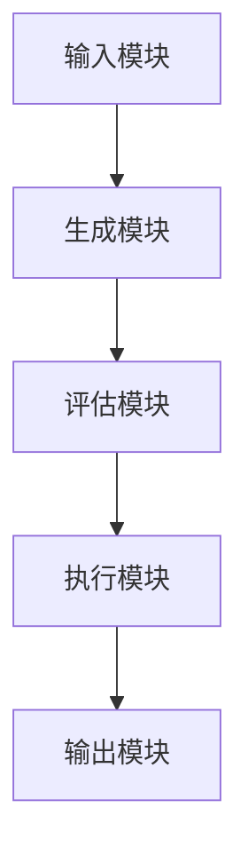

                 


# LLM驱动的AI Agent创新思维发散技术

> 关键词：LLM, AI Agent, 创新思维, 思维发散, 大语言模型, 人工智能代理, 创新技术

> 摘要：本文将深入探讨如何利用大语言模型（LLM）驱动AI代理（AI Agent）实现创新思维的发散技术。文章从LLM和AI Agent的基本概念入手，分析它们的结合方式，详细讲解创新思维发散技术的实现机制，并通过实际案例展示其应用。文章内容涵盖算法原理、系统架构设计、项目实战以及高级主题与最佳实践，为读者提供全面的技术指导。

---

## 第一部分: LLM与AI Agent的基本概念

### 第1章: LLM的基本原理

#### 1.1.1 大语言模型的定义与特点
大语言模型（Large Language Model, LLM）是一种基于深度学习的自然语言处理模型，能够理解和生成人类语言。其特点包括：
- **大规模训练数据**：通常使用海量文本数据进行训练，涵盖多种语言和领域。
- **多任务能力**：能够执行多种NLP任务，如文本生成、问答、翻译等。
- **上下文理解**：通过长上下文窗口理解上下文，能够进行多轮对话。

#### 1.1.2 LLM的核心技术与实现原理
大语言模型的核心技术包括：
- **Transformer架构**：由Google的BERT和OpenAI的GPT系列模型引领，基于自注意力机制，能够捕捉文本中的长距离依赖关系。
- **自注意力机制**：通过计算输入序列中每个词与其他词的相关性，生成注意力权重，从而决定每个词对最终输出的重要性。
- **生成式模型**：基于概率分布生成文本，能够进行创造性输出。

#### 1.1.3 LLM的应用场景与优势
- **文本生成**：用于创意写作、新闻生成、营销文案等。
- **问答系统**：应用于智能客服、知识问答平台。
- **代码生成与调试**：辅助程序员快速编写代码和解决bug。
- **多语言支持**：能够生成多种语言文本，支持国际化场景。

### 第2章: AI Agent的定义与功能

#### 1.2.1 AI Agent的定义
AI Agent（人工智能代理）是一种智能体，能够感知环境并采取行动以实现特定目标。它通过接收输入、分析信息、执行决策并输出结果来完成任务。

#### 1.2.2 AI Agent的核心功能与分类
AI Agent的核心功能包括：
- **感知环境**：通过传感器或API获取外部信息。
- **决策与推理**：基于感知的信息进行推理和决策。
- **执行操作**：根据决策执行操作，输出结果或触发外部动作。

AI Agent的分类：
- **基于规则的代理**：根据预定义的规则进行决策。
- **基于模型的代理**：使用内部模型进行推理和决策。
- **强化学习代理**：通过与环境互动，基于奖励机制优化决策。

### 1.3 LLM驱动AI Agent的创新思维发散技术

#### 1.3.1 创新思维发散技术的定义
创新思维发散技术是一种通过系统性方法激发创造力和创新性的技术，能够在不同领域生成多样化的解决方案。

#### 1.3.2 LLM在创新思维发散中的作用
- **生成多样化想法**：利用LLM的强大生成能力，快速生成多种创意方案。
- **优化创新过程**：通过模型的反馈机制，优化创新思维的路径和结果。
- **跨领域应用**：能够在不同领域（如设计、编程、市场营销）中应用，提供通用的创新方法。

#### 1.3.3 技术的边界与外延
- **边界**：创新思维发散技术依赖于LLM的生成能力和AI Agent的执行能力，其效果受限于模型的训练数据和算法的优化程度。
- **外延**：可以通过与其他技术（如图像生成、语音识别）结合，扩展创新思维的应用范围。

---

## 第二部分: LLM与AI Agent的结合方式

### 第2章: LLM作为AI Agent的核心驱动力

#### 2.1.1 LLM在AI Agent中的角色
- **知识库**：作为AI Agent的知识库，提供丰富的上下文理解和生成能力。
- **决策支持**：通过分析输入信息，为AI Agent提供决策支持。
- **生成与表达**：帮助AI Agent以自然语言形式生成输出，增强人机交互体验。

#### 2.1.2 LLM与AI Agent的协同工作原理
1. AI Agent接收输入信息，解析需求。
2. 通过LLM生成多样化的解决方案。
3. AI Agent根据解决方案进行决策，并执行操作。
4. 通过人机交互界面输出结果或进一步优化方案。

#### 2.1.3 LLM对AI Agent创新思维的推动作用
- **多样化生成**：LLM能够生成多种创新方案，帮助AI Agent跳出传统思维模式。
- **动态优化**：通过实时反馈和调整，优化创新思维的路径和结果。

### 第2.2 创新思维发散技术的实现机制

#### 2.2.1 创新思维发散技术的实现流程
1. **需求分析**：明确创新目标和约束条件。
2. **生成多样化方案**：利用LLM生成多个创意方案。
3. **方案评估**：通过AI Agent对方案进行评估和优化。
4. **最终决策**：选择最优方案并执行。

#### 2.2.2 LLM在创新思维发散中的具体应用
- **设计领域**：生成多种设计方案，帮助设计师选择最优方案。
- **编程领域**：生成多种代码实现方案，帮助开发者优化代码结构。
- **市场营销**：生成多种营销策略，帮助市场人员制定最佳方案。

#### 2.2.3 技术的创新点与优势
- **创新点**：结合LLM的生成能力和AI Agent的执行能力，实现创新思维的系统化和自动化。
- **优势**：提高创新效率，降低创新成本，适用于多种应用场景。

---

## 第三部分: 创新思维发散技术的核心算法

### 第3章: LLM的算法原理

#### 3.1.1 Transformer模型的原理
- **自注意力机制**：计算输入序列中每个词与其他词的相关性，生成注意力权重。
- **前向网络**：通过多层感知机（MLP）进行非线性变换，提取特征。

#### 3.1.2 多层感知机（MLP）的实现
```python
def MLP(x, weights, biases):
    for i in range(len(weights)):
        x = tf.matmul(x, weights[i])
        x = tf.nn.relu(x + biases[i])
    return x
```

#### 3.1.3 LLM的训练流程
1. **输入数据预处理**：将输入文本转换为数字表示（如词嵌入）。
2. **前向传播**：通过神经网络计算输出概率分布。
3. **损失计算**：使用交叉熵损失函数计算模型的预测误差。
4. **反向传播**：通过梯度下降优化模型参数。

### 第3章: AI Agent的算法原理

#### 3.2.1 强化学习的原理
- **奖励机制**：通过奖励函数指导AI Agent的学习方向。
- **策略优化**：通过优化策略函数，提高AI Agent的决策能力。

#### 3.2.2 策略梯度法的实现
```python
def policy_gradients(states, actions, rewards, policy_net, optimizer):
    with tf.GradientTape() as tape:
        # 预测概率分布
        logits = policy_net(states)
        # 计算损失
        loss = -tf.reduce_mean(tf.log(tf.nn.softmax(logits)) * actions * rewards)
    # 更新参数
    grads = tape.gradient(loss, policy_net.trainable_weights)
    optimizer.apply_gradients(zip(grads, policy_net.trainable_weights))
    return loss
```

#### 3.2.3 基于模型的算法实现
```python
def model_based_algorithm(initial_state):
    # 使用模型生成预测
    predicted_actions = model(initial_state)
    # 执行动作并观察结果
    next_state, reward = env.step(predicted_actions)
    # 更新模型
    model.fit(initial_state, predicted_actions)
    return next_state, reward
```

---

## 第四部分: 系统分析与架构设计

### 第4章: 系统功能设计

#### 4.1.1 系统功能模块
- **输入模块**：接收用户输入的需求描述。
- **生成模块**：利用LLM生成多样化方案。
- **评估模块**：对生成方案进行评估和优化。
- **执行模块**：根据最优方案执行操作。
- **输出模块**：输出结果或进一步优化方案。

#### 4.1.2 系统功能流程
1. 用户输入需求描述。
2. 系统解析需求，生成多样化方案。
3. 系统评估方案，选择最优方案。
4. 系统执行操作并输出结果。

### 第4章: 系统架构设计

#### 4.2.1 系统架构图


#### 4.2.2 实体关系图
```mermaid
entity User
    input: 需求描述
    output: 优化后的方案

entity System
    function: 生成方案、评估方案、执行操作

relationship User -- 系统调用 --> System
```

---

## 第五部分: 项目实战

### 第5章: 项目环境安装

#### 5.1.1 安装Python环境
```bash
python --version
pip install --upgrade pip
```

#### 5.1.2 安装必要的库
```bash
pip install numpy matplotlib tensorflow
```

### 第5章: 核心代码实现

#### 5.2.1 LLM驱动的创新思维发散代码
```python
import tensorflow as tf
from tensorflow import keras

# 定义模型
model = keras.Sequential([
    keras.layers.Embedding(input_dim=10000, output_dim=128),
    keras.layers.LSTM(64),
    keras.layers.Dense(50, activation='relu'),
    keras.layers.Dense(1, activation='sigmoid')
])

# 编译模型
model.compile(optimizer='adam', loss='binary_crossentropy', metrics=['accuracy'])

# 训练模型
model.fit(X_train, y_train, epochs=10, batch_size=32)
```

#### 5.2.2 AI Agent的实现
```python
class AIAssistant:
    def __init__(self):
        self.llm = LLMModel()

    def think(self, input_text):
        # 生成多样化方案
        ideas = self.llm.generate_variations(input_text)
        # 选择最优方案
        best_idea = self.llm.evaluate.ideas(ideas)
        return best_idea
```

### 第5章: 案例分析与代码解读

#### 5.3.1 案例分析
- **案例背景**：设计一个新的移动应用功能。
- **生成方案**：生成多种设计方案，包括用户界面、功能模块等。
- **评估与选择**：通过模型评估每个方案的可行性和用户体验，选择最优方案。

#### 5.3.2 代码解读
- **输入模块**：接收用户需求描述。
- **生成模块**：利用LLM生成多样化方案。
- **评估模块**：对生成方案进行评估和优化。
- **执行模块**：根据最优方案执行操作。
- **输出模块**：输出结果或进一步优化方案。

---

## 第六部分: 高级主题与最佳实践

### 第6章: 高级主题

#### 6.1.1 多模态模型的应用
- **图像与文本结合**：利用多模态模型，结合图像和文本信息，提高创新思维的效果。
- **语音与文本结合**：通过语音识别和生成，增强人机交互体验。

#### 6.1.2 实时推理与动态优化
- **实时推理**：通过实时更新模型参数，提高创新思维的效率。
- **动态优化**：根据反馈实时调整模型，优化创新思维的结果。

### 第6章: 最佳实践

#### 6.2.1 小结
- **核心观点**：创新思维发散技术的核心在于结合LLM和AI Agent，通过系统化的算法和架构设计，实现创新思维的自动化和优化。
- **关键点**：在实际应用中，需要注意模型的训练数据质量、算法的优化以及系统的可扩展性。

#### 6.2.2 注意事项
- **数据隐私**：在处理用户数据时，需要注意数据隐私和安全。
- **模型泛化能力**：模型的泛化能力直接影响创新思维的效果，需要通过多样化的数据训练来提升。

#### 6.2.3 拓展阅读
- 推荐阅读相关领域的最新论文和书籍，关注技术发展的最新动态。

---

## 附录

### 术语表

| 术语 | 定义 |
|------|------|
| LLM  | 大语言模型，基于深度学习的自然语言处理模型。 |
| AI Agent | 人工智能代理，能够感知环境并采取行动以实现特定目标的智能体。 |
| 创新思维发散技术 | 通过系统性方法激发创造力和创新性的技术，能够在不同领域生成多样化的解决方案。 |

### 参考文献

1. Vaswani, A., et al. "Attention Is All You Need." Advances in Neural Information Processing Systems, 2017.
2. Radford, A., et al. "Language Models Are Few-Shot Learners." arXiv preprint arXiv:1909.01037, 2019.
3. LeCun, Y., Bengio, Y., & Hinton, G. "Deep Learning." Nature, 2015.

### 扩展资源

- [大语言模型资源](https://arxiv.org/abs/1909.01037)
- [AI Agent技术博客](https://towardsdatascience.com/ai-agent)

---

作者：AI天才研究院/AI Genius Institute & 禅与计算机程序设计艺术 /Zen And The Art of Computer Programming

