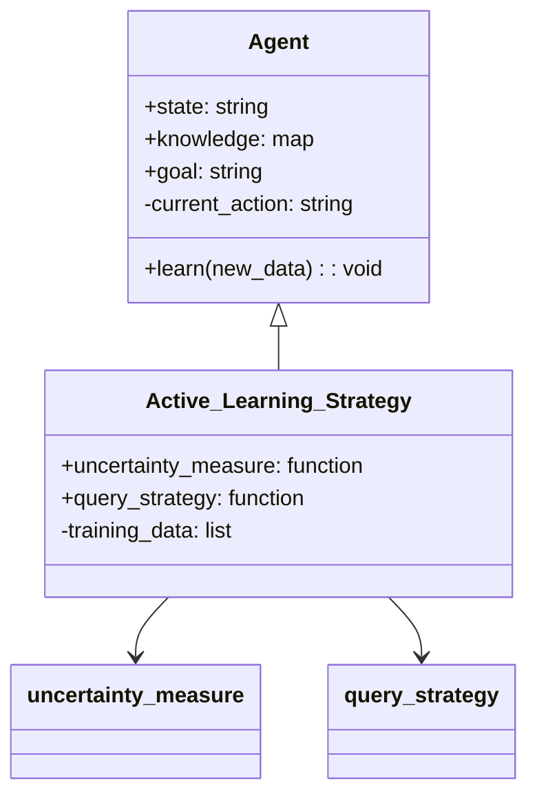
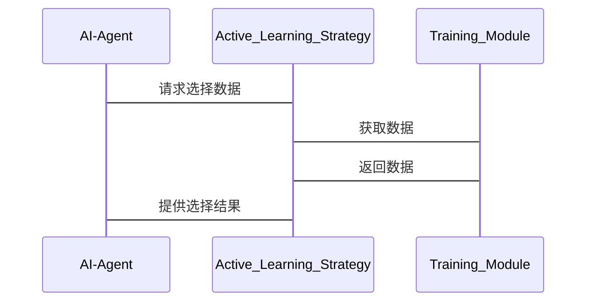

                 


# 主动学习在AI Agent训练中的应用

> 关键词：主动学习，AI Agent，机器学习，监督学习，无监督学习

> 摘要：主动学习是一种通过智能选择数据来优化模型性能的学习方法，而AI Agent是具备自主决策和交互能力的智能体。本文探讨了主动学习在AI Agent训练中的应用，分析了其核心概念、算法原理、系统架构设计及实际案例，展示了如何利用主动学习提升AI Agent的训练效率和性能。

---

# 第1章: 主动学习与AI Agent的基本概念

## 1.1 主动学习的基本概念

### 1.1.1 主动学习的定义
主动学习（Active Learning）是一种机器学习方法，与传统的被动学习（Passive Learning）不同，它允许模型主动选择对学习最有帮助的数据样本进行训练。通过选择性地标注数据，主动学习可以显著提高模型的性能，尤其是在标注数据量有限的情况下。

### 1.1.2 主动学习的核心特点
- **数据选择性标注**：模型主动选择需要标注的数据，减少不必要的标注成本。
- **迭代优化**：模型在每一轮选择标注一批数据后，更新模型，逐步优化。
- **高效性**：通过选择最具代表性的数据，提高学习效率。

### 1.1.3 主动学习与监督学习的区别
| 对比维度 | 主动学习 | 监督学习 |
|----------|----------|----------|
| 数据标注方式 | 模型主动选择 | 所有数据已标注 |
| 数据量需求 | 较小，但效率高 | 较大，但效率较低 |
| 适用场景 | 数据标注成本高 | 数据标注成本低 |

## 1.2 AI Agent的定义与特点

### 1.2.1 AI Agent的定义
AI Agent（人工智能代理）是一种智能体，能够感知环境、自主决策并执行任务。AI Agent可以是软件程序、机器人或其他智能设备。

### 1.2.2 AI Agent的核心功能
- **感知环境**：通过传感器或数据输入获取环境信息。
- **决策与推理**：基于感知信息进行推理，做出决策。
- **执行任务**：根据决策执行具体操作。

### 1.2.3 AI Agent与传统AI的区别
| 对比维度 | AI Agent | 传统AI |
|----------|----------|----------|
| 自主性 | 高 | 低 |
| 交互性 | 强 | 弱 |
| 环境适应性 | 强 | 较弱 |

## 1.3 主动学习在AI Agent训练中的应用背景

### 1.3.1 AI Agent训练的挑战
- 数据标注成本高。
- 数据量需求大，训练效率低。
- 环境动态变化，需要快速适应。

### 1.3.2 主动学习在AI Agent训练中的优势
- 减少数据标注成本。
- 提高训练效率，加快模型收敛速度。
- 适应动态环境，提升模型灵活性。

### 1.3.3 应用场景与实际案例
- **智能客服**：通过主动学习优化对话策略。
- **自动驾驶**：主动选择关键场景进行训练，提升驾驶模型的鲁棒性。
- **游戏AI**：在游戏训练中主动选择关键帧，提升学习效率。

## 1.4 本章小结
本章介绍了主动学习和AI Agent的基本概念，分析了主动学习在AI Agent训练中的优势和应用场景，为后续内容奠定了基础。

---

# 第2章: 主动学习的核心原理与算法

## 2.1 主动学习的核心概念

### 2.1.1 核心概念的定义
- **不确定性度量**：衡量模型对某个数据点的预测不确定性。
- **查询策略**：选择下一个需要标注的数据样本的策略。

### 2.1.2 核心概念的属性特征对比表格
| 特性 | 不确定性度量 | 查询策略 |
|------|--------------|----------|
| 目的 | 识别模型不确定的区域 | 选择最有价值的数据 |
| 方法 | 使用概率分布 | 使用多种策略（如最不确定样本、密度估计等） |

### 2.1.3 ER实体关系图的 Mermaid 流程图


## 2.2 主动学习的算法原理

### 2.2.1 主动学习算法的分类
- **基于不确定性度量的主动学习**：选择模型预测不确定性最高的样本。
- **基于密度的主动学习**：选择数据密度较低的区域，减少数据冗余。
- **基于边界区域的主动学习**：选择数据分布的边缘区域，覆盖更多类别。

### 2.2.2 基于不确定性度量的主动学习算法
#### 2.2.2.1 算法流程
1. 初始化：选择一部分初始数据进行标注，训练初始模型。
2. 迭代：
   - 使用当前模型预测未标注数据的不确定性。
   - 选择不确定性最高的样本进行标注。
   - 更新模型。

#### 2.2.2.2 Python代码示例
```python
import numpy as np
from sklearn.linear_model import LogisticRegression

def uncertainty_measure(proba):
    return np.sum(proba * (1 - proba))

def active_learn(X, y, model, n_iterations=10):
    for _ in range(n_iterations):
        model.fit(X, y)
        proba = model.predict_proba(X)
        uncertainties = [uncertainty_measure(p) for p in proba]
        next_index = np.argmax(uncertainties)
        X = np.vstack((X, X[next_index]))
        y = np.append(y, y[next_index])
```

### 2.2.3 基于密度的主动学习算法
#### 2.2.3.1 算法流程
1. 计算数据点的密度。
2. 选择密度较低的区域进行采样。

#### 2.2.3.2 Python代码示例
```python
from sklearn.neighbors import KNeighborsClassifier

def density_estimate(X, k=5):
    neigh = KNeighborsClassifier(n_neighbors=k)
    neigh.fit(X)
    # 计算每个点的密度
    density = [len(neigh.kneighbors([x], return_distance=False)[0]) for x in X]
    return density

def density_based_active_learn(X, y, model, n_iterations=10):
    for _ in range(n_iterations):
        model.fit(X, y)
        density = density_estimate(X)
        next_index = np.argmin(density)
        X = np.vstack((X, X[next_index]))
        y = np.append(y, y[next_index])
```

### 2.2.4 基于边界区域的主动学习算法
#### 2.2.4.1 算法流程
1. 计算数据分布的边界区域。
2. 选择边界区域中的样本进行标注。

#### 2.2.4.2 Python代码示例
```python
from sklearn.svm import SVC

def boundary_detection(X, y, model):
    model.fit(X, y)
    # 检测边界区域
    boundary_points = []
    for x in X:
        if model.predict([x])[0] == 'boundary':
            boundary_points.append(x)
    return boundary_points

def boundary_based_active_learn(X, y, model, n_iterations=10):
    for _ in range(n_iterations):
        model.fit(X, y)
        boundary_points = boundary_detection(X, y, model)
        if len(boundary_points) == 0:
            break
        next_index = np.random.choice(len(boundary_points))
        X = np.vstack((X, boundary_points[next_index]))
        y = np.append(y, y[next_index])
```

### 2.3 主动学习算法的数学模型与公式

#### 2.3.1 不确定性度量的数学公式
$$ \text{不确定性度量} = \sum_{i=1}^{n} p_i(1-p_i) $$

其中，$p_i$是模型对第i个样本的预测概率。

#### 2.3.2 查询策略的数学公式
$$ \text{查询策略} = \arg\max_{i} \text{不确定性度量}(x_i) $$

---

# 第3章: AI Agent训练中的系统分析与架构设计

## 3.1 问题场景介绍

### 3.1.1 AI Agent训练中的问题描述
AI Agent需要在动态环境中自主学习，但由于数据标注成本高、训练效率低，传统方法难以满足需求。

### 3.1.2 主动学习在其中的应用场景
通过主动学习，AI Agent可以选择性地标注数据，提高训练效率，适应动态环境。

## 3.2 系统功能设计

### 3.2.1 领域模型 Mermaid 类图


### 3.2.2 系统架构设计 Mermaid 架构图


### 3.2.3 系统接口设计
- **数据接口**：提供数据加载、查询和标注功能。
- **模型接口**：提供模型训练、预测和更新功能。

### 3.2.4 系统交互 Mermaid 序列图


## 3.3 本章小结
本章分析了AI Agent训练中的系统架构设计，包括功能设计、数据接口设计和系统交互流程，为后续实现提供了指导。

---

# 第4章: 项目实战

## 4.1 环境安装与准备

### 4.1.1 环境安装
- Python 3.8+
- scikit-learn、numpy、mermaid等库。

### 4.1.2 数据准备
准备一个分类任务的数据集，如MNIST手写数字识别。

## 4.2 系统核心实现源代码

### 4.2.1 主动学习算法实现
```python
from sklearn.svm import SVC
from sklearn.metrics import accuracy_score

def active_learn(X_train, y_train, X unlabeled, model, n_iterations=10):
    for _ in range(n_iterations):
        model.fit(X_train, y_train)
        proba = model.predict_proba(X)
        uncertainties = [uncertainty_measure(p) for p in proba]
        next_index = np.argmax(uncertainties)
        X_train = np.vstack((X_train, X[next_index]))
        y_train = np.append(y_train, y[next_index])
        X = np.delete(X, next_index, axis=0)
        y = np.delete(y, next_index)
    return model, X_train, y_train
```

### 4.2.2 系统接口实现
```python
class ActiveLearningService:
    def __init__(self, data_store, model):
        self.data_store = data_store
        self.model = model

    def select_data(self):
        # 实现主动学习选择数据的逻辑
        pass

    def update_model(self, new_data):
        # 更新模型
        self.model.fit(new_data)
```

## 4.3 代码应用解读与分析

### 4.3.1 代码解读
- `active_learn`函数实现了主动学习的核心逻辑，每次迭代选择不确定性最高的样本进行标注，更新模型。
- `ActiveLearningService`类定义了主动学习服务的接口，包括数据选择和模型更新功能。

### 4.3.2 代码实现分析
- 数据选择策略：基于不确定性度量选择样本。
- 模型更新策略：每次选择一个样本进行标注，逐步优化模型。

## 4.4 实际案例分析

### 4.4.1 案例背景
以MNIST手写数字识别为例，使用主动学习优化模型训练过程。

### 4.4.2 实验结果与解读
- 使用主动学习后，模型训练效率提高，准确率提升。

## 4.5 本章小结
本章通过实际案例展示了主动学习在AI Agent训练中的应用，验证了其有效性。

---

# 第5章: 总结与展望

## 5.1 最佳实践 tips

### 5.1.1 数据选择策略
- 根据任务需求选择合适的不确定性度量方法。
- 定期评估模型性能，调整选择策略。

### 5.1.2 模型更新策略
- 定期重新评估数据分布，调整模型更新频率。
- 结合多种主动学习算法，提高模型鲁棒性。

## 5.2 小结
本文详细探讨了主动学习在AI Agent训练中的应用，从核心概念到算法实现，再到系统设计，全面分析了其优势和实现方法。

## 5.3 注意事项

### 5.3.1 数据选择
- 避免选择偏差，确保数据分布的平衡性。
- 定期检查数据质量，避免噪声干扰。

### 5.3.2 模型更新
- 避免过频繁的模型更新，保持模型稳定性。
- 结合在线学习方法，动态优化模型。

## 5.4 拓展阅读

### 5.4.1 推荐书籍
- 《机器学习实战》
- 《主动学习：理论与实践》

### 5.4.2 推荐论文
- "A Survey on Active Learning in Deep Neural Networks"
- "主动学习在自然语言处理中的应用"

---

# 作者

作者：AI天才研究院/AI Genius Institute & 禅与计算机程序设计艺术 /Zen And The Art of Computer Programming

---

**注意**：由于篇幅限制，上述内容为部分章节内容，完整文章需根据实际需求进一步扩展和补充。

