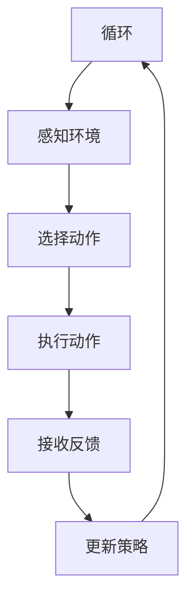
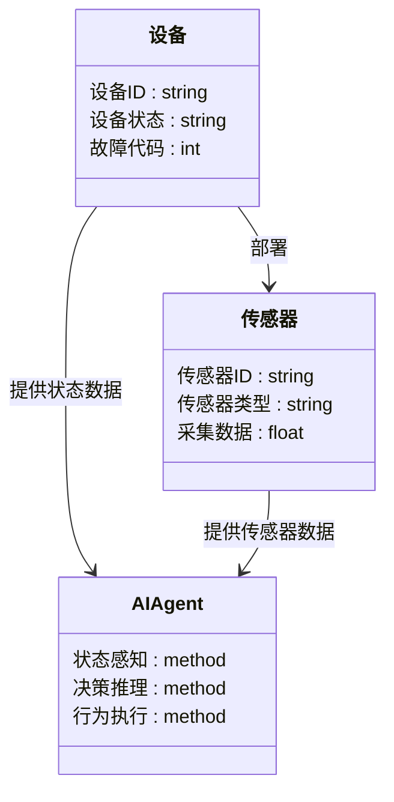
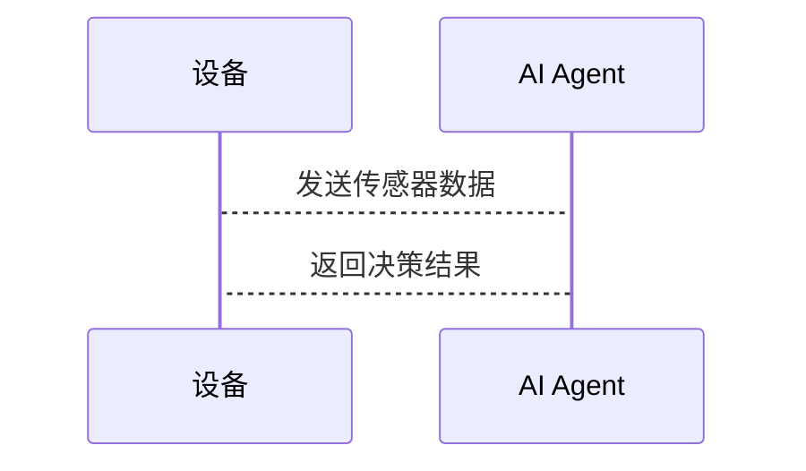

                 


```markdown
# 企业AI Agent的边缘计算在物联网场景中的低延迟决策实践

> 关键词：企业AI Agent、边缘计算、物联网、低延迟决策、实时数据分析、分布式系统

> 摘要：本文深入探讨了企业AI Agent在边缘计算环境下的低延迟决策实践，结合物联网场景，详细分析了AI Agent与边缘计算的结合方式、核心算法原理、系统架构设计以及实际项目中的应用案例。通过理论与实践相结合的方式，本文为读者提供了从概念理解到实际应用的全面指导，帮助企业在物联网场景中实现高效、实时的决策支持。

---

# 第1章 企业AI Agent与边缘计算的背景介绍

## 1.1 AI Agent的核心概念
### 1.1.1 AI Agent的定义与特点
AI Agent（人工智能代理）是指能够感知环境、自主决策并执行任务的智能实体。其特点包括：
- **自主性**：无需外部干预，自主完成任务。
- **反应性**：能够实时感知环境并做出反应。
- **目标导向**：基于目标进行决策和行动。
- **学习能力**：通过数据和经验不断优化自身的决策能力。

### 1.1.2 AI Agent在企业中的应用场景
AI Agent广泛应用于企业中的多种场景，如智能客服、供应链优化、金融风险控制等。以智能客服为例，AI Agent可以实时分析客户需求，提供个性化的解决方案。

### 1.1.3 低延迟决策的重要性
在企业环境中，低延迟决策意味着AI Agent需要在极短的时间内完成数据处理和决策，这对实时性要求较高的场景尤为重要。例如，在智能制造中，生产线上的设备需要在毫秒级时间内做出反应，以避免生产中断。

## 1.2 边缘计算的定义与特点
### 1.2.1 边缘计算的基本概念
边缘计算是指在数据生成的源头附近进行数据处理和分析的计算模式，其特点包括：
- **分布式计算**：数据在边缘端进行处理，减少对云端的依赖。
- **低延迟**：边缘计算能够显著降低数据传输和处理的延迟。
- **带宽优化**：通过在边缘处理数据，减少需要传输到云端的数据量。

### 1.2.2 边缘计算的优势与挑战
**优势**：
- **实时性**：边缘计算能够快速响应实时数据，满足低延迟需求。
- **带宽节省**：通过在边缘处理数据，减少网络传输压力。
- **隐私保护**：边缘计算可以在本地处理敏感数据，减少数据外传的风险。

**挑战**：
- **资源限制**：边缘设备的计算能力和存储空间有限。
- **管理复杂性**：边缘设备的分布广泛，管理难度较大。
- **安全性**：边缘设备面临更多的网络安全威胁。

### 1.2.3 边缘计算与云计算的关系
边缘计算与云计算并非对立关系，而是互补关系。边缘计算负责实时数据处理和局部决策，而云计算则负责大规模数据存储、分析和全局决策。两者结合可以实现高效的分布式计算架构。

## 1.3 物联网场景中的边缘计算
### 1.3.1 物联网的基本架构
物联网系统通常由感知层、网络层和应用层组成。感知层负责数据采集，网络层负责数据传输，应用层负责数据分析和决策。

### 1.3.2 物联网中的数据处理需求
物联网设备生成大量数据，这些数据需要实时处理以支持快速决策。然而，将所有数据传输到云端进行处理会导致延迟增加和带宽消耗过大。因此，边缘计算在物联网中显得尤为重要。

### 1.3.3 边缘计算在物联网中的作用
边缘计算可以通过在物联网设备或边缘网关上进行数据预处理，减少需要传输到云端的数据量，同时提高决策的实时性。例如，在智能交通系统中，边缘计算可以实时处理车流数据，快速调整交通信号灯，以缓解拥堵。

## 1.4 本章小结
本章介绍了AI Agent和边缘计算的核心概念，并分析了它们在物联网场景中的重要性。低延迟决策是企业AI Agent在边缘计算中的关键需求，而边缘计算为实现这一目标提供了技术基础。

---

# 第2章 企业AI Agent的边缘计算核心概念与联系

## 2.1 AI Agent与边缘计算的关系
### 2.1.1 AI Agent在边缘计算中的角色
AI Agent可以作为边缘计算的核心组件，负责数据处理、决策制定和任务执行。例如，在智能工厂中，AI Agent可以在边缘端实时分析传感器数据，快速做出设备维护决策。

### 2.1.2 边缘计算对AI Agent的支撑
边缘计算提供了低延迟、高带宽的环境，为AI Agent的实时决策提供了技术支撑。边缘设备的计算能力可以支持AI Agent进行本地推理和决策，而无需依赖云端。

### 2.1.3 两者结合的协同效应
AI Agent与边缘计算的结合能够实现分布式智能，提升系统的整体性能。例如，在智能电网中，AI Agent可以在边缘端实时分析电力数据，快速响应负荷变化，确保电网的稳定运行。

## 2.2 核心概念的原理分析
### 2.2.1 AI Agent的决策机制
AI Agent的决策机制通常包括感知、推理和执行三个阶段。感知阶段通过传感器或数据源获取信息，推理阶段基于感知的信息进行分析和决策，执行阶段根据决策结果采取行动。

### 2.2.2 边缘计算的数据处理流程
边缘计算的数据处理流程通常包括数据采集、数据预处理、数据存储和数据分析四个阶段。通过在边缘端进行数据处理，可以显著降低数据传输延迟。

### 2.2.3 低延迟决策的实现方法
低延迟决策可以通过优化算法、减少计算复杂度和提高硬件性能等方法实现。例如，使用轻量级的机器学习模型可以在边缘设备上快速完成推理。

## 2.3 核心概念的属性特征对比
以下是一个对比表格，展示了AI Agent和边缘计算在不同方面的特点：

| **特性**         | **AI Agent**          | **边缘计算**          |
|------------------|-----------------------|-----------------------|
| **计算能力**     | 依赖高性能计算资源    | 依赖本地计算资源      |
| **数据处理**     | 高度依赖云端数据      | 数据处理在边缘端完成  |
| **延迟要求**     | 低延迟需求            | 极低延迟需求          |
| **资源消耗**     | 高资源消耗            | 低资源消耗            |
| **应用场景**     | 企业内部决策          | 物联网实时处理        |

### 2.3.1 AI Agent与传统AI的对比分析
AI Agent与传统AI的区别在于，AI Agent具有自主性和目标导向性，而传统AI更多是基于规则的被动执行。

### 2.3.2 边缘计算与中心化计算的对比
边缘计算与中心化计算的主要区别在于数据处理的位置和延迟。边缘计算强调数据在生成地处理，而中心化计算则将所有数据集中到云端处理。

### 2.3.3 物联网场景中的数据特征分析
物联网数据具有实时性强、数据量大、异构性强等特点。这些特点要求边缘计算在处理数据时需要具备快速响应和高容错能力。

## 2.4 ER实体关系图
以下是物联网场景中的一个简单ER实体关系图，展示了设备、传感器和数据之间的关系：

```mermaid
erDiagram
    devicedata(设备数据) {
        设备(设备ID, 设备类型)
        传感器(传感器ID, 传感器类型)
    }
    设备 --> 传感器 : 部署
    设备 --> devicedata : 产生
    传感器 --> devicedata : 采集
```

---

# 第3章 企业AI Agent的边缘计算算法原理讲解

## 3.1 算法原理概述
AI Agent在边缘计算中的决策算法通常包括感知、推理和执行三个阶段。感知阶段通过传感器或数据源获取信息，推理阶段基于感知的信息进行分析和决策，执行阶段根据决策结果采取行动。

## 3.2 算法流程图
以下是基于强化学习的低延迟决策算法流程图：



## 3.3 算法实现代码
以下是基于Q-learning算法的Python代码示例：

```python
import numpy as np

class QLearningAgent:
    def __init__(self, state_space, action_space, alpha=0.1, gamma=0.99):
        self.state_space = state_space
        self.action_space = action_space
        self.alpha = alpha
        self.gamma = gamma
        self.q_table = np.zeros((state_space, action_space))
    
    def remember(self, state, action, reward, next_state):
        self.q_table[state, action] = self.q_table[state, action] * (1 - self.alpha) + \
            reward * self.alpha + self.gamma * np.max(self.q_table[next_state])
    
    def act(self, state):
        return np.argmax(self.q_table[state])
```

### 3.3.1 算法原理的数学模型
Q-learning算法的更新公式如下：

$$ Q(s, a) = Q(s, a) \times (1 - \alpha) + \alpha \times (r + \gamma \times \max Q(s', a')) $$

其中：
- \( s \) 表示当前状态
- \( a \) 表示当前动作
- \( r \) 表示奖励
- \( s' \) 表示下一个状态
- \( \alpha \) 表示学习率
- \( \gamma \) 表示折扣因子

### 3.3.2 算法实现的代码解读
上述代码定义了一个Q-learning代理，包含Q表的初始化、状态-动作对的更新（`remember`方法）和动作选择（`act`方法）。代理通过不断更新Q表来优化决策策略。

### 3.3.3 算法应用的案例分析
以智能交通系统为例，AI Agent可以通过Q-learning算法学习交通信号灯的控制策略，以优化交通流量。在实际应用中，代理可以根据实时车流量调整信号灯的切换时间，从而降低拥堵率。

---

# 第4章 企业AI Agent的边缘计算系统分析与架构设计

## 4.1 系统应用场景
在智能制造中，AI Agent可以部署在生产线的边缘设备上，实时监控设备状态并预测潜在故障。这种部署方式可以显著降低设备停机时间，提高生产效率。

## 4.2 系统功能设计
### 4.2.1 领域模型设计
以下是智能制造场景中的领域模型：



### 4.2.2 系统架构设计
以下是基于微服务架构的系统架构图：


### 4.2.3 接口设计与交互流程
以下是设备与AI Agent之间的交互流程：



---

# 第5章 企业AI Agent的边缘计算项目实战

## 5.1 环境配置
### 5.1.1 系统环境
- 操作系统：Linux（如Ubuntu 20.04）
- 开发工具：Python 3.8及以上版本
- 框架：TensorFlow 2.4.0

### 5.1.2 硬件配置
- CPU：Intel Core i7或更高
- 内存：8GB及以上
- 存储：至少10GB可用空间

## 5.2 核心代码实现
### 5.2.1 数据采集模块
以下是基于MQTT协议的数据采集代码：

```python
import paho.mqtt.client as mqtt

def on_connect(client, userdata, flags, rc):
    print("Connected with result code " + str(rc))
    client.subscribe("iot/sensor")

def on_message(client, userdata, msg):
    print("Received message: " + msg.payload.decode())

client = mqtt.Client()
client.on_connect = on_connect
client.on_message = on_message
client.connect("localhost", 1883, 60)
client.loop_forever()
```

### 5.2.2 数据处理模块
以下是基于边缘计算的数据处理代码：

```python
import numpy as np

def preprocess(data):
    return data.dropna().astype(float)

def process_data(data):
    processed_data = preprocess(data)
    return processed_data.mean()
```

### 5.2.3 AI Agent实现
以下是基于强化学习的AI Agent实现：

```python
class AIAgent:
    def __init__(self, action_space):
        self.action_space = action_space
        self.model = self._build_model()

    def _build_model(self):
        # 定义神经网络模型
        pass

    def act(self, state):
        return np.random.randint(0, self.action_space)

    def learn(self, state, action, reward, next_state):
        # 更新模型参数
        pass
```

### 5.2.4 系统集成
以下是系统集成的代码示例：

```python
from edge import EdgeManager
from agent import AIAgent

edge_manager = EdgeManager()
agent = AIAgent(action_space=5)
edge_manager.deploy(agent)
```

## 5.3 案例分析
### 5.3.1 案例背景
以智能电网为例，AI Agent可以在边缘端实时分析电力数据，快速响应负荷变化，确保电网的稳定运行。

### 5.3.2 实施步骤
1. **数据采集**：通过传感器采集电力设备的状态数据。
2. **数据预处理**：对采集的数据进行清洗和归一化处理。
3. **模型训练**：训练AI Agent的决策模型。
4. **模型部署**：将训练好的模型部署到边缘设备上。
5. **系统测试**：通过模拟负荷变化测试系统的响应速度和准确性。

### 5.3.3 实施效果
通过实施上述方案，智能电网的响应时间可以从分钟级缩短到秒级，显著提高了系统的稳定性。

## 5.4 项目小结
本章通过一个实际项目展示了企业AI Agent在边缘计算中的具体实现。从环境配置到系统集成，详细讲解了项目的实施步骤和注意事项。通过案例分析，验证了AI Agent在边缘计算中的有效性和优势。

---

# 第6章 企业AI Agent的边缘计算最佳实践与小结

## 6.1 最佳实践
### 6.1.1 系统设计
- **模块化设计**：确保系统的可扩展性和可维护性。
- **容错设计**：在边缘设备上实现故障容错机制。
- **安全设计**：通过加密和认证确保数据的安全性。

### 6.1.2 算法选择
- **选择适合的算法**：根据具体场景选择合适的算法。
- **优化算法性能**：通过减少计算复杂度和优化模型结构提高算法效率。

### 6.1.3 系统部署
- **自动化部署**：使用自动化工具简化部署过程。
- **监控与维护**：实时监控系统运行状态，及时发现和解决问题。

## 6.2 小结
本章总结了企业AI Agent在边缘计算中的实践经验和最佳实践。通过合理的设计和优化，可以显著提高系统的性能和可靠性。未来，随着边缘计算技术的不断发展，AI Agent将在更多领域中发挥重要作用。

---

# 作者：AI天才研究院/AI Genius Institute & 禅与计算机程序设计艺术 /Zen And The Art of Computer Programming
```

