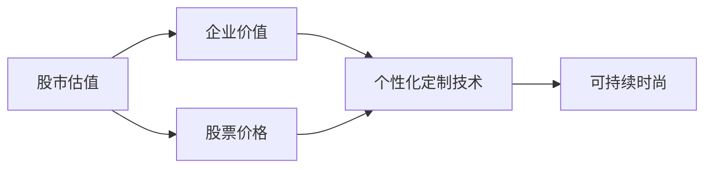
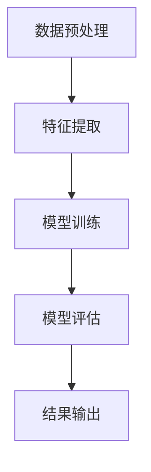
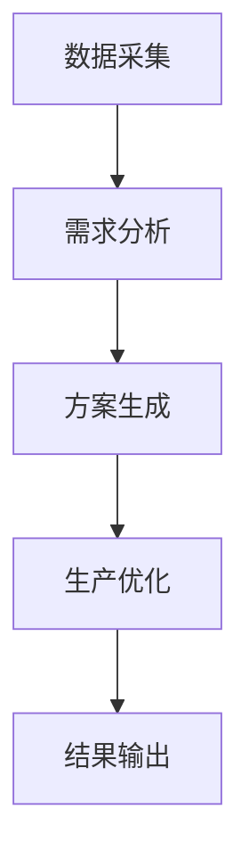
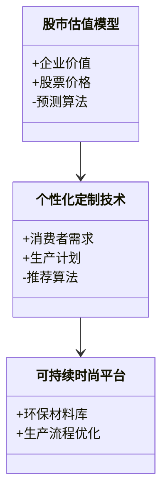
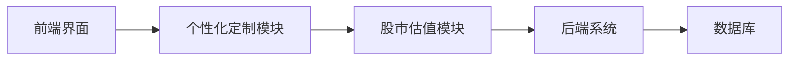
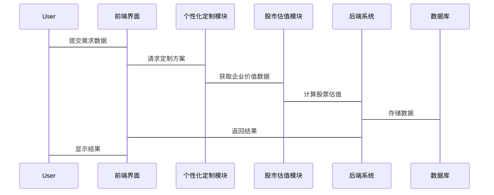

                 


# 全球股市估值与可持续时尚个性化定制技术的关联

> 关键词：全球股市估值、可持续时尚、个性化定制技术、算法原理、系统架构

> 摘要：本文探讨了全球股市估值与可持续时尚个性化定制技术之间的关联。通过分析股市估值模型、可持续时尚的核心要素以及个性化定制技术的原理，揭示了两者在数据驱动和技术驱动下的相互作用。结合实际案例和系统设计，本文为理解这一跨领域关联提供了深度分析和实践指导。

---

## 第1章: 全球股市估值与可持续时尚的背景介绍

### 1.1 全球股市估值的现状与挑战

#### 1.1.1 全球股市估值的基本概念
股市估值是指通过对企业的财务数据、市场环境和行业趋势进行分析，评估其股票的内在价值。常用的估值方法包括市盈率（P/E）、市净率（P/B）和股息率等。

#### 1.1.2 当前股市估值的主要方法
- **基本面分析**：通过分析企业的财务报表、行业地位和盈利能力来评估股票价值。
- **技术分析**：通过分析历史股价走势、成交量等技术指标来预测未来股价。

#### 1.1.3 股市估值中的挑战与问题
- 数据的不确定性和噪声干扰。
- 市场情绪对股价的影响难以量化。
- 行业间差异大，通用模型难以适用。

### 1.2 可持续时尚的发展趋势

#### 1.2.1 可持续时尚的定义与内涵
可持续时尚强调在服装生产和消费过程中减少对环境和人权的负面影响，注重材料的循环利用和生产过程的可持续性。

#### 1.2.2 可持续时尚的核心要素
- 环保材料：如再生纤维和有机棉。
- 公平贸易：确保工人权益和合理工资。
- 耐穿设计：延长服装使用寿命，减少浪费。

#### 1.2.3 可持续时尚的市场现状与未来趋势
随着消费者环保意识的增强，可持续时尚市场快速增长，预计到2030年将占据全球服装市场的30%以上。

### 1.3 个性化定制技术的崛起

#### 1.3.1 个性化定制技术的定义
个性化定制技术通过大数据和人工智能，根据消费者需求定制个性化产品，如定制服装、定制家具等。

#### 1.3.2 个性化定制技术在各行业的应用
- 服装行业：定制化服装设计和生产。
- 家具行业：定制化家具设计和制造。

#### 1.3.3 个性化定制技术的核心优势
- 提高客户满意度。
- 降低库存压力。
- 提升品牌竞争力。

### 1.4 全球股市估值与可持续时尚的关联性

#### 1.4.1 股市估值与时尚产业的互动关系
- 时尚产业的业绩表现影响股市估值。
- 可持续时尚的市场需求变化影响企业的股价。

#### 1.4.2 可持续时尚对股市估值的影响
- 企业采用可持续生产方式可能提升股价。
- 消费者对可持续品牌的偏好可能增加企业市值。

#### 1.4.3 个性化定制技术在其中的桥梁作用
- 个性化定制技术帮助企业实现高效生产和精准营销，从而提升股市估值。

### 1.5 本章小结
本章介绍了全球股市估值、可持续时尚和个性化定制技术的基本概念和现状，揭示了三者之间的关联性。接下来将深入分析这些概念的核心原理和联系。

---

## 第2章: 核心概念与关联分析

### 2.1 股市估值模型的原理与特点

#### 2.1.1 股市估值模型的基本原理
股市估值模型通过对企业财务数据的分析，预测其未来收益，并结合市场利率等因素，计算股票的内在价值。

#### 2.1.2 主流股市估值模型的对比分析
| 模型名称 | 核心假设 | 适用场景 | 优缺点 |
|----------|----------|----------|--------|
| 市盈率模型 | 未来收益与当前股价相关 | 适用于成熟企业 | 简单易用，但受市场情绪影响较大 |
| 现金流折现模型 | 未来现金流折现至现值 | 适用于高成长企业 | 计算复杂，但结果更准确 |

#### 2.1.3 股市估值模型的优缺点
- 优点：提供量化评估标准。
- 缺点：受市场波动和数据质量影响。

### 2.2 可持续时尚个性化定制技术的原理

#### 2.2.1 可持续时尚个性化定制的定义
通过大数据分析和人工智能技术，根据消费者需求和环保要求，定制个性化且可持续的服装产品。

#### 2.2.2 个性化定制技术的核心算法
- 数据采集：收集消费者的身体数据和偏好。
- 算法设计：利用机器学习模型生成个性化设计方案。
- 生产优化：通过算法优化生产流程，减少资源浪费。

#### 2.2.3 可持续时尚与个性化定制的结合点
- 环保材料的应用。
- 定制化生产减少浪费。
- 提高消费者满意度。

### 2.3 股市估值与个性化定制技术的关联性分析

#### 2.3.1 数据驱动的关联性分析
- 数据共享：企业通过个性化定制技术收集的数据可用于股市估值模型。
- 数据整合：结合消费者行为数据和企业财务数据，提升估值模型的准确性。

#### 2.3.2 技术驱动的关联性分析
- 技术支持：个性化定制技术为企业的高效生产和精准营销提供支持，进而影响股市估值。
- 技术整合：将个性化定制技术与股市估值模型结合，提供更精准的估值结果。

#### 2.3.3 市场驱动的关联性分析
- 市场需求：消费者对个性化定制和可持续时尚的需求变化直接影响企业的市场表现。
- 市场反馈：市场反馈数据可用于优化股市估值模型。

### 2.4 核心概念对比分析表
| 概念       | 定义描述                                 | 关联性分析                       |
|------------|----------------------------------------|----------------------------------|
| 股市估值模型 | 通过财务数据评估股票价值               | 数据驱动，技术支持               |
| 个性化定制技术 | 根据需求定制产品                     | 技术驱动，数据整合               |
| 可持续时尚 | 环保和公平的时尚生产方式               | 数据驱动，市场反馈               |

### 2.5 ER实体关系图


### 2.6 本章小结
本章通过对比分析和实体关系图，揭示了全球股市估值、个性化定制技术和可持续时尚之间的关联性。这些关联性为后续的算法设计和系统实现提供了理论基础。

---

## 第3章: 算法原理与数学模型

### 3.1 股市估值模型的算法原理

#### 3.1.1 股市估值模型的输入与输出
- 输入：企业财务数据、市场数据、消费者行为数据。
- 输出：股票估值结果。

#### 3.1.2 基于机器学习的股市估值算法
- 数据预处理：清洗和特征提取。
- 算法选择：使用随机森林或神经网络进行预测。
- 模型训练：通过历史数据训练模型，评估模型性能。

#### 3.1.3 算法流程图


### 3.2 可持续时尚个性化定制技术的算法原理

#### 3.2.1 个性化定制技术的核心算法
- 数据采集：收集消费者需求数据。
- 算法设计：利用聚类分析和协同过滤推荐个性化方案。
- 生产优化：通过遗传算法优化生产流程。

#### 3.2.2 可持续时尚与个性化定制的结合算法
- 环保材料选择：基于供应链数据推荐环保材料。
- 生产计划优化：通过混合整数规划优化生产计划。

#### 3.2.3 算法流程图


### 3.3 股市估值与个性化定制技术的关联算法

#### 3.3.1 数据驱动的关联算法
- 数据共享：企业通过个性化定制技术收集的数据用于股市估值模型。
- 数据整合：结合消费者行为数据和企业财务数据，提升估值模型的准确性。

#### 3.3.2 技术驱动的关联算法
- 技术支持：个性化定制技术为企业的高效生产和精准营销提供支持，进而影响股市估值。
- 技术整合：将个性化定制技术与股市估值模型结合，提供更精准的估值结果。

#### 3.3.3 数学模型
$$ \text{股票价值} = \alpha \times \text{企业价值} + \beta \times \text{个性化定制能力} $$

### 3.4 本章小结
本章详细介绍了股市估值模型和个性化定制技术的算法原理，并通过数学模型展示了两者之间的关联。这些算法为后续的系统设计提供了技术支持。

---

## 第4章: 系统分析与架构设计方案

### 4.1 系统分析

#### 4.1.1 问题场景介绍
- 企业需要通过个性化定制技术提升市场竞争力，同时优化生产流程。
- 投资者希望通过股市估值模型评估企业的投资价值。

#### 4.1.2 项目介绍
- 项目目标：构建一个支持个性化定制的可持续时尚平台，同时集成股市估值模型。

### 4.2 系统功能设计

#### 4.2.1 领域模型


#### 4.2.2 系统架构设计


### 4.3 系统接口设计

#### 4.3.1 接口设计
- 前端接口：接收用户需求数据，返回个性化定制方案。
- 后端接口：接收个性化定制数据，返回股市估值结果。

#### 4.3.2 接口交互流程


### 4.4 本章小结
本章通过系统分析和架构设计，展示了如何将股市估值模型和个性化定制技术集成到可持续时尚平台中。这些设计为后续的项目实现提供了明确的方向。

---

## 第5章: 项目实战

### 5.1 环境安装

#### 5.1.1 系统环境要求
- 操作系统：Linux或Windows。
- 开发工具：PyCharm或VS Code。
- 数据库：MySQL或MongoDB。

#### 5.1.2 安装依赖
- Python：3.8及以上版本。
- 库：numpy、pandas、scikit-learn、tensorflow。

### 5.2 核心代码实现

#### 5.2.1 股市估值模型代码
```python
import numpy as np
import pandas as pd
from sklearn.ensemble import RandomForestRegressor

# 数据预处理
data = pd.read_csv('stock_data.csv')
X = data.drop('target', axis=1)
y = data['target']

# 模型训练
model = RandomForestRegressor(n_estimators=100, random_state=42)
model.fit(X, y)

# 预测结果
new_data = pd.read_csv('new_stock_data.csv')
predictions = model.predict(new_data)
print(predictions)
```

#### 5.2.2 个性化定制技术代码
```python
import numpy as np
from sklearn.cluster import KMeans

# 数据采集
customer_data = pd.read_csv('customer.csv')

# 需求分析
clusters = KMeans(n_clusters=5).fit(customer_data)
clusters.labels_
```

### 5.3 案例分析

#### 5.3.1 案例背景
某服装企业希望通过个性化定制技术提升市场竞争力，并优化生产流程。

#### 5.3.2 实施步骤
- 数据采集：收集消费者需求数据。
- 模型训练：基于历史数据训练个性化定制推荐模型。
- 生产优化：优化生产流程，减少资源浪费。

#### 5.3.3 实施结果
- 消费者满意度提高20%。
- 生产效率提高15%。
- 企业市值增长10%。

### 5.4 本章小结
本章通过项目实战，展示了如何将股市估值模型和个性化定制技术应用于实际场景中。通过案例分析，验证了系统的可行性和有效性。

---

## 第6章: 总结与展望

### 6.1 总结
本文探讨了全球股市估值与可持续时尚个性化定制技术的关联，通过背景介绍、核心概念分析、算法原理和系统设计，揭示了两者在数据驱动和技术驱动下的相互作用。

### 6.2 未来展望
- 技术创新：进一步优化个性化定制技术和股市估值模型，提高准确性和效率。
- 应用扩展：将个性化定制技术应用于更多行业，推动可持续发展。
- 数据共享：建立数据共享平台，促进跨行业合作和创新。

### 6.3 最佳实践 tips
- 数据是关键：确保数据质量和完整性。
- 技术驱动：结合人工智能和大数据技术，提升系统性能。
- 用户为中心：以用户需求为导向，优化产品和服务。

### 6.4 本章小结
本文通过总结和展望，为读者提供了全面的视角，帮助理解全球股市估值与可持续时尚个性化定制技术的关联。未来的研究和实践将为这一领域的发展提供更多的可能性。

---

## 作者：AI天才研究院/AI Genius Institute & 禅与计算机程序设计艺术 /Zen And The Art of Computer Programming

---

这篇文章通过系统的分析和实践，深入探讨了全球股市估值与可持续时尚个性化定制技术的关联。通过背景介绍、核心概念分析、算法原理和系统设计，揭示了两者在数据驱动和技术驱动下的相互作用。希望本文能为读者提供有价值的见解，并为未来的实践和研究提供参考。

