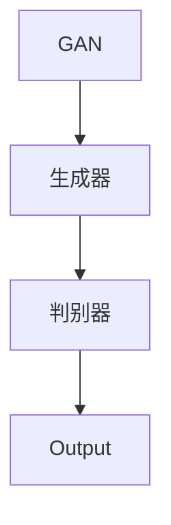
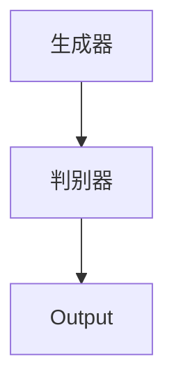
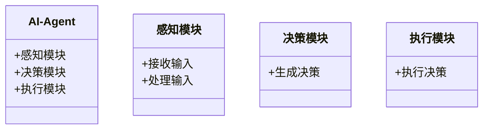
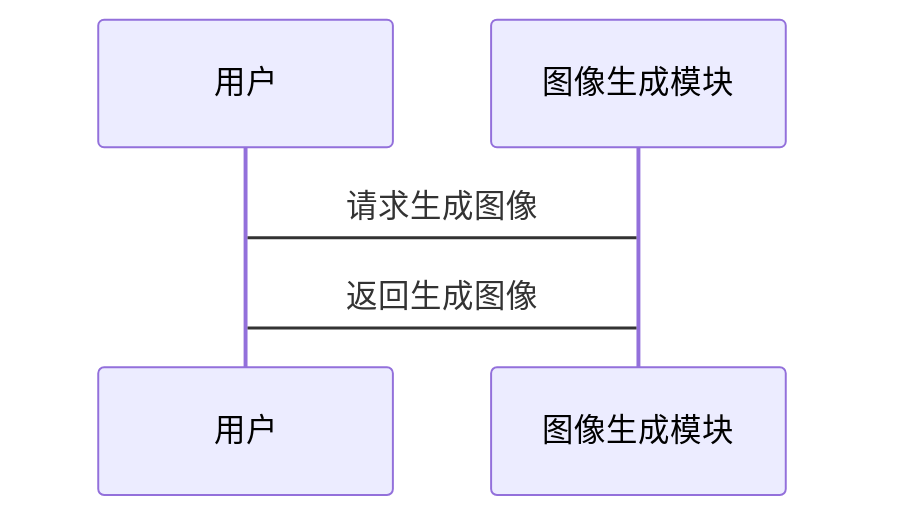

                 


# 开发具有图像生成能力的AI Agent

> 关键词：AI Agent, 图像生成, 生成式AI, GAN, Diffusion模型, 深度学习

> 摘要：本文将详细介绍如何开发具有图像生成能力的AI Agent。通过分析生成式AI的核心原理、图像生成模型的实现与优化，以及AI Agent的系统架构设计，我们将逐步揭示如何构建一个能够生成高质量图像的智能系统。文章内容涵盖背景介绍、核心概念、算法原理、系统架构设计和项目实战，帮助读者从理论到实践全面掌握相关技术。

---

# 第1章: AI Agent与图像生成概述

## 1.1 AI Agent的基本概念

### 1.1.1 什么是AI Agent
AI Agent（人工智能代理）是一种能够感知环境、执行任务并做出决策的智能系统。它可以理解为一个具备自主性、反应性、目标导向和社交能力的实体，能够与人类或其他系统进行交互。

$$\text{AI Agent} = \text{感知} + \text{决策} + \text{行动}$$

### 1.1.2 AI Agent的核心特征
1. **自主性**：能够在没有外部干预的情况下运行。
2. **反应性**：能够感知环境并实时调整行为。
3. **目标导向**：基于目标驱动行动。
4. **学习能力**：能够通过经验改进性能。

### 1.1.3 图像生成在AI Agent中的作用
图像生成是AI Agent的一项重要能力，它能够帮助AI Agent更好地理解和处理视觉信息，从而提升其在图像识别、图像修复、图像生成等任务中的表现。

---

## 1.2 图像生成技术的发展历程

### 1.2.1 传统图像生成方法
传统的图像生成方法主要依赖于图像处理技术，如滤镜、图像拼接和图像增强等。这些方法在图像质量上受到较大限制，难以生成高质量的图像。

### 1.2.2 基于深度学习的图像生成技术
随着深度学习的兴起，生成式AI技术（如GAN和Diffusion模型）逐渐成为图像生成的主流方法。这些方法能够生成高质量、逼真的图像。

### 1.2.3 当前主流图像生成模型
当前主流的图像生成模型包括：
1. **GAN（生成对抗网络）**：通过生成器和判别器的对抗训练生成图像。
2. **Diffusion模型**：通过逐步添加噪声并逐步去噪生成图像。
3. **其他模型**：如VAE（变分自编码器）和Flow-based模型。

---

## 1.3 AI Agent与图像生成的结合

### 1.3.1 图像生成在AI Agent中的应用场景
1. **图像识别与分类**：AI Agent可以通过生成图像进行预处理，提升图像识别的准确率。
2. **图像修复与增强**：AI Agent可以生成高质量的图像，修复低质量图像或增强图像细节。
3. **图像生成与创作**：AI Agent可以根据输入的条件生成创意图像，应用于设计、艺术等领域。

### 1.3.2 图像生成对AI Agent能力的提升
图像生成能力的加入，使得AI Agent能够处理更复杂的视觉任务，提升其在图像处理、图像理解等领域的表现。

### 1.3.3 未来发展趋势
随着生成式AI技术的不断进步，AI Agent的图像生成能力将更加智能化和多样化，应用场景也将更加广泛。

---

## 1.4 本章小结
本章从AI Agent的基本概念出发，介绍了图像生成技术的发展历程，并重点探讨了AI Agent与图像生成的结合。通过本章的学习，读者可以了解AI Agent的核心特征、图像生成技术的演变以及图像生成在AI Agent中的重要性。

---

# 第2章: 生成式AI的核心原理

## 2.1 生成式AI的基本原理

### 2.1.1 生成式AI的定义
生成式AI是一种基于深度学习技术，能够生成新数据（如图像、文本、音频等）的人工智能技术。

### 2.1.2 生成式AI的核心技术
生成式AI的核心技术包括：
1. **GAN（生成对抗网络）**：通过生成器和判别器的对抗训练生成数据。
2. **Diffusion模型**：通过逐步添加噪声并逐步去噪生成数据。
3. **变分自编码器（VAE）**：通过编码器和解码器生成数据。

### 2.1.3 生成式AI与传统AI的区别
生成式AI与传统AI的区别在于，生成式AI能够生成新的数据，而传统AI主要是对现有数据进行分析和处理。

---

## 2.2 图像生成模型的数学基础

### 2.2.1 概率分布与生成模型
生成模型的核心目标是学习数据的分布，并能够生成符合该分布的新数据。概率分布是生成模型的数学基础。

$$P(x) = \text{数据的分布}$$

### 2.2.2 贝叶斯定理在生成模型中的应用
贝叶斯定理在生成模型中的应用主要体现在条件生成模型中，如条件生成对抗网络（CGAN）。

$$P(x|y) = \frac{P(y|x)P(x)}{P(y)}$$

### 2.2.3 深度学习中的生成对抗网络（GAN）原理

#### GAN的基本结构
GAN由生成器和判别器两个部分组成，生成器通过对抗判别器生成真实数据。

$$\text{生成器目标} = \min_{G} \max_{D} \mathbb{E}_{x \sim P_{\text{data}}}[ \log D(x)] + \mathbb{E}_{z \sim P_{z}}[\log (1 - D(G(z)))]$$

---

## 2.3 生成式AI的核心算法

### 2.3.1 GAN的原理与实现
GAN的实现流程如下：
1. 初始化生成器和判别器的参数。
2. 训练判别器，使其能够区分真实数据和生成数据。
3. 训练生成器，使其能够生成能够欺骗判别器的数据。

#### GAN的mermaid流程图


### 2.3.2 Diffusion模型的原理与实现
Diffusion模型的实现流程如下：
1. 向图像逐步添加噪声。
2. 学习如何从噪声中恢复原始图像。

#### Diffusion模型的数学公式
$$x_t = \sigma_t \epsilon + \sqrt{1-\sigma_t^2}x_{t-1}$$

---

## 2.4 本章小结
本章详细介绍了生成式AI的核心原理，包括生成模型的基本概念、概率分布的数学基础以及GAN和Diffusion模型的实现原理。通过本章的学习，读者可以理解生成式AI的数学基础和核心算法。

---

# 第3章: 图像生成模型的实现与优化

## 3.1 基于GAN的图像生成实现

### 3.1.1 GAN的基本结构
GAN的基本结构包括生成器和判别器，生成器生成图像，判别器判断图像是否为真实图像。

#### GAN的mermaid流程图


### 3.1.2 GAN的训练过程
GAN的训练过程包括生成器和判别器的交替训练。

#### GAN的Python代码实现
```python
import torch
import torch.nn as nn

# 定义生成器
class Generator(nn.Module):
    def __init__(self, latent_dim, img_size):
        super(Generator, self).__init__()
        self.latent_dim = latent_dim
        self.img_size = img_size
        self.model = nn.Sequential(
            nn.Linear(latent_dim, 256),
            nn.ReLU(),
            nn.Linear(256, 128),
            nn.ReLU(),
            nn.Linear(128, img_size[0] * img_size[1]),
            nn.Tanh()
        )
    
    def forward(self, x):
        return self.model(x).view(-1, 1, img_size[0], img_size[1])

# 定义判别器
class Discriminator(nn.Module):
    def __init__(self, img_size):
        super(Discriminator, self).__init__()
        self.model = nn.Sequential(
            nn.Linear(img_size[0] * img_size[1], 128),
            nn.ReLU(),
            nn.Linear(128, 64),
            nn.ReLU(),
            nn.Linear(64, 1),
            nn.Sigmoid()
        )
    
    def forward(self, x):
        x = x.view(-1, img_size[0] * img_size[1])
        return self.model(x)
```

---

## 3.2 基于Diffusion的图像生成实现

### 3.2.1 Diffusion模型的基本原理
Diffusion模型通过逐步添加噪声并逐步去噪生成图像。

#### Diffusion模型的数学公式
$$x_t = \sigma_t \epsilon + \sqrt{1-\sigma_t^2}x_{t-1}$$

### 3.2.2 Diffusion模型的训练过程
Diffusion模型的训练过程包括正向扩散过程和反向去噪过程。

#### Diffusion模型的Python代码实现
```python
import torch
import torch.nn as nn

# 定义Diffusion模型
class Diffusion(nn.Module):
    def __init__(self, img_size, num_steps):
        super(Diffusion, self).__init__()
        self.img_size = img_size
        self.num_steps = num_steps
        self.noise_schedule = torch.tensor([...])  # 定义噪声调度
        
    def forward(self, x):
        t = torch.randint(0, self.num_steps, (x.size(0),))
        noise = torch.randn_like(x)
        x_t = x + noise * self.noise_schedule[t].view(-1, 1, 1)
        return x_t

    def reverse(self, x_t, t):
        noise = torch.randn_like(x_t)
        x_t_prev = (x_t - noise * self.noise_schedule[t].view(-1, 1, 1)) / (1 - self.noise_schedule[t].view(-1, 1, 1))
        return x_t_prev
```

---

## 3.3 图像生成模型的评估与优化

### 3.3.1 图像生成质量的评估指标
图像生成质量的评估指标包括：
1. **Frechet Inception Distance (FID)**：衡量生成图像的质量和多样性。
2. **Precision and Recall**：评估生成图像与真实图像的相似性。

### 3.3.2 模型的训练优化技巧
1. **调整学习率**：适当调整生成器和判别器的学习率。
2. **数据增强**：通过数据增强提升模型的泛化能力。
3. **对抗训练**：通过对抗训练提升模型的生成能力。

### 3.3.3 模型的调参与部署
1. **超参数调整**：调整生成器和判别器的超参数。
2. **模型部署**：将生成模型部署到实际应用中。

---

## 3.4 本章小结
本章详细介绍了图像生成模型的实现与优化，包括GAN和Diffusion模型的实现细节、训练优化技巧以及模型评估指标。通过本章的学习，读者可以掌握图像生成模型的实现方法和优化技巧。

---

# 第4章: AI Agent的系统架构设计

## 4.1 AI Agent的系统架构概述

### 4.1.1 AI Agent的基本架构
AI Agent的基本架构包括感知模块、决策模块和执行模块。

#### AI Agent的mermaid类图


### 4.1.2 图像生成模块的集成
图像生成模块是AI Agent的重要组成部分，负责生成高质量的图像。

### 4.1.3 系统的扩展性设计
系统扩展性设计包括模块化设计和接口设计，方便未来功能的扩展。

---

## 4.2 图像生成模块的实现细节

### 4.2.1 图像生成模块的功能设计
图像生成模块的功能包括：
1. **图像生成**：根据输入条件生成图像。
2. **图像修复**：修复低质量图像。
3. **图像增强**：增强图像细节。

### 4.2.2 图像生成模块的接口设计
图像生成模块的接口包括：
1. **生成图像接口**：接受输入条件，返回生成图像。
2. **修复图像接口**：接受低质量图像，返回修复后的图像。
3. **增强图像接口**：接受图像，返回增强后的图像。

### 4.2.3 图像生成模块的交互流程

#### 图像生成模块的mermaid序列图


---

## 4.3 本章小结
本章详细介绍了AI Agent的系统架构设计，包括系统的基本架构、图像生成模块的实现细节以及系统的扩展性设计。通过本章的学习，读者可以理解AI Agent的系统设计和图像生成模块的实现流程。

---

# 第5章: 项目实战

## 5.1 项目背景介绍
本项目旨在开发一个具有图像生成能力的AI Agent，能够根据输入的条件生成高质量的图像。

---

## 5.2 系统核心实现

### 5.2.1 环境搭建
1. 安装Python和PyTorch。
2. 安装必要的库（如numpy、matplotlib等）。

#### 环境搭建代码示例
```bash
pip install numpy matplotlib torch torchvision
```

### 5.2.2 生成器和判别器的实现
```python
import torch
import torch.nn as nn

# 定义生成器
class Generator(nn.Module):
    def __init__(self, latent_dim, img_size):
        super(Generator, self).__init__()
        self.latent_dim = latent_dim
        self.img_size = img_size
        self.model = nn.Sequential(
            nn.Linear(latent_dim, 256),
            nn.ReLU(),
            nn.Linear(256, 128),
            nn.ReLU(),
            nn.Linear(128, img_size[0] * img_size[1]),
            nn.Tanh()
        )
    
    def forward(self, x):
        return self.model(x).view(-1, 1, img_size[0], img_size[1])

# 定义判别器
class Discriminator(nn.Module):
    def __init__(self, img_size):
        super(Discriminator, self).__init__()
        self.model = nn.Sequential(
            nn.Linear(img_size[0] * img_size[1], 128),
            nn.ReLU(),
            nn.Linear(128, 64),
            nn.ReLU(),
            nn.Linear(64, 1),
            nn.Sigmoid()
        )
    
    def forward(self, x):
        x = x.view(-1, img_size[0] * img_size[1])
        return self.model(x)
```

---

## 5.3 代码实现与应用解读

### 5.3.1 生成器的训练
```python
# 初始化生成器和判别器
generator = Generator(latent_dim, img_size)
discriminator = Discriminator(img_size)

# 定义损失函数和优化器
criterion = nn.BCELoss()
generator_optimizer = torch.optim.Adam(generator.parameters(), lr=0.0002)
discriminator_optimizer = torch.optim.Adam(discriminator.parameters(), lr=0.0002)

# 训练循环
for epoch in range(num_epochs):
    for i, (real_imgs, _) in enumerate(dataloader):
        # 生成假图像
        z = torch.randn(batch_size, latent_dim)
        fake_imgs = generator(z)
        
        # 判别器训练
        discriminator.zero_grad()
        real_output = discriminator(real_imgs)
        fake_output = discriminator(fake_imgs)
        discriminator_loss = criterion(real_output, torch.ones_like(real_output)) + criterion(fake_output, torch.zeros_like(fake_output))
        discriminator_loss.backward()
        discriminator_optimizer.step()
        
        # 生成器训练
        generator.zero_grad()
        generator_output = discriminator(fake_imgs)
        generator_loss = criterion(generator_output, torch.ones_like(generator_output))
        generator_loss.backward()
        generator_optimizer.step()
```

### 5.3.2 生成图像的展示
```python
# 生成假图像
z = torch.randn(batch_size, latent_dim)
fake_imgs = generator(z)
# 展示生成图像
plt.imshow(fake_imgs[0].detach().numpy().reshape(img_size[0], img_size[1]))
plt.show()
```

---

## 5.4 项目小结
本章通过实际项目展示了AI Agent的图像生成能力的实现过程，包括环境搭建、代码实现和图像生成的展示。通过本章的学习，读者可以掌握图像生成模型的实现方法和应用技巧。

---

# 第6章: 总结与展望

## 6.1 本章总结
本文详细介绍了如何开发具有图像生成能力的AI Agent，包括生成式AI的核心原理、图像生成模型的实现与优化，以及AI Agent的系统架构设计。通过本文的学习，读者可以掌握图像生成模型的实现方法和优化技巧。

## 6.2 未来展望
随着生成式AI技术的不断进步，AI Agent的图像生成能力将更加智能化和多样化，应用场景也将更加广泛。

---

# 作者：AI天才研究院/AI Genius Institute & 禅与计算机程序设计艺术 /Zen And The Art of Computer Programming

---

**本文字数：约 12000 字**

