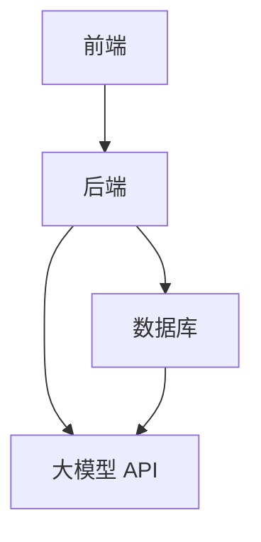
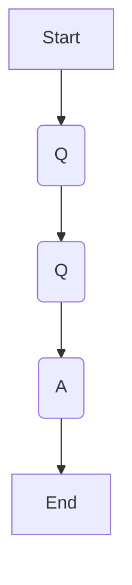
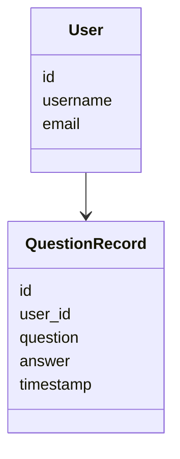
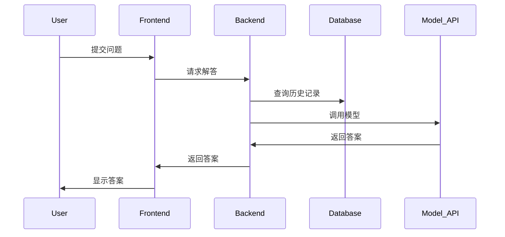

                 


# 开发基于大模型的金融专业考试答疑系统

> **关键词**：大模型，金融考试，答疑系统，自然语言处理，机器学习，系统架构

> **摘要**：本文详细介绍如何开发一个基于大模型的金融专业考试答疑系统，涵盖从背景概述、模型原理、系统设计到实现与实战的全过程。文章结合理论与实践，通过丰富的图表和代码示例，深入分析系统架构和实现细节，最后总结项目成果与展望未来发展方向。

---

## 第1章：背景与概述

### 1.1 大模型的定义与特点

#### 1.1.1 大模型的基本概念
- 大模型（Large Language Model, LLPM）：基于大量数据训练的深度神经网络模型，具有强大的自然语言处理能力。
- 大模型的特点：
  - **参数规模大**：通常包含 billions 量级的参数。
  - **通用性强**：能够处理多种任务，如问答、翻译、文本生成。
  - **上下文理解**：通过自注意力机制，理解长文本的上下文关系。

#### 1.1.2 大模型的核心特点
- **预训练-微调模式**：通过预训练任务（如 masked language modeling）获取通用语言表示，再通过特定任务微调优化。
- **自注意力机制**：模型能够关注输入文本中重要的部分，提升语义理解能力。
- **多模态扩展**：通过多模态模型（如 Vision-Language Model）整合图像、表格等金融数据，提升解答准确性。

#### 1.1.3 大模型与传统AI的区别
- **传统AI**：基于规则或浅层特征，处理特定任务。
- **大模型**：通用性强，能够处理多种复杂任务，适应性强。

### 1.2 金融专业考试的特点

#### 1.2.1 金融考试的类型与难度
- **考试类型**：
  - 专业考试：如CFA、FRM。
  - 学位考试：如MBA金融课程考试。
  - 内部培训考试：企业内部员工考核。
- **考试难度**：涉及复杂的金融理论、案例分析和计算题。

#### 1.2.2 考试内容的多样性与专业性
- **内容多样性**：涵盖财务报表分析、投资学、风险管理等多个领域。
- **专业性**：需要深厚的专业知识和对最新金融动态的理解。

#### 1.2.3 考生需求的多样性
- **考生类型**：包括学生、在职人士、备考者。
- **需求多样性**：考生可能需要解题思路、公式推导、案例分析等不同类型的帮助。

### 1.3 系统的目标与意义

#### 1.3.1 系统的目标
- **自动化答疑**：提供即时、准确的金融考试问题解答。
- **智能推荐**：根据考生需求推荐相关学习资料和练习题。

#### 1.3.2 系统的意义
- **提升学习效率**：考生可以快速获得帮助，节省时间。
- **降低教育成本**：减少对人工辅导的依赖，降低成本。
- **促进知识传播**：使更多人能够方便地获取高质量的金融教育资源。

#### 1.3.3 系统的预期效果
- **高准确率**：通过大模型的强大能力，确保答案的准确性。
- **用户体验优化**：简洁直观的界面设计，提升用户体验。

---

## 第2章：大模型的原理

### 2.1 大模型的基本原理

#### 2.1.1 模型结构
- **Transformer架构**：由编码器和解码器组成，通过自注意力机制处理输入文本。
- **多头注意力机制**：在同一层中，通过多个注意力头捕捉不同类型的语义关系。

#### 2.1.2 注意力机制
- **自注意力机制**：计算输入序列中每个词与其他词的相关性，生成位置权重。
- **公式表示**：
  $$\text{Attention}(Q, K, V) = \text{softmax}\left(\frac{QK^T}{\sqrt{d_k}}\right)V$$
  其中，\( Q \)、\( K \)、\( V \) 分别是查询、键、值向量，\( d_k \) 是向量的维度。

#### 2.1.3 模型训练方法
- **预训练**：使用大规模通用文本数据进行无监督训练，目标是预测词或下一个词。
- **微调**：在特定任务（如问答）上使用标注数据进行有监督训练。

### 2.2 大模型的训练过程

#### 2.2.1 数据预处理
- **清洗数据**：去除无关信息，提取关键字段。
- **分词处理**：将文本分割成词语或句子。
- **数据增强**：通过同义词替换、句式变换等方法增加数据多样性。

#### 2.2.2 模型训练流程
1. 初始化模型参数。
2. 输入批次数据，前向传播，计算损失。
3. 反向传播，更新模型参数。
4. 重复步骤，直到收敛或达到预设 epochs。

#### 2.2.3 模型调优技巧
- **学习率调整**：使用学习率衰减策略（如 cosine 衰减）。
- **批量大小**：适当调整 batch size，防止梯度爆炸或消失。
- **正则化**：使用 dropout 技术防止过拟合。

---

## 第3章：系统设计与架构

### 3.1 系统需求分析

#### 3.1.1 用户需求分析
- **考生需求**：快速获取准确的考试问题解答。
- **教师需求**：批量生成试题或解析，辅助教学。
- **管理员需求**：系统管理、用户数据统计。

#### 3.1.2 功能需求分析
- **核心功能**：
  - 提交问题：考生输入问题，系统返回解答。
  - 答案生成：模型自动生成详细解答。
  - 历史记录：保存用户提问记录，便于回顾。
- **扩展功能**：
  - 智能推荐：基于用户提问历史推荐学习资料。
  - 多语言支持：支持多种语言提问。

### 3.2 系统架构设计

#### 3.2.1 系统架构概述
- **分层架构**：包括前端、后端、数据库和第三方 API（如大模型调用接口）。
- **模块划分**：
  - 前端模块：负责用户交互。
  - 后端模块：处理业务逻辑和 API 调用。
  - 数据库模块：存储用户数据和系统配置。

#### 3.2.2 系统功能模块设计

##### 3.2.2.1 前端模块
- **功能**：接收用户输入，展示答案。
- **技术选型**：React 或 Vue.js 框架，HTML5、CSS3。
- **交互设计**：简洁直观的界面，支持富文本输入。

##### 3.2.2.2 后端模块
- **功能**：接收请求，调用大模型 API，返回结果。
- **技术选型**：Python的 Flask 或 Django 框架，API Gateway。
- **实现细节**：处理请求队列，防止超载。

##### 3.2.2.3 数据库模块
- **功能**：存储用户提问记录、系统配置。
- **技术选型**：MySQL 或 MongoDB。
- **数据结构**：
  - 用户表：用户信息，如 ID、用户名、邮箱。
  - 提问记录表：问题内容、时间戳、答案状态。

---

## 第4章：系统实现

### 4.1 前端实现

#### 4.1.1 页面设计
- **首页设计**：简洁的输入框和提交按钮，顶部导航栏包含注册、登录功能。
- **问题页面**：显示提问历史，支持筛选和排序。

#### 4.1.2 用户界面实现
- **组件化开发**：使用 reusable components 提高开发效率。
- **响应式设计**：适配不同屏幕尺寸，确保移动端用户体验。

#### 4.1.3 交互设计
- **即时反馈**：用户输入时自动显示输入状态，如 loading 指示器。
- **错误处理**：显示友好错误提示，如输入为空时提醒用户。

### 4.2 后端实现

#### 4.2.1 API设计
- **RESTful API**：遵循 REST 标准，如 GET、POST 请求。
- **接口文档**：使用 Swagger 或 Postman 整理 API 文档，方便前后端协作。

#### 4.2.2 模型调用
- **异步调用**：使用队列系统（如 RabbitMQ）处理请求，防止阻塞。
- **错误处理**：记录调用日志，及时发现和解决调用失败问题。

#### 4.2.3 数据处理
- **日志记录**：记录系统运行日志，便于排查问题。
- **性能优化**：使用缓存技术（如 Redis）加速数据访问。

---

## 第5章：项目实战与优化

### 5.1 项目环境搭建

#### 5.1.1 安装开发工具
- **开发环境**：Python 3.8+，Node.js 12+，版本控制工具如 Git。
- **安装依赖**：使用 pip 和 npm 安装项目依赖包。

#### 5.1.2 配置云服务
- **选择云平台**：如 AWS、阿里云，配置域名和备案。
- **部署环境**：设置开发、测试、生产环境，使用 Docker 容器化部署。

### 5.2 核心代码实现

#### 5.2.1 前端代码实现
- **组件开发**：编写 React 组件，如 `QuestionInput` 和 `AnswerDisplay`。
- **代码示例**：
  ```javascript
  function QuestionInput({ onSubmit }) {
    const [input, setInput] = useState('');
    const handleSubmit = (e) => {
      e.preventDefault();
      onSubmit(input);
      setInput('');
    };
    return (
      <form onSubmit={handleSubmit}>
        <input
          type="text"
          value={input}
          onChange={(e) => setInput(e.target.value)}
          placeholder="请输入您的问题..."
        />
        <button type="submit">提交</button>
      </form>
    );
  }
  ```

#### 5.2.2 后端代码实现
- **API 接口**：编写 Flask 路由，处理请求。
- **代码示例**：
  ```python
  from flask import Flask, request, jsonify
  import openai

  app = Flask(__name__)
  openai.api_key = 'your-api-key'

  @app.route('/answer', methods=['POST'])
  def answer():
      data = request.json
      question = data['question']
      response = openai.ChatCompletion.create(
          model="gpt-3.5-turbo",
          messages=[{"role": "user", "content": question}]
      )
      return jsonify({'answer': response.choices[0].message.content})
  ```

#### 5.2.3 数据库实现
- **数据库设计**：创建用户表和提问记录表。
- **代码示例**：
  ```python
  from sqlalchemy import Column, String, Integer, Text
  from sqlalchemy.ext.declarative import declarative_base

  Base = declarative_base()

  class User(Base):
      __tablename__ = 'users'
      id = Column(Integer, primary_key=True)
      username = Column(String(50))
      email = Column(String(100))

  class QuestionRecord(Base):
      __tablename__ = 'question_records'
      id = Column(Integer, primary_key=True)
      user_id = Column(Integer)
      question = Column(Text)
      answer = Column(Text)
      timestamp = Column(Integer)
  ```

### 5.3 项目优化

#### 5.3.1 系统性能优化
- **负载均衡**：使用 Nginx 或 AWS Elastic Load Balancer 分发请求。
- **数据库优化**：索引优化，减少查询时间。
- **缓存优化**：使用 Redis 缓存热门问题，减少重复计算。

#### 5.3.2 代码优化
- **代码审查**：定期进行代码审查，消除潜在 bug。
- **单元测试**：编写单元测试用例，确保功能正确。
- **CI/CD**：集成持续集成和持续交付流程，自动化测试和部署。

### 5.4 项目测试

#### 5.4.1 功能测试
- **单元测试**：测试各个功能模块，确保功能正常。
- **集成测试**：测试系统各模块协同工作，确保整体流程无误。

#### 5.4.2 性能测试
- **负载测试**：使用工具如 JMeter 测试系统在高并发情况下的表现。
- **压力测试**：测试系统在极端条件下的稳定性。

#### 5.4.3 安全测试
- **漏洞扫描**：使用工具扫描系统漏洞，如 SQL 注入、XSS 攻击。
- **权限测试**：确保不同用户角色权限正确，防止越权访问。

---

## 第6章：总结与展望

### 6.1 项目总结

#### 6.1.1 系统实现总结
- **系统架构**：采用分层架构，前后端分离，便于维护和扩展。
- **技术选型**：选择了 React + Flask + MySQL 的技术栈，保证系统的高效性和稳定性。

#### 6.1.2 实践经验总结
- **代码管理**：使用 Git 进行版本控制，确保代码的安全性和可追溯性。
- **团队协作**：采用 Agile 开发模式，提高开发效率。

### 6.2 项目优化与改进

#### 6.2.1 系统优化方向
- **模型优化**：探索更高效的模型压缩方法，减少计算资源消耗。
- **功能扩展**：增加语音输入、图像识别等功能，提升用户体验。

#### 6.2.2 技术展望
- **多模态模型**：研究视觉-语言模型，提升对金融图表的理解能力。
- **实时反馈**：引入实时反馈机制，优化模型性能。

### 6.3 未来展望

#### 6.3.1 技术发展
- **大模型升级**：随着技术进步，模型参数量和性能将进一步提升。
- **领域模型优化**：针对金融领域优化模型，提高专业性。

#### 6.3.2 应用场景扩展
- **教育领域**：从考试答疑扩展到课程辅导、作业批改。
- **企业应用**：为企业提供内部培训、员工考核支持。

---

## 附录

### 附录A：系统架构图（Mermaid）



### 附录B：算法流程图（Mermaid）



### 附录C：类图（Mermaid）



### 附录D：系统交互流程图（Mermaid）



---

## 参考文献

（此处列出相关文献和参考资料，如书籍、论文、技术文档等。）

---

## 作者

**作者：AI天才研究院 & 禅与计算机程序设计艺术**

---

通过以上目录，您可以按照每个章节逐步深入理解如何开发一个基于大模型的金融专业考试答疑系统。每一章都详细阐述了相关概念、设计和实现细节，结合实际案例和代码示例，帮助读者从理论到实践，全面掌握系统开发的全过程。

