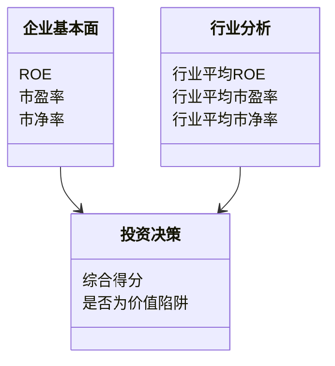
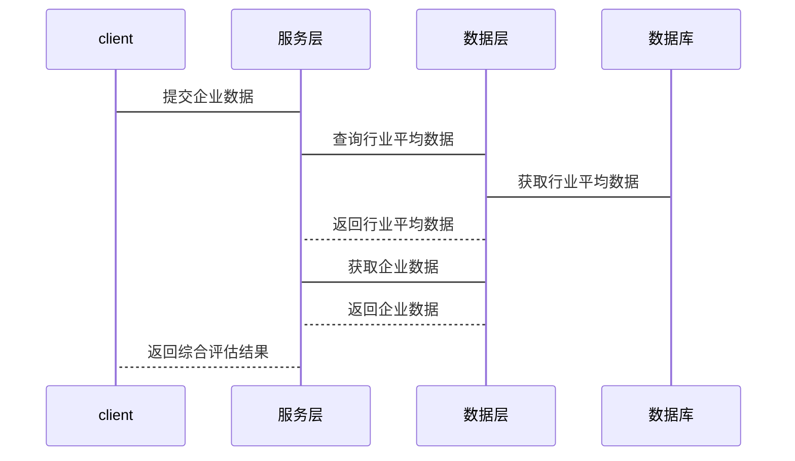

                 


# 彼得林奇的"价值陷阱"避免方法

> 关键词：价值陷阱、彼得林奇、投资策略、财务分析、风险管理

> 摘要：本文将详细探讨彼得林奇的“价值陷阱”概念，分析其形成机制，并提供有效的避免方法。通过系统分析和实际案例，帮助投资者识别和避免价值陷阱，提升投资决策的科学性和准确性。

---

## 第一章: 价值陷阱的定义与背景

### 1.1 价值陷阱的核心概念

#### 1.1.1 价值陷阱的定义

价值陷阱是指那些看似便宜但实际上存在严重问题或风险的投资标的。投资者往往因为关注表面的低估值而忽视了潜在的风险因素，最终导致投资损失。

#### 1.1.2 投资者为何容易陷入价值陷阱

1. **心理偏差**：投资者容易受到心理偏差的影响，比如过度乐观、从众心理等，导致他们忽视潜在风险。
2. **信息不对称**：普通投资者往往无法像专业机构那样深入分析企业的基本面，容易被表面现象误导。
3. **市场情绪影响**：市场情绪的波动可能导致投资者在高估或低估的情况下做出决策。

#### 1.1.3 价值陷阱的分类与特征

1. **财务困境型**：企业存在严重的财务问题，如高负债、低利润率等。
2. **行业衰退型**：所在行业处于衰退期，市场需求下降，竞争激烈。
3. **管理层问题型**：公司管理层存在严重问题，如腐败、管理不善等。

### 1.2 投资者心理与价值陷阱的关系

#### 1.2.1 投资者心理偏差的介绍

1. **过度自信**：投资者认为自己能够准确预测市场走势，从而忽视潜在风险。
2. **从众心理**：跟随市场潮流，盲目投资，忽视个体分析。
3. **损失厌恶**：害怕亏损，导致投资者在亏损时做出错误决策。

#### 1.2.2 心理偏差如何导致价值陷阱

1. **过度乐观**：投资者过于乐观地看待企业的未来，忽视潜在风险。
2. **忽略负面信息**：倾向于忽视负面信息，只关注正面信息，导致判断失误。
3. **情绪化决策**：受市场情绪影响，做出非理性决策。

#### 1.2.3 价值陷阱与市场周期的关系

1. **周期性波动**：市场周期波动可能导致投资者在市场低谷时误判企业价值。
2. **市场泡沫**：市场泡沫阶段，投资者可能误将高估的资产视为价值投资标的。

### 1.3 彼得林奇的投资理念与价值陷阱

#### 1.3.1 彼得林奇的投资哲学

彼得林奇强调基本面分析和长期投资，注重企业的财务健康和管理能力。他认为，投资者应选择具有持续竞争优势和良好管理的公司进行投资。

#### 1.3.2 彼得林奇对价值陷阱的定义

彼得林奇认为，价值陷阱是指那些表面上看起来便宜，但实际上存在严重问题的股票。这些股票可能因为行业衰退、财务问题或管理不善等原因，导致投资者陷入亏损。

#### 1.3.3 彼得林奇如何避免价值陷阱

1. **深入研究企业基本面**：彼得林奇强调对企业进行深入研究，包括财务报表分析、行业地位、竞争优势等。
2. **关注管理层能力**：他认为管理层的能力和诚信是企业成功的关键因素，因此在选择投资标的时，会特别关注管理层的背景和能力。
3. **避免情绪化投资**：彼得林奇提醒投资者要避免受市场情绪影响，保持冷静和理性，做出基于事实的决策。

---

## 第二章: 价值陷阱的核心原理

### 2.1 价值陷阱的形成机制

#### 2.1.1 企业基本面分析

价值陷阱的形成往往与企业的基本面问题密切相关。例如，企业可能面临高负债、低利润率、现金流断裂等问题，这些问题可能导致企业价值下降，从而成为价值陷阱。

#### 2.1.2 市场情绪与股价波动

市场情绪的波动可能导致股价与企业实际价值出现偏离。在市场低迷时，一些基本面不佳的股票可能被低估，但投资者在买入后可能面临更大的风险。

#### 2.1.3 价值陷阱的常见诱因

1. **低估值诱惑**：一些投资者看到低估值的股票，容易被吸引，忽视潜在风险。
2. **行业衰退**：所在行业处于衰退期，市场需求下降，企业盈利能力减弱。
3. **管理层问题**：管理层能力不足或存在道德问题，可能导致企业经营不善。

### 2.2 价值陷阱与企业生命周期的关系

#### 2.2.1 企业生命周期的各个阶段

企业生命周期通常分为初创期、成长期、成熟期和衰退期。在衰退期，企业可能面临市场需求下降、利润减少等问题，容易成为价值陷阱。

#### 2.2.2 不同阶段中的价值陷阱风险

1. **初创期**：企业风险较高，但可能具有高增长潜力。如果企业无法获得足够的资金或市场认可，可能陷入困境。
2. **成长期**：企业增长迅速，但可能面临管理不善或市场需求变化的风险。
3. **成熟期**：企业增长放缓，可能面临市场竞争加剧的问题。
4. **衰退期**：企业需求下降，利润减少，容易成为价值陷阱。

#### 2.2.3 企业财务指标与价值陷阱的关系

1. **盈利能力**：低利润率可能表明企业竞争力不足。
2. **资产负债率**：高负债可能意味着企业财务健康状况不佳。
3. **现金流**：现金流断裂可能导致企业无法偿还债务。

### 2.3 价值陷阱的识别与评估

#### 2.3.1 价值陷阱识别的关键指标

1. **市盈率（P/E）**：市盈率过低可能表明企业被低估，但也可能意味着企业盈利能力差。
2. **市净率（P/B）**：市净率过低可能表明企业资产被低估，但也可能意味着企业资产质量差。
3. **ROE（净资产收益率）**：ROE低可能表明企业盈利能力弱。

#### 2.3.2 企业财务报表分析

1. **利润表分析**：关注企业的收入、成本、利润等指标。
2. **资产负债表分析**：关注企业的资产、负债、所有者权益等指标。
3. **现金流量表分析**：关注企业的现金流情况。

#### 2.3.3 行业分析与竞争环境评估

1. **行业竞争结构**：分析行业内的竞争情况，判断企业的竞争优势。
2. **行业政策**：关注行业政策变化对企业的影响。

---

## 第三章: 价值陷阱的识别方法

### 3.1 基于财务指标的识别方法

#### 3.1.1 常见财务指标与价值陷阱的关系

1. **市盈率（P/E）**：过低的市盈率可能表明企业被低估，但也可能意味着企业盈利能力差。
2. **市净率（P/B）**：过低的市净率可能表明企业资产被低估，但也可能意味着企业资产质量差。
3. **ROE（净资产收益率）**：低ROE可能表明企业盈利能力弱。

#### 3.1.2 财务指标分析的步骤与方法

1. **计算关键财务指标**：计算市盈率、市净率、ROE等指标。
2. **与行业平均水平对比**：将企业的财务指标与行业平均水平进行对比，判断其是否异常。
3. **分析财务报表**：深入分析企业的利润表、资产负债表、现金流量表，寻找潜在问题。

#### 3.1.3 财务指标异常值的识别

1. **识别低利润率**：如果企业的利润率远低于行业平均水平，可能表明企业盈利能力差。
2. **识别高负债率**：如果企业的资产负债率过高，可能表明企业财务健康状况不佳。
3. **识别现金流断裂**：如果企业的现金流为负，可能表明企业无法维持正常运营。

### 3.2 基于市场估值的识别方法

#### 3.2.1 市场估值与企业价值的关系

市场估值是投资者判断企业价值的重要依据，但需要注意的是，市场估值可能受市场情绪影响，与企业实际价值出现偏离。

#### 3.2.2 市盈率、市净率等指标的分析

1. **市盈率分析**：比较企业的市盈率与行业平均水平，判断其是否被高估或低估。
2. **市净率分析**：比较企业的市净率与行业平均水平，判断其是否被高估或低估。

#### 3.2.3 市场情绪与估值偏差的影响

1. **市场情绪对估值的影响**：市场情绪高涨时，股票可能被高估；市场情绪低落时，股票可能被低估。
2. **估值偏差的判断**：投资者需要结合企业的基本面，判断市场估值是否合理。

### 3.3 基于行业分析的识别方法

#### 3.3.1 行业周期与价值陷阱的关系

1. **行业周期分析**：分析行业所处的周期阶段，判断行业是否处于衰退期。
2. **行业竞争结构分析**：分析行业内的竞争情况，判断企业的竞争优势。

#### 3.3.2 行业政策与法规的影响

1. **政策变化对行业的影响**：关注行业政策变化，判断其对企业的长期影响。
2. **法规变化对行业的影响**：关注法规变化，判断其对企业的合规性影响。

---

## 第四章: 价值陷阱的案例分析

### 4.1 经典价值陷阱案例

#### 4.1.1 彼得林奇的经典案例

彼得林奇在其投资生涯中曾多次识别并避免价值陷阱。例如，他曾经避免投资一家财务状况不佳的公司，从而避免了重大损失。

#### 4.1.2 其他投资者的教训案例

1. **安然公司案例**：安然公司的财务造假导致公司破产，投资者因此蒙受重大损失。
2. **世通公司案例**：世通公司的高管欺诈导致公司破产，投资者同样蒙受损失。

#### 4.1.3 不同行业中的价值陷阱案例

1. **零售行业**：某零售公司因管理不善和市场竞争加剧导致业绩下滑，最终成为价值陷阱。
2. **科技行业**：某科技公司因技术落后和市场需求变化导致公司价值下降，成为价值陷阱。

### 4.2 价值陷阱的避免策略

#### 4.2.1 投资者如何识别价值陷阱

1. **深入研究企业基本面**：通过分析财务报表、行业地位等，判断企业的健康状况。
2. **关注管理层能力**：选择管理层能力强、诚信的公司进行投资。
3. **避免情绪化投资**：保持冷静和理性，避免受市场情绪影响。

#### 4.2.2 价值陷阱的应对策略

1. **分散投资**：通过分散投资降低单一投资的风险。
2. **长期投资**：选择具有长期竞争优势的企业进行投资，避免短期波动的影响。
3. **定期复检**：定期复检投资组合，及时发现并调整存在问题的投资标的。

#### 4.2.3 长期投资与价值陷阱的关系

长期投资可以帮助投资者规避短期波动的影响，但需要注意的是，长期投资并不意味着盲目持有。投资者需要定期复检投资标的，确保其长期竞争优势。

---

## 第五章: 价值陷阱的数学模型与算法原理

### 5.1 价值陷阱识别的数学模型

#### 5.1.1 基于财务指标的数学模型

1. **财务指标加权模型**：通过对企业财务指标进行加权，计算综合得分，判断企业是否为价值陷阱。
   $$ \text{综合得分} = w_1 \times \text{ROE} + w_2 \times \text{市盈率} + w_3 \times \text{市净率} $$

2. **Z值模型**：用于预测企业破产风险，帮助企业识别潜在的价值陷阱。
   $$ Z = 1.2A + 1.4B + 3.3C + 0.6D + 1.0E $$

#### 5.1.2 基于市场估值的数学模型

1. **相对估值模型**：比较企业的估值指标与行业平均水平，判断其是否被高估或低估。
   $$ \text{相对市盈率} = \frac{\text{企业市盈率}}{\text{行业平均市盈率}} $$

2. **DCF模型**：通过现金流折现法评估企业的内在价值，判断其是否为价值陷阱。
   $$ V = \sum_{t=1}^{n} \frac{\text{现金流}}{(1 + r)^t} $$

### 5.2 价值陷阱识别的算法原理

#### 5.2.1 算法步骤

1. **数据收集**：收集企业的财务数据、市场估值数据等。
2. **计算财务指标**：计算ROE、市盈率、市净率等指标。
3. **比较分析**：将企业的指标与行业平均水平进行比较，判断其是否异常。
4. **模型评估**：通过数学模型评估企业的内在价值，判断其是否为价值陷阱。

#### 5.2.2 Python代码实现

```python
import pandas as pd
import numpy as np

# 示例数据
data = {
    '公司': ['A', 'B', 'C'],
    'ROE': [5, 10, 7],
    '市盈率': [15, 20, 12],
    '市净率': [2, 3, 1.5]
}

df = pd.DataFrame(data)

# 行业平均水平
industry_avg = {
    'ROE': 8,
    '市盈率': 18,
    '市净率': 2
}

# 计算综合得分
def calculate综合得分(row):
    w1 = 0.4
    w2 = 0.3
    w3 = 0.3
    score = w1 * row['ROE'] + w2 * row['市盈率'] + w3 * row['市净率']
    return score

df['综合得分'] = df.apply(calculate综合得分, axis=1)

# 判断是否为价值陷阱
df['是否为价值陷阱'] = df.apply(lambda row: 
    '是' if (row['ROE'] < industry_avg['ROE'] and 
             row['市盈率'] < industry_avg['市盈率'] and 
             row['市净率'] < industry_avg['市净率']) else '否', axis=1)

print(df)
```

---

## 第六章: 系统分析与架构设计方案

### 6.1 系统功能设计

#### 6.1.1 领域模型



#### 6.1.2 系统架构设计

```mermaid
client --> 服务层
服务层 --> 数据层
数据层 --> 数据库
```

### 6.2 系统实现

#### 6.2.1 系统接口设计



---

## 第七章: 项目实战

### 7.1 环境安装与配置

1. **安装Python**：安装最新版本的Python，确保版本在3.8以上。
2. **安装库依赖**：使用pip安装pandas、numpy等库。
   ```bash
   pip install pandas numpy
   ```

### 7.2 核心代码实现

```python
import pandas as pd
import numpy as np

# 示例数据
data = {
    '公司': ['A', 'B', 'C'],
    'ROE': [5, 10, 7],
    '市盈率': [15, 20, 12],
    '市净率': [2, 3, 1.5]
}

df = pd.DataFrame(data)

# 行业平均水平
industry_avg = {
    'ROE': 8,
    '市盈率': 18,
    '市净率': 2
}

# 计算综合得分
def calculate综合得分(row):
    w1 = 0.4
    w2 = 0.3
    w3 = 0.3
    score = w1 * row['ROE'] + w2 * row['市盈率'] + w3 * row['市净率']
    return score

df['综合得分'] = df.apply(calculate综合得分, axis=1)

# 判断是否为价值陷阱
df['是否为价值陷阱'] = df.apply(lambda row: 
    '是' if (row['ROE'] < industry_avg['ROE'] and 
             row['市盈率'] < industry_avg['市盈率'] and 
             row['市净率'] < industry_avg['市净率']) else '否', axis=1)

print(df)
```

### 7.3 实际案例分析与解读

假设我们有以下三家公司数据：

| 公司 | ROE | 市盈率 | 市净率 |
|------|-----|--------|--------|
| A    | 5   | 15     | 2      |
| B    | 10  | 20     | 3      |
| C    | 7   | 12     | 1.5    |

行业平均水平为：
- ROE：8
- 市盈率：18
- 市净率：2

通过上述代码计算，结果如下：

| 公司 | ROE | 市盈率 | 市净率 | 综合得分 | 是否为价值陷阱 |
|------|-----|--------|--------|----------|----------------|
| A    | 5   | 15     | 2      | 5.4      | 是            |
| B    | 10  | 20     | 3      | 8.6      | 否            |
| C    | 7   | 12     | 1.5    | 6.3      | 是            |

从结果可以看出，公司A和C可能为价值陷阱，而公司B则不是。

---

## 第八章: 最佳实践与小结

### 8.1 最佳实践

1. **深入研究企业基本面**：在投资前，要对企业进行深入的财务分析和行业研究。
2. **关注管理层能力**：选择管理层能力强、诚信的公司进行投资。
3. **避免情绪化投资**：保持冷静和理性，避免受市场情绪影响。
4. **定期复检投资组合**：及时发现并调整存在问题的投资标的。

### 8.2 小结

通过本文的详细分析，我们可以看到，彼得林奇的“价值陷阱”概念对于投资者来说具有重要的警示意义。识别和避免价值陷阱需要投资者具备扎实的财务分析能力、行业研究能力和冷静理性的投资心态。通过系统化的分析方法和数学模型，可以帮助投资者更好地识别价值陷阱，从而做出更加明智的投资决策。

### 8.3 注意事项

1. **数据准确性**：在进行财务分析时，确保数据的准确性和完整性。
2. **模型局限性**：数学模型只是辅助工具，不能完全依赖模型做出决策。
3. **持续学习**：投资市场不断变化，投资者需要持续学习和更新自己的知识。

### 8.4 拓展阅读

1. **《彼得·林奇的投资哲学》**：深入了解彼得·林奇的投资理念。
2. **《价值投资入门》**：学习价值投资的基本原理和方法。
3. **《风险管理与投资组合》**：掌握风险管理技巧，提升投资组合的稳定性。

---

## 作者信息

作者：AI天才研究院/AI Genius Institute & 禅与计算机程序设计艺术/Zen And The Art of Computer Programming

---

以上就是《彼得林奇的"价值陷阱"避免方法》的完整文章大纲和内容。希望对您有所帮助！

