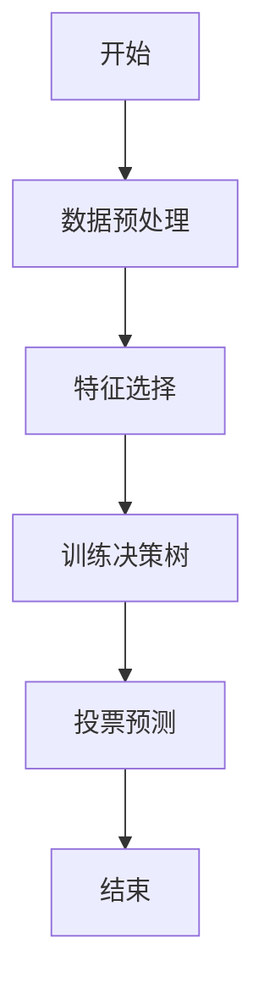
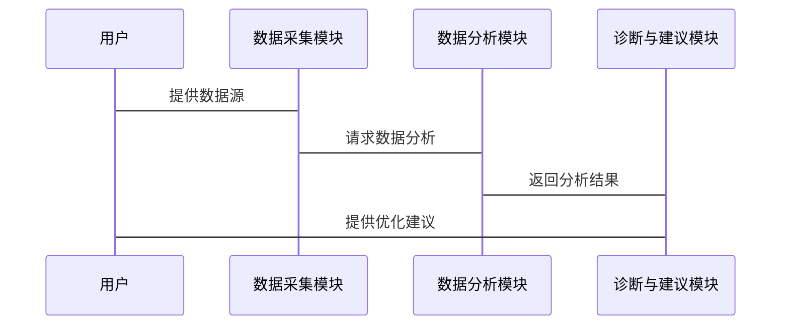

                 


# 智能个人财务健康诊断系统

**关键词**：智能诊断、财务管理、数据分析、人工智能、健康诊断

**摘要**：  
本文详细探讨了智能个人财务健康诊断系统的构建与实现。从背景分析到系统设计，从算法原理到项目实战，系统地介绍了如何利用人工智能技术实现个人财务健康诊断。文章结合理论与实践，深入分析了系统的功能模块、架构设计、算法实现及实际应用场景，为读者提供了全面的技术解读。

---

## 第一部分: 智能个人财务健康诊断系统背景与核心概念

### 第1章: 个人财务健康诊断的背景与问题

#### 1.1 个人财务管理的现状与挑战

##### 1.1.1 当前个人财务管理的主要问题
个人财务管理在现代生活中变得越来越重要。然而，传统财务管理方式存在以下主要问题：
- 数据分散：账单、银行流水、投资记录等数据分布在不同平台，难以统一管理。
- 计算复杂：手动计算收支平衡、预算分配等过程繁琐且容易出错。
- 缺乏预测：无法有效预测未来的财务状况，难以提前规避风险。

##### 1.1.2 传统财务管理工具的局限性
现有财务管理工具主要依赖人工输入和简单的数据统计，难以提供深度分析和智能建议。例如：
- 数据更新滞后：无法实时跟踪收支变化。
- 分析维度单一：仅能提供基本的收支统计，难以进行多维度分析。
- 缺乏个性化建议：无法根据用户的财务状况提供定制化建议。

##### 1.1.3 人工智能在财务管理中的应用潜力
人工智能技术的快速发展为财务管理带来了新的可能性。例如：
- **自动化数据处理**：AI可以自动抓取和整理分散的财务数据。
- **深度数据分析**：通过机器学习算法，可以挖掘数据背后的趋势和规律。
- **智能诊断与建议**：AI可以实时分析财务状况，并提供个性化的优化建议。

#### 1.2 智能财务诊断的需求分析

##### 1.2.1 个人财务健康诊断的核心目标
智能个人财务健康诊断系统的核心目标是：
1. 实时监控用户的财务状况。
2. 分析数据并发现潜在问题。
3. 提供优化建议和风险预警。

##### 1.2.2 用户需求的多样性与复杂性
不同用户的财务状况和需求差异较大：
- **收入来源多样化**：包括工资、投资收益、租金等多种收入。
- **支出类型多样化**：包括日常生活开支、房贷、车贷、教育支出等。
- **目标个性化**：用户可能有不同的财务目标，如资产增值、债务优化、退休规划等。

##### 1.2.3 智能诊断系统的必要性与可行性
智能诊断系统的必要性体现在：
- **高效性**：AI可以快速处理大量数据，提供实时反馈。
- **准确性**：通过机器学习算法，诊断结果更加精准。
- **个性化**：系统可以根据用户需求提供定制化建议。

#### 1.3 本章小结
本章主要介绍了智能个人财务健康诊断系统的背景和需求。通过分析传统财务管理的局限性，提出了利用人工智能技术构建智能诊断系统的重要性，并明确了系统的核心目标和用户需求。

---

## 第2章: 智能个人财务健康诊断系统的概念与框架

#### 2.1 核心概念与定义

##### 2.1.1 智能诊断系统的定义
智能个人财务健康诊断系统是一种基于人工智能技术的财务管理系统，旨在通过实时数据分析，为用户提供个性化的财务诊断和优化建议。

##### 2.1.2 系统的核心功能模块
系统主要包括以下功能模块：
- 数据采集模块：负责收集用户的财务数据。
- 数据分析模块：对数据进行清洗、建模和分析。
- 诊断与建议模块：根据分析结果生成诊断报告和优化建议。

##### 2.1.3 系统的目标用户群体
目标用户包括：
- 个人用户：希望通过系统实现财务管理的个人用户。
- 金融机构：可以利用系统为客户提供智能财务诊断服务。
- 财务顾问：可以借助系统提高工作效率和诊断准确性。

#### 2.2 系统的组成与结构

##### 2.2.1 数据采集模块
数据采集模块负责从多种数据源（如银行账户、支付宝、股票账户等）获取用户的财务数据。以下是数据采集的步骤：
1. **数据源识别**：识别用户授权的财务数据源。
2. **数据获取**：通过API接口获取数据。
3. **数据清洗**：对获取的数据进行去重、格式转换等预处理。

##### 2.2.2 数据分析模块
数据分析模块是系统的核心，主要包括：
1. **数据建模**：利用机器学习算法（如随机森林、支持向量机等）构建诊断模型。
2. **数据分析**：通过聚类分析、回归分析等方法挖掘数据中的规律。
3. **风险评估**：评估用户的财务风险等级。

##### 2.2.3 诊断与建议模块
诊断与建议模块根据分析结果生成诊断报告和优化建议：
1. **诊断报告**：包括收支分析、资产配置分析、风险评估等内容。
2. **优化建议**：根据诊断结果提出具体的优化方案，例如调整投资比例、优化支出结构等。

#### 2.3 系统的边界与外延

##### 2.3.1 系统功能的边界
系统的主要功能不包括：
- **直接投资操作**：系统仅提供投资建议，不进行实际的投资操作。
- **法律咨询**：系统不提供法律建议，用户需结合自身情况咨询专业顾问。

##### 2.3.2 系统与外部系统的交互
系统可能与以下外部系统进行交互：
- **第三方数据源**：如银行、支付宝、股票交易平台等。
- **用户界面**：通过Web或移动端界面与用户交互。
- **外部数据库**：如宏观经济数据、市场趋势数据等。

##### 2.3.3 系统的可扩展性与灵活性
系统设计时充分考虑了可扩展性和灵活性：
- **模块化设计**：各个功能模块相对独立，便于后续扩展。
- **接口标准化**：通过标准化接口与外部系统交互，便于未来接入新的数据源或功能模块。

---

## 第3章: 系统的核心概念与联系

#### 3.1 核心概念的原理与特征

##### 3.1.1 数据采集的准确性与实时性
数据采集的准确性直接影响诊断结果的准确性。系统通过多源数据融合和数据清洗技术，确保数据的准确性和完整性。

##### 3.1.2 数据分析的深度与广度
系统采用多种数据分析方法，从多个维度对用户财务状况进行分析，包括：
- **收支分析**：分析用户的收入来源和支出结构。
- **资产分析**：评估用户的资产配置情况。
- **风险分析**：预测用户的财务风险等级。

##### 3.1.3 诊断建议的个性化与实用性
系统根据用户的个性化需求提供定制化的诊断建议，例如：
- **预算优化建议**：帮助用户制定合理的预算计划。
- **投资建议**：根据市场趋势和用户风险偏好，提供投资建议。

#### 3.2 核心概念的对比分析

##### 3.2.1 不同诊断方法的对比
以下是几种常见的诊断方法对比：

| 方法         | 优点                         | 缺点                         |
|--------------|------------------------------|------------------------------|
| 财务比率分析 | 简单易懂，适用于初步诊断     | 无法深入分析具体问题         |
| 机器学习     | 分析深度高，结果准确         | 对数据质量和数量要求较高     |
| 支持向量机    | 分类能力强                  | 对非线性问题处理能力有限      |

##### 3.2.2 不同数据分析技术的优缺点
以下是几种常见数据分析技术的对比：

| 技术         | 优点                         | 缺点                         |
|--------------|------------------------------|------------------------------|
| 决策树       | 易于解释，适合分类问题       | 对噪声数据敏感               |
| 随机森林     | 高准确性，抗过拟合           | 计算复杂度高                 |
| 支持向量机    | 分类能力强                  | 对非线性问题处理能力有限      |

##### 3.2.3 不同诊断系统的性能对比
以下是几种常见诊断系统的性能对比：

| 系统类型     | 处理速度 | 准确率 | 易用性 |
|--------------|----------|--------|--------|
| 传统系统     | 较慢     | 一般    | 较低    |
| AI诊断系统    | 较快     | 高      | 较高    |

#### 3.3 系统的ER实体关系图
以下是系统的ER实体关系图：

```mermaid
er
  actor: 用户
  system: 智能诊断系统
  financial_data: 财务数据
 诊断报告

  actor --> system: 使用系统
  system --> financial_data: 采集数据
  system --> 诊断报告: 生成报告
```

---

## 第4章: 系统的核心算法与实现

#### 4.1 数据分析与诊断算法

##### 4.1.1 算法选择
系统采用随机森林算法进行分类和回归分析。以下是随机森林算法的流程图：



##### 4.1.2 算法实现
以下是随机森林算法的Python代码实现：

```python
from sklearn.ensemble import RandomForestClassifier

# 数据预处理
X = processed_data
y = labels

# 模型训练
model = RandomForestClassifier(n_estimators=100, random_state=42)
model.fit(X, y)

# 预测
预测结果 = model.predict(X)
```

##### 4.1.3 数学模型与公式
随机森林算法的核心公式如下：
$$
y = \text{argmax}_i \sum_{j=1}^{n} I(y_j = i)
$$

---

## 第5章: 系统分析与架构设计方案

#### 5.1 问题场景介绍

##### 5.1.1 系统功能需求
系统需要实现以下功能：
- 数据采集：从多个数据源采集用户的财务数据。
- 数据分析：利用机器学习算法对数据进行分析。
- 诊断与建议：生成诊断报告并提供优化建议。

##### 5.1.2 系统性能需求
系统需要满足以下性能要求：
- 响应时间：小于5秒。
- 处理能力：支持至少1000个用户同时在线。

#### 5.2 项目介绍

##### 5.2.1 项目目标
本项目旨在开发一个智能个人财务健康诊断系统，利用人工智能技术为用户提供个性化的财务诊断和优化建议。

##### 5.2.2 项目范围
项目范围包括：
- 数据采集模块的设计与实现。
- 数据分析模块的算法实现。
- 诊断与建议模块的界面设计。

#### 5.3 系统功能设计

##### 5.3.1 领域模型
以下是系统的领域模型：


##### 5.3.2 系统架构设计
以下是系统的架构设计：


##### 5.3.3 系统接口设计
系统接口设计如下：
- **数据采集接口**：用于从第三方数据源获取数据。
- **数据分析接口**：用于调用机器学习算法进行分析。
- **诊断报告接口**：用于生成诊断报告并返回给用户。

##### 5.3.4 系统交互设计
以下是系统的交互设计：



---

## 第6章: 项目实战

#### 6.1 环境安装与配置

##### 6.1.1 安装Python
安装Python 3.8或更高版本。

##### 6.1.2 安装相关库
安装以下Python库：
```
pip install pandas scikit-learn requests beautifulsoup4
```

#### 6.2 系统核心实现

##### 6.2.1 数据采集模块实现
以下是数据采集模块的实现代码：

```python
import requests
from bs4 import BeautifulSoup

def get_financial_data(source):
    url = f"{source}/api/data"
    headers = {
        'User-Agent': 'Mozilla/5.0 (Windows NT 10.0; Win64; x64) AppleWebKit/537.36 (KHTML, like Gecko) Chrome/85.0.4183.121 Safari/537.36'
    }
    response = requests.get(url, headers=headers)
    data = response.json()
    return data
```

##### 6.2.2 数据分析模块实现
以下是数据分析模块的实现代码：

```python
from sklearn.ensemble import RandomForestClassifier
import pandas as pd

def analyze_data(data):
    # 数据预处理
    processed_data = pd.DataFrame(data)
    features = processed_data.drop(columns=['label'])
    labels = processed_data['label']
    
    # 模型训练
    model = RandomForestClassifier(n_estimators=100, random_state=42)
    model.fit(features, labels)
    
    return model
```

##### 6.2.3 诊断与建议模块实现
以下是诊断与建议模块的实现代码：

```python
def generate_recommendation(model, new_data):
    # 数据预处理
    processed_data = pd.DataFrame(new_data)
    features = processed_data.drop(columns=['label'])
    
    # 模型预测
    prediction = model.predict(features)
    
    return prediction
```

#### 6.3 实际案例分析与解读

##### 6.3.1 案例背景
假设用户A的财务数据如下：
- 收入：月均3万元
- 支出：每月2万元
- 资产：100万元
- 债务：50万元

##### 6.3.2 系统诊断结果
系统诊断结果如下：
- **收支平衡**：收入大于支出，财务状况良好。
- **资产配置**：资产与债务比例合理。
- **风险评估**：中等风险。

##### 6.3.3 系统优化建议
系统优化建议如下：
1. **增加紧急储备金**：建议预留3-6个月的生活费用。
2. **优化投资比例**：增加股票投资比例至40%。
3. **减少高利贷债务**：优先偿还高利率的债务。

#### 6.4 项目小结
本章通过实际案例分析，展示了系统的实现过程和应用效果。通过代码实现和案例分析，验证了系统的可行性和有效性。

---

## 第7章: 最佳实践与注意事项

#### 7.1 最佳实践

##### 7.1.1 数据隐私保护
系统设计时需注意数据隐私保护，确保用户数据的安全性。

##### 7.1.2 系统优化
定期更新算法模型，提高系统的准确性和效率。

#### 7.2 小结
智能个人财务健康诊断系统的开发和应用需要结合理论与实践，注重系统的可扩展性和灵活性。

#### 7.3 注意事项

##### 7.3.1 数据质量问题
确保数据的准确性和完整性，避免因数据问题影响诊断结果。

##### 7.3.2 系统维护
定期维护系统，确保其正常运行和数据更新。

##### 7.3.3 用户教育
加强对用户的教育，帮助用户理解系统功能和使用方法。

---

## 总结

智能个人财务健康诊断系统的开发和应用，不仅需要技术实现，更需要对用户需求的深入理解。通过本文的详细分析，读者可以全面了解系统的构建过程和实现方法。未来，随着人工智能技术的不断发展，智能财务诊断系统将更加智能化和个性化，为用户提供更高效、更精准的财务管理服务。

---

**作者：AI天才研究院/AI Genius Institute & 禅与计算机程序设计艺术 /Zen And The Art of Computer Programming**

