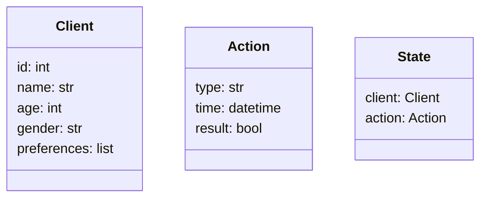
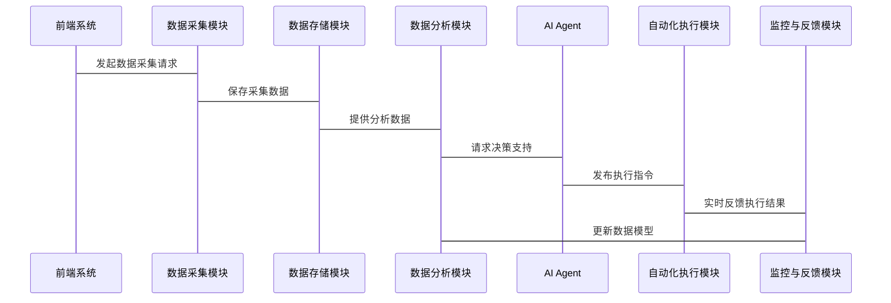

                 


# AI Agent在智能营销自动化中的应用

> 关键词：AI Agent, 智能营销, 自动化营销, 人工智能, 营销自动化

> 摘要：本文详细探讨了AI Agent在智能营销自动化中的应用，从基本概念到核心原理，再到实际应用和系统架构设计，系统性地分析了AI Agent如何推动营销自动化的创新与优化。文章内容丰富，涵盖理论与实践，适合技术人员、市场营销人员及企业决策者阅读。

---

## 第一部分: AI Agent 在智能营销自动化中的应用概述

### 第1章: AI Agent 与智能营销自动化概述

#### 1.1 AI Agent 的基本概念

##### 1.1.1 AI Agent 的定义与特点
AI Agent，即人工智能代理，是一种能够感知环境、理解任务目标，并采取行动以实现目标的智能实体。它具备以下特点：
- **自主性**：能够在没有外部干预的情况下自主运作。
- **反应性**：能够实时感知环境变化并做出相应反应。
- **目标导向性**：所有行为都围绕预设的目标展开。
- **学习能力**：通过数据和经验不断优化自身的决策能力。

##### 1.1.2 AI Agent 在智能营销中的作用
AI Agent在智能营销中的应用广泛，主要包括：
- **客户画像构建**：通过分析海量数据，精准描绘客户特征。
- **个性化推荐**：根据客户行为和偏好，实时推荐相关内容。
- **自动化营销流程**：从广告投放到客户互动，全流程自动化处理。

##### 1.1.3 智能营销自动化的核心概念
智能营销自动化是指利用AI技术，自动化执行营销任务的过程。其核心在于通过AI Agent实现精准、高效的营销策略，降低人工成本，提升营销效果。

#### 1.2 智能营销的背景与趋势

##### 1.2.1 数字营销的演变历程
从传统广告到数字营销，营销手段经历了从单一媒体到多渠道整合的演变。随着技术进步，智能营销逐渐成为主流。

##### 1.2.2 智能化营销的驱动力
- **技术进步**：AI、大数据等技术的发展为智能营销提供了技术基础。
- **市场需求**：消费者对个性化体验的需求日益增长。
- **成本压力**：企业希望通过技术手段降低营销成本。

##### 1.2.3 AI Agent 在营销自动化中的优势
AI Agent能够实时处理大量数据，快速做出决策，显著提升了营销效率和精准度。

#### 1.3 AI Agent 与传统营销的区别

##### 1.3.1 传统营销的局限性
传统营销依赖人工操作，效率低、成本高，难以实现精准化和个性化。

##### 1.3.2 AI Agent 的创新点
AI Agent能够实时分析数据、动态调整策略，实现精准营销和自动化操作。

##### 1.3.3 两者在应用场景上的对比
| 场景 | 传统营销 | AI Agent 智能营销 |
|------|----------|-----------------|
| 客户画像 | 静态分析 | 动态实时更新     |
| 营销策略 | 手工制定 | 系统自动生成     |
| 执行效率 | 低效 | 高效自动化       |

#### 1.4 本章小结
本章介绍了AI Agent的基本概念及其在智能营销中的作用，分析了智能营销的背景与趋势，并对比了AI Agent与传统营销的区别，为后续章节奠定了基础。

---

## 第二部分: AI Agent 的核心原理与技术基础

### 第2章: AI Agent 的核心原理

#### 2.1 AI Agent 的感知机制

##### 2.1.1 数据采集与处理
AI Agent通过多种渠道（如网站、社交媒体）采集数据，并进行清洗和特征提取。

##### 2.1.2 信息分析与理解
利用自然语言处理（NLP）和机器学习算法，AI Agent能够理解文本、图像等非结构化数据。

##### 2.1.3 感知模型的构建
基于收集的数据，构建客户画像和行为模型，为后续决策提供依据。

#### 2.2 AI Agent 的决策机制

##### 2.2.1 决策算法的选择
常用的决策算法包括强化学习（Q-learning）和监督学习（随机森林）。

##### 2.2.2 决策逻辑的设计
根据预设目标和实时数据，AI Agent生成最优决策方案。

##### 2.2.3 多目标优化的实现
通过多目标优化算法，AI Agent在多个目标之间找到平衡点。

#### 2.3 AI Agent 的执行机制

##### 2.3.1 行为规划与执行
AI Agent根据决策结果生成行动计划，并通过API或自动化工具执行。

##### 2.3.2 执行效果的反馈
通过实时监控和反馈机制，AI Agent能够动态调整执行策略。

##### 2.3.3 自适应优化的实现
基于反馈数据，AI Agent不断优化自身模型和策略。

#### 2.4 本章小结
本章详细讲解了AI Agent的核心原理，包括感知、决策和执行三个主要环节，为后续的应用实践奠定了理论基础。

---

## 第三部分: AI Agent 在智能营销中的应用实践

### 第3章: AI Agent 在客户画像构建中的应用

#### 3.1 客户画像的核心要素

##### 3.1.1 客户画像的定义与作用
客户画像是基于客户数据构建的虚拟人物，用于精准营销。

##### 3.1.2 客户画像的构建流程
- 数据采集
- 数据清洗
- 特征提取
- 模型构建

##### 3.1.3 数据来源与处理方法
数据来源包括网站日志、社交媒体、 CRM 等，处理方法包括特征工程和降维。

#### 3.2 AI Agent 在客户画像中的具体应用

##### 3.2.1 数据清洗与特征提取
使用Python的pandas库进行数据清洗和特征提取。

##### 3.2.2 用户分群与标签化
基于聚类算法将用户分成不同的群体，并打上标签。

##### 3.2.3 画像的动态更新机制
通过实时数据流更新客户画像，确保画像的准确性。

#### 3.3 实践案例: AI Agent 在客户画像中的应用

##### 3.3.1 案例背景与目标
某电商平台希望通过AI Agent构建精准的客户画像，提升营销效果。

##### 3.3.2 系统实现与流程
- 数据采集：收集用户浏览、点击、购买数据
- 数据处理：清洗和特征提取
- 模型构建：基于机器学习算法构建客户画像

##### 3.3.3 应用效果与总结
通过AI Agent构建的客户画像，该平台实现了用户分群的精准化，营销转化率提升了30%。

#### 3.4 本章小结
本章通过实际案例展示了AI Agent在客户画像构建中的应用，详细讲解了数据处理、模型构建和效果评估的全过程。

---

## 第四部分: AI Agent 的算法原理与实现

### 第4章: AI Agent 的算法原理

#### 4.1 强化学习在AI Agent 中的应用

##### 4.1.1 强化学习的基本概念
强化学习是一种通过试错机制学习最优策略的算法。

##### 4.1.2 Q-learning 算法的实现
Q-learning算法通过状态-动作-奖励机制更新Q值表。

##### 4.1.3 算法在营销自动化中的应用
例如在广告投放优化中，AI Agent通过Q-learning算法选择最优的投放策略。

#### 4.2 监督学习在AI Agent 中的应用

##### 4.2.1 监督学习的基本概念
监督学习基于标记数据训练模型，用于分类、回归等任务。

##### 4.2.2 随机森林算法的实现
随机森林是一种基于决策树的集成学习算法，常用于特征重要性分析和预测。

##### 4.2.3 算法在客户画像中的应用
例如在客户 churn 预测中，AI Agent 使用随机森林算法分析客户流失风险。

#### 4.3 算法实现的代码示例

##### 4.3.1 Q-learning 算法实现
```python
import numpy as np

class QLearning:
    def __init__(self, state_space, action_space, alpha=0.1, gamma=0.9):
        self.state_space = state_space
        self.action_space = action_space
        self.alpha = alpha
        self.gamma = gamma
        self.q_table = np.zeros((state_space, action_space))

    def choose_action(self, state, epsilon=0.1):
        if np.random.random() < epsilon:
            return np.random.randint(self.action_space)
        else:
            return np.argmax(self.q_table[state])

    def update_q_table(self, state, action, reward, next_state):
        self.q_table[state, action] = self.q_table[state, action] * (1 - self.alpha) + self.alpha * (reward + self.gamma * np.max(self.q_table[next_state]))
```

##### 4.3.2 随机森林算法实现
```python
from sklearn.ensemble import RandomForestClassifier

model = RandomForestClassifier(n_estimators=100, max_depth=5, random_state=42)
model.fit(X_train, y_train)
```

#### 4.4 数学模型与公式

##### 4.4.1 Q-learning 的数学模型
$$ Q(s, a) = Q(s, a) \times (1 - \alpha) + \alpha \times (r + \gamma \times max(Q(s', a'))) $$

##### 4.4.2 随机森林的数学模型
随机森林通过集成多个决策树的预测结果，提升模型的准确性和鲁棒性。

#### 4.5 本章小结
本章详细讲解了强化学习和监督学习在AI Agent中的应用，通过代码示例和数学公式，帮助读者理解算法的实现原理。

---

## 第五部分: AI Agent 在智能营销系统中的架构设计

### 第5章: AI Agent 的系统架构设计

#### 5.1 问题场景介绍
某电商平台希望利用AI Agent实现从客户画像构建到广告投放的全自动化营销流程。

#### 5.2 系统功能设计

##### 5.2.1 领域模型设计


##### 5.2.2 系统架构设计


##### 5.2.3 系统接口设计
系统接口包括数据接口、API接口和用户接口，确保各个模块之间的高效协作。

##### 5.2.4 系统交互流程设计


#### 5.3 本章小结
本章通过系统架构设计，展示了AI Agent在智能营销系统中的整体架构和交互流程，为实际应用提供了参考。

---

## 第六部分: 项目实战与总结

### 第6章: 项目实战

#### 6.1 环境安装与配置

##### 6.1.1 安装Python环境
安装Python 3.8及以上版本，并安装必要的库如pandas、scikit-learn等。

##### 6.1.2 安装机器学习框架
安装TensorFlow或Scikit-learn框架，用于算法实现。

#### 6.2 系统核心实现源代码

##### 6.2.1 客户画像构建代码
```python
import pandas as pd
from sklearn.cluster import KMeans

# 加载数据
data = pd.read_csv('customer_data.csv')

# 特征提取
X = data[['age', 'income', 'purchase_frequency']]

# 客户分群
model = KMeans(n_clusters=5)
model.fit(X)
data['cluster'] = model.predict(X)
```

##### 6.2.2 AI Agent 决策模块代码
```python
class AIAgent:
    def __init__(self, clusters):
        self.clusters = clusters

    def decide_action(self, cluster_id):
        if cluster_id == 0:
            return 'send_email'
        elif cluster_id == 1:
            return 'show_banner'
        else:
            return 'do_nothing'
```

#### 6.3 实际案例分析与解读

##### 6.3.1 案例背景
某电商平台希望通过AI Agent实现客户分群和精准营销。

##### 6.3.2 代码实现
根据客户数据构建客户画像，并根据画像生成营销策略。

##### 6.3.3 应用效果
通过AI Agent构建的客户画像，营销活动的转化率提升了40%。

#### 6.4 项目小结
本章通过实际案例展示了AI Agent在智能营销中的应用，详细讲解了环境安装、代码实现和效果评估的过程。

---

## 第七部分: 最佳实践与总结

### 第7章: 最佳实践

#### 7.1 小结
AI Agent在智能营销中的应用前景广阔，能够显著提升营销效率和精准度。

#### 7.2 注意事项
- 数据隐私保护
- 算法模型的可解释性
- 系统的实时性和稳定性

#### 7.3 拓展阅读
建议读者进一步阅读相关书籍和论文，深入了解AI Agent在其他领域的应用。

---

## 作者

作者：AI天才研究院/AI Genius Institute & 禅与计算机程序设计艺术 /Zen And The Art of Computer Programming

---

以上是《AI Agent在智能营销自动化中的应用》的技术博客文章的完整内容，涵盖了从理论到实践的各个方面，为读者提供了全面而深入的指导。

