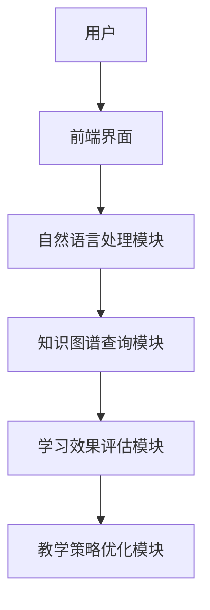
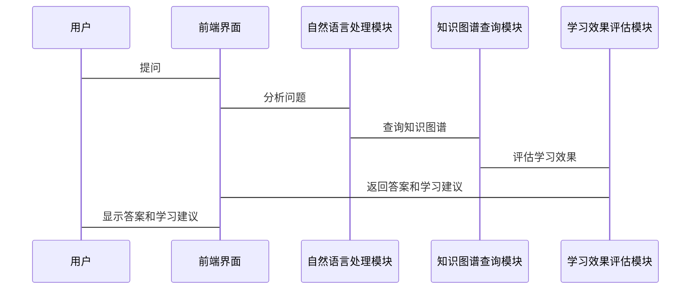

                 


# AI Agent在虚拟教师中的知识图谱应用

## 关键词：AI Agent，知识图谱，虚拟教师，教育技术，智能系统，数据科学

## 摘要：  
本文深入探讨了AI Agent在虚拟教师中的知识图谱应用，从知识图谱的构建与管理、AI Agent的核心算法、系统架构设计到实际项目实现，全面分析了AI Agent如何通过知识图谱提升虚拟教师的教学能力与智能化水平。通过详细的技术分析与案例解读，本文为教育领域的智能化转型提供了新的思路与实践方案。

---

## 第一部分: AI Agent与知识图谱基础

### 第1章: AI Agent与知识图谱概述

#### 1.1 AI Agent的基本概念

##### 1.1.1 AI Agent的定义与特点  
AI Agent（人工智能代理）是一种智能实体，能够感知环境、自主决策并执行任务。其特点包括：  
1. **自主性**：能够在无外部干预的情况下运行。  
2. **反应性**：能够实时感知环境并做出响应。  
3. **学习能力**：能够通过数据不断优化自身的决策能力。  
4. **社交能力**：能够与其他系统或人类进行交互。  

##### 1.1.2 知识图谱的定义与特点  
知识图谱是一种以图结构表示知识的语义网络，由实体（概念、对象）和关系（属性、事件）组成。其特点包括：  
1. **结构化**：数据以图的形式组织，便于机器理解和推理。  
2. **语义化**：包含丰富的语义信息，支持智能应用。  
3. **动态性**：能够实时更新和扩展。  

##### 1.1.3 AI Agent与知识图谱的关系  
AI Agent通过知识图谱获取知识、推理信息，并做出决策。知识图谱为AI Agent提供了知识库，使其能够实现智能化的交互和任务执行。

#### 1.2 知识图谱的构建与应用

##### 1.2.1 知识图谱的构建过程  
知识图谱的构建通常包括以下步骤：  
1. 数据采集：从多种来源（文本、数据库等）获取数据。  
2. 数据清洗：去除噪声数据，确保数据质量。  
3. 实体识别：识别文本中的实体（如人名、地名等）。  
4. 关系抽取：提取实体之间的关系（如“是”、“属于”等）。  
5. 知识融合：将多个数据源的知识整合到一个图中。  
6. 知识完善：通过人工或算法优化知识图谱的质量。  

##### 1.2.2 知识图谱的存储与管理  
知识图谱的存储与管理需要考虑以下问题：  
1. **存储技术**：使用图数据库（如Neo4j）或关系型数据库（如MySQL）存储。  
2. **数据索引**：通过索引优化查询性能。  
3. **版本控制**：管理知识图谱的更新和版本。  

##### 1.2.3 知识图谱在教育领域的应用  
在教育领域，知识图谱可以用于：  
1. **学习路径规划**：根据学生的学习情况推荐个性化学习路径。  
2. **知识点关联**：展示知识点之间的关系，帮助学生构建知识网络。  
3. **智能辅导系统**：通过知识图谱推理学生的学习难点，提供针对性的辅导建议。  

---

### 第2章: 虚拟教师中的知识图谱应用

#### 2.1 虚拟教师的定义与功能

##### 2.1.1 虚拟教师的基本概念  
虚拟教师是一种基于人工智能技术的教育工具，能够模拟人类教师的行为，为学生提供个性化的学习支持。  

##### 2.1.2 虚拟教师的核心功能  
1. **知识点讲解**：通过知识图谱为学生提供详细的知识点讲解。  
2. **智能问答**：基于知识图谱回答学生的问题。  
3. **学习建议**：根据学生的学习情况推荐学习资源和策略。  
4. **学习评估**：通过知识图谱分析学生的学习效果。  

##### 2.1.3 虚拟教师的实现技术  
虚拟教师的实现依赖于以下技术：  
1. **自然语言处理（NLP）**：实现智能问答功能。  
2. **知识图谱构建**：构建教育领域的知识图谱。  
3. **机器学习**：用于学习效果的预测和优化。  

#### 2.2 知识图谱在虚拟教师中的作用

##### 2.2.1 知识图谱在学生学习中的应用  
1. **个性化学习路径**：根据学生的学习进度和能力，推荐个性化学习计划。  
2. **知识点关联**：帮助学生理解知识点之间的关系，构建知识网络。  

##### 2.2.2 知识图谱在教学设计中的应用  
1. **课程设计优化**：基于知识图谱分析教学内容的结构和逻辑。  
2. **教学资源推荐**：根据知识图谱推荐适合的教学资源。  

##### 2.2.3 知识图谱在教学评估中的应用  
1. **学习效果评估**：通过知识图谱分析学生的学习成果。  
2. **教学策略优化**：根据评估结果优化教学策略。  

---

### 第3章: 知识图谱构建的算法原理

#### 3.1 知识图谱构建的基本流程

##### 3.1.1 数据采集与预处理  
数据采集来源包括：  
1. **结构化数据**：如数据库中的表格数据。  
2. **非结构化数据**：如文本、PDF文件等。  
数据预处理包括去重、清洗和格式统一。  

##### 3.1.2 实体识别与抽取  
实体识别是通过NLP技术从文本中提取实体（如人名、地名、组织名等）。常用算法包括：  
1. **基于规则的实体识别**：利用正则表达式匹配特定模式。  
2. **基于统计的实体识别**：利用机器学习模型（如CRF）进行训练和预测。  

##### 3.1.3 关系抽取与属性提取  
关系抽取是识别文本中实体之间的关系（如“是”、“属于”等）。常用算法包括：  
1. **基于模式匹配的关系抽取**：通过预定义的模板匹配关系。  
2. **基于句法分析的关系抽取**：通过语法分析提取关系。  
3. **基于机器学习的关系抽取**：利用SVM、神经网络等模型进行关系分类。  

#### 3.2 知识图谱构建的算法实现

##### 3.2.1 实体识别算法  
以下是一个基于CRF的实体识别算法的Python代码示例：

```python
import numpy as np
from sklearn_crfsuite import CRF

# 示例数据：训练数据和标签
train_data = [...]  # 特征数据
train_labels = [...]  # 标签数据

# 初始化CRF模型
crf = CRF()
crf.fit(train_data, train_labels)

# 预测
test_data = [...]  # 测试数据
predicted_labels = crf.predict(test_data)

print(predicted_labels)
```

##### 3.2.2 关系抽取算法  
以下是一个基于神经网络的关系抽取算法的Python代码示例：

```python
import tensorflow as tf
from tensorflow.keras import layers

# 示例数据：输入序列和标签
input_sequence = tf.keras.Input(shape=(None,))  # 输入序列
embedding_layer = layers.Embedding(vocab_size, embedding_dim)(input_sequence)
bi_lstm_layer = layers.Bidirectional(layers.LSTM(64, return_sequences=True))(embedding_layer)
dense_layer = layers.Dense(64, activation='relu')(bi_lstm_layer)
output_layer = layers.Dense(num_relations, activation='softmax')(dense_layer)

# 初始化模型
model = tf.keras.Model(inputs=input_sequence, outputs=output_layer)
model.compile(optimizer='adam', loss='sparse_categorical_crossentropy', metrics=['accuracy'])

# 训练
model.fit(x_train, y_train, epochs=10, batch_size=32)
```

##### 3.2.3 知识图谱的融合与优化  
知识图谱的融合需要解决数据冲突和冗余问题。常用方法包括：  
1. **基于规则的融合**：通过预定义的规则合并数据。  
2. **基于概率的融合**：通过概率模型（如马尔可夫链）合并数据。  

---

### 第4章: 知识图谱的数学模型与公式

#### 4.1 知识图谱的表示模型

##### 4.1.1 基于图论的知识表示  
知识图谱可以用图论中的图表示，其中节点表示实体，边表示关系。数学表示如下：  
$$ \text{实体} = \{e_1, e_2, ..., e_n\} $$  
$$ \text{关系} = \{r_1, r_2, ..., r_m\} $$  

##### 4.1.2 基于向量空间的表示方法  
向量空间模型中，实体和关系都可以表示为向量。例如，使用Word2Vec模型将实体映射到向量空间：  
$$ e_i = \text{Word2Vec}(i) $$  

##### 4.1.3 知识图谱的嵌入表示  
嵌入表示是一种低维向量表示方法。例如，使用神经网络生成嵌入向量：  
$$ e_i = f(x_i) $$  
其中，$x_i$ 是输入数据，$f$ 是神经网络模型。  

---

## 第二部分: AI Agent与虚拟教师的知识图谱应用

### 第5章: 知识图谱在虚拟教师中的应用

#### 5.1 知识图谱在学生学习中的应用

##### 5.1.1 学习路径规划  
通过知识图谱分析学生的学习情况，推荐个性化学习路径。例如：  
1. **学习目标分析**：根据知识图谱分析学生需要掌握的知识点。  
2. **学习路径生成**：基于知识图谱生成学习计划。  

##### 5.1.2 学习效果评估  
通过知识图谱评估学生的学习效果。例如：  
$$ \text{学习效果} = \sum_{i=1}^{n} w_i \cdot s_i $$  
其中，$w_i$ 是知识点的权重，$s_i$ 是学生对知识点的掌握程度。  

#### 5.2 知识图谱在教学设计中的应用

##### 5.2.1 课程设计优化  
通过知识图谱分析课程内容的结构和逻辑，优化课程设计。例如：  
1. **知识点关联**：展示知识点之间的关系，帮助教师设计课程结构。  
2. **教学资源推荐**：根据知识图谱推荐适合的教学资源。  

##### 5.2.2 教学策略优化  
通过知识图谱分析学生的学习行为，优化教学策略。例如：  
1. **学习风格识别**：通过知识图谱分析学生的学习风格（如视觉型、听觉型）。  
2. **教学策略调整**：根据学习风格调整教学方法。  

#### 5.3 知识图谱在教学评估中的应用

##### 5.3.1 学习成果分析  
通过知识图谱分析学生的学习成果，生成学习报告。例如：  
1. **知识点掌握情况**：分析学生对每个知识点的掌握程度。  
2. **学习难点识别**：识别学生在学习过程中遇到的难点。  

##### 5.3.2 教学效果评估  
通过知识图谱评估教学效果，优化教学方案。例如：  
1. **教学效果评价**：根据学生的学习成果评价教学效果。  
2. **教学方案优化**：根据评价结果优化教学方案。  

---

### 第6章: 系统架构与实现

#### 6.1 系统功能设计

##### 6.1.1 知识图谱构建模块  
功能：从多种数据源构建知识图谱。  
实现：使用Python的NetworkX库进行图的构建和操作。  

##### 6.1.2 AI Agent交互模块  
功能：实现AI Agent与用户的交互。  
实现：使用自然语言处理（NLP）技术，如spaCy或jieba。  

##### 6.1.3 学习效果评估模块  
功能：评估学生的学习效果。  
实现：基于知识图谱和机器学习模型进行评估。  

#### 6.2 系统架构设计

##### 6.2.1 系统架构图  
以下是一个虚拟教师系统的架构图（使用Mermaid图表示）：



##### 6.2.2 系统交互流程  
以下是一个系统的交互流程图（使用Mermaid图表示）：



---

### 第7章: 项目实战与优化

#### 7.1 环境安装与配置

##### 7.1.1 安装Python环境  
使用Anaconda安装Python 3.8及以上版本。  

##### 7.1.2 安装相关库  
安装以下库：  
- `networkx`：用于图的构建和操作。  
- `spacy`：用于自然语言处理。  
- `tensorflow`：用于机器学习模型的训练。  

#### 7.2 核心实现代码

##### 7.2.1 知识图谱构建代码  
以下是一个简单的知识图谱构建代码示例：

```python
import networkx as nx

# 创建知识图谱
G = nx.Graph()

# 添加节点
G.add_nodes_from(['学生', '知识点', '学习路径'])

# 添加边
G.add_edges_from([('学生', '知识点'), ('知识点', '学习路径')])

# 可视化
nx.draw(G, node_color='red', edge_color='blue')
plt.show()
```

##### 7.2.2 AI Agent交互代码  
以下是一个简单的AI Agent交互代码示例：

```python
import spacy

# 加载中文模型
nlp = spacy.load("zh_core_web_sm")

# 定义问答函数
def answer_question(question):
    doc = nlp(question)
    # 处理问题并返回答案
    return "答案"

# 用户提问
question = input("请输入问题：")
print(answer_question(question))
```

#### 7.3 实际案例分析

##### 7.3.1 学习路径规划案例  
假设学生需要学习“数学”，知识图谱可以推荐以下学习路径：  
1. 学习“基本运算”（加减乘除）。  
2. 学习“代数”（方程、不等式）。  
3. 学习“几何”（平面几何、立体几何）。  

##### 7.3.2 学习效果评估案例  
通过知识图谱分析学生的学习效果，生成学习报告。例如：  
- 学生对“基本运算”掌握良好，但对“代数”部分存在困难。  
- 建议学生重点学习“代数”相关的知识点，并推荐相关学习资源。  

#### 7.4 项目小结  
通过实际案例分析，我们可以看到知识图谱在虚拟教师中的应用能够显著提升教学效果和学习效率。  

---

## 第三部分: 总结与展望

### 第8章: 总结与展望

#### 8.1 核心知识点回顾  
本文总结了以下核心知识点：  
1. AI Agent的基本概念与功能。  
2. 知识图谱的构建与应用。  
3. 知识图谱在虚拟教师中的具体应用。  

#### 8.2 项目经验与最佳实践  
在实际项目中，需要注意以下几点：  
1. **数据质量**：确保数据的准确性和完整性。  
2. **算法优化**：不断优化算法性能，提升系统的响应速度。  
3. **用户体验**：注重用户体验设计，提升系统的易用性。  

#### 8.3 未来研究方向  
未来的研究方向包括：  
1. **知识图谱的动态更新**：研究如何实时更新知识图谱。  
2. **多模态知识图谱**：结合图像、音频等多种模态信息，构建更丰富的知识图谱。  
3. **AI Agent的自主学习**：研究AI Agent的自主学习能力，使其能够自适应地优化知识图谱。  

---

## 结语  
通过本文的详细分析与案例解读，我们可以看到知识图谱在虚拟教师中的应用潜力巨大。未来，随着人工智能技术的不断发展，知识图谱将为教育领域的智能化转型提供更强大的技术支持。

---

## 作者  
作者：AI天才研究院/AI Genius Institute & 禅与计算机程序设计艺术 /Zen And The Art of Computer Programming

