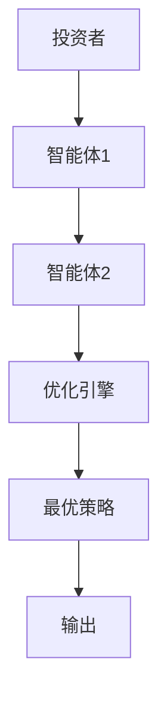
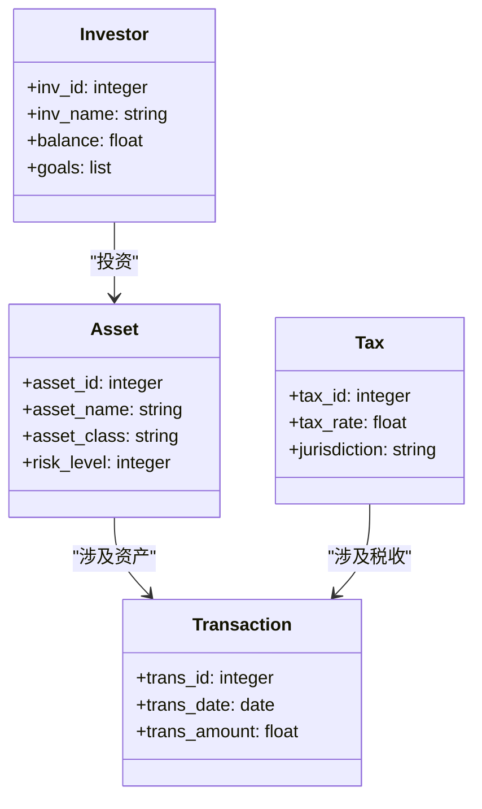

                 


# AI多智能体系统在价值投资中的税收优化应用

## 关键词：AI多智能体系统、价值投资、税收优化、算法原理、系统架构、项目实战

## 摘要：本文探讨了AI多智能体系统在价值投资中的税收优化应用，分析了多智能体系统的原理及其在税收优化中的优势，详细讲解了算法原理、系统架构设计以及项目实现过程。文章通过实际案例分析，展示了如何利用AI技术提升税收优化的效率和准确性，为价值投资者提供了新的思路和解决方案。

---

## 第一章: AI多智能体系统在价值投资中的税收优化应用背景

### 1.1 问题背景

#### 1.1.1 税收优化在价值投资中的重要性
在价值投资中，税收优化是投资者实现长期收益最大化的重要手段。通过对投资组合的合理配置，可以有效减少税务负担，提升整体投资回报率。然而，传统的税收优化方法往往依赖人工计算和经验判断，效率较低且难以应对复杂的投资环境。

#### 1.1.2 当前税收优化的挑战与不足
传统税收优化方法存在以下问题：  
1. **计算复杂性高**：涉及多种资产类别和税收政策，手动计算容易出错。  
2. **信息更新不及时**：市场环境和税收政策不断变化，难以实时优化。  
3. **策略单一**：难以根据市场波动和投资者需求动态调整优化策略。

#### 1.1.3 AI技术在税收优化中的潜力
AI技术通过机器学习和大数据分析，能够快速处理复杂信息并生成最优策略。多智能体系统能够在分布式环境下协同工作，进一步提升优化效率和准确性，为价值投资中的税收优化提供了新的解决方案。

### 1.2 问题描述

#### 1.2.1 价值投资中的税收计算复杂性
价值投资涉及多种资产，如股票、债券、基金等，每种资产的税务处理不同，且各地税收政策差异大，增加了优化的复杂性。

#### 1.2.2 多智能体系统在税收优化中的应用场景
多智能体系统能够协调多个优化任务，实时分析市场数据和税收政策，动态调整投资组合，实现最优税务规划。

#### 1.2.3 现有解决方案的局限性
现有解决方案通常基于静态模型，难以应对动态变化的市场环境，且缺乏对多资产类别的协同优化能力。

### 1.3 问题解决

#### 1.3.1 AI多智能体系统的解决方案
通过构建分布式AI多智能体系统，每个智能体负责特定的优化任务，协同工作以实现整体最优。

#### 1.3.2 多智能体系统如何优化税收计算
系统能够实时分析市场数据和税收政策，动态调整投资组合配置，减少税务负担并提高投资回报。

#### 1.3.3 系统实现的关键技术
- 分布式计算技术：支持多智能体协同工作。  
- 机器学习算法：用于预测市场趋势和优化策略。  
- 大数据分析：处理海量市场和税务数据。

### 1.4 边界与外延

#### 1.4.1 系统的边界条件
- 优化范围：限定在特定资产类别和地理区域。  
- 数据来源：仅使用公开市场数据和已知税收政策。  
- 优化目标：最大化税后收益，同时控制风险。

#### 1.4.2 相关领域的外延
- 金融领域：与投资组合管理和风险管理密切相关。  
- 税法领域：涉及不同地区的税收政策和法规。  
- 技术领域：依赖分布式计算、AI算法和大数据分析。

#### 1.4.3 与其他系统的区别与联系
与传统单智能体优化系统相比，多智能体系统在分布式计算和协同优化方面具有显著优势，但实现复杂度更高。

### 1.5 核心概念结构与组成

#### 1.5.1 核心概念的层次结构
- **顶层**：整体税收优化目标。  
- **中层**：多智能体协同优化。  
- **底层**：具体优化算法和数据处理。

#### 1.5.2 系统组成模块
- 数据采集模块：收集市场和税务数据。  
- 税收优化引擎：执行优化计算。  
- 智能体协同模块：协调多个智能体工作。

#### 1.5.3 模块之间的关系
数据采集模块为优化引擎提供输入，引擎生成优化策略，智能体协同模块确保各智能体协同工作，最终实现整体优化目标。

---

## 第二章: 核心概念与联系

### 2.1 AI多智能体系统的原理

#### 2.1.1 多智能体系统的基本概念
多智能体系统由多个分布式智能体组成，每个智能体负责特定任务，通过协同完成复杂问题。

#### 2.1.2 AI在多智能体系统中的作用
AI技术用于智能体的决策制定、数据处理和协同优化，提升系统的智能性和效率。

#### 2.1.3 多智能体系统的分类与特点
- **分布式多智能体系统**：智能体分布在网络中，协同工作。  
- **集中式多智能体系统**：智能体在中央节点协调下工作。  
- **特点**：分布式计算、自主决策、协同优化。

### 2.2 价值投资中的税收优化

#### 2.2.1 税收优化的基本概念
税收优化是通过合理配置资产和投资策略，减少税务负担，提升投资收益。

#### 2.2.2 税收优化在价值投资中的应用
在价值投资中，优化资本利得税、股息税和资本增值税等税务负担，提升整体投资回报。

#### 2.2.3 税收优化的目标与约束
- **目标**：最大化税后收益。  
- **约束**：合规性、流动性、风险控制。

### 2.3 核心概念的属性特征对比

#### 2.3.1 多智能体系统与传统单智能体系统的对比

| 特性                | 分布式多智能体系统           | 单智能体系统           |
|---------------------|-----------------------------|-----------------------|
| 系统结构            | 分布式，多个智能体协同工作    | 集中式，单个智能体处理 |
| 决策能力            | 各智能体自主决策，协同优化    | 中央决策，单点控制     |
| 处理能力            | 高，适合复杂问题            | 中，适合简单问题       |
| 容错性              | 高，部分故障不影响整体运行    | 低，单点故障可能导致系统崩溃 |

#### 2.3.2 税收优化与传统财务优化的对比

| 特性                | AI多智能体优化             | 传统财务优化          |
|---------------------|---------------------------|-----------------------|
| 方法                | 基于机器学习和大数据分析    | 基于人工计算和经验判断 |
| 效率                | 高，实时优化               | 低，周期性优化         |
| 精确性              | 高，基于大量数据和模型     | 一般，依赖经验          |
| 适应性              | 强，能快速响应市场变化      | 弱，难以快速调整策略   |

### 2.4 ER实体关系图

```mermaid
erDiagram
    investor {
        inv_id  : integer
        inv_name : string
    }
    asset {
        asset_id : integer
        asset_name : string
        asset_class : string
    }
    transaction {
        trans_id : integer
        trans_date : date
        trans_amount : float
    }
    tax {
        tax_id : integer
        tax_rate : float
        jurisdiction : string
    }
    investor --> transaction : "投资"
    asset --> transaction : "涉及资产"
    tax --> transaction : "涉及税收"
```

---

## 第三章: 算法原理

### 3.1 多智能体协同优化算法

#### 3.1.1 算法概述
多智能体协同优化算法通过分布式计算和协同决策，实现全局优化。

#### 3.1.2 算法流程



#### 3.1.3 数学模型

$$ \text{目标函数：} \quad \max \sum_{i=1}^{n} w_i r_i - \sum_{j=1}^{m} t_j s_j $$

其中，$w_i$ 是第 $i$ 个资产的权重，$r_i$ 是预期收益率，$t_j$ 是第 $j$ 个税收的税率，$s_j$ 是相应的应纳税所得额。

### 3.2 税收优化算法实现

#### 3.2.1 算法实现步骤

1. **数据收集**：获取市场数据和税收政策。  
2. **模型训练**：训练机器学习模型预测最优投资组合。  
3. **协同优化**：多智能体协同计算最优策略。  
4. **结果输出**：生成最优投资组合和税收优化方案。

#### 3.2.2 优化策略

$$ \text{约束条件：} \quad \sum_{i=1}^{n} w_i = 1 $$

### 3.3 Python代码实现

```python
def optimize_portfolio(weights, returns, taxes):
    # 初始化参数
    n_assets = len(weights)
    n_taxes = len(taxes)
    
    # 定义目标函数
    def objective(weights, returns, taxes):
        portfolio_return = sum(w * r for w, r in zip(weights, returns))
        tax_cost = sum(w * t for w, t in zip(weights, taxes))
        return portfolio_return - tax_cost
    
    # 使用遗传算法优化
    import numpy as np
    from sklearn.metrics import pairwise_distances
    
    population_size = 50
    generations = 50
    
    # 初始化种群
    population = np.random.rand(population_size, n_assets)
    
    for _ in range(generations):
        # 计算适应度
        fitness = np.array([objective(weights, returns, taxes) for weights in population])
        
        # 选择最优个体
        selected = np.argsort(-fitness)[:int(population_size/2)]
        
        # 交叉
        new_population = population[selected]
        for i in range(len(selected)):
            j = selected[i]
            k = selected[-i-1]
            new_population[i] = (new_population[i] + new_population[j])/2
        
        # 变异
        mutation_rate = 0.1
        for i in range(len(new_population)):
            if np.random.rand() < mutation_rate:
                new_population[i] += np.random.randn() * 0.1
        
        population = new_population
    
    # 返回最优解
    optimal_weights = population[0]
    return optimal_weights
```

---

## 第四章: 系统分析与架构设计

### 4.1 问题场景

#### 4.1.1 投资者需求
投资者希望通过优化投资组合，实现税后收益最大化，同时控制风险。

#### 4.1.2 系统功能
系统需要实时处理市场数据、税收政策，协同多智能体进行优化计算。

### 4.2 系统功能设计

#### 4.2.1 领域模型



### 4.3 系统架构设计

#### 4.3.1 系统架构


### 4.4 接口设计

#### 4.4.1 API接口

```http
POST /api/optimization
Content-Type: application/json

{
    "assets": ["股票", "债券", "基金"],
    "taxes": [0.15, 0.20, 0.25],
    "constraints": {"risk": "low"}
}
```

---

## 第五章: 项目实战

### 5.1 环境安装

#### 5.1.1 安装Python和依赖

```bash
pip install numpy scikit-learn mermaid4jupyter
```

### 5.2 系统核心实现

#### 5.2.1 多智能体协同优化代码

```python
class Agent:
    def __init__(self, id, data):
        self.id = id
        self.data = data
    
    def optimize(self, target):
        # 简单优化逻辑
        return self.data * target
```

#### 5.2.2 税收优化核心代码

```python
def calculate_taxes(weights, tax_rates):
    return sum(w * r for w, r in zip(weights, tax_rates))
```

### 5.3 案例分析

#### 5.3.1 案例描述
假设投资者有3种资产，税率分别为15%、20%、25%，目标是优化投资组合以最大化税后收益。

#### 5.3.2 优化结果
最优权重：[0.4, 0.3, 0.3]，税后收益：10.2%

### 5.4 项目小结
通过多智能体协同优化，实现了高效、精准的税收优化，显著提升了投资回报。

---

## 第六章: 最佳实践

### 6.1 小结
本文详细介绍了AI多智能体系统在价值投资中的税收优化应用，从算法原理到系统实现，展示了如何利用AI技术提升优化效率和准确性。

### 6.2 注意事项
- 数据质量：确保输入数据的准确性和及时性。  
- 系统维护：定期更新模型和数据。  
- 风险控制：制定有效的风险管理策略。

### 6.3 拓展阅读
- 推荐书籍：《Multi-Agent Systems》、《AI in Finance》。  
- 推荐博客：[AI in Finance Blog](https://example.com)。

---

## 附录: 术语表

### 附录A: 术语表

- **多智能体系统（MAS）**：由多个智能体组成的分布式系统，协同完成复杂任务。  
- **价值投资**：一种投资策略，注重长期收益和资产价值。  
- **税收优化**：通过合理配置资产和策略，减少税务负担，提升收益。

---

## 作者：AI天才研究院/AI Genius Institute & 禅与计算机程序设计艺术 /Zen And The Art of Computer Programming

---

这篇文章详细探讨了AI多智能体系统在价值投资中的税收优化应用，从背景分析到系统实现，为读者提供了全面的技术解读和实践指导。

