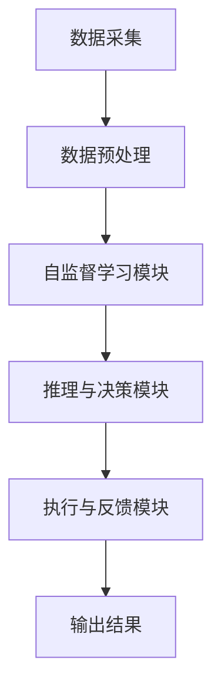
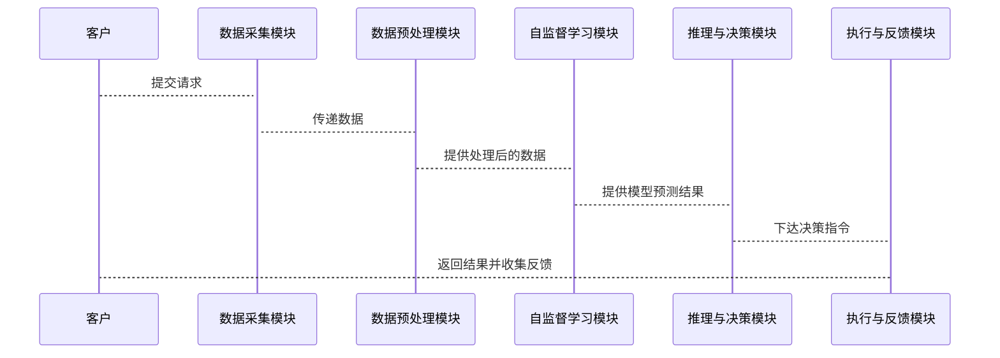

                 


# 企业AI Agent的自监督学习在非标准数据利用中的突破性实践

## 关键词：自监督学习，AI Agent，非标准数据，企业智能化，人工智能

## 摘要：  
本文深入探讨了自监督学习在企业AI Agent中的应用，特别是如何在非标准数据利用方面实现突破性实践。文章首先分析了企业数据利用的现状与痛点，详细阐述了自监督学习的核心概念与算法原理。接着，通过系统架构设计与项目实战，展示了如何将自监督学习应用于实际的企业场景中。最后，总结了自监督学习在非标准数据处理中的优势，并展望了未来的发展方向。

---

# 第一部分：企业AI Agent的自监督学习基础

## 第1章：问题背景与概念解析

### 1.1 问题背景与挑战

#### 1.1.1 企业数据利用的现状与痛点
企业数据的多样性和复杂性使得传统监督学习方法在处理非标准数据时面临诸多挑战。非标准数据（如文本、图像、音频等）通常缺乏明确的标签或结构，导致数据利用率低，模型训练效率低下。此外，企业数据往往分布不均衡，标注成本高，且难以快速适应动态变化的业务需求。

#### 1.1.2 非标准数据的定义与特点
非标准数据是指未经处理的原始数据，通常不具备明确的标签或结构。其特点包括：
- **多样性**：涵盖文本、图像、音频等多种形式。
- **不完整性**：数据可能存在缺失或噪声。
- **动态性**：数据分布可能随时间变化。

#### 1.1.3 自监督学习的必要性与优势
自监督学习通过利用数据本身的结构进行学习，无需外部标注，特别适合处理非标准数据。其优势包括：
- **降低标注成本**：减少对人工标注的依赖。
- **提高模型泛化能力**：通过数据内部关系学习，增强模型的鲁棒性。
- **适应动态变化**：能够快速调整模型以适应新的数据分布。

### 1.2 企业AI Agent的核心概念

#### 1.2.1 AI Agent的基本定义与功能
AI Agent是一种能够感知环境、执行任务并做出决策的智能体。其核心功能包括：
- **感知**：通过传感器或数据接口获取环境信息。
- **推理**：基于获取的信息进行分析和推理。
- **决策**：根据推理结果做出最优决策。
- **执行**：通过执行机构完成任务。

#### 1.2.2 自监督学习的原理与特点
自监督学习是一种无监督学习方法，通过构建 pretext任务（ pretext task）来学习数据的表示。其特点包括：
- **自适应性**：能够根据数据内部结构自动调整学习策略。
- **可解释性**：通过构建任务目标，模型行为更加透明。
- **高效性**：相比监督学习，标注成本大幅降低。

#### 1.2.3 非标准数据在企业中的应用场景
非标准数据在企业中的应用场景包括：
- **客户行为分析**：通过分析客户行为数据，优化营销策略。
- **设备状态监测**：利用设备运行数据，预测设备故障。
- **文本情感分析**：分析客户反馈，改进产品和服务。

### 1.3 问题解决路径与目标

#### 1.3.1 自监督学习在非标准数据处理中的作用
自监督学习通过构建 pretext任务，能够有效提取非标准数据中的有用信息，降低对标注的依赖。

#### 1.3.2 企业AI Agent的目标与价值
企业AI Agent的目标是通过智能化手段，提高企业运营效率、降低成本，并增强决策的准确性。其价值体现在：
- **提升效率**：自动化处理大量非结构化数据。
- **降低成本**：减少人工干预和标注成本。
- **增强决策**：通过数据分析提供更精准的决策支持。

#### 1.3.3 本章小结
本章从企业数据利用的现状出发，分析了非标准数据的定义与特点，阐述了自监督学习的核心概念与优势，并明确了企业AI Agent的目标与价值。

---

## 第2章：核心概念与原理

### 2.1 自监督学习的原理

#### 2.1.1 自监督学习的定义与特点
自监督学习是一种通过构建 pretext任务来学习数据表示的方法。其特点包括：
- **无监督学习**：无需外部标注。
- **任务驱动**：通过解决 pretext任务，模型自动学习数据的结构。

#### 2.1.2 自监督学习的核心机制
自监督学习的核心机制包括：
- **任务构建**：设计 pretext任务，如图像重建、文本预测等。
- **对比学习**：通过对比不同数据的表示，增强模型的区分能力。

#### 2.1.3 自监督学习与监督学习的对比
| 特性                | 监督学习          | 自监督学习        |
|---------------------|------------------|------------------|
| 数据需求            | 需要标注数据      | 无需标注数据      |
| 训练效率            | 低               | 高               |
| 模型泛化能力        | 一般             | 强               |

### 2.2 AI Agent的体系结构

#### 2.2.1 AI Agent的组成模块
AI Agent的体系结构通常包括以下几个模块：
- **感知模块**：负责获取环境信息。
- **推理模块**：对获取的信息进行分析和推理。
- **决策模块**：基于推理结果做出决策。
- **执行模块**：通过执行机构完成任务。

#### 2.2.2 自监督学习模块的作用
自监督学习模块在AI Agent中的作用是通过构建 pretext任务，提取数据中的有用特征，提升模型的表示能力。

#### 2.2.3 企业AI Agent的系统架构
企业AI Agent的系统架构通常包括以下几个部分：
- **数据采集模块**：负责采集企业内外部数据。
- **数据预处理模块**：对数据进行清洗和转换。
- **自监督学习模块**：通过 pretext任务学习数据的表示。
- **推理与决策模块**：基于学习到的表示进行推理和决策。
- **执行与反馈模块**：根据决策结果执行任务，并收集反馈信息。

### 2.3 非标准数据的特征与处理

#### 2.3.1 非标准数据的定义与分类
非标准数据可以根据其类型分为以下几类：
- **文本数据**：如客户反馈、日志信息等。
- **图像数据**：如产品图片、监控视频等。
- **音频数据**：如语音对话、背景音乐等。

#### 2.3.2 非标准数据的预处理方法
非标准数据的预处理方法包括：
- **数据清洗**：去除噪声和无关信息。
- **数据转换**：将数据转换为模型可接受的格式。
- **数据增强**：通过增加数据的多样性，提高模型的泛化能力。

#### 2.3.3 非标准数据对AI Agent的影响
非标准数据对AI Agent的影响主要体现在：
- **数据利用率**：非标准数据通常难以直接用于监督学习。
- **模型性能**：数据质量直接影响模型的性能。

### 2.4 核心概念关系图

#### 2.4.1 自监督学习与AI Agent的关系
自监督学习是AI Agent中提取数据特征的重要方法，通过构建 pretext任务，AI Agent能够更好地理解和利用非标准数据。

#### 2.4.2 非标准数据与企业AI Agent的关联
非标准数据是企业AI Agent的主要处理对象，自监督学习通过提取数据中的有用信息，提升AI Agent的性能。

#### 2.4.3 核心概念的ER实体关系图

```mermaid
erDiagram
    customer&&(order, orderID)
    product&&(order, productID)
    order&&(orderID, productID, quantity, orderDate)
    customer: {id, name, email}
    product: {id, name, price}
    order: {orderID, productID, quantity, orderDate}
```

---

## 第3章：自监督学习算法原理

### 3.1 算法原理概述

#### 3.1.1 自监督学习的基本流程
自监督学习的基本流程包括：
1. 数据预处理：清洗和转换数据。
2. 任务构建：设计 pretext任务。
3. 模型训练：通过解决 pretext任务，学习数据的表示。
4. 模型优化：通过对比学习等方法优化模型性能。

#### 3.1.2 知识蒸馏与对比学习的结合
知识蒸馏通过将教师模型的知识迁移到学生模型，对比学习通过对比不同数据的表示，两者结合可以有效提升模型的表示能力。

#### 3.1.3 图神经网络在自监督学习中的应用
图神经网络通过将数据建模为图结构，能够更好地捕捉数据之间的关系，增强模型的表示能力。

### 3.2 算法实现细节

#### 3.2.1 知识蒸馏的实现步骤
知识蒸馏的实现步骤包括：
1. 训练教师模型。
2. 设计知识蒸馏损失函数。
3. 训练学生模型。

#### 3.2.2 对比学习的损失函数设计
对比学习的损失函数通常包括：
- 正样本对的相似度。
- 负样本对的相似度。

#### 3.2.3 图神经网络的构建与训练
图神经网络的构建与训练包括：
1. 构建图结构。
2. 设计节点表示方法。
3. 训练模型。

### 3.3 算法数学模型与公式

#### 3.3.1 知识蒸馏的损失函数
知识蒸馏的损失函数通常包括：
$$ L_{\text{distill}} = -\sum_{i} p_i \log q_i $$
其中，\( p_i \) 和 \( q_i \) 分别是教师模型和学生模型的预测概率。

#### 3.3.2 对比学习的损失函数
对比学习的损失函数通常包括：
$$ L_{\text{contrast}} = \log\left(\frac{e^{sim(x,y)}}{1 + e^{sim(x,y)}}\right) $$
其中，\( sim(x,y) \) 是样本 \( x \) 和 \( y \) 的相似度。

#### 3.3.3 图神经网络的聚合函数
图神经网络的聚合函数通常包括：
$$ h_v = \text{AGG}(\{h_u | u \in N(v)\}) $$
其中，\( N(v) \) 是节点 \( v \) 的邻居节点集合，\( h_u \) 是节点 \( u \) 的表示。

### 3.4 算法流程图

```mermaid
graph TD
A[输入数据] --> B[数据预处理]
B --> C[特征提取]
C --> D[自监督学习模块]
D --> E[知识蒸馏]
D --> F[对比学习]
D --> G[图神经网络]
E, F, G --> H[模型优化]
H --> I[输出结果]
```

---

## 第4章：企业AI Agent系统架构设计

### 4.1 问题场景介绍
企业AI Agent的目标是通过智能化手段，提高企业运营效率、降低成本，并增强决策的准确性。

### 4.2 系统功能设计

#### 4.2.1 系统功能模块
系统功能模块包括：
- **数据采集模块**：负责采集企业内外部数据。
- **数据预处理模块**：对数据进行清洗和转换。
- **自监督学习模块**：通过 pretext任务学习数据的表示。
- **推理与决策模块**：基于学习到的表示进行推理和决策。
- **执行与反馈模块**：根据决策结果执行任务，并收集反馈信息。

#### 4.2.2 系统功能流程图



### 4.3 系统架构设计

#### 4.3.1 系统架构图


#### 4.3.2 系统接口设计
系统接口设计包括：
- **数据接口**：与数据源对接，获取数据。
- **模型接口**：与推理模块对接，提供模型的预测结果。
- **反馈接口**：收集反馈信息，优化模型。

#### 4.3.3 系统交互流程图



---

## 第5章：项目实战

### 5.1 环境安装与配置
项目实战需要以下环境：
- **编程语言**：Python 3.8+
- **深度学习框架**：TensorFlow或PyTorch
- **其他依赖**：numpy、pandas、scikit-learn等。

### 5.2 核心实现代码

#### 5.2.1 数据预处理代码

```python
import pandas as pd
import numpy as np

def preprocess_data(data):
    # 数据清洗
    data = data.dropna()
    # 数据转换
    data = pd.get_dummies(data)
    return data
```

#### 5.2.2 自监督学习模型代码

```python
import tensorflow as tf
from tensorflow.keras import layers

def contrastive_loss(x, y, margin=1.0):
    # 计算距离
    distance = tf.reduce_mean(tf.square(x - y), axis=1)
    # 计算损失
    loss = tf.maximum(0.0, margin - distance)
    return tf.reduce_mean(loss)

def build_model(input_shape):
    # 构建模型
    inputs = layers.Input(shape=input_shape)
    embeddings = layers.Dense(128, activation='relu')(inputs)
    embeddings = layers.Dense(64, activation='relu')(embeddings)
    return tf.keras.Model(inputs=inputs, outputs=embeddings)
```

#### 5.2.3 图神经网络代码

```python
import tensorflow as tf
from tensorflow.keras import layers

def graph_convolution_layer(inputs, num_units):
    # 图卷积层
    GCN = layers.Conv1D(filters=num_units, kernel_size=1, activation='relu')
    output = GCN(inputs)
    return output
```

### 5.3 代码应用解读与分析
代码实现包括数据预处理、自监督学习模型构建和图神经网络设计。通过这些代码，我们可以看到自监督学习在企业AI Agent中的具体实现方式。

### 5.4 案例分析与详细讲解
以客户行为分析为例，通过自监督学习提取客户行为特征，构建客户画像，从而优化营销策略。

### 5.5 项目小结
本章通过具体的项目实战，展示了自监督学习在企业AI Agent中的具体实现方式，验证了其在非标准数据处理中的有效性。

---

## 第6章：总结与展望

### 6.1 总结
本文深入探讨了自监督学习在企业AI Agent中的应用，特别是如何在非标准数据利用方面实现突破性实践。

### 6.2 未来展望
未来，随着技术的发展，自监督学习在企业AI Agent中的应用将更加广泛和深入。特别是在大规模非标准数据处理和动态适应性方面，还将有更多的突破。

### 6.3 最佳实践 tips
- **数据预处理**：确保数据质量，降低噪声影响。
- **任务设计**：合理设计 pretext任务，提升模型性能。
- **模型优化**：结合对比学习和知识蒸馏，优化模型表示能力。

---

# 作者：AI天才研究院/AI Genius Institute & 禅与计算机程序设计艺术 /Zen And The Art of Computer Programming

---

以上就是《企业AI Agent的自监督学习在非标准数据利用中的突破性实践》的完整目录大纲和文章内容。

