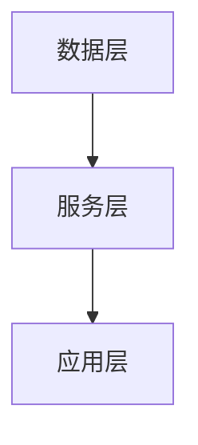
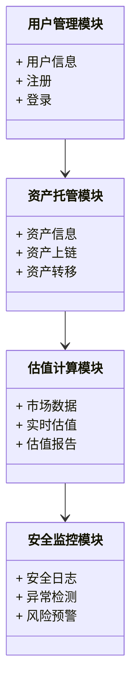
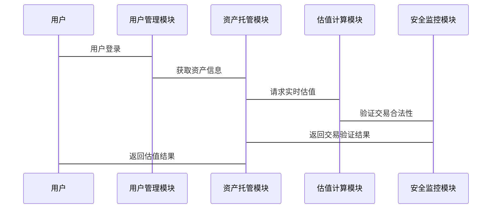

                 


# 企业估值中的区块链数字资产托管平台评估

## 关键词：区块链、数字资产、企业估值、托管平台、评估模型

## 摘要：  
本文深入探讨了区块链数字资产托管平台在企业估值中的重要性。通过分析区块链技术的基本原理、数字资产的分类及其对估值的影响，构建了一个基于区块链的数字资产托管平台评估模型。文章详细阐述了评估模型的算法原理、系统架构设计及其实现，通过具体案例展示了模型的应用价值，为企业的数字资产管理提供了新的思路和方法。

---

# 第一部分: 区块链数字资产托管平台概述

## 第1章: 区块链与数字资产的基本概念

### 1.1 区块链技术基础

#### 1.1.1 区块链的定义与特点
区块链是一种去中心化的分布式账本技术，具有去中心化、不可篡改、透明性和可追溯性等特点。  
- **去中心化**：数据存储在多个节点上，不存在单点故障。  
- **不可篡改**：通过加密算法和共识机制确保数据的安全性。  
- **透明性**：所有交易记录在区块链上公开可见，但用户身份可匿名。  
- **可追溯性**：每笔交易都可以追溯到源头，便于审计和追踪。

#### 1.1.2 区块链的核心技术原理
区块链的核心技术包括**共识机制**、**智能合约**和**加密算法**。  
- **共识机制**：确保所有节点达成一致的机制，如比特币的PoW（工作量证明）和以太坊的PoS（权益证明）。  
- **智能合约**：通过预设的代码自动执行合同条款，实现自动化操作。  
- **加密算法**：如RSA和椭圆曲线加密，用于保障数据安全。

#### 1.1.3 区块链的分类与应用场景
区块链主要分为**公链**、**私链**和**联盟链**。  
- **公链**：完全去中心化的区块链，如比特币和以太坊。  
- **私链**：仅限于特定组织内部使用的区块链，如企业内部的供应链管理。  
- **联盟链**：由多个机构共同组成的区块链，如金融行业的跨境支付系统。

### 1.2 数字资产的概念与分类

#### 1.2.1 数字资产的定义
数字资产是指以数字化形式存在的资产，包括**加密货币**、**代币**、**NFTs**（非同质化代币）等。

#### 1.2.2 数字资产的主要类型
数字资产可以分为以下几类：
1. **加密货币**：如比特币（BTC）、以太坊（ETH），用于价值存储和转账。  
2. **实用型代币**：用于特定平台或服务的代币，如以太坊上的ERC-20代币。  
3. **安全型代币**：代表传统资产（如股票、债券）的数字权益。  
4. **NFTs**：用于表示独特的数字艺术品、收藏品等。

#### 1.2.3 数字资产与传统资产的区别
- **可分割性**：数字资产通常是可分割的，而传统资产如房地产不可分割。  
- **流动性**：数字资产通常具有较高的流动性，可以快速买卖。  
- **透明性**：数字资产的交易记录在区块链上公开可见，而传统资产的交易可能较为私密。

### 1.3 区块链数字资产托管平台的定义与特点

#### 1.3.1 托管平台的定义
区块链数字资产托管平台是指一种基于区块链技术，为用户提供数字资产存储、管理、交易等服务的平台。

#### 1.3.2 托管平台的核心功能
1. **资产存储**：用户可以将数字资产托管在平台上，确保资产的安全性。  
2. **资产管理**：提供资产的转移、质押、借贷等功能。  
3. **估值计算**：根据市场数据和算法，实时计算用户资产的价值。  
4. **安全性保障**：通过区块链技术确保资产的安全性和交易的可追溯性。

#### 1.3.3 托管平台的优势与挑战
- **优势**：  
  1. **安全性高**：区块链技术确保资产的安全性。  
  2. **透明性**：所有交易记录公开可见，便于审计和追踪。  
  3. **去中心化**：减少单点故障风险。  
- **挑战**：  
  1. **技术复杂性**：区块链技术的实现和维护需要较高的技术门槛。  
  2. **监管不确定性**：数字资产的监管政策尚不明确，可能面临合规风险。  
  3. **用户体验**：复杂的操作可能影响用户体验。

## 1.4 本章小结

---

# 第二部分: 区块链数字资产托管平台的评估方法

## 第2章: 企业估值的基本原理

### 2.1 企业估值的核心概念

#### 2.1.1 企业估值的定义
企业估值是指对企业整体或部分资产的价值进行评估的过程。

#### 2.1.2 企业估值的主要方法
1. **市场法**：通过比较同类企业的市场价值进行估值。  
2. **收益法**：基于企业的未来现金流折现进行估值。  
3. **成本法**：基于企业的重置成本进行估值。  

#### 2.1.3 企业估值的关键因素
- **财务状况**：包括收入、利润、资产负债表等。  
- **市场环境**：包括行业趋势、宏观经济环境等。  
- **管理团队**：包括管理能力、战略规划等。

### 2.2 数字资产在企业估值中的作用

#### 2.2.1 数字资产对企业价值的影响
数字资产可以作为企业的核心资产之一，影响企业的整体估值。例如，数字资产的持有量可能影响企业的流动性。

#### 2.2.2 数字资产的流动性与估值难度
数字资产的流动性较高，但其价格波动较大，这增加了估值的难度。

#### 2.2.3 数字资产对企业财务状况的潜在影响
数字资产的持有可能影响企业的财务状况，例如增加资产负债表中的流动资产。

### 2.3 区块链技术对企业估值的影响

#### 2.3.1 区块链技术对企业透明度的提升
区块链技术可以提高企业的透明度，便于投资者进行估值。

#### 2.3.2 区块链技术对企业资产安全的保障
区块链技术可以确保数字资产的安全性，减少资产损失的风险。

#### 2.3.3 区块链技术对企业信用评估的支持
通过区块链技术，企业的信用记录可以更加透明，便于金融机构进行信用评估。

## 2.4 本章小结

---

# 第三部分: 区块链数字资产托管平台的评估模型

## 第3章: 评估模型的构建与原理

### 3.1 评估模型的设计思路

#### 3.1.1 模型设计的目标
模型设计的目标是通过区块链技术，实现对数字资产托管平台的实时估值。

#### 3.1.2 模型设计的原则
- **数据驱动**：模型应基于实时市场数据进行估值。  
- **可扩展性**：模型应支持大规模数据的处理。  
- **可解释性**：模型的输出应易于理解和解释。

#### 3.1.3 模型设计的关键步骤
1. 数据采集：从区块链上采集数字资产的交易数据。  
2. 数据清洗：对数据进行预处理，去除异常值。  
3. 数据建模：基于历史数据建立估值模型。  
4. 模型验证：通过实际数据验证模型的准确性。

### 3.2 评估模型的核心算法

#### 3.2.1 算法原理概述
模型基于机器学习算法，结合区块链上的交易数据，进行数字资产的估值。

#### 3.2.2 算法的数学模型
模型的数学表达式如下：
$$
V = \alpha \cdot P + \beta \cdot Q
$$
其中，\( V \) 表示估值，\( P \) 表示当前价格，\( Q \) 表示交易量，\( \alpha \) 和 \( \beta \) 是模型的参数。

#### 3.2.3 算法的实现步骤
1. 数据采集：从区块链上获取数字资产的交易数据。  
2. 数据清洗：去除异常值和错误数据。  
3. 数据建模：使用回归算法训练模型。  
4. 模型验证：通过实际数据验证模型的准确性。  
5. 模型优化：根据验证结果优化模型参数。

### 3.3 评估模型的验证与优化

#### 3.3.1 模型的验证方法
通过实际交易数据验证模型的预测准确性，计算模型的均方误差（MSE）和决定系数（R²）。

#### 3.3.2 模型的优化策略
- **参数调整**：优化模型的参数，提高预测精度。  
- **模型改进**：引入更多的特征变量，如市场情绪、技术指标等。

#### 3.3.3 模型的适用性分析
模型适用于数字资产价格波动较小的场景，但在市场剧烈波动时可能需要进一步优化。

## 3.4 本章小结

---

# 第四部分: 区块链数字资产托管平台的系统架构

## 第4章: 系统架构设计

### 4.1 系统功能模块划分

#### 4.1.1 用户管理模块
- 用户注册与登录。  
- 用户身份验证。  

#### 4.1.2 资产托管模块
- 资产上链：将数字资产托管到区块链上。  
- 资产转移：用户可以将资产转移到其他地址。  

#### 4.1.3 估值计算模块
- 实时估值：基于市场数据计算数字资产的当前价值。  
- 估值报告：生成资产的估值报告。  

#### 4.1.4 安全监控模块
- 安全监控：实时监控系统安全。  
- 风险预警：发现异常交易时触发预警。

### 4.2 系统架构图

#### 4.2.1 系统架构图的描述
系统架构采用分层设计，包括**数据层**、**服务层**和**应用层**。

#### 4.2.2 系统架构图的 Mermaid 表示


### 4.3 系统功能设计

#### 4.3.1 系统功能的 Mermaid 类图


### 4.4 系统接口设计

#### 4.4.1 系统接口的描述
系统接口包括**REST API**和**WebSocket**接口，用于实现用户与系统的交互。

### 4.5 系统交互的 Mermaid 序列图



## 4.6 本章小结

---

# 第五部分: 区块链数字资产托管平台的项目实战

## 第5章: 项目实战

### 5.1 环境安装

#### 5.1.1 系统环境
- 操作系统：Linux/Windows/MacOS  
- 区块链框架：以太坊  
- 开发工具：IDE（如VS Code）+ 区块链钱包（如MetaMask）

#### 5.1.2 安装依赖
```bash
npm install web3
npm install eth-gas-station
npm install express
```

### 5.2 系统核心实现源代码

#### 5.2.1 资产托管模块的实现
```javascript
const Web3 = require('web3');
const web3 = new Web3(new Web3.providers.HttpProvider('http://localhost:8545'));

async function assetDeposit(address, amount) {
    const contract = new web3.eth.Contract(ABI, contractAddress);
    const tx = contract.methods.deposit(amount).send({ from: address });
    return tx;
}
```

#### 5.2.2 估值计算模块的实现
```javascript
const Web3 = require('web3');
const web3 = new Web3(new Web3.providers.HttpProvider('http://localhost:8545'));

async function calculateValue(tokenAddress, amount) {
    const contract = new web3.eth.Contract(ABI, tokenAddress);
    const value = contract.methods.getTokenValue(amount).call();
    return value;
}
```

### 5.3 代码应用解读与分析

#### 5.3.1 资产托管模块解读
- 使用Web3库连接到以太坊节点，实现资产的上链托管。  
- `assetDeposit`函数用于将指定数量的资产托管到指定地址。

#### 5.3.2 估值计算模块解读
- 使用智能合约获取数字资产的当前价值。  
- `calculateValue`函数根据指定的代币地址和数量，返回对应的估值。

### 5.4 实际案例分析和详细讲解剖析

#### 5.4.1 案例背景
假设我们有一个基于以太坊的数字资产托管平台，用户需要将ETH托管到平台上，并进行实时估值。

#### 5.4.2 案例实现
```javascript
async function main() {
    const address = '0x123456789abc';
    const amount = 1;
    await assetDeposit(address, amount);
    const value = await calculateValue('0x123456789abc', amount);
    console.log('资产估值:', value);
}
main();
```

#### 5.4.3 案例分析
- 资产托管：用户将1 ETH托管到指定地址。  
- 实时估值：智能合约根据当前ETH的价格计算出资产的估值。  
- 输出结果：资产估值为当前ETH的价格。

### 5.5 项目小结

---

# 第六部分: 总结与展望

## 第6章: 总结与展望

### 6.1 本章总结
本文详细介绍了区块链数字资产托管平台的评估方法，构建了一个基于区块链的评估模型，并通过实际案例展示了模型的应用价值。

### 6.2 未来展望
未来，随着区块链技术的不断发展，数字资产托管平台的评估方法将更加智能化和自动化。同时，随着监管政策的完善，数字资产的估值将更加规范化。

---

# 作者：AI天才研究院/AI Genius Institute & 禅与计算机程序设计艺术 /Zen And The Art of Computer Programming

