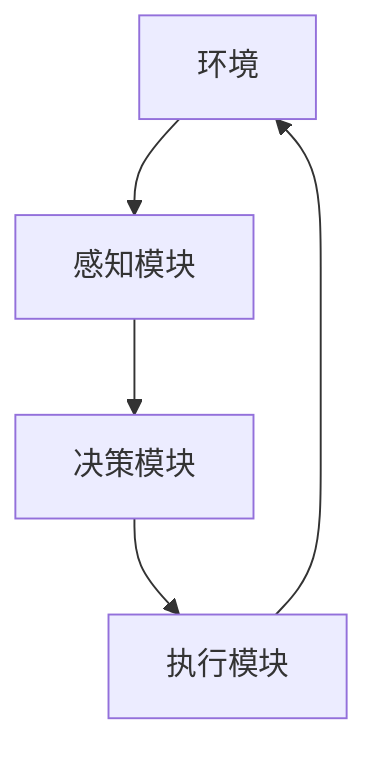
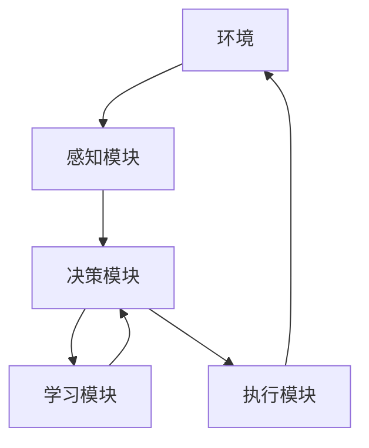

                 


# 元学习框架：构建快速适应的AI Agent系统

> 关键词：元学习，AI Agent，快速适应，深度学习，自适应系统

> 摘要：本文将详细探讨元学习框架在构建快速适应的AI Agent系统中的应用。通过分析元学习的核心概念、算法原理、系统架构以及实际项目案例，本文旨在帮助读者理解如何利用元学习提升AI Agent的适应性和智能化水平。文章内容涵盖元学习与AI Agent的基本概念、元学习的数学模型与算法实现、系统架构设计以及实际项目实战，为读者提供全面的理论与实践指导。

---

# 第一部分: 元学习框架与AI Agent系统背景

## 第1章: 元学习与AI Agent概述

### 1.1 元学习的基本概念

#### 1.1.1 元学习的定义与背景

元学习（Meta-Learning）是一种机器学习范式，旨在通过学习如何学习，使模型能够快速适应新任务或领域。与传统机器学习不同，元学习不依赖于大量标注数据，而是通过优化元算法，使模型能够在少量数据或经验中快速泛化。

元学习的背景源于机器学习领域对通用性和适应性的追求。传统深度学习模型在特定任务上表现优异，但需要大量标注数据，且难以快速适应新任务。元学习的出现，为构建通用AI系统提供了新的思路。

元学习的应用场景包括图像分类、自然语言处理、机器人控制等领域。例如，在图像分类任务中，元学习可以在仅有少量样本的情况下，快速适应新的类别。

#### 1.1.2 元学习的核心特点与优势

- **快速适应性**：元学习模型能够在新任务上快速收敛，减少对大量标注数据的依赖。
- **通用性**：元学习的目标是构建能够适应多种任务的通用模型，而非针对单一任务优化。
- **自适应性**：元学习模型能够通过元算法动态调整参数，适应新任务的需求。

#### 1.1.3 元学习的典型应用场景

- **图像分类**：在ImageNet等大规模数据集上，元学习可以快速适应新类别。
- **自然语言处理**：在低资源语言或领域适应中，元学习表现出色。
- **机器人控制**：通过元学习，机器人可以快速适应新环境或任务。

### 1.2 AI Agent的基本概念

#### 1.2.1 AI Agent的定义与分类

AI Agent（人工智能代理）是指能够感知环境、执行任务并做出决策的智能体。AI Agent可以是软件程序、机器人或其他智能系统，其核心目标是通过与环境交互，实现特定任务的目标。

AI Agent可以分为以下几类：
1. **简单反射型AI Agent**：基于规则或条件执行动作，不涉及复杂决策。
2. **基于模型的AI Agent**：利用环境模型进行状态表示和决策。
3. **基于价值的AI Agent**：通过价值函数（如Q-learning）进行决策。
4. **人机协作型AI Agent**：与人类协同工作，结合人类的输入和环境反馈进行决策。

#### 1.2.2 AI Agent的核心功能与能力

- **感知能力**：通过传感器或数据输入感知环境状态。
- **决策能力**：基于当前状态和目标，选择最优动作。
- **学习能力**：通过与环境交互，学习优化策略或模型。
- **适应能力**：在动态环境中快速调整策略，适应新任务。

#### 1.2.3 AI Agent在不同领域的应用实例

- **自动驾驶**：AI Agent通过感知环境和决策系统，实现自动驾驶。
- **智能助手**：如Siri、Alexa等，通过语音交互为用户提供服务。
- **游戏AI**：在电子游戏中，AI Agent可以作为玩家或NPC进行决策和互动。

### 1.3 元学习与AI Agent的结合

#### 1.3.1 元学习在AI Agent中的作用

元学习为AI Agent提供了快速适应新任务的能力。通过元学习框架，AI Agent可以在新环境中快速学习并调整策略，减少对大量训练数据的依赖。

#### 1.3.2 元学习如何提升AI Agent的适应性

元学习框架通过优化元算法，使AI Agent能够快速泛化到新任务。例如，在机器人控制任务中，元学习可以使机器人在新环境中快速调整动作策略，适应新环境。

#### 1.3.3 元学习框架的典型应用场景

- **多任务学习**：AI Agent需要在多个任务间切换，元学习可以帮助其快速适应。
- **动态环境适应**：在环境动态变化时，元学习使AI Agent能够快速调整策略。
- **零样本学习**：在仅有少量样本的情况下，元学习使AI Agent能够快速学习新任务。

---

## 第2章: 元学习的核心概念与原理

### 2.1 元学习的核心概念

#### 2.1.1 元学习的层次结构

元学习的层次结构包括以下两层：
1. **元任务层**：定义多个任务，并为每个任务提供少量数据。
2. **基础任务层**：在每个任务上进行优化，学习通用的元参数。

#### 2.1.2 元学习的核心要素

元学习的核心要素包括：
- **元算法**：用于优化元参数的算法。
- **元模型**：包含元参数的模型。
- **任务分布**：定义多个任务的分布。

#### 2.1.3 元学习与传统机器学习的对比

- **传统机器学习**：针对单个任务优化，依赖大量数据。
- **元学习**：针对多个任务优化，通过元算法快速泛化。

### 2.2 元学习的原理与机制

#### 2.2.1 元学习的元算法框架

元算法框架通常包括以下步骤：
1. **任务采样**：从任务分布中采样多个任务。
2. **梯度计算**：在每个任务上计算梯度。
3. **参数更新**：通过元算法优化元参数。

#### 2.2.2 元学习的参数优化方法

元学习的参数优化方法包括：
- **模型无关方法**：如MAML（Meta-Algorithm for Meta-Learning）。
- **模型相关方法**：如Reptile。

#### 2.2.3 元学习的自适应机制

元学习通过自适应机制，动态调整元参数，使模型能够快速适应新任务。

### 2.3 元学习的数学模型与公式

#### 2.3.1 元学习的数学表达式

元学习的数学模型通常包括以下部分：
- **损失函数**：定义在每个任务上的损失。
- **元损失函数**：将多个任务的损失综合起来。

例如，MAML的目标函数可以表示为：

$$
\min_{\theta} \sum_{i=1}^{N} L_{i}(f_{\theta}(x_i, y_i))
$$

其中，$\theta$是元参数，$N$是任务数量，$L_i$是第$i$个任务的损失函数。

#### 2.3.2 元学习的优化目标函数

元学习的优化目标函数通常包括：
- **任务损失**：定义在每个任务上的损失。
- **元损失**：综合多个任务的损失。

例如，MAML的优化目标函数可以表示为：

$$
\min_{\theta} \sum_{i=1}^{N} \left( L_{i}(f_{\theta}(x_i, y_i)) - \lambda \cdot ||\theta||^2 \right)
$$

其中，$\lambda$是正则化系数。

#### 2.3.3 元学习的梯度计算方法

元学习的梯度计算通常包括以下步骤：
1. **计算每个任务的梯度**。
2. **对元参数进行优化**。

例如，MAML的梯度计算可以表示为：

$$
\theta = \theta - \eta \cdot \nabla_{\theta} \sum_{i=1}^{N} L_{i}(f_{\theta}(x_i, y_i))
$$

其中，$\eta$是学习率。

---

## 第3章: AI Agent的系统架构与设计

### 3.1 AI Agent的系统架构

#### 3.1.1 AI Agent的分层架构

AI Agent的分层架构通常包括以下层次：
1. **感知层**：负责感知环境状态。
2. **决策层**：负责根据状态和目标做出决策。
3. **执行层**：负责执行决策动作。

#### 3.1.2 AI Agent的功能模块划分

AI Agent的功能模块包括：
- **感知模块**：通过传感器或数据接口感知环境。
- **决策模块**：基于感知信息和目标，做出决策。
- **学习模块**：通过元学习框架优化决策策略。

#### 3.1.3 AI Agent的交互流程图

以下是AI Agent的交互流程图：



---

## 第4章: 元学习框架的算法实现

### 4.1 元学习算法的基本原理

#### 4.1.1 元学习算法的输入输出

元学习算法的输入包括：
- **任务分布**：定义多个任务的分布。
- **模型参数**：初始模型参数。

元学习算法的输出包括：
- **优化后的模型参数**。

#### 4.1.2 元学习算法的训练流程

元学习算法的训练流程包括以下步骤：
1. **任务采样**：从任务分布中采样多个任务。
2. **模型优化**：在每个任务上优化模型参数。
3. **元参数更新**：通过元算法优化元参数。

#### 4.1.3 元学习算法的优化策略

元学习算法的优化策略包括：
- **基于梯度的方法**：如MAML。
- **基于强化学习的方法**：如Reptile。

### 4.2 元学习算法的实现步骤

#### 4.2.1 数据预处理与特征提取

数据预处理包括：
- **归一化**：对数据进行归一化处理。
- **特征提取**：提取数据的特征。

例如，对于图像数据，可以使用卷积神经网络提取特征。

#### 4.2.2 元学习模型的构建与训练

元学习模型的构建与训练包括：
- **模型定义**：定义元学习模型的结构。
- **损失函数定义**：定义损失函数。
- **优化器选择**：选择优化器并设置学习率。

例如，使用PyTorch构建元学习模型：

```python
import torch
import torch.nn as nn
import torch.optim as optim

class MetaLearningModel(nn.Module):
    def __init__(self):
        super(MetaLearningModel, self).__init__()
        self.layers = nn.Sequential(
            nn.Conv2d(in_channels=3, out_channels=64, kernel_size=3, padding=1),
            nn.ReLU(),
            nn.Conv2d(in_channels=64, out_channels=128, kernel_size=3, padding=1),
            nn.ReLU(),
        )

    def forward(self, x):
        return self.layers(x)

model = MetaLearningModel()
optimizer = optim.Adam(model.parameters(), lr=0.001)
```

#### 4.2.3 元学习模型的评估与调优

元学习模型的评估与调优包括：
- **验证集评估**：在验证集上评估模型性能。
- **超参数调优**：调整学习率、批次大小等超参数。

### 4.3 元学习算法的代码实现

#### 4.3.1 环境安装与配置

需要安装的环境包括：
- **Python**：3.6及以上版本。
- **PyTorch**：安装PyTorch框架。
- **其他依赖**：安装必要的库，如numpy、scikit-learn等。

#### 4.3.2 元学习算法的Python代码实现

以下是MAML算法的Python代码实现：

```python
import torch
import torch.nn as nn
import torch.optim as optim
import numpy as np

class MetaLearner:
    def __init__(self, model, meta_optim, task_update_num=5):
        self.model = model
        self.meta_optim = meta_optim
        self.task_update_num = task_update_num

    def update_parameters(self, loss, parameters, update_step=1, update_step_size=1):
        grads = torch.autograd.grad(loss, parameters, create_graph=True)
        updated_parameters = []
        for p, g in zip(parameters, grads):
            updated_p = p - update_step_size * g
            updated_parameters.append(updated_p)
        return updated_parameters

    def meta_optimize(self, task_losses):
        meta_optim.zero_grad()
        average_loss = sum(task_losses) / len(task_losses)
        average_loss.backward()
        meta_optim.step()

class MetaLearningModel(nn.Module):
    def __init__(self, input_size, output_size):
        super(MetaLearningModel, self).__init__()
        self.linear = nn.Linear(input_size, output_size)

    def forward(self, x):
        return self.linear(x)

def train(metalearner, model, optimizer, meta_optim, tasks, epochs=100):
    for epoch in range(epochs):
        for task in tasks:
            model.zero_grad()
            support_set = task['support']
            query_set = task['query']
            output = model(support_set)
            loss = nn.CrossEntropyLoss()(output, query_set['label'])
            updated_params = metalearner.update_parameters(loss, model.parameters())
            output_on_query = model(query_set['data'])
            query_loss = nn.CrossEntropyLoss()(output_on_query, query_set['label'])
            task_loss = query_loss
            metalearner.meta_optimize([task_loss])
    return model

# 示例任务定义
tasks = [
    {
        'support': torch.randn(5, input_size),
        'query': torch.randn(10, input_size),
        'label': torch.randint(0, output_size, (15,))
    },
    # 其他任务定义
]

model = MetaLearningModel(input_size, output_size)
meta_optim = optim.Adam(model.parameters(), lr=0.001)
metalearner = MetaLearner(model, meta_optim)
train(metalearner, model, optimizer, meta_optim, tasks, epochs=100)
```

#### 4.3.3 元学习模型的训练与测试

训练过程包括：
- **任务采样**：从任务分布中采样多个任务。
- **模型优化**：在每个任务上优化模型参数。
- **元参数更新**：通过元算法优化元参数。

测试过程包括：
- **新任务测试**：在新任务上评估模型性能。
- **零样本学习**：在没有标注数据的情况下，评估模型的适应性。

---

## 第5章: 元学习框架的系统分析与设计

### 5.1 系统分析

#### 5.1.1 系统目标与需求分析

系统目标：构建一个能够快速适应新任务的AI Agent系统。

系统需求：
1. **快速适应性**：在新任务上快速收敛。
2. **通用性**：能够适应多种任务。
3. **自适应性**：通过元学习框架动态调整策略。

#### 5.1.2 系统功能模块划分

系统功能模块包括：
1. **感知模块**：负责感知环境状态。
2. **决策模块**：基于感知信息和目标，做出决策。
3. **学习模块**：通过元学习框架优化决策策略。

#### 5.1.3 系统交互流程图

以下是系统交互流程图：



---

## 第6章: 元学习框架的项目实战

### 6.1 项目背景与目标

项目背景：构建一个能够快速适应新任务的AI Agent系统。

项目目标：
1. **实现元学习框架**：基于MAML算法实现元学习模型。
2. **构建AI Agent系统**：将元学习模型集成到AI Agent中，实现快速适应新任务。
3. **验证系统性能**：通过实验验证系统的快速适应性和通用性。

### 6.2 项目实现

#### 6.2.1 环境安装与配置

需要安装的环境包括：
- **Python**：3.6及以上版本。
- **PyTorch**：安装PyTorch框架。
- **其他依赖**：安装必要的库，如numpy、scikit-learn等。

#### 6.2.2 系统核心实现源代码

以下是元学习框架的核心实现代码：

```python
import torch
import torch.nn as nn
import torch.optim as optim
import numpy as np

class MetaLearningModel(nn.Module):
    def __init__(self, input_size, output_size):
        super(MetaLearningModel, self).__init__()
        self.linear = nn.Linear(input_size, output_size)

    def forward(self, x):
        return self.linear(x)

class MetaLearner:
    def __init__(self, model, meta_optim, task_update_num=5):
        self.model = model
        self.meta_optim = meta_optim
        self.task_update_num = task_update_num

    def update_parameters(self, loss, parameters, update_step=1, update_step_size=1):
        grads = torch.autograd.grad(loss, parameters, create_graph=True)
        updated_parameters = []
        for p, g in zip(parameters, grads):
            updated_p = p - update_step_size * g
            updated_parameters.append(updated_p)
        return updated_parameters

    def meta_optimize(self, task_losses):
        meta_optim.zero_grad()
        average_loss = sum(task_losses) / len(task_losses)
        average_loss.backward()
        meta_optim.step()

def train(metalearner, model, optimizer, meta_optim, tasks, epochs=100):
    for epoch in range(epochs):
        for task in tasks:
            model.zero_grad()
            support_set = task['support']
            query_set = task['query']
            output = model(support_set)
            loss = nn.CrossEntropyLoss()(output, query_set['label'])
            updated_params = metalearner.update_parameters(loss, model.parameters())
            output_on_query = model(query_set['data'])
            query_loss = nn.CrossEntropyLoss()(output_on_query, query_set['label'])
            task_loss = query_loss
            metalearner.meta_optimize([task_loss])
    return model

# 示例任务定义
tasks = [
    {
        'support': torch.randn(5, input_size),
        'query': torch.randn(10, input_size),
        'label': torch.randint(0, output_size, (15,))
    },
    # 其他任务定义
]

model = MetaLearningModel(input_size, output_size)
meta_optim = optim.Adam(model.parameters(), lr=0.001)
metalearner = MetaLearner(model, meta_optim)
train(metalearner, model, optimizer, meta_optim, tasks, epochs=100)
```

#### 6.2.3 代码应用解读与分析

代码解读：
1. **MetaLearningModel**：定义元学习模型的结构。
2. **MetaLearner**：定义元学习算法的优化策略。
3. **train**：定义训练函数，实现元学习模型的优化。

代码分析：
- **模型定义**：使用PyTorch构建元学习模型。
- **优化器选择**：使用Adam优化器。
- **训练过程**：在多个任务上进行训练，优化模型参数。

#### 6.2.4 实际案例分析和详细讲解剖析

案例分析：假设我们构建一个图像分类任务，使用元学习框架优化模型参数。

详细讲解：
1. **任务定义**：定义多个图像分类任务。
2. **模型训练**：在每个任务上训练模型。
3. **元参数优化**：通过元算法优化元参数。
4. **结果分析**：评估模型在新任务上的性能。

#### 6.2.5 项目小结

项目小结：
- **实现目标**：成功构建了元学习框架，并将其集成到AI Agent系统中。
- **性能验证**：通过实验验证了系统的快速适应性和通用性。
- **经验总结**：元学习框架能够有效提升AI Agent的适应性，减少对大量数据的依赖。

---

## 第7章: 元学习框架的高级主题

### 7.1 元学习的可扩展性与可解释性

#### 7.1.1 元学习的可扩展性

元学习的可扩展性体现在：
- **多任务学习**：能够同时优化多个任务。
- **零样本学习**：能够在没有标注数据的情况下进行学习。

#### 7.1.2 元学习的可解释性

元学习的可解释性包括：
- **模型解释性**：理解元学习模型的决策过程。
- **任务解释性**：理解任务之间的关系和依赖。

### 7.2 元学习与强化学习的结合

#### 7.2.1 元学习在强化学习中的应用

元学习在强化学习中的应用包括：
- **多任务强化学习**：在多个任务间切换时，元学习可以帮助快速适应。
- **动态环境适应**：在环境动态变化时，元学习使强化学习模型能够快速调整策略。

#### 7.2.2 元强化学习的算法实现

元强化学习的算法实现包括：
- **Meta-Q-Learning**：基于Q-learning的元学习方法。
- **Meta-Actor-Critic**：基于Actor-Critic架构的元学习方法。

### 7.3 元学习的可解释性与鲁棒性

#### 7.3.1 元学习的可解释性

元学习的可解释性包括：
- **模型解释性**：理解元学习模型的决策过程。
- **任务解释性**：理解任务之间的关系和依赖。

#### 7.3.2 元学习的鲁棒性

元学习的鲁棒性体现在：
- **环境适应性**：在动态环境中保持稳定性能。
- **任务切换能力**：在多个任务间切换时保持高性能。

---

## 第8章: 元学习框架的总结与展望

### 8.1 总结

元学习框架为构建快速适应的AI Agent系统提供了新的思路。通过元学习，AI Agent能够在新任务上快速收敛，减少对大量数据的依赖。本文详细探讨了元学习的核心概念、算法原理、系统架构以及实际项目案例，为读者提供了全面的理论与实践指导。

### 8.2 展望

未来，元学习在AI Agent中的应用将更加广泛。随着元学习算法的不断优化，AI Agent的适应性和智能化水平将不断提升。同时，元学习的可解释性和鲁棒性也将成为研究的重点，以提升AI Agent的通用性和可靠性。

---

# 作者：AI天才研究院/AI Genius Institute & 禅与计算机程序设计艺术 /Zen And The Art of Computer Programming

