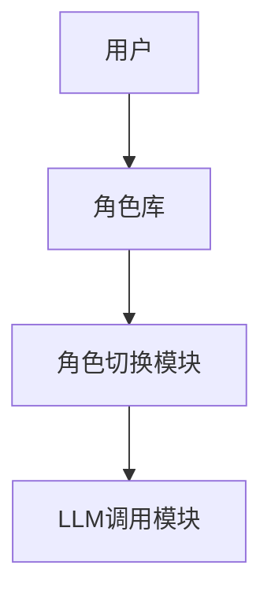
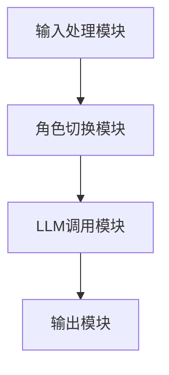
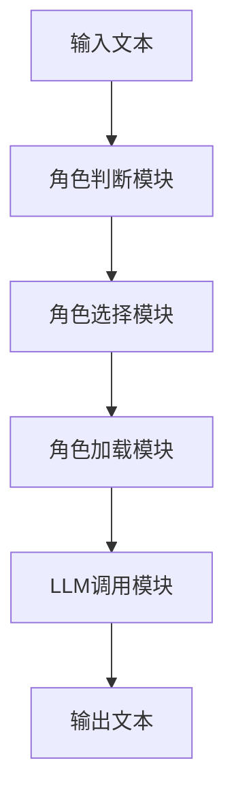
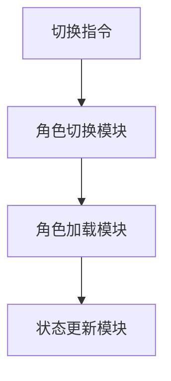
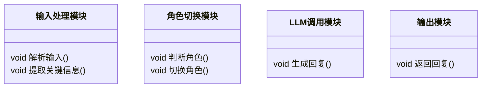

                 


# 多角色AI Agent：基于LLM的虚拟角色扮演系统

> **关键词**：多角色AI Agent、大语言模型（LLM）、虚拟角色扮演、AI系统架构、LLM应用

> **摘要**：  
> 本文详细探讨了基于大语言模型（LLM）的多角色AI Agent系统的设计与实现。文章首先介绍了多角色AI Agent的概念、背景及其在实际场景中的应用价值。接着，从技术基础的角度分析了LLM的核心原理，以及如何通过算法实现多角色的切换与一致性管理。随后，详细阐述了系统的架构设计、功能模块划分及接口设计，并通过具体案例展示了如何在实际项目中实现多角色AI Agent。最后，总结了当前系统的优势与不足，并展望了未来的发展方向。

---

# 第1章: 多角色AI Agent的概念与背景

## 1.1 多角色AI Agent的定义

### 1.1.1 什么是多角色AI Agent
多角色AI Agent（Multi-Role AI Agent）是一种能够根据需求动态切换不同角色的智能系统。它通过基于大语言模型（LLM）的技术，实现对多个复杂角色的理解与模拟，从而在交互过程中展现出不同的行为模式。

- **动态角色切换**：系统能够根据输入的上下文或用户需求，快速切换到所需的角色。
- **多角色一致性**：在切换角色时，系统需保持当前角色的行为一致性，同时不影响其他角色的独立性。
- **上下文记忆**：系统需要记忆当前对话的上下文，以确保角色切换后仍能保持连贯的交互。

### 1.1.2 多角色AI Agent的核心特点
- **动态性**：能够根据输入动态选择合适的角色。
- **一致性**：在切换角色时，保持当前交互的连贯性。
- **上下文感知**：基于对话历史理解当前情境。
- **可扩展性**：支持新增多个角色。

### 1.1.3 多角色AI Agent的背景与应用前景
随着大语言模型技术的成熟，AI Agent的应用场景日益广泛。从客服系统到虚拟助手，再到教育领域的智能导师，多角色AI Agent能够根据具体场景切换角色，为用户提供更个性化的服务。

---

## 1.2 多角色AI Agent的背景介绍

### 1.2.1 问题背景与问题描述
在传统的单角色AI系统中，AI只能以单一的身份与用户交互。例如，客服系统只能以“客服人员”的身份提供服务，无法在需要时切换为“技术支持”或“销售顾问”。这种局限性使得AI系统的功能扩展性受到限制。

### 1.2.2 多角色AI Agent的边界与外延
- **边界**：多角色AI Agent的边界在于其能够切换的角色数量和每个角色的行为范围。
- **外延**：多角色AI Agent可以应用于多种场景，如教育、医疗、客服等。

### 1.2.3 多角色AI Agent的概念结构与核心要素
- **核心要素**：
  - 角色库：存储多个角色的行为规范和知识库。
  - 角色切换机制：根据输入选择合适的角色。
  - 上下文管理：记忆对话历史，确保角色切换后交互连贯。

---

## 1.3 多角色AI Agent的核心概念与联系

### 1.3.1 多角色AI Agent的核心概念原理
多角色AI Agent通过以下步骤实现动态角色切换：
1. **输入分析**：解析用户的输入，判断所需角色。
2. **角色选择**：从角色库中选择最匹配的角色。
3. **角色切换**：加载选定角色的行为规范和知识库。
4. **交互执行**：以选定角色的身份与用户进行交互。

### 1.3.2 多角色AI Agent的概念属性特征对比表格

| 属性         | 单角色AI Agent | 多角色AI Agent |
|--------------|----------------|----------------|
| 角色数量     | 1              | ≥2             |
| 角色切换     | 无             | 支持            |
| 上下文管理    | 简单           | 复杂            |
| 应用场景      | 单一           | 多种            |

### 1.3.3 多角色AI Agent的ER实体关系图架构



---

# 第2章: 基于LLM的多角色AI Agent技术基础

## 2.1 大语言模型（LLM）概述

### 2.1.1 大语言模型的定义与特点
- **定义**：大语言模型是指经过大规模数据训练的深度学习模型，能够理解并生成人类语言。
- **特点**：
  - 参数规模大（如GPT-3的175B参数）。
  - 具备上下文理解能力。
  - 支持多种语言和任务。

### 2.1.2 LLM的核心技术与实现原理
- **核心技术**：
  - 自注意力机制（Self-Attention）。
  - 前馈神经网络。
  - 梯度下降优化。
- **实现原理**：
  - 通过自注意力机制捕捉上下文信息。
  - 生成概率最高的下一个词。

### 2.1.3 LLM与传统NLP技术的区别
- **传统NLP**：基于规则或浅层学习，适用于特定任务。
- **LLM**：基于深度学习，适用于多种任务，具有更强的泛化能力。

---

## 2.2 多角色AI Agent的实现原理

### 2.2.1 多角色AI Agent的实现机制
- **角色库管理**：存储多个角色的行为规范和知识库。
- **角色切换逻辑**：根据输入内容选择合适角色。
- **上下文记忆**：通过缓存机制记忆对话历史。

### 2.2.2 多角色AI Agent的实现步骤
1. **输入分析**：解析用户输入，判断所需角色。
2. **角色选择**：从角色库中选择最匹配的角色。
3. **角色切换**：加载选定角色的行为规范和知识库。
4. **交互执行**：以选定角色的身份与用户进行交互。

### 2.2.3 多角色AI Agent的系统架构
- **功能模块**：
  - 输入处理模块。
  - 角色切换模块。
  - LLM调用模块。
  - 上下文管理模块。

---

## 2.3 多角色AI Agent的系统架构

### 2.3.1 系统功能模块划分
- **输入处理模块**：解析用户输入，提取关键信息。
- **角色切换模块**：根据输入选择合适角色。
- **LLM调用模块**：调用大语言模型生成回复。
- **上下文管理模块**：记忆对话历史，确保连贯性。

### 2.3.2 系统架构设计图


### 2.3.3 系统接口设计与交互流程
- **接口设计**：
  - 输入接口：接收用户输入的文本或语音。
  - 输出接口：返回生成的回复。
- **交互流程**：
  1. 用户输入问题。
  2. 系统解析输入，判断所需角色。
  3. 系统加载选定角色的行为规范。
  4. 系统调用LLM生成回复。
  5. 系统输出回复。

---

# 第3章: 多角色AI Agent的算法原理

## 3.1 基于LLM的多角色生成算法

### 3.1.1 多角色生成算法的流程图


### 3.1.2 多角色生成算法的数学模型
$$ P(y|x) = \prod_{i=1}^{n} P(y_i|x_{i-1}, y_{i-1}) $$

### 3.1.3 多角色生成算法的实现细节
- **输入处理**：将用户输入转化为模型可处理的格式。
- **角色选择**：通过预训练模型判断角色。
- **LLM调用**：生成回复文本。

---

## 3.2 多角色切换算法

### 3.2.1 多角色切换算法的流程图


### 3.2.2 多角色切换算法的数学公式
$$ C = \argmax_{c} P(c|x, y) $$

### 3.2.3 多角色切换算法的实现步骤
1. 接收切换指令。
2. 判断目标角色。
3. 加载目标角色的行为规范。
4. 更新系统状态。

---

## 3.3 多角色一致性维护算法

### 3.3.1 一致性维护的数学模型
$$ S = \sum_{i=1}^{n} \lambda_i x_i $$

### 3.3.2 一致性维护的实现细节
- **上下文记忆**：通过缓存机制记录对话历史。
- **角色记忆**：记录当前角色的行为规范。

---

# 第4章: 多角色AI Agent的系统分析与架构设计

## 4.1 系统功能设计

### 4.1.1 多角色切换功能
- **功能描述**：支持用户动态切换角色。
- **实现步骤**：
  1. 接收切换指令。
  2. 判断目标角色。
  3. 加载目标角色的行为规范。

### 4.1.2 角色记忆与上下文管理
- **功能描述**：记忆对话历史，确保角色切换后交互连贯。
- **实现步骤**：
  1. 提取对话历史。
  2. 更新上下文缓存。

### 4.1.3 多角色对话生成功能
- **功能描述**：基于当前角色生成回复。
- **实现步骤**：
  1. 调用LLM生成回复。
  2. 输出生成的文本。

---

## 4.2 系统架构设计

### 4.2.1 系统架构图


### 4.2.2 系统功能模块的类图


---

## 4.3 系统接口设计与交互流程

### 4.3.1 系统接口设计
- **输入接口**：
  - 接收用户输入的文本或语音。
- **输出接口**：
  - 返回生成的回复文本。

### 4.3.2 系统交互流程
1. 用户输入问题。
2. 系统解析输入，判断所需角色。
3. 系统加载选定角色的行为规范。
4. 系统调用LLM生成回复。
5. 系统输出回复。

---

# 第5章: 多角色AI Agent的项目实战

## 5.1 项目介绍
- **项目名称**：基于LLM的多角色AI Agent系统。
- **项目目标**：实现一个能够动态切换多个角色的智能系统。
- **开发环境**：Python 3.9、TensorFlow 2.5、Hugging Face Transformers 4.10。

---

## 5.2 系统核心实现

### 5.2.1 环境安装
```python
pip install tensorflow==2.5 transformers==4.10
```

### 5.2.2 核心代码实现

```python
class MultiRoleAI:
    def __init__(self):
        self.roles = {
            'role1': {'model': 'gpt2', 'params': {}},
            'role2': {'model': 'gpt3', 'params': {}}
        }
        self.current_role = None

    def switch_role(self, role_name):
        self.current_role = role_name
        return f"切换到角色：{role_name}"

    def generate_response(self, input_text):
        if self.current_role is None:
            return "请先选择一个角色"
        # 调用LLM生成回复
        response = self.roles[self.current_role]['model'].generate(input_text)
        return response
```

### 5.2.3 代码解读与分析
- **类结构**：
  - `MultiRoleAI`：管理多个角色。
  - `switch_role`：切换角色。
  - `generate_response`：生成回复。

---

## 5.3 实际案例分析

### 5.3.1 案例背景
假设我们开发了一个客服系统，支持“客服代表”和“技术支持”两个角色。

### 5.3.2 案例实现
```python
ai = MultiRoleAI()
ai.switch_role('客服代表')
response = ai.generate_response("我的订单在哪里？")
print(response)
```

### 5.3.3 案例分析
- **角色切换**：用户输入“切换到技术支持”。
- **角色加载**：系统加载“技术支持”角色的行为规范。
- **生成回复**：系统以“技术支持”的身份生成回复。

---

## 5.4 项目小结
- **系统优势**：
  - 支持多个角色。
  - 动态切换角色。
  - 上下文记忆功能。
- **系统不足**：
  - 角色数量有限。
  - 切换角色时可能会有延迟。

---

# 第6章: 总结与展望

## 6.1 系统总结
- **总结**：
  - 多角色AI Agent系统通过动态切换角色，实现了个性化的交互体验。
  - 基于LLM的技术使得系统具备强大的自然语言处理能力。

## 6.2 未来展望
- **技术改进方向**：
  - 提高角色切换的效率。
  - 增强上下文记忆能力。
  - 支持更多种类的角色。
- **应用扩展方向**：
  - 教育领域：智能导师。
  - 医疗领域：多角色医生。
  - 金融领域：智能投资顾问。

---

# 作者：AI天才研究院/AI Genius Institute & 禅与计算机程序设计艺术 /Zen And The Art of Computer Programming

