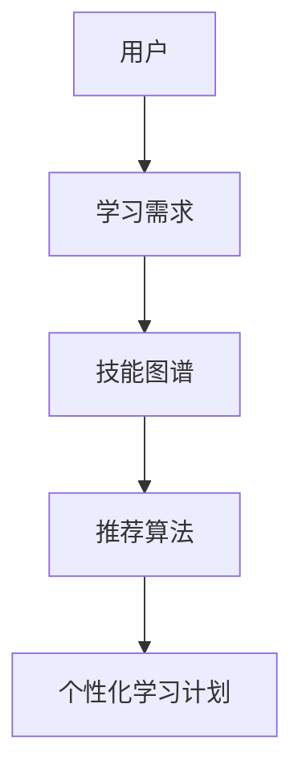
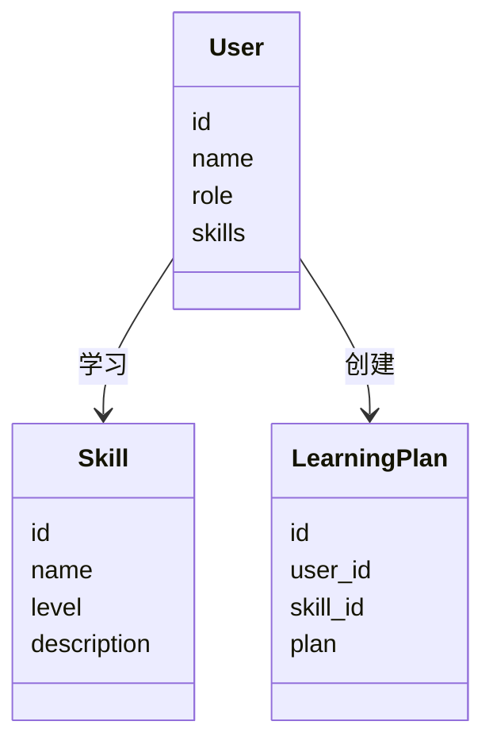
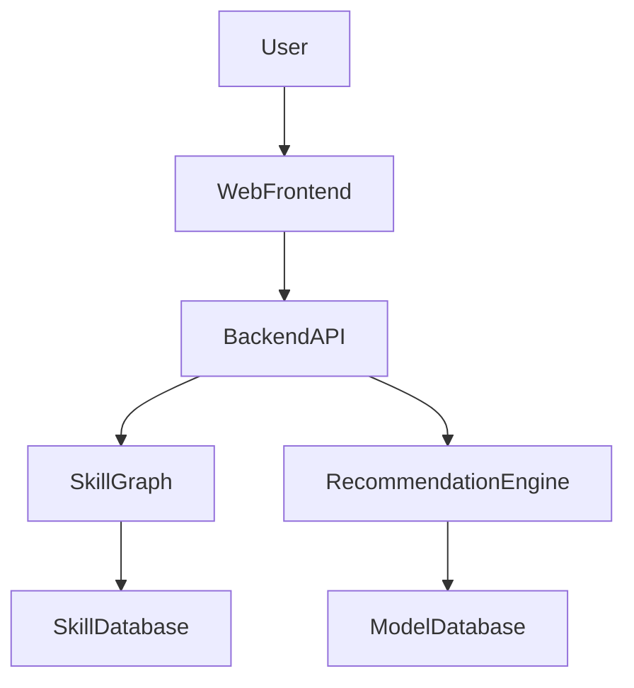
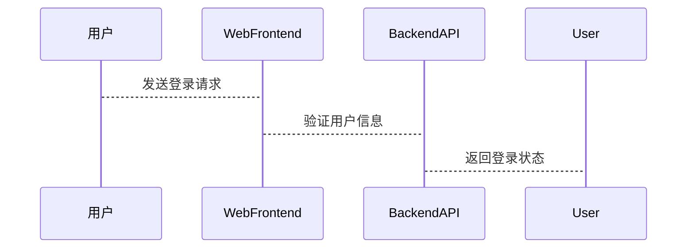
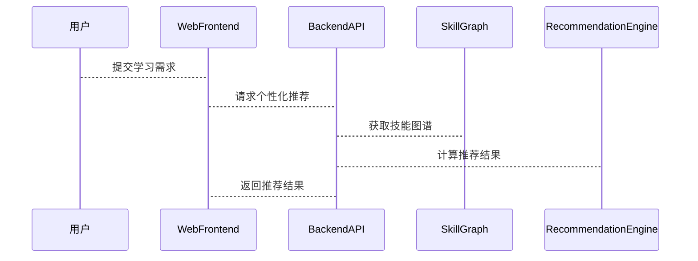

                 


# 构建智能企业学习管理系统：技能图谱与个性化发展规划的融合

## 关键词：智能企业学习管理系统、技能图谱、个性化发展、推荐算法、系统架构设计

## 摘要：  
本文探讨如何通过构建智能企业学习管理系统，将技能图谱与个性化发展规划相结合，实现企业学习管理的智能化与高效化。文章从问题背景出发，详细阐述了技能图谱的构建原理、个性化发展的算法实现，以及系统架构设计。通过实际案例分析，展示了如何利用协同过滤和深度学习模型推荐算法，实现学习资源的精准匹配与个性化推荐。文章最后总结了系统的实现方法与应用价值，为企业构建智能化学习管理系统提供了参考。

---

# 第1章: 问题背景与概念解析

## 1.1 企业学习管理的现状与挑战

### 1.1.1 传统企业学习管理的痛点
- 传统学习管理依赖人工匹配，效率低且难以满足个性化需求。
- 知识点分散，缺乏系统性的技能关联与动态更新。
- 学习效果难以量化，难以追踪员工技能提升路径。

### 1.1.2 数字化转型对企业学习管理的影响
- 数字化工具的应用使学习资源更加丰富，但管理复杂性增加。
- 数据驱动的分析能力帮助企业更精准地识别员工技能缺口。
- 人工智能技术的应用为个性化学习提供了新的可能。

### 1.1.3 技能图谱与个性化发展的必要性
- 技能图谱通过系统化的方法，将分散的知识点转化为可操作的技能网络。
- 个性化发展基于员工特点和需求，提供定制化的学习路径。
- 两者的融合能够实现学习资源的精准匹配，提升学习效率和效果。

## 1.2 技能图谱与个性化发展的核心概念

### 1.2.1 技能图谱的定义与特点
- **定义**：技能图谱是一种以图结构表示的技能体系，通过节点和边描述技能之间的关系。
- **特点**：
  - 结构化：技能之间的关系清晰，便于分析和推理。
  - 动态性：能够根据行业变化和员工需求实时更新。
  - 可扩展性：支持多种技能维度的扩展，如技术技能、软技能等。

### 1.2.2 个性化发展的内涵与外延
- **内涵**：基于员工的特点（如职业目标、兴趣、能力水平）制定个性化学习计划。
- **外延**：不仅包括学习内容的推荐，还包括学习路径的规划、学习效果的评估等。

### 1.2.3 两者融合的背景与意义
- **背景**：随着企业对员工技能要求的提高，传统学习管理方式已难以满足需求。
- **意义**：技能图谱提供了系统化的技能体系，个性化发展满足了员工的差异化需求，两者结合能够实现学习资源的精准匹配和高效管理。

## 1.3 本章小结

---

# 第2章: 技能图谱构建原理

## 2.1 技能图谱的构建方法

### 2.1.1 基于知识图谱的构建技术
- **知识图谱**：通过语义网络技术构建技能之间的关系。
- **构建步骤**：
  1. 数据采集：收集岗位要求、技能描述等数据。
  2. 数据清洗：去除冗余和不相关的信息。
  3. 实体识别与抽取：提取技能节点和关系。
  4. 图结构构建：通过边连接技能节点，形成技能图谱。

### 2.1.2 基于机器学习的自动构建
- **自动构建**：利用机器学习模型从大规模数据中学习技能关系。
- **关键技术**：
  - 基于图嵌入的表示学习：通过节点向量表示技能之间的关系。
  - 基于聚类的技能分组：根据技能相似性自动分组。

### 2.1.3 人机协作的混合式构建
- **人机协作**：结合人工审核和自动构建，确保技能图谱的准确性和完整性。
- **优势**：
  - 提高构建效率。
  - 保证技能关系的合理性。

## 2.2 技能图谱的属性与关系

### 2.2.1 技能节点的属性特征对比表
| 技能节点 | 属性 | 示例 |
|----------|------|------|
| 编程技能 | 类型 | Python、Java |
| 技能层次 | 初级、中级、高级 |
| 技能描述 | 简要说明 | 数据结构与算法 |

### 2.2.2 技能关系的ER实体关系图
```mermaid
entity: Skill
attributes: id, name, level, description
relations: 
  - has_many: PrerequisiteSkill
  - has_many: RelatedSkill
  - has_many: JobRole
```

## 2.3 技能图谱构建的数学模型

### 2.3.1 基于图嵌入的表示学习
$$ E(S_i, S_j) = \sum_{k=1}^n w_k (s_{i,k} - s_{j,k})^2 $$
- **公式说明**：$S_i$和$S_j$是两个技能节点的向量表示，$w_k$是权重系数。

### 2.3.2 基于矩阵分解的推荐算法
$$ R_{u,i} = \sum_{k=1}^K p_k q_k^T + b_u + b_i $$
- **公式说明**：$R_{u,i}$表示用户$u$对技能$i$的偏好，$p_k$和$q_k$是用户和技能的隐向量，$b_u$和$b_i$是偏置项。

---

# 第3章: 个性化发展规划的算法原理

## 3.1 基于协同过滤的推荐算法

### 3.1.1 用户相似度计算
$$ sim(u, v) = \frac{\sum_{i=1}^n (r_{u,i} - \bar{r}_u)(r_{v,i} - \bar{r}_v)}{\sqrt{\sum_{i=1}^n (r_{u,i} - \bar{r}_u)^2} \sqrt{\sum_{i=1}^n (r_{v,i} - \bar{r}_v)^2}} $$
- **公式说明**：$r_{u,i}$表示用户$u$对技能$i$的评分，$\bar{r}_u$是用户的平均评分。

### 3.1.2 基于物品的推荐流程


## 3.2 基于深度学习的推荐模型

### 3.2.1 基于神经网络的特征提取
- **关键技术**：
  - 卷积神经网络（CNN）用于提取局部特征。
  - 循环神经网络（RNN）用于处理序列数据。

### 3.2.2 基于Transformer的序列建模
- **Transformer结构**：
  - 编码器：将输入序列转换为固定长度的向量。
  - 解码器：根据编码结果生成推荐序列。

### 3.2.3 模型训练与优化
- **训练目标**：最小化预测值与真实值的误差。
- **优化方法**：使用Adam优化器，学习率衰减。

## 3.3 算法实现的Python代码示例

### 3.3.1 协同过滤算法实现
```python
def calculate_similarity(user_ratings, item_ratings):
    # 计算用户相似度
    similarity = {}
    for u in user_ratings:
        for v in user_ratings:
            if u != v:
                # 计算用户的平均评分
                u_avg = sum(user_ratings[u].values()) / len(user_ratings[u].values())
                v_avg = sum(user_ratings[v].values()) / len(user_ratings[v].values())
                # 计算相似度
                numerator = sum((user_ratings[u][i] - u_avg) * (user_ratings[v][i] - v_avg) for i in user_ratings[u].keys() if i in user_ratings[v].keys())
                denominator = (sum((user_ratings[u][i] - u_avg)**2 for i in user_ratings[u].keys()) ** 0.5) * (sum((user_ratings[v][i] - v_avg)**2 for i in user_ratings[v].keys()) ** 0.5)
                if denominator == 0:
                    similarity[(u, v)] = 0.0
                else:
                    similarity[(u, v)] = numerator / denominator
    return similarity
```

## 3.4 算法实现的注意事项

### 3.4.1 数据预处理
- **数据清洗**：处理缺失值、异常值。
- **特征工程**：提取有用的特征，如用户行为特征、技能特征。

### 3.4.2 模型调优
- **参数选择**：选择合适的模型参数，如学习率、批次大小。
- **评估指标**：使用准确率、召回率、F1值等指标评估模型性能。

---

# 第4章: 系统架构设计与实现

## 4.1 系统功能设计

### 4.1.1 领域模型


### 4.1.2 系统架构


## 4.2 系统接口设计

### 4.2.1 API接口
- **获取技能图谱**：`GET /api/skill-graph`
- **个性化推荐**：`POST /api/recommend`
- **创建学习计划**：`POST /api/learning-plan`

### 4.2.2 接口协议
- **RESTful API**：采用JSON格式传递数据。
- **身份验证**：使用JWT实现用户认证。

## 4.3 系统交互流程

### 4.3.1 用户登录与认证


### 4.3.2 个性化推荐流程


---

# 第5章: 项目实战与案例分析

## 5.1 项目环境安装

### 5.1.1 安装Python依赖
```bash
pip install numpy pandas scikit-learn
```

### 5.1.2 安装Jupyter Notebook
```bash
pip install jupyter
```

## 5.2 系统核心实现

### 5.2.1 技能图谱构建
```python
import numpy as np
from sklearn.metrics.pairwise import cosine_similarity

def build_skill_graph(user_ratings):
    # 计算相似度矩阵
    similarity_matrix = cosine_similarity(user_ratings)
    # 构建技能图谱
    skill_graph = {}
    for i in range(len(similarity_matrix)):
        skill_graph[i] = []
        for j in range(len(similarity_matrix[i])):
            if i != j and similarity_matrix[i][j] > 0.5:
                skill_graph[i].append(j)
    return skill_graph
```

### 5.2.2 个性化推荐实现
```python
import numpy as np
from sklearn.metrics.pairwise import cosine_similarity

def recommend_skills(user_id, skill_graph, user_ratings):
    # 获取用户的历史评分
    user_history = user_ratings[user_id]
    # 计算用户与其他用户的相似度
    similarity = cosine_similarity(user_history.values.reshape(1, -1).T)
    # 找到最相似的用户
    similar_user = np.argmax(similarity)
    # 返回推荐的技能
    return [skill for skill in skill_graph[similar_user] if skill not in user_history]
```

## 5.3 案例分析与应用解读

### 5.3.1 实际案例
- **案例背景**：某企业需要提升开发团队的Python编程能力。
- **技能图谱构建**：构建包含Python基础、高级特性、框架等内容的技能图谱。
- **个性化推荐**：根据员工现有技能推荐学习路径。

### 5.3.2 案例分析
- **学习效果**：员工技能水平显著提升。
- **效率提升**：学习资源的精准匹配减少了无效学习时间。

---

# 第6章: 总结与展望

## 6.1 最佳实践 tips

### 6.1.1 数据质量
- 确保数据的完整性和准确性。
- 定期更新技能图谱。

### 6.1.2 模型优化
- 根据业务需求调整模型参数。
- 引入实时数据流处理。

## 6.2 小结
- 技能图谱与个性化发展的结合为企业学习管理提供了新的思路。
- 通过智能化算法和系统架构设计，能够实现学习资源的精准匹配和个性化推荐。

## 6.3 注意事项
- 数据隐私保护：确保用户数据的安全性。
- 系统可扩展性：设计灵活的架构，方便后续功能扩展。

## 6.4 拓展阅读
- 推荐阅读相关领域的书籍和论文，深入了解技能图谱和推荐算法的最新研究成果。

---

# 作者：AI天才研究院/AI Genius Institute & 禅与计算机程序设计艺术 /Zen And The Art of Computer Programming

---

本文通过详细阐述技能图谱的构建原理、个性化发展的算法实现，以及系统架构设计，展示了如何通过智能化方法提升企业学习管理的效率和效果。希望本文能够为相关领域的研究者和实践者提供有价值的参考。

