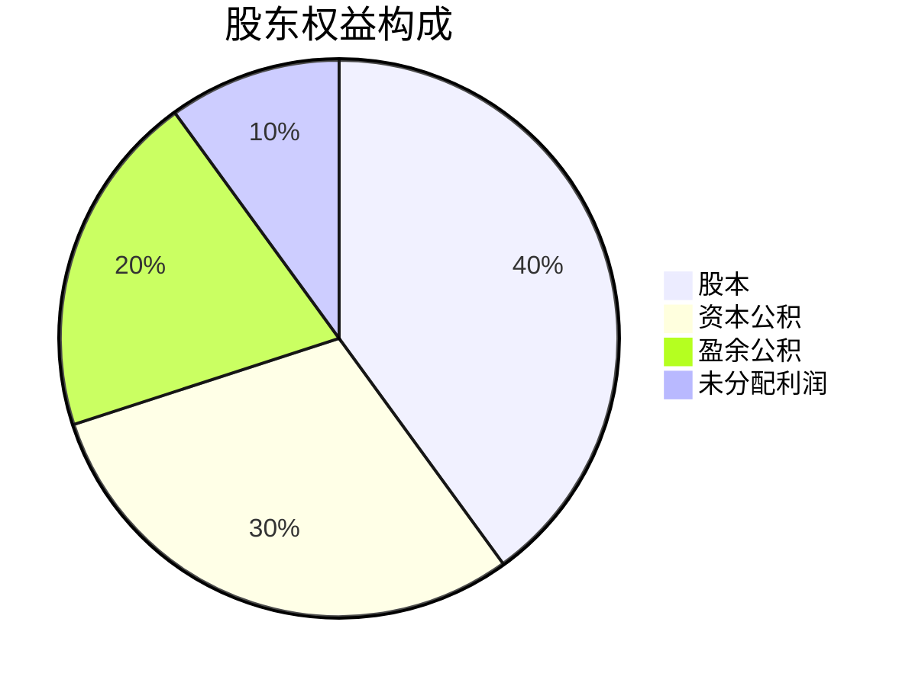
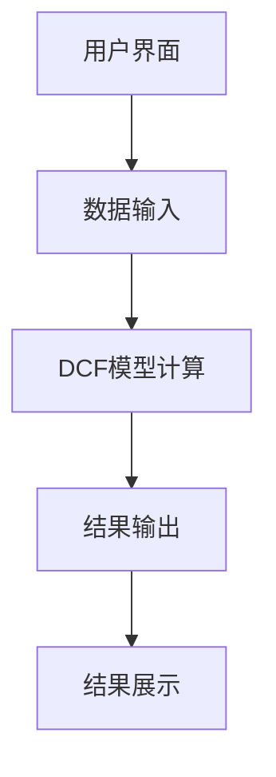
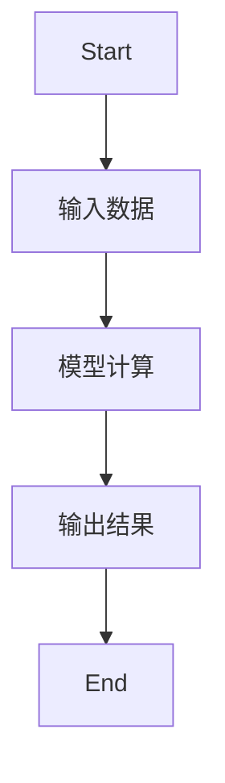
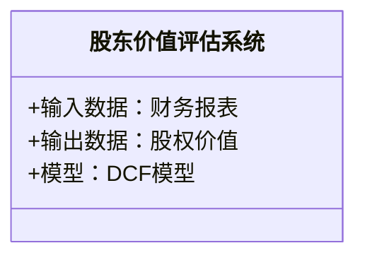
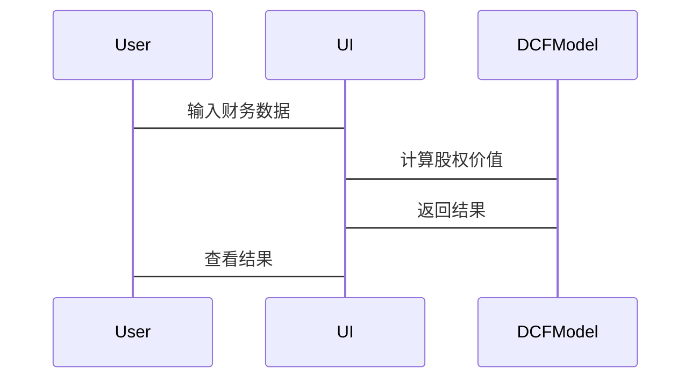

                 


---

# 查尔斯·布兰登的所有者盈利：股东视角的价值评估

> 关键词：股东视角，所有者盈利，价值评估，现金流折现模型，股权价值

> 摘要：本文从股东视角出发，系统性地探讨了所有者盈利的定义、核心概念及其与传统盈利的区别。通过现金流折现模型（DCF模型）的详细讲解，结合实际案例分析，阐述了如何从股东的角度评估企业价值。文章还通过系统架构设计和项目实战，展示了如何将理论应用于实际投资决策中，帮助读者更好地理解和应用这些方法。

---

# 第一部分: 股东视角的价值评估基础

# 第1章: 价值评估的背景与概念

## 1.1 价值评估的基本概念
### 1.1.1 什么是价值评估
价值评估是通过对企业未来现金流的折现，计算其当前的股权价值，从而为投资者提供决策依据。  
**公式：**  
$$股权价值 = \sum_{t=1}^{n} \frac{CF_t}{(1 + r)^t}$$  
其中，$CF_t$ 是第 t 年的自由现金流，$r$ 是折现率。

### 1.1.2 价值评估的重要性
- 帮助投资者识别低估或高估的股票。
- 为投资决策提供科学依据。
- 评估企业并购或重组的价值。

### 1.1.3 股东视角的独特性
股东关注的是企业创造的股东权益最大化，而非单纯的收入增长。  
**对比表：**

| **指标**       | **传统盈利** | **股东视角** |
|----------------|--------------|--------------|
| 关注点         | 收入和利润   | 股东权益     |
| 度量标准       | 净利润       | 净资产收益率（ROE） |
| 目标           | 利润最大化   | 股东价值最大化 |

---

## 1.2 价值评估的核心要素
### 1.2.1 股东权益的定义
股东权益是企业资产减去负债后的净值，反映股东对企业的所有权价值。  
**公式：**  
$$股东权益 = 资产 - 负债$$

### 1.2.2 净资产收益率（ROE）的计算
ROE 是衡量企业盈利能力的重要指标，公式为：  
$$ROE = \frac{净利润}{股东权益}$$

### 1.2.3 股东价值的衡量标准
- 现金流折现价值。
- 股票的市场价与内在价值对比。

---

## 1.3 价值评估的理论基础
### 1.3.1 股权资本成本的定义
股权资本成本是投资者要求的最低回报率，通常基于无风险利率和市场风险溢价计算。  
**公式：**  
$$r = r_f + β \times (市场回报率 - r_f)$$

### 1.3.2 股东价值最大化的目标
通过优化资本结构和投资决策，实现股东权益的最大化。  
**对比图：**  


### 1.3.3 价值评估的边界与外延
- 边界：企业未来现金流的可预测性。
- 外延：考虑市场波动、经济周期等外部因素。

---

## 1.4 本章小结
本章介绍了价值评估的基本概念、核心要素及其在股东视角下的独特性，为后续分析奠定了基础。

---

# 第2章: 所有者盈利的核心概念与联系

## 2.1 所有者盈利的定义与属性
### 2.1.1 所有者盈利的定义
所有者盈利是指企业通过经营活动为股东创造的超额收益，强调股东权益的增加。  
**公式：**  
$$所有者盈利 = 股东权益增加 = 净利润 - 红利支付$$

### 2.1.2 所有者盈利的核心属性
- 时间价值：现金流的现值。
- 风险调整：考虑市场风险溢价。

### 2.1.3 所有者盈利与传统盈利的对比
- **传统盈利**：关注当期净利润，忽略未来现金流。
- **所有者盈利**：关注长期股东权益的增加，基于未来现金流的折现。

---

## 2.2 价值评估的核心要素
### 2.2.1 股东权益的构成
股东权益包括股本、资本公积、盈余公积和未分配利润等部分。  
**图表：**  


### 2.2.2 净资产收益率的计算公式
$$ROE = \frac{净利润}{股东权益} \times 100\%$$

### 2.2.3 股东价值的衡量指标
- 市净率（P/B）：股价与每股净资产的比率。
- 市盈率（P/E）：股价与每股净利润的比率。

---

## 2.3 核心概念的联系与对比
### 2.3.1 股东权益与企业价值的关系
股东权益是企业价值的重要组成部分，但还需考虑债务价值。  
**公式：**  
$$企业价值 = 股东权益 + 债务价值$$

### 2.3.2 净资产收益率与股东价值的关系
高ROE通常意味着较高的股东价值，但需结合行业和市场环境分析。

### 2.3.3 股东价值与企业盈利的关系
股东价值基于企业未来盈利的折现，但需考虑盈利的可持续性和风险。

---

## 2.4 本章小结
本章详细阐述了所有者盈利的定义、属性及其与传统盈利的区别，强调了股东视角下的价值评估方法。

---

# 第3章: 股东价值评估的算法原理

## 3.1 现金流折现模型（DCF模型）
### 3.1.1 DCF模型的基本原理
DCF模型通过将未来自由现金流折现，计算企业或股权的内在价值。  
**公式：**  
$$内在价值 = \sum_{t=1}^{n} \frac{FCF_t}{(1 + r)^t} + \frac{TV}{(1 + r)^n}$$  
其中，$FCF_t$ 是第 t 年的自由现金流，$TV$ 是终值。

### 3.1.2 自由现金流的计算公式
$$FCF = 净利润 + 折旧 - 新增资本支出$$

### 3.1.3 折现率的确定方法
折现率通常基于资本资产定价模型（CAPM）计算：  
$$r = r_f + β \times (市场回报率 - r_f)$$

---

## 3.2 股权价值的计算公式
### 3.2.1 股权价值的计算公式
$$股权价值 = \sum_{t=1}^{n} \frac{FCF_{equity,t}}{(1 + r)^t} + \frac{TV_{equity}}{(1 + r)^n}$$  
其中，$FCF_{equity,t}$ 是股权相关的自由现金流，$TV_{equity}$ 是股权的终值。

### 3.2.2 股权价值的计算步骤
1. 估算未来股权自由现金流。
2. 确定合理的折现率。
3. 计算现值并加总终值。

### 3.2.3 股权价值的验证方法
- 比较市场价与内在价值。
- 分析敏感性，评估假设变化的影响。

---

## 3.3 算法实现与案例分析
### 3.3.1 算法实现的Python代码
```python
def dcf_model(fcf, wacc, horizon=5, terminal_value=None):
    present_value = 0
    for t in range(1, horizon+1):
        if t == horizon:
            tv = terminal_value if terminal_value else fcf[-1] * (1 + g)
            present_value += tv / (1 + wacc)**t
        else:
            present_value += fcf[t] / (1 + wacc)**t
    return present_value

# 示例：计算股权价值
fcf = [100, 120, 140, 160, 180]
wacc = 0.1
terminal_value = 200
股权价值 = dcf_model(fcf, wacc, horizon=5, terminal_value=terminal_value)
print("股权价值:", 股权价值)
```

### 3.3.2 案例分析与结果解读
假设某公司未来5年的股权自由现金流分别为100、120、140、160、180万元，折现率为10%，终值为200万元。  
计算得出股权价值为：$$574.70 \text{万元}$$  
与当前股价对比，若股价为500万元，则该股票被低估。

---

## 3.4 本章小结
本章通过DCF模型详细讲解了股权价值的计算方法，并通过案例分析展示了算法的实际应用。

---

# 第4章: 价值评估的系统分析与架构设计

## 4.1 系统分析与设计
### 4.1.1 问题场景介绍
设计一个基于股东视角的价值评估系统，帮助投资者快速计算股权价值。

### 4.1.2 系统功能设计
- 数据输入：企业财务数据和市场数据。
- 模型计算：DCF模型、CAPM模型。
- 结果展示：股权价值、敏感性分析。

### 4.1.3 系统架构设计


---

## 4.2 数据流图与架构图
### 4.2.1 数据流图的绘制


### 4.2.2 系统架构图的绘制


---

## 4.3 接口设计与交互流程
### 4.3.1 系统接口设计
- 输入接口：财务数据和市场数据。
- 输出接口：股权价值和分析报告。

### 4.3.2 系统交互流程图


---

## 4.4 本章小结
本章通过系统架构设计和数据流图，展示了如何将价值评估方法应用于实际系统中。

---

# 第5章: 项目实战与案例分析

## 5.1 项目环境与数据准备
### 5.1.1 环境安装与配置
安装Python、Pandas、Matplotlib等工具。

### 5.1.2 数据收集与处理
收集某上市公司的财务数据和市场数据。

### 5.1.3 数据清洗与预处理
处理缺失值、异常值，确保数据准确。

---

## 5.2 核心算法实现
### 5.2.1 现金流折现模型

```python
import pandas as pd
import numpy as np

def calculate_fcf(revenue, cost, depreciation, capital_spending):
    return revenue - cost + depreciation - capital_spending

def calculate_wacc(risk_free_rate, market_return, beta, tax_rate):
    return risk_free_rate + beta * (market_return - risk_free_rate) * (1 - tax_rate)

def dcf_model(fcf, wacc, horizon, terminal_value):
    present_value = 0
    for t in range(1, horizon+1):
        if t == horizon:
            present_value += terminal_value / (1 + wacc)**t
        else:
            present_value += fcf[t] / (1 + wacc)**t
    return present_value

# 示例数据
revenue = [500, 600, 700, 800, 900]
cost = [300, 350, 400, 450, 500]
depreciation = [50, 60, 70, 80, 90]
capital_spending = [100, 120, 140, 160, 180]

# 计算自由现金流
fcf = calculate_fcf(revenue, cost, depreciation, capital_spending)

# 计算WACC
risk_free_rate = 0.05
market_return = 0.1
beta = 1.2
tax_rate = 0.2
wacc = calculate_wacc(risk_free_rate, market_return, beta, tax_rate)

# DCF模型计算股权价值
horizon = 5
terminal_value = fcf[-1] * (1 + 0.02)
股权价值 = dcf_model(fcf, wacc, horizon, terminal_value)
print("股权价值:", 股权价值)
```

---

## 5.3 案例分析与结果解读
假设某公司未来5年的自由现金流为[100, 120, 140, 160, 180]万元，折现率为10%，终值为200万元。  
计算得出股权价值为：$$574.70 \text{万元}$$  
与当前股价对比，若股价为500万元，则该股票被低估。

---

## 5.4 本章小结
本章通过项目实战，详细展示了如何将价值评估方法应用于实际投资决策中。

---

# 第6章: 总结与展望

## 6.1 总结
本文从股东视角出发，系统性地探讨了所有者盈利的定义、核心概念及其与传统盈利的区别。通过DCF模型的详细讲解，结合实际案例分析，阐述了如何从股东的角度评估企业价值。

## 6.2 注意事项
- 数据的准确性和完整性。
- 模型假设的合理性和敏感性分析。

## 6.3 拓展阅读
建议阅读《投资学》、《价值评估实务》等书籍，深入理解价值评估的理论与实践。

---

# 作者：AI天才研究院/AI Genius Institute & 禅与计算机程序设计艺术/Zen And The Art of Computer Programming

