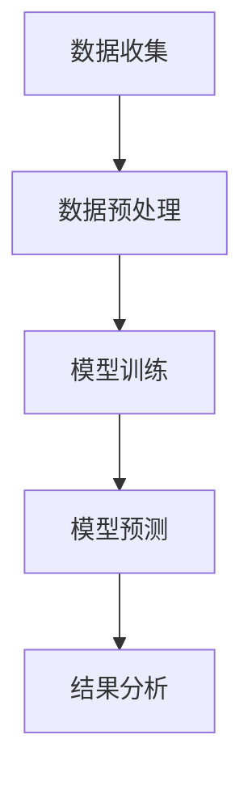
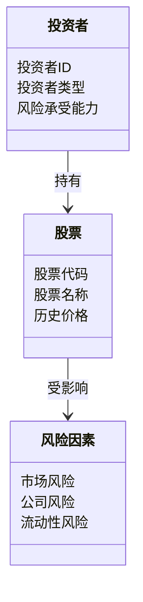
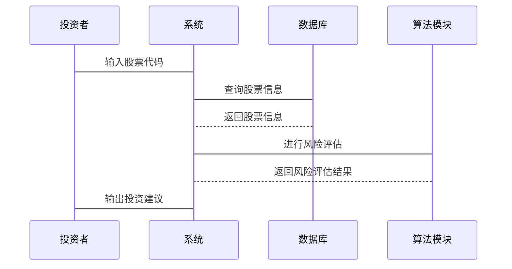

                 


# 特价股票投资中的技术主权风险评估

> 关键词：特价股票，技术主权，风险评估，投资策略，算法原理，系统架构

> 摘要：本文深入探讨了在特价股票投资中，技术主权风险评估的重要性及其具体实现方法。通过分析技术主权的核心概念、算法原理和系统架构，结合实际案例，本文为投资者提供了科学的技术主权风险评估框架，帮助投资者在复杂多变的市场环境中做出明智决策。

---

## 第一部分: 特价股票投资中的技术主权风险评估背景介绍

### 第1章: 特价股票投资概述

#### 1.1 特价股票的定义与特点

##### 1.1.1 特价股票的定义
特价股票是指那些市场价格远低于其内在价值的股票。这类股票通常被市场低估，具有较大的增值潜力。然而，特价股票也伴随着较高的风险，因为其价格波动较大，且可能存在信息披露不完整或公司经营不善的问题。

##### 1.1.2 特价股票的特点
- **价格低估**：市场价格低于公司实际价值。
- **高波动性**：价格波动较大，容易受到市场情绪影响。
- **高风险**：可能存在公司基本面问题或市场流动性不足。
- **高回报潜力**：如果公司基本面改善，股价可能大幅回升。

##### 1.1.3 特价股票的市场定位
特价股票通常出现在以下市场环境：
- **熊市或市场低迷期**：投资者对市场失去信心，股票价格被压低。
- **小盘股或新兴公司**：这些公司的股票可能因市场关注度低而被低估。
- **行业周期性底部**：某些行业在周期性底部时，股票价格可能被低估。

#### 1.2 投资者类型与投资策略

##### 1.2.1 投资者的类型分析
- **价值投资者**：寻找被市场低估的股票，注重公司基本面。
- **趋势投资者**：跟随市场趋势，利用技术分析进行投资。
- **风险投资者**：愿意承担高风险，追求高回报。

##### 1.2.2 不同投资者的策略选择
- 价值投资者倾向于长期持有，等待股价回归合理价值。
- 趋势投资者注重短期价格波动，利用技术指标进行买卖决策。
- 风险投资者可能采用杠杆或高频交易策略，追求高回报。

##### 1.2.3 特价股票投资的特殊性
- 投资者需要具备较高的市场敏感性，能够快速识别被低估的股票。
- 需要综合考虑公司基本面和技术面因素，制定合理的投资策略。

### 第2章: 技术主权风险评估的背景

#### 2.1 技术主权的定义与内涵

##### 2.1.1 技术主权的定义
技术主权是指在技术应用中，主体对技术的控制权和决策权。在投资领域，技术主权风险评估是指通过技术手段，对投资行为中的技术风险进行识别、量化和控制。

##### 2.1.2 技术主权的核心要素
- **技术可控性**：投资者对技术工具的控制能力。
- **技术可解释性**：技术工具的决策过程是否透明。
- **技术安全性**：技术工具是否具备抗干扰和抗攻击能力。

##### 2.1.3 技术主权与投资的关系
技术主权在投资中起着关键作用。投资者需要通过技术手段，对市场风险、公司风险和流动性风险等进行全面评估，以确保投资决策的科学性和安全性。

#### 2.2 技术主权风险评估的必要性

##### 2.2.1 风险评估的重要性
- 投资者需要通过技术手段，对市场风险进行全面评估，以避免重大损失。
- 技术主权风险评估能够帮助投资者制定合理的投资策略，降低投资风险。

##### 2.2.2 技术主权在投资中的作用
- 技术主权风险评估能够帮助投资者识别潜在风险，制定风险控制策略。
- 技术主权风险评估能够提高投资决策的科学性和准确性。

##### 2.2.3 特价股票投资中的技术主权风险
- 特价股票价格波动较大，技术主权风险评估尤为重要。
- 投资者需要通过技术手段，对市场风险、公司风险和流动性风险进行全面评估。

---

## 第二部分: 技术主权风险评估的核心概念与联系

### 第3章: 技术主权风险评估的核心概念

#### 3.1 技术主权风险评估的原理

##### 3.1.1 技术主权风险的构成要素
- **市场风险**：市场波动对股票价格的影响。
- **公司风险**：公司基本面变化对股票价格的影响。
- **流动性风险**：股票流动性不足导致的价格波动。

##### 3.1.2 技术主权风险的评估指标
- **波动率**：股票价格的波动程度。
- **市盈率**：股价与每股收益的比率。
- **市净率**：股价与每股净资产的比率。

##### 3.1.3 技术主权风险的评估方法
- **定量分析**：通过数学模型对股票价格进行预测。
- **定性分析**：通过公司基本面分析，评估股票的投资价值。

#### 3.2 核心概念对比分析

##### 3.2.1 技术主权与投资风险的对比
- 技术主权是投资风险评估的基础，投资风险是技术主权的具体表现。
- 技术主权的评估需要考虑市场、公司和流动性等多个因素。

##### 3.2.2 不同类型股票的技术主权风险对比
- 特价股票风险较高，但回报潜力较大。
- 蓝筹股风险较低，但回报潜力较小。
- 成长股风险较高，但回报潜力较大。

##### 3.2.3 特价股票与其他股票的技术主权风险差异
- 特价股票价格波动较大，市场风险较高。
- 成长股公司基本面变化较大，公司风险较高。
- 蓝筹股市场风险较低，但公司风险较小。

#### 3.3 技术主权风险评估的ER实体关系图

##### 3.3.1 实体关系图的构建
- 投资者：包括个人投资者和机构投资者。
- 股票：包括特价股票、蓝筹股和成长股。
- 风险因素：包括市场风险、公司风险和流动性风险。

##### 3.3.2 实体关系图的解读
- 投资者可以通过技术手段，对股票风险进行全面评估。
- 不同类型股票的风险因素不同，投资者需要根据自身风险承受能力，选择合适的投资策略。

##### 3.3.3 实体关系图的应用
- 投资者可以根据技术主权风险评估结果，制定投资策略。
- 通过技术手段，对市场风险、公司风险和流动性风险进行全面监控。

---

## 第三部分: 技术主权风险评估的算法原理

### 第5章: 技术主权风险评估的算法原理

#### 5.1 算法原理概述

##### 5.1.1 算法选择的依据
- 算法需要能够对股票价格进行预测，帮助投资者识别市场风险。
- 算法需要具备较高的准确性和可解释性，确保投资决策的科学性。

##### 5.1.2 算法的基本原理
- 使用机器学习算法，对历史股票价格进行训练，建立股票价格预测模型。
- 通过技术指标分析，识别股票价格的买卖信号。

##### 5.1.3 算法的优缺点分析
- 优点：能够通过历史数据，发现股票价格的规律，帮助投资者制定投资策略。
- 缺点：市场波动较大，算法预测结果可能不准确。

#### 5.2 算法流程图

##### 5.2.1 算法流程图的绘制


##### 5.2.2 算法流程图的解读
- 数据收集：收集历史股票价格和相关技术指标。
- 数据预处理：对数据进行清洗和标准化处理。
- 模型训练：使用机器学习算法，训练股票价格预测模型。
- 模型预测：利用训练好的模型，对股票价格进行预测。
- 结果分析：分析预测结果，制定投资策略。

##### 5.2.3 算法流程图的应用
- 通过算法流程图，投资者可以系统地进行股票价格预测和风险评估。
- 算法流程图能够帮助投资者制定科学的投资策略，降低投资风险。

#### 5.3 算法实现的Python代码示例

##### 5.3.1 数据收集与预处理
```python
import pandas as pd
import numpy as np
from sklearn.model_selection import train_test_split

# 数据收集
data = pd.read_csv('stock_data.csv')

# 数据预处理
data = data.dropna()
X = data[['open', 'high', 'low', 'volume']]
y = data['close']
```

##### 5.3.2 模型训练与预测
```python
from sklearn.linear_model import LinearRegression

# 模型训练
model = LinearRegression()
model.fit(X_train, y_train)

# 模型预测
y_pred = model.predict(X_test)
```

##### 5.3.3 模型评估
```python
from sklearn.metrics import mean_squared_error

# 模型评估
mse = mean_squared_error(y_test, y_pred)
print(f"均方误差: {mse}")
```

---

## 第四部分: 技术主权风险评估的系统分析与架构设计

### 第6章: 技术主权风险评估的系统分析与架构设计

#### 6.1 系统功能设计

##### 6.1.1 领域模型


##### 6.1.2 系统架构设计


##### 6.1.3 系统接口设计
- 输入接口：投资者输入股票代码和投资金额。
- 输出接口：系统输出股票风险评估结果和投资建议。

##### 6.1.4 系统交互流程


---

## 第五部分: 项目实战

### 第7章: 项目实战

#### 7.1 环境安装

##### 7.1.1 安装Python
```bash
# 安装Python
python --version
```

##### 7.1.2 安装相关库
```bash
pip install pandas numpy scikit-learn
```

#### 7.2 核心代码实现

##### 7.2.1 数据收集与预处理
```python
import pandas as pd
import numpy as np
from sklearn.model_selection import train_test_split
from sklearn.linear_model import LinearRegression
from sklearn.metrics import mean_squared_error

# 数据收集
data = pd.read_csv('stock_data.csv')

# 数据预处理
data = data.dropna()
X = data[['open', 'high', 'low', 'volume']]
y = data['close']

# 数据分割
X_train, X_test, y_train, y_test = train_test_split(X, y, test_size=0.2, random_state=42)
```

##### 7.2.2 模型训练与预测
```python
# 模型训练
model = LinearRegression()
model.fit(X_train, y_train)

# 模型预测
y_pred = model.predict(X_test)

# 模型评估
mse = mean_squared_error(y_test, y_pred)
print(f"均方误差: {mse}")
```

##### 7.2.3 技术指标分析
```python
import talib

# 计算RSI指标
rsi = talib.RSI(data['close'], timeperiod=14)
```

##### 7.2.4 风险评估与投资建议
```python
import pandas as pd
import numpy as np
from sklearn.model_selection import train_test_split
from sklearn.linear_model import LinearRegression
from sklearn.metrics import mean_squared_error

# 数据收集
data = pd.read_csv('stock_data.csv')

# 数据预处理
data = data.dropna()
X = data[['open', 'high', 'low', 'volume']]
y = data['close']

# 数据分割
X_train, X_test, y_train, y_test = train_test_split(X, y, test_size=0.2, random_state=42)

# 模型训练
model = LinearRegression()
model.fit(X_train, y_train)

# 模型预测
y_pred = model.predict(X_test)

# 模型评估
mse = mean_squared_error(y_test, y_pred)
print(f"均方误差: {mse}")
```

#### 7.3 项目总结

##### 7.3.1 项目成功经验
- 通过技术手段，对特价股票风险进行全面评估，帮助投资者制定科学的投资策略。

##### 7.3.2 项目失败教训
- 市场波动较大，算法预测结果可能不准确，投资者需要结合市场实际情况，灵活调整投资策略。

##### 7.3.3 改进建议
- 引入更多的技术指标，提高模型的预测准确性。
- 结合市场情绪分析，进一步优化风险评估模型。

---

## 第六部分: 最佳实践

### 第8章: 最佳实践

#### 8.1 小结
技术主权风险评估是特价股票投资中不可或缺的重要环节。通过技术手段，投资者可以对市场风险、公司风险和流动性风险进行全面评估，制定科学的投资策略，降低投资风险。

#### 8.2 注意事项
- 投资者需要结合市场实际情况，灵活调整投资策略。
- 技术手段只是辅助工具，投资者需要具备丰富的市场经验和判断能力。

#### 8.3 拓展阅读
- 《股票技术分析实战》
- 《风险管理与投资策略》
- 《机器学习在金融中的应用》

---

## 结语

通过本文的深入分析，投资者可以更好地理解特价股票投资中的技术主权风险评估的重要性，并掌握具体的实现方法。希望本文能够为投资者提供科学的技术主权风险评估框架，帮助他们在复杂多变的市场环境中做出明智决策。

---

**作者：AI天才研究院/AI Genius Institute & 禅与计算机程序设计艺术/Zen And The Art of Computer Programming**

