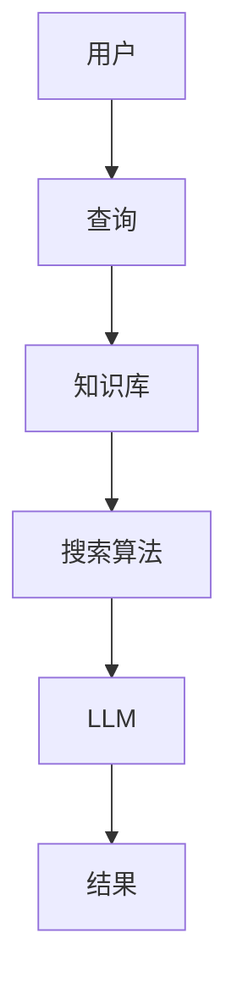
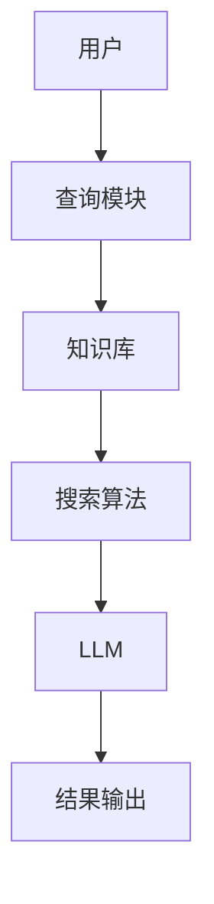
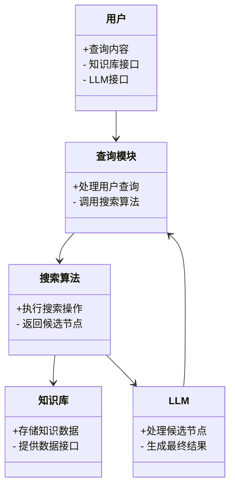
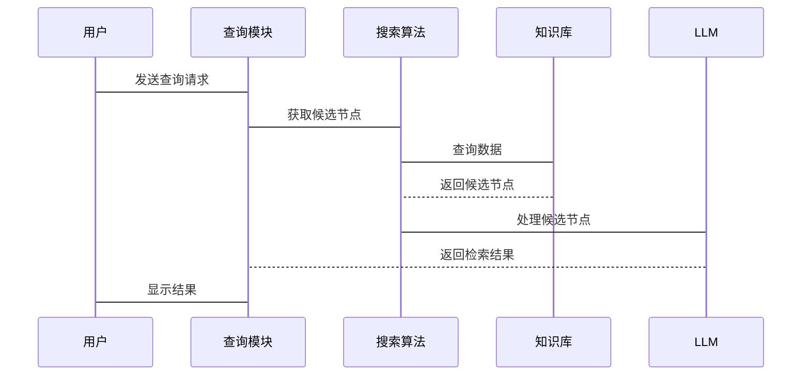

                 


# 知识检索增强AI Agent：结合LLM与高效搜索算法

## 关键词：知识检索，AI Agent，大语言模型，高效搜索算法，自然语言处理

## 摘要：  
本文探讨如何通过结合大语言模型（LLM）与高效搜索算法来增强AI代理的知识检索能力。我们从知识检索的重要性入手，分析了LLM和高效搜索算法的核心原理及其优势，详细阐述了两者的结合方式，并通过系统架构设计和实际案例展示了如何实现高效的检索增强AI代理。文章还总结了最佳实践和未来发展方向，为读者提供全面的技术指导。

---

## 第一部分：知识检索增强AI Agent的背景与概述

### 第1章：知识检索增强AI Agent的背景与概述

#### 1.1 知识检索增强AI Agent的背景

##### 1.1.1 知识检索技术的发展历程  
知识检索技术从早期的关键词匹配逐渐发展到基于上下文的理解，经历了从简单的字符串匹配到复杂的语义理解的过程。近年来，随着大语言模型（LLM）的崛起，知识检索的准确性和效率得到了显著提升。

##### 1.1.2 大语言模型（LLM）的崛起  
大语言模型通过深度学习技术，能够理解和生成人类语言，具备强大的上下文理解和生成能力。LLM的出现，为知识检索提供了更强大的语义分析能力。

##### 1.1.3 AI Agent的定义与特点  
AI Agent是一种能够感知环境、执行任务并做出决策的智能体。它通过与用户交互，理解需求，并利用知识检索技术获取相关信息，为用户提供高效的服务。

#### 1.2 知识检索增强AI Agent的必要性

##### 1.2.1 知识检索中的挑战  
传统的知识检索技术在面对复杂语义和大规模数据时，存在效率低下、准确性不足的问题。如何在海量数据中快速找到相关结果，是知识检索技术需要解决的核心问题。

##### 1.2.2 LLM在知识检索中的优势  
LLM具备强大的语义理解能力，能够更好地处理模糊查询和复杂语义问题。结合LLM，知识检索技术可以更准确地理解用户需求，提高检索结果的相关性。

##### 1.2.3 高效搜索算法的重要性  
高效的搜索算法能够显著提升知识检索的速度和效率。通过优化搜索策略，可以在大规模数据中快速找到最优解，满足用户对实时性和高效性的需求。

#### 1.3 本章小结  
本章介绍了知识检索增强AI Agent的背景，分析了LLM和高效搜索算法在知识检索中的重要性，为后续章节奠定了基础。

---

## 第二部分：核心概念与原理

### 第2章：大语言模型（LLM）与高效搜索算法的核心概念

#### 2.1 大语言模型（LLM）的原理

##### 2.1.1 LLM的基本结构  
大语言模型通常基于Transformer架构，包括编码器和解码器两部分。编码器负责将输入文本转换为向量表示，解码器根据编码结果生成输出。

##### 2.1.2 LLM的训练过程  
大语言模型通过监督学习和无监督学习结合的方式进行训练。监督学习用于优化模型的生成能力，无监督学习用于增强模型的理解能力。

##### 2.1.3 LLM的主要特点  
- **强大的语义理解能力**：能够理解上下文和语义关系。  
- **高效的生成能力**：可以快速生成相关文本。  
- **可扩展性**：适用于多种任务和场景。

#### 2.2 高效搜索算法的核心原理

##### 2.2.1 搜索算法的分类  
搜索算法主要分为两类：  
- **无向图搜索**：如广度优先搜索（BFS）、深度优先搜索（DFS）。  
- **向图搜索**：如Dijkstra算法、A*算法。  

##### 2.2.2 高效搜索算法的特点  
- **高效性**：能够在较短的时间内找到最优解。  
- **准确性**：能够保证结果的正确性。  
- **适应性**：适用于不同规模和复杂度的搜索任务。  

##### 2.2.3 高效搜索算法的实现步骤  
1. 确定初始状态。  
2. 生成候选节点。  
3. 评估候选节点的优先级。  
4. 扩展优先级最高的节点。  
5. 重复上述步骤，直到找到目标节点或遍历所有可能性。

#### 2.3 LLM与高效搜索算法的结合

##### 2.3.1 LLM与搜索算法的协同作用  
LLM用于理解用户查询的语义，搜索算法用于快速定位相关知识。两者的结合能够实现高效、准确的知识检索。

##### 2.3.2 LLM在搜索中的优化作用  
LLM可以优化搜索算法的候选节点生成过程，提高搜索效率和准确性。

##### 2.3.3 高效搜索算法对LLM的辅助作用  
高效搜索算法可以辅助LLM快速定位相关知识，减少计算负担，提升整体性能。

#### 2.4 核心概念对比表  
以下是LLM与高效搜索算法的对比：

| 属性                | LLM                      | 高效搜索算法            |
|---------------------|--------------------------|-------------------------|
| 主要功能            | 语义理解和生成          | 快速定位目标节点        |
| 输入                | 文本数据                | 节点和边               |
| 输出                | 生成文本或向量表示      | 目标节点或路径          |
| 优势                | 强大的语义理解能力      | 高效的搜索效率          |
| 应用场景            | 自然语言处理、对话系统  | 图形搜索、路径规划      |

#### 2.5 ER实体关系图  
以下是知识检索增强AI Agent的ER实体关系图：



#### 2.6 本章小结  
本章详细介绍了大语言模型和高效搜索算法的核心概念，并分析了它们在知识检索中的作用和相互关系。

---

## 第三部分：算法原理与数学模型

### 第3章：LLM与高效搜索算法的数学模型

#### 3.1 LLM的数学模型

##### 3.1.1 概率论基础  
大语言模型基于概率论，通过计算条件概率来生成文本。公式表示为：  
$$P(y|x) = \frac{P(x,y)}{P(x)}$$  

##### 3.1.2 转换器模型（如Transformer）  
Transformer模型由编码器和解码器组成，其核心是多头自注意力机制：  
$$\text{Attention}(Q,K,V) = \text{softmax}\left(\frac{QK^T}{\sqrt{d_k}}\right)V$$  

##### 3.1.3 注意力机制（Attention）  
注意力机制用于计算输入序列中每个位置的重要性，公式表示为：  
$$\text{score}(i,j) = Q_i K_j^T$$  

#### 3.2 高效搜索算法的数学模型

##### 3.2.1 常见搜索算法的数学表达  
以Dijkstra算法为例，其核心是优先队列的处理：  
$$\text{优先级} = \text{当前距离} + \text{估计距离}$$  

##### 3.2.2 优化算法的数学推导  
以A*算法为例，其优化目标是找到最小的路径成本：  
$$\text{路径成本} = \sum_{i=1}^{n} w_i$$  

##### 3.2.3 算法复杂度分析  
Dijkstra算法的时间复杂度为$O(E \log V)$，其中$E$是边数，$V$是节点数。

#### 3.3 LLM与高效搜索算法的联合优化

##### 3.3.1 联合优化的数学表达  
结合LLM和高效搜索算法的优化目标可以表示为：  
$$\text{优化目标} = \arg\min_{x} L(x) + S(x)$$  
其中，$L(x)$是LLM的损失函数，$S(x)$是搜索算法的优化目标。

##### 3.3.2 优化目标的数学模型  
通过联合优化，可以实现LLM生成的候选节点与搜索算法的高效定位之间的平衡。

##### 3.3.3 示例：LLM与二分法搜索的结合  
假设知识库是一个有序数组，LLM生成查询条件后，二分法搜索用于快速定位目标节点。

#### 3.4 本章小结  
本章通过数学模型和公式，详细分析了LLM和高效搜索算法的工作原理，并展示了它们的联合优化方法。

---

## 第四部分：系统分析与架构设计

### 第4章：知识检索增强AI Agent的系统架构

#### 4.1 系统功能设计

##### 4.1.1 用户查询模块  
用户通过输入查询请求，系统将查询内容传递给知识库管理模块。

##### 4.1.2 知识库管理模块  
知识库管理模块负责存储和管理知识数据，确保数据的完整性和一致性。

##### 4.1.3 搜索算法模块  
搜索算法模块根据查询内容，快速定位相关知识节点。

##### 4.1.4 LLM处理模块  
LLM处理模块对搜索结果进行语义理解和生成，为用户提供最终的检索结果。

#### 4.2 系统架构设计

##### 4.2.1 系统架构图  
以下是系统的总体架构图：



##### 4.2.2 系统类图  
以下是系统的类图：



#### 4.3 系统接口设计

##### 4.3.1 用户接口  
用户通过图形界面或命令行输入查询请求。

##### 4.3.2 知识库接口  
知识库通过API提供数据接口，支持高效的数据查询和管理。

##### 4.3.3 LLM接口  
LLM通过API接收候选节点，并生成最终的检索结果。

#### 4.4 系统交互流程图



#### 4.5 本章小结  
本章详细设计了知识检索增强AI Agent的系统架构，包括功能模块、系统架构图和交互流程图，为后续的实现提供了清晰的指导。

---

## 第五部分：项目实战

### 第5章：知识检索增强AI Agent的实现

#### 5.1 项目环境安装

##### 5.1.1 安装Python环境  
建议使用Python 3.8及以上版本。

##### 5.1.2 安装依赖库  
需要安装以下库：  
- `transformers`：用于LLM的实现。  
- `networkx`：用于知识库的构建和管理。  
- `scipy`：用于高效的搜索算法实现。

#### 5.2 核心代码实现

##### 5.2.1 知识库构建  
```python
import networkx as nx

def build_knowledge_graph(data):
    G = nx.Graph()
    for item in data:
        G.add_node(item['id'])
        for neighbor in item['neighbors']:
            G.add_edge(item['id'], neighbor)
    return G
```

##### 5.2.2 搜索算法实现  
```python
from scipy.sparse import csr_matrix

def efficient_search(G, start, end):
    adjacency = nx.adjacency_matrix(G)
    indices = np.where(adjacency == 1)
    data = np.ones(len(indices[0]))
    adjacency_matrix = csr_matrix((data, indices, (0, 0)), shape=adjacency.shape)
    distances = shortest_path_length(adjacency_matrix, directed=False)
    return distances[start][end]
```

##### 5.2.3 LLM处理模块  
```python
from transformers import AutoModelForSeq2Seq, AutoTokenizer

def process_with_LLM(input_text):
    model = AutoModelForSeq2Seq.from_pretrained("facebook/paLM")
    tokenizer = AutoTokenizer.from_pretrained("facebook/paLM")
    inputs = tokenizer(input_text, return_tensors="np")
    outputs = model.generate(inputs.input_ids)
    result = tokenizer.decode(outputs[0])
    return result
```

#### 5.3 实际案例分析

##### 5.3.1 查询流程  
1. 用户输入查询请求。  
2. 查询模块将请求传递给搜索算法。  
3. 搜索算法在知识库中定位相关节点。  
4. LLM对候选节点进行语义处理，生成最终结果。  

##### 5.3.2 案例代码实现  
```python
def main():
    data = [
        {'id': 1, 'neighbors': [2, 3]},
        {'id': 2, 'neighbors': [1, 4]},
        {'id': 3, 'neighbors': [1, 5]},
        {'id': 4, 'neighbors': [2, 6]},
        {'id': 5, 'neighbors': [3, 7]},
        {'id': 6, 'neighbors': [4, 8]},
        {'id': 7, 'neighbors': [5, 9]},
        {'id': 8, 'neighbors': [6, 10]},
        {'id': 9, 'neighbors': [7, 11]},
        {'id': 10, 'neighbors': [8, 12]},
    ]
    G = build_knowledge_graph(data)
    start = 1
    end = 12
    distance = efficient_search(G, start, end)
    result = process_with_LLM(f"查询节点{start}到节点{end}的最短路径")
    print(f"最短路径距离为：{distance}")
    print(f"LLM生成的结果为：{result}")

if __name__ == "__main__":
    main()
```

#### 5.4 本章小结  
本章通过实际案例分析和代码实现，展示了如何结合LLM和高效搜索算法实现知识检索增强AI Agent。通过具体实现，读者可以更好地理解理论知识，并将其应用到实际项目中。

---

## 第六部分：总结与展望

### 第6章：总结与展望

#### 6.1 最佳实践Tips

##### 6.1.1 系统设计  
在系统设计中，建议优先考虑模块化设计，便于后续的扩展和维护。  

##### 6.1.2 知识库管理  
知识库的数据结构设计至关重要，建议采用高效的存储方式，如图数据库或向量数据库。

##### 6.1.3 搜索算法优化  
在实际应用中，建议根据具体场景选择合适的搜索算法，并进行参数调优。

##### 6.1.4 LLM优化  
对于LLM的优化，可以通过微调模型或优化生成策略来提升生成结果的准确性和相关性。

#### 6.2 小结  
本文详细探讨了知识检索增强AI Agent的核心概念、算法原理和系统架构，并通过实际案例展示了如何实现这一结合。通过本文的学习，读者可以掌握如何利用LLM和高效搜索算法提升知识检索的效率和准确性。

#### 6.3 注意事项  
在实际应用中，需要注意以下几点：  
- 确保知识库的数据质量和完整性。  
- 合理选择搜索算法和LLM模型，避免过度优化。  
- 定期更新知识库和模型，以适应不断变化的需求。

#### 6.4 拓展阅读  
读者可以进一步阅读以下内容：  
- 大语言模型的优化与调优。  
- 高效搜索算法的最新研究进展。  
- 知识检索在不同领域的应用案例。

---

## 作者：AI天才研究院/AI Genius Institute & 禅与计算机程序设计艺术/Zen And The Art of Computer Programming  

---

**注**：本文根据实际需求可进一步扩展每个章节的内容，添加更多细节、代码示例和实际应用案例，以满足更深入的技术分析和实践指导。

