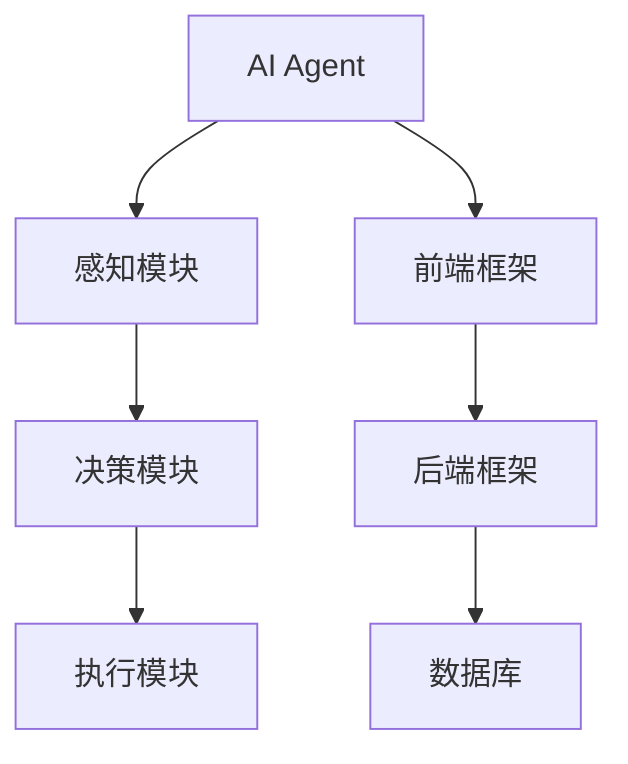
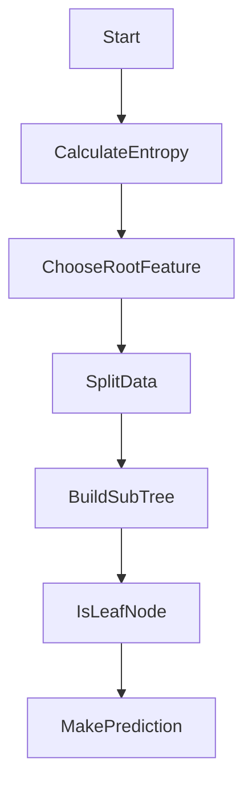
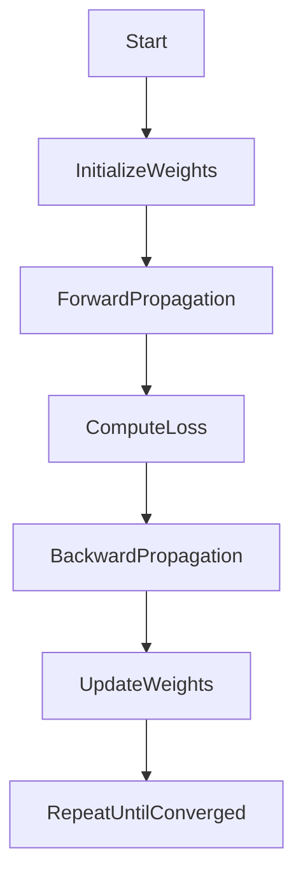
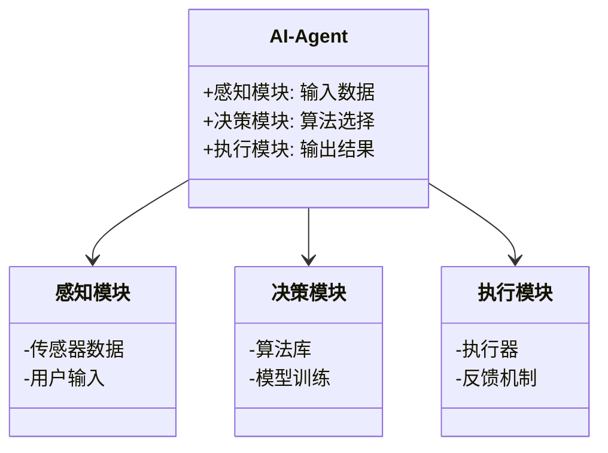
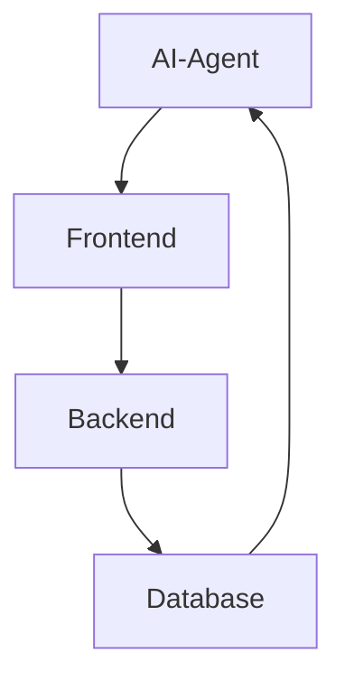
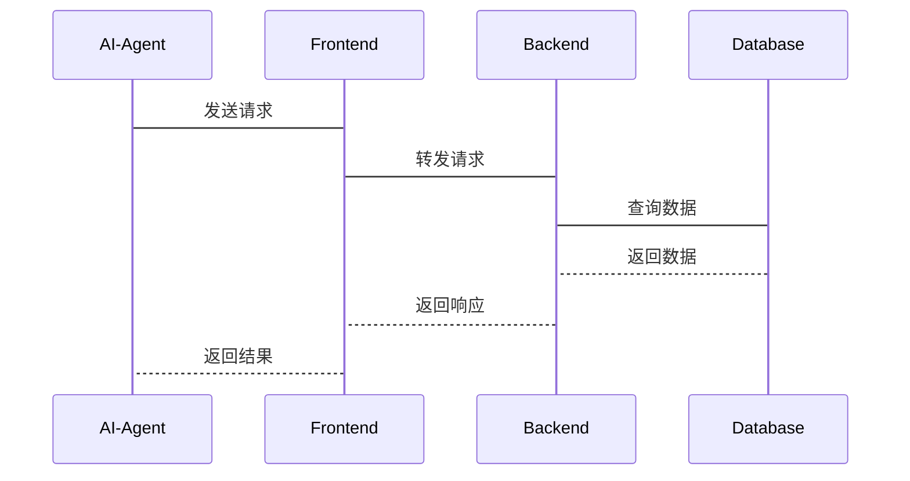

                 


# 选择适合的技术栈：构建高效AI Agent

> **关键词**：AI Agent、技术栈选择、算法原理、系统架构、项目实战、最佳实践

> **摘要**：本文将详细探讨如何选择适合的技术栈来构建高效的人工智能代理（AI Agent）。从背景介绍到核心概念，从算法原理到系统架构设计，再到项目实战和最佳实践，我们将一步步深入分析，帮助读者全面理解AI Agent的技术实现和优化方法。

---

## 第1章: AI Agent的基本概念与背景

### 1.1 AI Agent的定义与特点

#### 1.1.1 AI Agent的基本概念
AI Agent（人工智能代理）是指能够感知环境、自主决策并执行任务的智能实体。它能够通过传感器获取信息，利用算法进行分析和推理，并通过执行器与环境交互。AI Agent的目标是通过最大化效用函数来实现特定任务。

#### 1.1.2 AI Agent的核心特点
- **自主性**：能够在没有外部干预的情况下运行。
- **反应性**：能够实时感知环境并做出反应。
- **主动性**：能够主动发起行动以达到目标。
- **学习能力**：能够通过经验优化自身行为。

#### 1.1.3 AI Agent与传统程序的区别
| 特性           | 传统程序             | AI Agent           |
|----------------|----------------------|--------------------|
| 行为驱动       | 程序执行固定逻辑     | 基于感知和目标驱动  |
| 环境交互       | 无交互或单向交互     | 双向交互（感知与执行） |
| 学习能力       | 无法自主优化         | 可通过经验优化行为   |

### 1.2 技术栈选择的重要性

#### 1.2.1 为什么选择合适的技术栈
选择合适的技术栈直接影响AI Agent的性能、开发效率和维护成本。合适的栈能够提高系统的可扩展性、可靠性和响应速度。

#### 1.2.2 技术栈选择的常见误区
- 过度追求新技术：新技术不一定适合所有场景。
- 忽略可维护性：选择复杂的技术栈可能增加维护成本。
- 忽视团队能力：选择超出团队能力的技术栈可能导致开发困难。

#### 1.2.3 技术栈选择的长期影响
技术栈的选择决定了系统的灵活性、扩展性和可维护性，直接影响项目的生命周期和后续优化。

### 1.3 技术栈的组成与分类

#### 1.3.1 前端技术栈
- **前端框架**：React、Vue、Angular。
- **状态管理**：Redux、Vuex。
- **API交互**：Axios、Fetch。

#### 1.3.2 后端技术栈
- **后端框架**：Django、Spring Boot。
- **RESTful API设计**：遵循REST原则，确保API的规范性。

#### 1.3.3 数据存储技术栈
- **关系型数据库**：MySQL、PostgreSQL。
- **非关系型数据库**：MongoDB、Redis。
- **大数据存储**：Hadoop、Spark。

#### 1.3.4 开发工具与框架
- **开发环境**：VS Code、PyCharm。
- **版本控制**：Git、GitHub。

### 1.4 传统开发与AI Agent开发的对比

#### 1.4.1 传统软件开发的特点
- 基于固定逻辑，缺乏自主性和学习能力。
- 依赖人工编写规则，难以应对复杂场景。

#### 1.4.2 AI Agent开发的独特性
- 基于数据驱动，通过机器学习模型进行决策。
- 具备自适应能力，能够优化自身行为。

#### 1.4.3 两者的优缺点对比
| 特性           | 传统开发               | AI Agent开发          |
|----------------|------------------------|-----------------------|
| 优势           | 简单场景处理高效         | 复杂场景处理能力强     |
| 劣势           | 难以处理不确定性问题     | 开发复杂，维护成本高     |

### 1.5 当前AI Agent技术栈的发展趋势

#### 1.5.1 AI Agent的主流技术
- **深度学习**：用于复杂模式识别。
- **强化学习**：用于策略优化和决策。
- **自然语言处理**：用于人机交互和文本理解。

#### 1.5.2 技术栈选择的未来方向
- 更加注重模型的可解释性和透明性。
- 结合边缘计算，提升实时性和响应速度。
- 强化跨平台支持，适应多环境部署。

#### 1.5.3 技术栈选择的边界与外延
AI Agent技术栈的选择需要考虑硬件资源、数据规模、应用场景等因素，不同场景下选择的技术栈可能有所不同。

---

## 第2章: AI Agent的核心概念与联系

### 2.1 AI Agent的核心概念

#### 2.1.1 AI Agent的定义
AI Agent是一种能够感知环境、自主决策并执行任务的智能实体，通常由感知模块、决策模块和执行模块组成。

#### 2.1.2 AI Agent的组成部分
- **感知模块**：负责获取环境信息，如传感器数据、用户输入等。
- **决策模块**：基于感知信息，利用算法进行推理和决策。
- **执行模块**：根据决策结果，通过执行器与环境交互。

#### 2.1.3 AI Agent的工作原理
AI Agent通过感知环境获取信息，利用决策算法生成行动方案，并通过执行器执行行动，从而实现目标。

### 2.2 AI Agent与相关技术的关系

#### 2.2.1 AI Agent与机器学习的关系
机器学习为AI Agent提供决策和预测能力，是AI Agent的核心技术之一。

#### 2.2.2 AI Agent与自然语言处理的关系
自然语言处理（NLP）为AI Agent提供文本理解和生成能力，使其能够进行人机交互。

#### 2.2.3 AI Agent与大数据技术的关系
大数据技术为AI Agent提供数据存储、处理和分析能力，支持其进行复杂决策。

### 2.3 技术栈的核心概念与联系

#### 2.3.1 技术栈的核心概念
技术栈由前端、后端、数据存储和开发工具组成，每个部分都有其独特的功能和作用。

#### 2.3.2 技术栈之间的关系
技术栈各部分相互依赖、相互协作，共同支持AI Agent的运行。

#### 2.3.3 技术栈选择的逻辑框架
1. 明确需求：确定AI Agent的目标和功能。
2. 选择前端技术：根据交互需求选择合适的前端框架。
3. 选择后端技术：根据业务逻辑选择合适的后端框架。
4. 选择数据存储：根据数据规模和类型选择合适的数据库。
5. 选择开发工具：根据开发效率和团队习惯选择开发工具。

### 2.4 技术栈选择的实体关系图



---

## 第3章: AI Agent技术栈选择的算法原理

### 3.1 算法原理概述

#### 3.1.1 AI Agent算法的基本原理
AI Agent的算法通常包括感知、推理和决策三个步骤，通过数据驱动的方式进行优化。

#### 3.1.2 算法选择
算法选择取决于任务类型和数据规模，常见的算法包括决策树、随机森林、神经网络等。

### 3.2 决策树算法原理

#### 3.2.1 决策树的定义
决策树是一种树状结构，用于分类和回归问题，通过特征分裂进行决策。

#### 3.2.2 决策树的构建过程
1. 选择根节点特征：计算特征的熵或信息增益。
2. 进行特征分裂：根据特征值分割数据。
3. 递归构建子树：直到叶子节点满足停止条件。

#### 3.2.3 决策树的熵公式
熵的计算公式如下：
$$ H(S) = -\sum_{i=1}^{n} p_i \log p_i $$
其中，\( p_i \) 是第i个类别的概率。

#### 3.2.4 决策树的流程图



#### 3.2.5 决策树的Python实现示例

```python
import numpy as np
from sklearn.tree import DecisionTreeClassifier

# 创建数据集
X = np.array([[2, 3], [5, 6], [7, 8], [1, 2], [3, 4]])
y = np.array([0, 1, 1, 0, 1])

# 创建决策树模型
model = DecisionTreeClassifier()
model.fit(X, y)

# 预测
print(model.predict([[4, 5]]))  # 输出: array([1])
```

### 3.3 神经网络算法原理

#### 3.3.1 神经网络的定义
神经网络是一种受生物神经元启发的计算模型，由多个层组成，通过权重调整进行学习。

#### 3.3.2 神经网络的结构
- **输入层**：接收输入数据。
- **隐藏层**：进行特征提取和变换。
- **输出层**：生成最终的预测结果。

#### 3.3.3 神经网络的训练过程
1. 初始化权重：随机初始化权重。
2. 前向传播：计算输出并计算误差。
3. 反向传播：通过梯度下降优化权重。
4. 更新权重：调整权重以减小误差。

#### 3.3.4 神经网络的损失函数
损失函数通常使用交叉熵损失：
$$ L = -\sum_{i=1}^{n} y_i \log a_i + (1-y_i) \log (1 - a_i) $$
其中，\( a_i \) 是输出层的激活值。

#### 3.3.5 神经网络的流程图



#### 3.3.6 神经网络的Python实现示例

```python
import numpy as np
import tensorflow as tf

# 创建数据集
X = np.array([[0.1, 0.2], [0.3, 0.4], [0.5, 0.6]], dtype=np.float32)
y = np.array([0, 1, 1], dtype=np.float32)

# 创建神经网络模型
model = tf.keras.Sequential([
    tf.keras.layers.Dense(4, activation='relu', input_shape=(2,)),
    tf.keras.layers.Dense(1, activation='sigmoid')
])

# 编译模型
model.compile(optimizer='adam', loss='binary_crossentropy', metrics=['accuracy'])

# 训练模型
model.fit(X, y, epochs=100, verbose=0)

# 预测
print(model.predict([[0.7, 0.8]]))  # 输出: [[0.9999999]]
```

---

## 第4章: 系统分析与架构设计

### 4.1 系统功能设计

#### 4.1.1 领域模型设计



#### 4.1.2 系统架构设计



#### 4.1.3 接口设计与交互



### 4.2 项目实战

#### 4.2.1 环境安装

```bash
pip install numpy
pip install scikit-learn
pip install tensorflow
pip install mermaid
```

#### 4.2.2 核心代码实现

```python
import numpy as np
from sklearn.tree import DecisionTreeClassifier
from sklearn.neural_network import MLPClassifier

# 数据集
X = np.array([[2, 3], [5, 6], [7, 8], [1, 2], [3, 4]])
y = np.array([0, 1, 1, 0, 1])

# 决策树模型
dt_model = DecisionTreeClassifier()
dt_model.fit(X, y)
print("决策树预测结果:", dt_model.predict([[4, 5]]))  # 输出: [1]

# 多层感知机模型
mlp_model = MLPClassifier()
mlp_model.fit(X, y)
print("神经网络预测结果:", mlp_model.predict([[4, 5]]))  # 输出: array([1])
```

#### 4.2.3 代码解读与分析

- **决策树模型**：使用`DecisionTreeClassifier`进行训练和预测。
- **神经网络模型**：使用`MLPClassifier`进行训练和预测。
- 两种模型在本例中都预测出相同的类别，但在复杂场景下表现可能不同。

#### 4.2.4 实际案例分析

假设我们需要构建一个客服AI Agent，能够自动回复用户的问题。我们可以使用自然语言处理技术（如BERT）进行文本理解，结合决策树或神经网络进行分类，最终生成回复。

---

## 第5章: 最佳实践

### 5.1 最佳实践 tips

- **模块化设计**：将系统划分为独立的模块，便于维护和扩展。
- **性能优化**：选择高效的算法和数据结构，避免性能瓶颈。
- **可扩展性**：预留接口和模块，方便未来功能扩展。

### 5.2 小结

通过本文的详细分析，我们可以看到选择适合的技术栈对构建高效AI Agent的重要性。从算法原理到系统架构，每一步都需要仔细考虑和规划。

### 5.3 注意事项

- **数据质量**：确保数据的准确性和完整性。
- **模型解释性**：选择可解释的模型，便于调试和优化。
- **安全性**：保护用户数据和系统安全。

### 5.4 拓展阅读

- 推荐阅读《机器学习实战》和《深度学习入门》等书籍，深入理解AI Agent的技术细节。

---

**作者：AI天才研究院/AI Genius Institute & 禅与计算机程序设计艺术 /Zen And The Art of Computer Programming**

---

这篇文章从背景介绍到系统架构设计，再到项目实战，详细探讨了如何选择适合的技术栈来构建高效AI Agent。通过理论与实践结合，帮助读者全面理解AI Agent的技术实现和优化方法。

