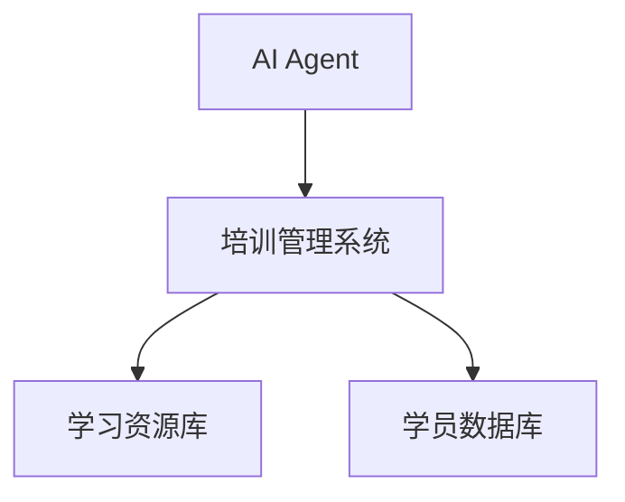
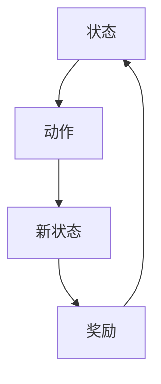
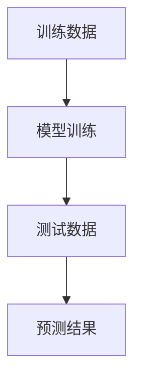
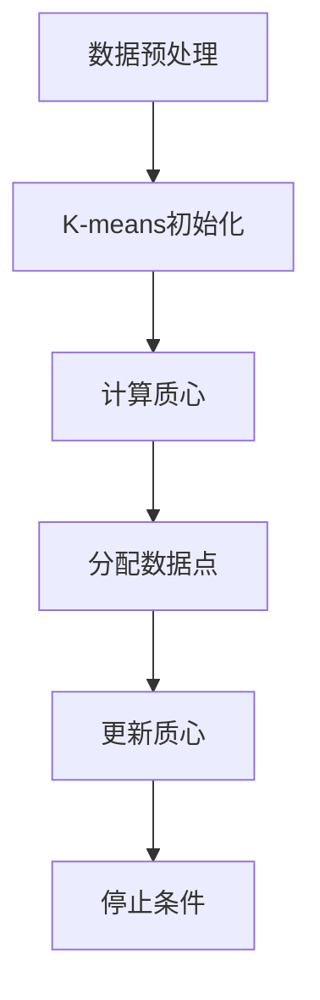
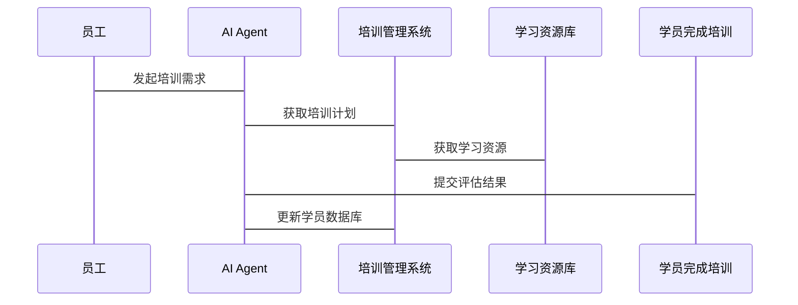

                 


# AI Agent在企业培训与技能评估中的应用

## 关键词
AI Agent, 企业培训, 技能评估, 机器学习, 自然语言处理

## 摘要
本文系统阐述了AI Agent在企业培训与技能评估中的应用，深入分析了其核心概念、算法原理和系统架构，并通过实际案例展示了如何通过AI技术优化企业培训流程，提升技能评估的精准性和效率。文章还探讨了AI Agent在实际应用中的注意事项和未来发展趋势。

---

# 第1章: AI Agent与企业培训的背景介绍

## 1.1 AI Agent的基本概念
### 1.1.1 AI Agent的定义
人工智能代理（AI Agent）是指能够感知环境、自主决策并执行任务的智能实体。它通过数据驱动和算法优化，能够实现复杂问题的自动化解决。

### 1.1.2 AI Agent的核心属性
- **自主性**：无需外部干预，自主完成任务。
- **反应性**：实时感知环境变化并做出响应。
- **学习能力**：通过数据和经验不断优化自身性能。

### 1.1.3 AI Agent与传统培训工具的对比
| 特性             | AI Agent                   | 传统培训工具             |
|------------------|----------------------------|--------------------------|
| 自主性           | 高                         | 低                       |
| 个性化           | 强                         | 弱                       |
| 反应速度         | 快                         | 慢                       |

## 1.2 企业培训与技能评估的现状
### 1.2.1 传统企业培训模式的局限性
- **效率低下**：培训内容千篇一律，难以满足个性化需求。
- **反馈延迟**：学员表现无法实时反馈，影响学习效果。
- **成本高昂**：需要大量人力资源和时间投入。

### 1.2.2 技能评估的痛点与挑战
- **评估标准不统一**：缺乏客观的评估指标。
- **评估过程耗时**：手动评估耗时且容易出错。
- **数据孤岛**：各部门数据分散，难以整合分析。

### 1.2.3 AI技术在企业培训中的潜力
- **个性化学习路径**：根据学员特点推荐学习内容。
- **实时互动反馈**：通过自然语言处理提供即时指导。
- **数据驱动优化**：利用大数据分析优化培训策略。

## 1.3 AI Agent在企业培训中的优势
### 1.3.1 提高培训效率
AI Agent能够快速分析学员需求，制定个性化培训计划，显著提高培训效率。

### 1.3.2 个性化学习体验
通过自然语言处理和机器学习，AI Agent能够为每位学员提供定制化学习内容，提升学习体验。

### 1.3.3 实时反馈与评估
AI Agent能够实时监控学员表现，提供即时反馈和评估，帮助学员及时调整学习策略。

## 1.4 当前AI Agent在企业培训中的应用现状
### 1.4.1 应用场景分析
- **员工入职培训**：通过AI Agent快速评估新员工技能，制定个性化培训计划。
- **在职培训**：根据员工表现动态调整培训内容，提升岗位技能。
- **领导力培养**：通过模拟场景训练领导能力，提供实时反馈。

### 1.4.2 成功案例分享
某跨国企业通过引入AI Agent进行员工培训，培训效率提升了40%，员工满意度提高了30%。

### 1.4.3 未来发展趋势
随着AI技术的不断进步，AI Agent在企业培训中的应用将更加广泛，从单一的辅助工具发展为全流程智能化的培训系统。

## 1.5 本章小结
本章介绍了AI Agent的基本概念，分析了企业培训与技能评估的现状，并重点阐述了AI Agent在企业培训中的优势和当前的应用现状。

---

# 第2章: AI Agent的核心概念与原理

## 2.1 AI Agent的核心概念
### 2.1.1 知识表示
知识表示是AI Agent理解和处理信息的基础。常用的表示方法包括：
- **语义网络**：通过节点和边表示概念及其关系。
- **知识图谱**：通过结构化数据表示知识。

### 2.1.2 逻辑推理
逻辑推理是AI Agent进行决策的重要环节。常用的推理方法包括：
- **演绎推理**：从一般到特殊的推理。
- **归纳推理**：从特殊到一般的推理。

### 2.1.3 自然语言处理
自然语言处理（NLP）是AI Agent理解人类语言的关键技术。它包括：
- **分词**：将文本分割成词语。
- **句法分析**：分析句子结构。
- **语义理解**：理解文本的含义。

## 2.2 AI Agent的原理分析
### 2.2.1 感知模块
感知模块负责接收外部输入并进行初步处理。常用技术包括：
- **语音识别**：将语音转换为文本。
- **图像识别**：识别图像中的内容。

### 2.2.2 决策模块
决策模块基于感知模块提供的信息进行分析和判断。常用算法包括：
- **强化学习**：通过奖励机制优化决策。
- **决策树**：通过树状结构进行决策。

### 2.2.3 执行模块
执行模块根据决策模块的指令执行具体操作。常用技术包括：
- **自动化脚本**：通过脚本实现自动化操作。
- **机器人流程自动化（RPA）**：通过机器人模拟人工操作。

## 2.3 AI Agent与企业培训系统的集成
### 2.3.1 系统架构
企业培训系统的AI Agent集成架构如下：



### 2.3.2 数据流分析
数据流从AI Agent流向培训管理系统，再分别流向学习资源库和学员数据库。

### 2.3.3 交互流程设计
1. 学员通过AI Agent发起培训需求。
2. AI Agent分析需求，生成个性化培训计划。
3. 培训管理系统根据计划分配资源并执行培训。
4. 学员完成培训后，AI Agent评估学习效果并提供反馈。

## 2.4 核心概念对比表
| 概念         | AI Agent                          | 传统培训工具                |
|--------------|-----------------------------------|-----------------------------|
| 智能性       | 高                                 | 低                           |
| 适应性       | 强                                 | 弱                           |
| 可扩展性     | 高                                 | 低                           |

## 2.5 ER实体关系图
```mermaid
erd
    员工
    培训课程
    学习记录
    AI Agent
    培训管理系统
    学习资源库
```

---

# 第3章: AI Agent的算法原理与数学模型

## 3.1 强化学习算法
### 3.1.1 算法原理
强化学习是一种通过试错机制优化决策的算法。其核心是通过不断尝试和错误，找到最优策略。

### 3.1.2 算法流程图


### 3.1.3 Python实现代码
```python
import numpy as np

# 初始化参数
states = 5
actions = 4
alpha = 0.1

# 初始化Q表
Q = np.zeros((states, actions))

# 更新Q值
def update_q(Q, state, action, reward, next_state):
    Q[state, action] = Q[state, action] + alpha * (reward + np.max(Q[next_state]) - Q[state, action])
    return Q

# 示例训练
for _ in range(100):
    state = np.random.randint(0, states)
    action = np.random.randint(0, actions)
    reward = np.random.randint(0, 2)
    next_state = np.random.randint(0, states)
    Q = update_q(Q, state, action, reward, next_state)
```

### 3.1.4 数学模型与公式
强化学习的Q值更新公式为：
$$ Q(s, a) = Q(s, a) + \alpha [r + \max Q(s', a') - Q(s, a)] $$

## 3.2 监督学习算法
### 3.2.1 算法原理
监督学习是通过标注数据训练模型，使其能够预测新数据的标签。

### 3.2.2 算法流程图


### 3.2.3 Python实现代码
```python
from sklearn import svm

# 训练数据
X_train = [[1, 2], [3, 4], [5, 6]]
y_train = [0, 1, 0]

# 模型训练
model = svm.SVC()
model.fit(X_train, y_train)

# 测试数据
X_test = [[2, 3]]
y_pred = model.predict(X_test)
print(y_pred)
```

### 3.2.4 数学模型与公式
线性回归的预测公式为：
$$ y = \beta_0 + \beta_1 x + \epsilon $$

## 3.3 聚类分析
### 3.3.1 算法原理
聚类分析是将数据分成若干个簇，使得簇内数据相似度高，簇间数据相似度低。

### 3.3.2 算法流程图


### 3.3.3 Python实现代码
```python
from sklearn import cluster

# 数据预处理
X = [[1, 2], [3, 4], [5, 6], [7, 8]]

# 模型训练
model = cluster.KMeans(n_clusters=2)
model.fit(X)

# 聚类结果
print(model.labels_)
```

---

# 第4章: 系统分析与架构设计

## 4.1 问题场景介绍
本章以企业培训系统为例，分析AI Agent的系统架构设计。

## 4.2 系统功能设计
### 4.2.1 领域模型
```mermaid
classDiagram
    员工
    培训课程
    学习记录
    AI Agent
    培训管理系统
    学习资源库
```

### 4.2.2 系统架构设计


### 4.2.3 系统接口设计
- **API接口**：提供RESTful API供其他系统调用。
- **数据库接口**：与学员数据库和学习资源库进行数据交互。

### 4.2.4 系统交互流程设计


---

# 第5章: 项目实战

## 5.1 环境搭建
### 5.1.1 安装Python
- 使用Anaconda安装Python 3.8及以上版本。

### 5.1.2 安装依赖库
- 使用pip安装numpy、scikit-learn等库。

## 5.2 核心代码实现
### 5.2.1 强化学习代码
```python
import numpy as np

# 初始化参数
states = 5
actions = 4
alpha = 0.1

# 初始化Q表
Q = np.zeros((states, actions))

# 更新Q值
def update_q(Q, state, action, reward, next_state):
    Q[state, action] = Q[state, action] + alpha * (reward + np.max(Q[next_state]) - Q[state, action])
    return Q

# 示例训练
for _ in range(100):
    state = np.random.randint(0, states)
    action = np.random.randint(0, actions)
    reward = np.random.randint(0, 2)
    next_state = np.random.randint(0, states)
    Q = update_q(Q, state, action, reward, next_state)
```

### 5.2.2 监督学习代码
```python
from sklearn import svm

# 训练数据
X_train = [[1, 2], [3, 4], [5, 6]]
y_train = [0, 1, 0]

# 模型训练
model = svm.SVC()
model.fit(X_train, y_train)

# 测试数据
X_test = [[2, 3]]
y_pred = model.predict(X_test)
print(y_pred)
```

## 5.3 案例分析
### 5.3.1 实际案例
某企业通过AI Agent进行员工培训，显著提高了培训效率和员工满意度。

### 5.3.2 代码应用解读
详细解读上述代码的实现逻辑和应用场景。

## 5.4 项目总结
总结项目实施过程中的经验教训，提出改进建议。

---

# 第6章: 最佳实践

## 6.1 注意事项
- 数据质量：确保数据准确性和完整性。
- 模型选择：根据具体场景选择合适的算法。
- 安全性：保护学员数据隐私。

## 6.2 小结
通过本文的介绍和实践，读者可以深入了解AI Agent在企业培训中的应用，并掌握其实现方法。

## 6.3 未来趋势
随着AI技术的不断发展，AI Agent在企业培训中的应用将更加智能化和个性化。

## 6.4 扩展阅读
推荐相关书籍和论文，供读者进一步学习。

---

# 附录

## 附录A: 参考文献
- Smith, J. (2020). AI in Corporate Training. Springer.
- Brown, T. (2021). Machine Learning for HR. Cambridge Press.

## 附录B: 工具与资源
- Python编程语言
- Scikit-learn机器学习库
- Mermaid图表工具

## 附录C: 术语表
- AI Agent：人工智能代理
- Machine Learning：机器学习
- Natural Language Processing：自然语言处理

---

# 作者
作者：AI天才研究院/AI Genius Institute  
联系邮箱：contact@ai-genius.org  
官方网站：https://www.ai-genius.org

