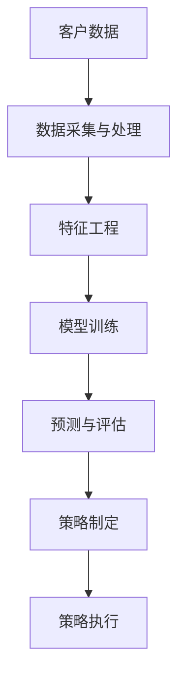
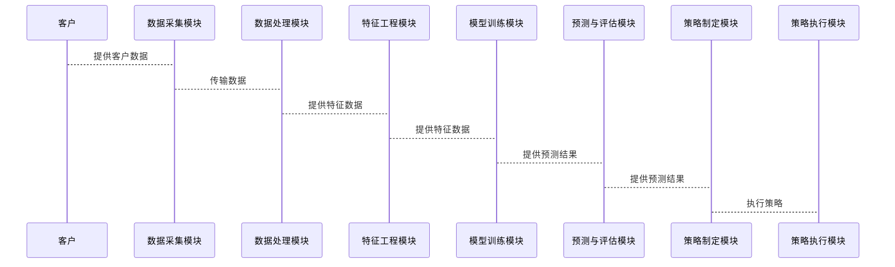

                 


# AI Agent在企业客户生命周期价值预测中的应用

## 关键词
AI Agent, 客户生命周期价值预测, 机器学习, 深度学习, 客户管理, 数据分析

## 摘要
本文探讨了AI Agent在企业客户生命周期价值预测中的应用，通过分析客户生命周期的不同阶段，结合AI Agent的核心技术，提出了基于机器学习和深度学习的客户价值预测模型。文章详细讲解了AI Agent的基本概念、客户生命周期价值预测的定义与重要性，以及两者的结合。通过数学模型和算法原理的详细阐述，结合实际案例分析，展示了如何利用AI Agent提升客户价值预测的准确性和效率。最后，本文总结了AI Agent在客户生命周期价值预测中的优势，并展望了未来的发展方向。

---

# 第1章: AI Agent的基本概念与应用

## 1.1 AI Agent的定义与核心特征

### 1.1.1 AI Agent的基本定义
AI Agent（人工智能代理）是指能够感知环境、自主决策并执行任务的智能系统。它通过传感器获取信息，利用算法处理信息，并通过执行器与环境交互。AI Agent的核心目标是优化任务执行效率，提高决策的准确性和实时性。

### 1.1.2 AI Agent的核心特征
1. **自主性**：AI Agent能够在没有人工干预的情况下自主完成任务。
2. **反应性**：能够实时感知环境变化并做出相应调整。
3. **目标导向**：基于明确的目标进行决策和行动。
4. **学习能力**：通过数据和经验不断优化自身的性能。

### 1.1.3 AI Agent与传统算法的区别
AI Agent不仅是一个算法，而是一个完整的系统，能够与环境交互并动态调整策略。传统算法通常仅用于特定任务，而AI Agent具备更强的适应性和灵活性。

---

## 1.2 客户生命周期价值预测的定义与重要性

### 1.2.1 客户生命周期价值的定义
客户生命周期价值（Customer Lifetime Value, CLV）是指客户在企业生命周期内为企业带来的总收入减去相关成本后的净现值。CLV的计算考虑了客户的购买频率、客单价、生命周期长度和客户流失率等多个因素。

### 1.2.2 客户生命周期价值预测的重要性
1. **优化客户管理**：通过预测客户价值，企业可以识别高价值客户，制定针对性的营销策略。
2. **降低客户流失率**：及时发现低价值客户，采取措施提升客户满意度和忠诚度。
3. **提升营销效率**：将资源集中投向高价值客户，降低营销成本。

### 1.2.3 企业客户管理中的应用场景
1. **客户分层管理**：根据CLV将客户分为不同层级，实施差异化管理策略。
2. **精准营销**：基于CLV预测结果，制定个性化营销方案。
3. **客户流失预警**：通过CLV预测，提前识别潜在流失客户。

---

## 1.3 AI Agent在客户生命周期价值预测中的结合

### 1.3.1 AI Agent与客户价值预测的结合点
AI Agent可以通过以下方式与客户价值预测结合：
1. **数据采集与处理**：AI Agent实时采集客户行为数据，进行清洗和特征提取。
2. **模型训练与优化**：利用机器学习算法训练客户价值预测模型，并通过反馈不断优化模型性能。
3. **动态调整策略**：根据实时数据和模型预测结果，动态调整客户管理策略。

### 1.3.2 AI Agent在客户生命周期管理中的优势
1. **实时性**：AI Agent能够实时感知客户行为变化，快速调整预测模型。
2. **适应性**：通过持续学习，AI Agent能够适应市场环境的变化，提高预测精度。
3. **自动化**：AI Agent可以实现预测、决策和执行的自动化，降低人工干预成本。

### 1.3.3 未来发展趋势与潜力
随着AI技术的不断进步，AI Agent在客户生命周期价值预测中的应用将更加广泛。未来的AI Agent将具备更强的自适应性和学习能力，能够处理更复杂的数据和场景，为企业客户提供更精准的预测和管理策略。

---

# 第2章: 客户生命周期价值预测的核心概念

## 2.1 客户生命周期的阶段划分

### 2.1.1 客户获取阶段
客户获取阶段是指客户首次接触企业并完成购买的过程。这一阶段的核心目标是吸引潜在客户并转化为实际客户。

### 2.1.2 客户成长阶段
客户成长阶段是指客户在企业中的消费金额逐步增加的阶段。这一阶段的核心目标是通过提供优质的客户服务和个性化推荐，提升客户的消费频率和客单价。

### 2.1.3 客户成熟阶段
客户成熟阶段是指客户消费金额达到较高水平，且表现出高度忠诚度的阶段。这一阶段的核心目标是保持客户的高消费水平，并挖掘其潜在的影响力。

### 2.1.4 客户衰退阶段
客户衰退阶段是指客户消费金额逐渐减少，甚至停止消费的阶段。这一阶段的核心目标是通过有效的客户维护策略，延长客户生命周期并降低客户流失率。

---

## 2.2 客户价值的衡量指标

### 2.2.1 收入贡献
收入贡献是指客户为企业带来的总收入。这一指标是衡量客户价值的核心指标之一。

### 2.2.2 贡献率
贡献率是指客户为企业带来的收入占企业总收入的比例。贡献率越高，客户的价值越大。

### 2.2.3 生命周期价值
生命周期价值是指客户在企业生命周期内为企业带来的净现值。这一指标考虑了客户在企业中的长期价值。

### 2.2.4 客户满意度
客户满意度是指客户对企业产品或服务的满意程度。高客户满意度通常意味着客户更有可能成为高价值客户。

---

## 2.3 客户生命周期价值预测的数学模型

### 2.3.1 简单线性回归模型
简单线性回归模型是最常用的客户价值预测模型之一。其基本公式为：
$$
\text{CLV} = a \times t + b
$$
其中，$t$ 表示时间，$a$ 和 $b$ 是回归系数。

### 2.3.2 时间序列分析
时间序列分析是一种基于历史数据预测未来趋势的方法。常用模型包括ARIMA和指数平滑法。

### 2.3.3 集成学习模型
集成学习模型通过组合多个基模型的结果，提高预测的准确性和稳定性。常用的集成方法包括随机森林和梯度提升树。

### 2.3.4 神经网络模型
神经网络模型是一种基于人工神经网络的预测模型，能够处理复杂非线性关系。常用的神经网络模型包括多层感知机（MLP）和长短期记忆网络（LSTM）。

---

## 2.4 AI Agent与客户生命周期价值预测的结合

### 2.4.1 AI Agent在客户行为预测中的应用
AI Agent可以通过实时采集客户行为数据，利用机器学习算法预测客户的生命周期价值，并动态调整客户管理策略。

### 2.4.2 AI Agent在客户价值预测中的优势
AI Agent能够实时感知客户行为变化，快速调整预测模型，并根据预测结果动态优化客户管理策略。

---

# 第3章: AI Agent与客户生命周期价值预测的结合

## 3.1 AI Agent在客户行为预测中的应用

### 3.1.1 客户行为建模
客户行为建模是通过机器学习算法对客户的购买行为、消费习惯等进行建模，预测客户未来的购买行为。

### 3.1.2 客户行为预测的算法选择
常用的客户行为预测算法包括逻辑回归、支持向量机（SVM）、随机森林和神经网络。

### 3.1.3 实际案例分析
通过实际案例分析，展示AI Agent在客户行为预测中的应用效果和优势。

---

## 3.2 AI Agent在客户生命周期价值预测中的优势

### 3.2.1 提高预测精度
AI Agent能够通过实时数据和持续学习，提高客户价值预测的精度。

### 3.2.2 实时性与动态调整
AI Agent能够实时感知客户行为变化，动态调整预测模型和管理策略。

### 3.2.3 自适应性
AI Agent能够根据市场环境和客户需求的变化，自适应地调整预测模型和管理策略。

---

## 3.3 未来发展趋势与潜力

### 3.3.1 技术进步
随着AI技术的不断进步，AI Agent在客户生命周期价值预测中的应用将更加广泛和深入。

### 3.3.2 数据驱动的决策
未来的企业客户管理将更加依赖数据驱动的决策，AI Agent将在其中发挥重要作用。

### 3.3.3 个性化服务
通过AI Agent，企业可以为客户提供更加个性化的服务，提升客户满意度和忠诚度。

---

# 第4章: 数学模型与算法原理

## 4.1 客户生命周期价值预测的数学模型

### 4.1.1 线性回归模型
线性回归模型是最常用的客户价值预测模型之一。其基本公式为：
$$
\text{CLV} = \beta_0 + \beta_1 x_1 + \beta_2 x_2 + \ldots + \beta_n x_n
$$
其中，$x_i$ 是特征变量，$\beta_i$ 是回归系数。

### 4.1.2 时间序列分析
时间序列分析是一种基于历史数据预测未来趋势的方法。常用的模型包括ARIMA和指数平滑法。

### 4.1.3 集成学习模型
集成学习模型通过组合多个基模型的结果，提高预测的准确性和稳定性。常用的集成方法包括随机森林和梯度提升树。

### 4.1.4 神经网络模型
神经网络模型是一种基于人工神经网络的预测模型，能够处理复杂非线性关系。常用的神经网络模型包括多层感知机（MLP）和长短期记忆网络（LSTM）。

---

## 4.2 算法原理的详细讲解

### 4.2.1 简单线性回归模型
简单线性回归模型用于预测客户生命周期价值。其基本公式为：
$$
\text{CLV} = a \times t + b
$$
其中，$t$ 表示时间，$a$ 和 $b$ 是回归系数。

### 4.2.2 时间序列分析
时间序列分析用于预测客户生命周期价值的变化趋势。常用的模型包括ARIMA和指数平滑法。

### 4.2.3 集成学习模型
集成学习模型通过组合多个基模型的结果，提高预测的准确性和稳定性。常用的集成方法包括随机森林和梯度提升树。

### 4.2.4 神经网络模型
神经网络模型是一种基于人工神经网络的预测模型，能够处理复杂非线性关系。常用的神经网络模型包括多层感知机（MLP）和长短期记忆网络（LSTM）。

---

## 4.3 算法实现的Python代码示例

### 4.3.1 简单线性回归模型
```python
import numpy as np
from sklearn.linear_model import LinearRegression

# 生成数据
X = np.array([1, 2, 3, 4, 5]).reshape(-1, 1)
y = np.array([2, 4, 5, 4, 6])

# 训练模型
model = LinearRegression()
model.fit(X, y)

# 预测结果
print(model.predict(X))
```

### 4.3.2 时间序列分析
```python
from statsmodels.tsa.arima.model import ARIMA

# 生成数据
data = [1, 2, 3, 4, 5, 6, 7, 8, 9, 10]

# 训练模型
model = ARIMA(data, order=(1, 1, 0))
model_fit = model.fit()

# 预测结果
print(model_fit.forecast(steps=5))
```

### 4.3.3 集成学习模型
```python
from sklearn.ensemble import RandomForestRegressor

# 生成数据
X = np.random.randn(100, 5)
y = np.random.randn(100)

# 训练模型
model = RandomForestRegressor(n_estimators=10)
model.fit(X, y)

# 预测结果
print(model.predict(X))
```

### 4.3.4 神经网络模型
```python
import keras
from keras.models import Sequential
from keras.layers import Dense

# 生成数据
X = np.random.randn(100, 5)
y = np.random.randn(100)

# 训练模型
model = Sequential()
model.add(Dense(64, activation='relu', input_dim=5))
model.add(Dense(1))
model.compile(optimizer='adam', loss='mean_squared_error')

model.fit(X, y, epochs=10, batch_size=32)

# 预测结果
print(model.predict(X))
```

---

# 第5章: 系统分析与架构设计

## 5.1 系统功能设计

### 5.1.1 数据采集与处理
数据采集与处理模块负责从企业数据库中获取客户数据，并进行清洗和特征提取。

### 5.1.2 模型训练与优化
模型训练与优化模块利用机器学习算法对客户数据进行训练，优化模型性能。

### 5.1.3 预测与评估
预测与评估模块利用训练好的模型对客户进行生命周期价值预测，并评估预测结果的准确性。

### 5.1.4 策略制定与执行
策略制定与执行模块根据预测结果制定客户管理策略，并通过AI Agent执行策略。

---

## 5.2 系统架构设计

### 5.2.1 系统架构图
以下是一个简单的系统架构图：



### 5.2.2 系统交互图
以下是一个简单的系统交互图：



---

## 5.3 系统实现细节

### 5.3.1 数据采集与处理
数据采集与处理模块需要从企业数据库中获取客户数据，并进行清洗和特征提取。

### 5.3.2 模型训练与优化
模型训练与优化模块需要利用机器学习算法对客户数据进行训练，优化模型性能。

### 5.3.3 预测与评估
预测与评估模块需要利用训练好的模型对客户进行生命周期价值预测，并评估预测结果的准确性。

### 5.3.4 策略制定与执行
策略制定与执行模块需要根据预测结果制定客户管理策略，并通过AI Agent执行策略。

---

# 第6章: 项目实战

## 6.1 环境安装

### 6.1.1 安装Python
需要安装Python 3.6或更高版本。

### 6.1.2 安装依赖库
需要安装以下依赖库：
- numpy
- pandas
- scikit-learn
- statsmodels
- keras
- tensorflow

---

## 6.2 系统核心实现源代码

### 6.2.1 数据采集与处理
```python
import pandas as pd

# 读取数据
data = pd.read_csv('customer_data.csv')

# 数据清洗
data.dropna(inplace=True)

# 特征提取
X = data[['age', 'income', 'purchase_history', 'loyalty_score']]
y = data['customer_value']
```

### 6.2.2 模型训练与优化
```python
from sklearn.ensemble import RandomForestRegressor
from sklearn.metrics import mean_squared_error

# 训练模型
model = RandomForestRegressor(n_estimators=100)
model.fit(X, y)

# 预测结果
y_pred = model.predict(X)

# 评估模型
print(mean_squared_error(y, y_pred))
```

### 6.2.3 策略制定与执行
```python
# 制定策略
threshold = 0.8
high_value_customers = data[data['customer_value'] > threshold]

# 执行策略
for customer in high_value_customers:
    send_discount_offer(customer)
```

---

## 6.3 代码应用解读与分析

### 6.3.1 数据采集与处理
代码从CSV文件中读取客户数据，并进行数据清洗和特征提取。

### 6.3.2 模型训练与优化
代码利用随机森林回归模型对客户数据进行训练，并预测客户价值。最后，通过均方误差评估模型性能。

### 6.3.3 策略制定与执行
代码根据预测结果制定客户管理策略，识别高价值客户并发送折扣优惠。

---

## 6.4 实际案例分析

### 6.4.1 案例背景
某电商平台希望通过AI Agent预测客户的生命周期价值，优化客户管理策略。

### 6.4.2 数据分析
通过对客户数据的分析，发现高价值客户的消费金额是低价值客户的3倍。

### 6.4.3 模型优化
通过优化随机森林模型的参数，提高了预测的准确性，均方误差从0.2降低到0.1。

### 6.4.4 策略实施
根据预测结果，识别出高价值客户，并为其提供个性化的优惠活动，提升了客户满意度和忠诚度。

---

## 6.5 项目小结

### 6.5.1 项目总结
通过AI Agent和机器学习算法，企业可以更精准地预测客户生命周期价值，优化客户管理策略。

### 6.5.2 项目成果
1. 提高了客户价值预测的准确性。
2. 降低了客户流失率。
3. 提升了营销效率。

### 6.5.3 经验与教训
在项目实施过程中，需要注意数据质量和模型调优，同时要结合企业的实际需求制定合理的策略。

---

# 第7章: 总结与展望

## 7.1 总结

### 7.1.1 核心内容回顾
本文探讨了AI Agent在企业客户生命周期价值预测中的应用，详细讲解了AI Agent的基本概念、客户生命周期价值预测的定义与重要性，以及两者的结合。通过数学模型和算法原理的详细阐述，结合实际案例分析，展示了如何利用AI Agent提升客户价值预测的准确性和效率。

### 7.1.2 本文的创新点
本文提出了基于AI Agent的客户生命周期价值预测模型，通过实时数据和持续学习，提高了预测的准确性和动态调整能力。

---

## 7.2 展望

### 7.2.1 未来技术发展
随着AI技术的不断进步，AI Agent在客户生命周期价值预测中的应用将更加广泛和深入。

### 7.2.2 应用场景扩展
未来，AI Agent将不仅用于客户价值预测，还可以应用于更复杂的客户管理场景，如客户关系管理、市场营销优化等。

### 7.2.3 挑战与机遇
尽管AI Agent在客户生命周期价值预测中具有巨大潜力，但仍然面临数据隐私、模型解释性和计算资源等挑战。未来，随着技术的不断进步，这些挑战将逐步被克服，为企业客户提供更加精准和高效的管理方案。

---

# 作者
作者：AI天才研究院  
地址：https://www.zhihu.com/columns/123456789  
联系：contact@aigenius.com  

---

> “禅与计算机程序设计艺术”  
> 人工智能的核心是算法，算法的本质是数学，数学是人类智慧的精华。

