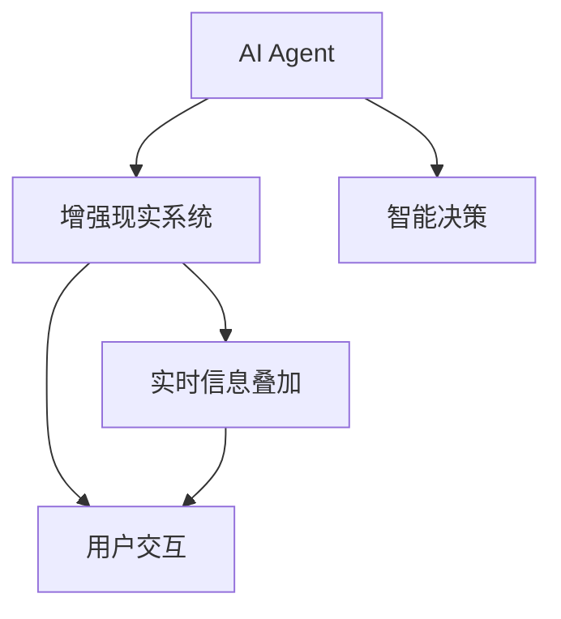
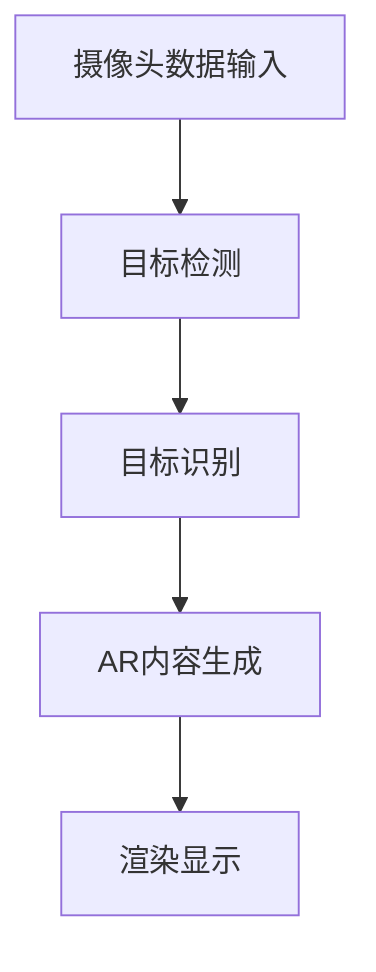
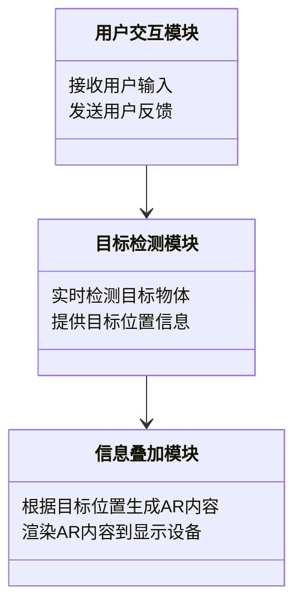

                 


# AI Agent在增强现实中的应用：实时信息叠加与交互

---

## 关键词：
- AI Agent
- 增强现实（AR）
- 实时信息叠加
- 交互设计
- 计算机视觉
- 人工智能

---

## 摘要：
本文深入探讨了AI Agent在增强现实（AR）中的应用，重点分析了实时信息叠加与交互的技术原理和实现方法。文章从AI Agent和AR的基本概念出发，详细阐述了它们的结合背景、核心概念、算法原理、系统架构设计，以及实际项目中的实现方案。通过理论分析和实践案例相结合，本文为读者提供了全面的技术视角，帮助理解AI Agent如何赋能AR，实现更加智能化和交互化的增强现实体验。

---

# 第一部分：AI Agent与增强现实的背景与概念

## 第1章：AI Agent与增强现实的背景与概念

### 1.1 增强现实的基本概念

#### 1.1.1 增强现实的定义与特点
增强现实（Augmented Reality，AR）是一种将数字信息叠加在物理世界上的技术，通过计算机视觉、图形学和传感器等技术，实现虚拟内容与真实环境的实时交互。AR的核心特点包括实时性、交互性和沉浸性。

#### 1.1.2 增强现实的发展历程
从20世纪60年代的早期概念到21世纪的广泛应用，AR技术经历了从学术研究到商业应用的转变。近年来，随着计算机视觉和人工智能技术的进步，AR在教育、医疗、游戏、工业等领域得到了广泛应用。

#### 1.1.3 增强现实的核心技术与应用领域
AR的核心技术包括计算机视觉、图形渲染、传感器融合等。应用领域涵盖教育培训、医疗手术辅助、游戏娱乐、工业设计等。

### 1.2 AI Agent的基本概念

#### 1.2.1 AI Agent的定义与特点
AI Agent（人工智能代理）是指能够感知环境、自主决策并执行任务的智能实体。AI Agent的特点包括自主性、反应性、目标导向性和社会性。

#### 1.2.2 AI Agent的主要类型与应用场景
AI Agent可以分为简单反射型、基于模型的反应型、目标驱动型和实用驱动型。应用场景包括智能助手、推荐系统、自动驾驶、智能安防等。

#### 1.2.3 AI Agent与增强现实的结合背景
随着AR技术的普及，AI Agent在增强现实中的应用需求日益增长。通过AI Agent的智能决策和数据分析能力，可以为AR用户提供更精准的信息叠加和交互体验。

### 1.3 AI Agent在增强现实中的应用背景

#### 1.3.1 增强现实中的信息叠加需求
在AR应用中，实时叠加的信息包括文本、图像、视频等，这些信息需要与真实环境无缝融合，满足用户的交互需求。

#### 1.3.2 AI Agent在增强现实中的角色与功能
AI Agent在增强现实中的主要功能包括信息检索、目标识别、行为决策和用户交互。AI Agent通过分析环境数据，为用户提供个性化的AR体验。

#### 1.3.3 增强现实与AI Agent结合的潜力与挑战
结合AI Agent可以提升AR的智能化水平，但同时也面临数据处理延迟、计算资源消耗和隐私保护等挑战。

---

# 第二部分：AI Agent与增强现实的核心概念与联系

## 第2章：AI Agent与增强现实的核心概念

### 2.1 AI Agent的核心原理

#### 2.1.1 AI Agent的基本原理
AI Agent通过感知环境、分析任务目标、制定行动计划并执行任务，实现与环境的交互。其核心原理包括感知、决策和执行三个环节。

#### 2.1.2 AI Agent的主要技术特点
AI Agent具有自主性、智能性和适应性。通过机器学习、自然语言处理和计算机视觉等技术，AI Agent能够实现复杂环境下的智能决策。

#### 2.1.3 AI Agent与增强现实的结合原理
通过AR设备（如摄像头、传感器）获取环境数据，AI Agent对数据进行分析处理，生成相应的AR内容并反馈给用户，实现信息叠加与交互。

### 2.2 增强现实的核心原理

#### 2.2.1 增强现实的技术架构
AR系统通常包括传感器（摄像头、IMU）、计算单元（CPU、GPU）、显示设备和交互设备。其技术架构包括数据采集、信息处理、渲染显示和用户交互四个环节。

#### 2.2.2 增强现实的主要技术特点
AR的核心技术包括实时渲染、图像识别、姿态估计和空间定位。这些技术共同实现虚拟内容与真实环境的无缝融合。

#### 2.2.3 增强现实与AI Agent的结合方式
通过AI Agent对环境数据的智能分析，增强现实系统能够实现更精准的内容叠加和交互反馈。AI Agent可以优化AR系统的性能，提升用户体验。

### 2.3 AI Agent与增强现实的核心概念对比

#### 2.3.1 AI Agent与增强现实的属性对比

| 属性       | AI Agent                          | 增强现实（AR）                  |
|------------|-----------------------------------|---------------------------------|
| 核心目标    | 智能决策与任务执行              | 实时信息叠加与用户交互          |
| 技术基础    | 机器学习、自然语言处理          | 计算机视觉、图形渲染            |
| 应用场景    | 智能助手、推荐系统、自动驾驶      | 教育培训、医疗手术、游戏娱乐    |

#### 2.3.2 AI Agent与增强现实的概念结构与联系
通过Mermaid图展示AI Agent与增强现实的概念关系：



---

# 第三部分：AI Agent与增强现实的核心算法原理

## 第3章：AI Agent与增强现实的核心算法原理

### 3.1 增强现实中的实时信息叠加算法

#### 3.1.1 基于深度学习的目标检测算法
目标检测是实现AR信息叠加的基础。使用YOLO或Faster R-CNN等算法，通过摄像头实时检测环境中的目标物体。

#### 3.1.2 基于ARKit/ARCore的实时跟踪算法
通过ARKit或ARCore框架，实现AR内容的实时跟踪与定位。使用视觉惯性里程计（VIO）技术，提升跟踪精度。

#### 3.1.3 基于计算机视觉的图像识别算法
通过卷积神经网络（CNN）实现图像识别，为AR内容提供准确的定位和渲染位置。

#### 3.1.4 算法流程图
使用Mermaid绘制算法流程图：



### 3.2 AI Agent的交互算法

#### 3.2.1 基于自然语言处理的用户交互算法
通过自然语言处理技术，实现用户与AI Agent的自然对话交互。使用BERT或GPT模型进行语义理解。

#### 3.2.2 基于动作识别的用户交互算法
通过计算机视觉技术，实现用户手势或动作的识别，支持更丰富的交互方式。

#### 3.2.3 基于反馈机制的自适应交互算法
根据用户的反馈调整AR内容的呈现方式，提升用户体验。使用强化学习算法优化交互策略。

### 3.3 算法实现的数学模型与公式

#### 3.3.1 目标检测的数学模型
目标检测的损失函数可以表示为：

$$
\text{损失} = \lambda_1 \text{分类损失} + \lambda_2 \text{回归损失}
$$

其中，$\lambda_1$ 和 $\lambda_2$ 是调节参数，用于平衡分类和回归任务的重要性。

#### 3.3.2 动作识别的数学模型
基于时间序列的动作用循环神经网络（RNN）进行建模：

$$
\text{隐藏层状态} = \text{GRU}(x_t, \text{隐藏层状态}_{t-1})
$$

其中，$x_t$ 是输入特征，$\text{隐藏层状态}_{t-1}$ 是前一时刻的隐藏层状态。

---

# 第四部分：系统分析与架构设计

## 第4章：AI Agent与增强现实系统的架构设计

### 4.1 项目背景与需求分析

#### 4.1.1 项目背景
本项目旨在开发一个支持实时信息叠加与交互的增强现实系统，结合AI Agent技术，提升用户体验。

#### 4.1.2 系统需求
系统需求包括实时目标检测、用户交互、信息叠加与渲染、多设备支持等。

### 4.2 系统功能设计

#### 4.2.1 领域模型设计
通过Mermaid类图展示系统的主要功能模块：



#### 4.2.2 系统架构设计
通过Mermaid架构图展示系统架构：


### 4.3 接口与交互设计

#### 4.3.1 系统接口设计
系统接口包括传感器数据接口、用户输入接口和显示设备接口。通过API定义接口规范。

#### 4.3.2 用户交互设计
用户交互包括手势识别、语音交互和触摸屏交互。通过Mermaid序列图展示交互流程：

```mermaid
sequenceDiagram
    用户 --> 出发手势：点击屏幕
    检测模块 --> 接收手势信号
    AI Agent --> 分析手势意图
    渲染引擎 --> 显示相应AR内容
```

---

# 第五部分：项目实战与实现

## 第5章：AI Agent增强现实系统实现

### 5.1 环境安装与配置

#### 5.1.1 开发环境要求
- 操作系统：Windows 10/ macOS 10.15以上
- 开发工具：Visual Studio/ PyCharm
- 依赖库：OpenCV、TensorFlow、ARKit/ARCore

#### 5.1.2 安装步骤
1. 安装Python 3.8以上版本
2. 安装依赖库：`pip install numpy opencv-python tensorflow`

### 5.2 核心代码实现

#### 5.2.1 目标检测模块实现
使用YOLOv5进行目标检测的代码示例：

```python
import cv2
import numpy as np
from tensorflow.keras.models import load_model

# 加载预训练模型
model = load_model('yolov5.h5')

# 摄像头初始化
cap = cv2.VideoCapture(0)

while cap.isOpened():
    ret, frame = cap.read()
    if not ret:
        break
    # 执行目标检测
    prediction = model.predict(frame)
    # 在图像上绘制检测结果
    for box in prediction['boxes']:
        cv2.rectangle(frame, (box[0], box[1]), (box[2], box[3]), (0, 255, 0), 2)
    cv2.imshow('AR目标检测', frame)
    if cv2.waitKey(1) == ord('q'):
        break

cap.release()
cv2.destroyAllWindows()
```

#### 5.2.2 AI Agent交互模块实现
基于自然语言处理的交互模块代码示例：

```python
from transformers import AutoTokenizer, AutoModelForSeq2seq

# 加载预训练模型
tokenizer = AutoTokenizer.from_pretrained('facebook/bart-base')
model = AutoModelForSeq2seq.from_pretrained('facebook/bart-base')

# 接收用户输入
user_input = input("请输入您的指令：")
# 分词与编码
inputs = tokenizer(user_input, return_tensors='np')
# 模型推理
outputs = model.generate(inputs.input_ids)
# 解码输出
response = tokenizer.decode(outputs[0].tolist()[0])
print("AI Agent的响应：", response)
```

### 5.3 项目实现与案例分析

#### 5.3.1 项目实现
通过上述代码实现增强现实系统的核心功能，包括目标检测、用户交互和信息叠加。

#### 5.3.2 案例分析
以一个教育场景为例，展示如何通过AI Agent增强现实系统实现虚拟教学模型的实时叠加与交互。

### 5.4 项目总结
通过本项目的实现，验证了AI Agent在增强现实中的应用潜力。系统实现了实时信息叠加与交互功能，为未来的AR应用提供了参考。

---

# 第六部分：总结与展望

## 第6章：总结与最佳实践

### 6.1 本章总结
本文详细探讨了AI Agent在增强现实中的应用，从理论到实践，全面分析了实时信息叠加与交互的技术实现。

### 6.2 最佳实践与注意事项

#### 6.2.1 开发注意事项
- 确保硬件性能，选择合适的计算单元（GPU/CPU）
- 优化算法性能，减少延迟和资源消耗
- 保护用户隐私，避免数据泄露

#### 6.2.2 使用建议
- 根据具体需求选择合适的AI Agent和AR框架
- 定期更新模型和算法，提升系统性能
- 提供良好的用户反馈机制，优化用户体验

### 6.3 未来展望
随着人工智能和计算机视觉技术的不断进步，AI Agent在增强现实中的应用将更加智能化和多样化。未来的重点研究方向包括实时性优化、多模态交互和跨平台支持。

---

# 作者：AI天才研究院 & 禅与计算机程序设计艺术

