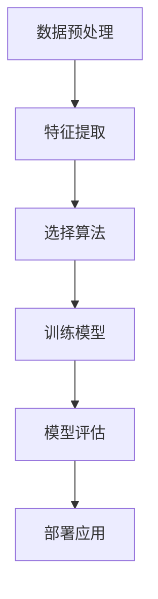
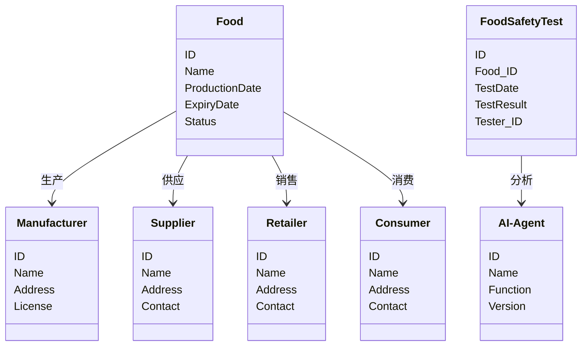
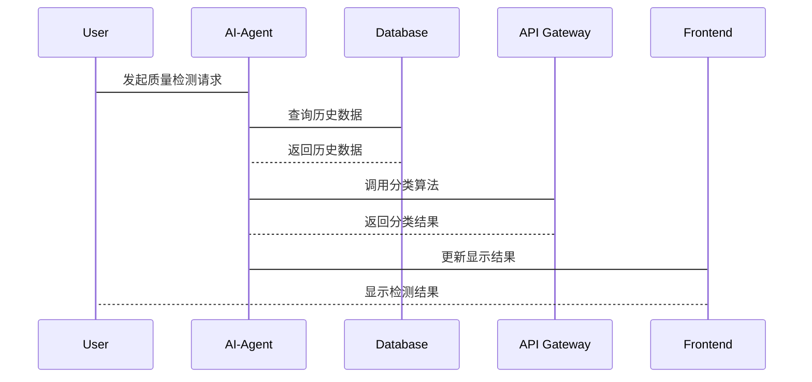

                 


# AI Agent在食品安全中的应用：质量控制与溯源

## 关键词
- AI Agent
- 食品安全
- 质量控制
- 溯源系统
- 人工智能
- 数据分析

## 摘要
随着人工智能技术的快速发展，AI Agent（人工智能代理）在食品安全领域的应用日益广泛。本文将详细探讨AI Agent在食品安全质量控制与溯源中的应用，涵盖AI Agent的基本概念、核心算法、系统架构、项目实战以及最佳实践。通过理论与实践相结合的方式，帮助读者全面理解AI Agent在食品安全中的重要作用，掌握其实际应用中的关键技术和方法。

---

## 第1章: AI Agent与食品安全概述

### 1.1 AI Agent的基本概念
#### 1.1.1 AI Agent的定义
AI Agent是一种能够感知环境、自主决策并执行任务的智能实体。它能够通过传感器获取数据，利用算法进行分析，并根据结果采取行动，以实现预定目标。

#### 1.1.2 AI Agent的核心特征
- **自主性**：能够在没有外部干预的情况下独立运行。
- **反应性**：能够实时感知环境变化并做出响应。
- **目标导向性**：通过设定目标来指导行为和决策。
- **学习能力**：能够通过数据学习和优化自身的算法。

#### 1.1.3 AI Agent与传统自动化系统的区别
| 特性         | AI Agent                          | 传统自动化系统                   |
|--------------|-----------------------------------|----------------------------------|
| 智能性       | 高                                 | 低                               |
| 决策能力     | 强                                 | 弱                               |
| 灵活性       | 高                                 | 低                               |
| 学习能力     | 强                                 | 无或弱                           |

### 1.2 食品安全的重要性
#### 1.2.1 食品安全的定义
食品安全是指食品在种植、加工、运输、销售和消费过程中，符合相关法律法规和标准，不会对人体健康造成危害。

#### 1.2.2 食品安全问题的现状与挑战
- **现状**：随着工业化和全球化的推进，食品安全问题日益复杂，包括重金属污染、农药残留、微生物污染等。
- **挑战**：传统检测方法效率低、成本高，难以满足大规模、实时化的需求。

#### 1.2.3 食品安全对社会和经济的影响
- **社会影响**：食品安全事故可能导致公众健康问题，影响社会稳定。
- **经济影响**：食品召回、品牌信誉损失等会对企业造成巨大经济损失。

### 1.3 AI Agent在食品安全中的应用前景
#### 1.3.1 AI Agent在食品安全领域的优势
- **高效性**：AI Agent能够快速处理大量数据，提高检测效率。
- **精准性**：通过机器学习算法，AI Agent能够实现高精度的检测和分析。
- **实时性**：AI Agent能够实时监控生产过程，及时发现并解决问题。

#### 1.3.2 全球范围内AI Agent在食品安全中的应用案例
- **案例1**：某食品企业利用AI Agent实时监控生产线上的温度、湿度等参数，确保产品质量。
- **案例2**：某政府机构通过AI Agent分析食品供应链数据，快速溯源食品安全问题。

#### 1.3.3 未来发展趋势与挑战
- **趋势**：AI Agent在食品安全中的应用将更加普及，技术也将更加智能化、自动化。
- **挑战**：数据隐私、算法优化、法律法规等问题需要进一步解决。

---

## 第2章: AI Agent在食品安全中的核心概念与联系

### 2.1 核心概念原理
#### 2.1.1 AI Agent的工作原理
AI Agent通过感知环境、分析数据、制定决策并执行操作来实现目标。其工作流程包括数据采集、数据处理、决策制定和行动执行四个阶段。

#### 2.1.2 AI Agent在食品安全中的应用场景
- **质量检测**：通过图像识别技术检测食品表面的缺陷。
- **溯源管理**：利用区块链技术记录食品的生产、运输和销售信息，实现全程可追溯。
- **风险预警**：通过数据分析预测食品安全风险，提前采取措施。

#### 2.1.3 核心概念的属性特征对比表格
| 属性         | AI Agent                          | 传统检测方法                   |
|--------------|-----------------------------------|----------------------------------|
| 数据处理能力 | 强                                 | 弱                               |
| 决策能力     | 高                                 | 低                               |
| 灵活性       | 高                                 | 低                               |

### 2.2 ER实体关系图
```mermaid
erd
  Food (
    ID,
    Name,
    ProductionDate,
    ExpiryDate,
    Status
  )
  Manufacturer (
    ID,
    Name,
    Address,
    License
  )
  Supplier (
    ID,
    Name,
    Address,
    Contact
  )
  Retailer (
    ID,
    Name,
    Address,
    Contact
  )
  Consumer (
    ID,
    Name,
    Address,
    Contact
  )
  FoodSafetyTest (
    ID,
    Food_ID,
    TestDate,
    TestResult,
    Tester_ID
  )
  AI-Agent (
    ID,
    Name,
    Function,
    Version
  )
  link Food_Manufacturer { Food -> Manufacturer }
  link Food_Supplier { Food -> Supplier }
  link Food_Retailer { Food -> Retailer }
  link Food_Consumer { Food -> Consumer }
  link FoodSafetyTest_AI-Agent { FoodSafetyTest -> AI-Agent }
```

---

## 第3章: AI Agent在食品安全中的算法原理

### 3.1 算法原理概述
#### 3.1.1 AI Agent在食品安全中的分类算法
- **逻辑回归**：用于分类问题，例如检测食品是否合格。
- **支持向量机（SVM）**：适用于小样本数据的分类。
- **随机森林**：适用于特征较多的分类问题。

#### 3.1.2 AI Agent在食品安全中的聚类算法
- **K-means**：将食品样本分为不同的簇，识别潜在的质量问题。
- **层次聚类**：根据相似性将食品分成层次结构。

#### 3.1.3 AI Agent在食品安全中的关联规则挖掘
- **Apriori算法**：挖掘食品中不同属性之间的关联规则，例如某种添加剂与质量问题的相关性。

### 3.2 算法流程图


### 3.3 算法实现代码
```python
import pandas as pd
from sklearn.model_selection import train_test_split
from sklearn.ensemble import RandomForestClassifier
from sklearn.metrics import accuracy_score

# 数据加载
data = pd.read_csv('food_quality.csv')

# 数据分割
X = data.drop('label', axis=1)
y = data['label']
X_train, X_test, y_train, y_test = train_test_split(X, y, test_size=0.2)

# 模型训练
model = RandomForestClassifier()
model.fit(X_train, y_train)

# 模型预测
y_pred = model.predict(X_test)

# 模型评估
accuracy = accuracy_score(y_test, y_pred)
print(f'模型准确率：{accuracy}')
```

---

## 第4章: AI Agent在食品安全中的数学模型与公式

### 4.1 分类算法的数学模型
#### 4.1.1 逻辑回归
$$ P(y=1|x) = \frac{1}{1 + e^{-\beta x}} $$

#### 4.1.2 支持向量机（SVM）
$$ \text{目标函数：} \min_{\beta, b} \frac{1}{2}\beta^2 + C \sum_{i=1}^n \xi_i $$
$$ \text{约束条件：} y_i (\beta x_i + b) \geq 1 - \xi_i, \xi_i \geq 0 $$

#### 4.1.3 随机森林
随机森林通过集成学习将多个决策树的预测结果进行投票或平均，最终得到一个高精度的分类结果。

### 4.2 聚类算法的数学模型
#### 4.2.1 K-means
$$ \text{目标函数：} \min_{K} \sum_{i=1}^n \sum_{j=1}^K \frac{1}{2} \sum_{x_i \in C_j} (x_i - \mu_j)^2 $$

#### 4.2.2 层次聚类
层次聚类通过计算样本之间的距离，逐步合并相似的簇，最终形成树状结构。

### 4.3 关联规则挖掘的数学模型
#### 4.3.1 Apriori算法
$$ \text{频繁项集：} L_k = \{所有长度为k的频繁项集\} $$
$$ \text{关联规则：} \text{如果 } X \subseteq Y, \text{ 则 } X \rightarrow Y $$

---

## 第5章: 系统分析与架构设计

### 5.1 问题场景介绍
某食品企业希望通过AI Agent实现食品质量的实时监控和溯源管理，提升产品质量和消费者信任度。

### 5.2 系统功能设计
#### 5.2.1 领域模型


### 5.3 系统架构设计


### 5.4 系统接口设计
- **API接口**：提供RESTful API，用于数据的上传、查询和分析。
- **数据接口**：与传感器、数据库等系统对接，实现数据的实时传输。

### 5.5 系统交互序列图


---

## 第6章: 项目实战

### 6.1 环境安装
- **Python**：安装Python 3.8以上版本。
- **依赖库**：安装numpy、pandas、scikit-learn、mermaid、matplotlib等。

### 6.2 系统核心实现
#### 6.2.1 数据预处理
```python
import pandas as pd
from sklearn.preprocessing import StandardScaler

data = pd.read_csv('food_quality.csv')
scaler = StandardScaler()
scaled_data = scaler.fit_transform(data.drop('label', axis=1))
```

#### 6.2.2 模型训练
```python
from sklearn.ensemble import RandomForestClassifier

model = RandomForestClassifier()
model.fit(scaled_data, data['label'])
```

#### 6.2.3 模型部署
```python
from flask import Flask, request, jsonify

app = Flask(__name__)

@app.route('/predict', methods=['POST'])
def predict():
    data = request.json['data']
    prediction = model.predict([data])
    return jsonify({'result': prediction[0]})

if __name__ == '__main__':
    app.run(debug=True)
```

### 6.3 代码应用解读
- **数据预处理**：标准化数据，确保模型输入一致。
- **模型训练**：利用随机森林算法训练分类模型。
- **模型部署**：通过Flask框架搭建API，实现模型的在线预测。

### 6.4 案例分析
假设某食品企业检测一批食品的重金属含量，通过AI Agent快速分类出不合格产品，并通过溯源系统找到问题根源。

### 6.5 项目小结
通过本项目，我们实现了AI Agent在食品安全中的质量检测和溯源管理，验证了其高效性和准确性。

---

## 第7章: 最佳实践与总结

### 7.1 小结
- AI Agent在食品安全中的应用前景广阔，能够显著提升质量控制和溯源管理的效率。
- 通过机器学习算法和大数据技术，AI Agent能够实现高精度的检测和实时监控。

### 7.2 注意事项
- 数据隐私和安全是应用中的重要问题，需严格遵守相关法律法规。
- 模型的准确性和鲁棒性需要通过大量数据和反复优化来保证。

### 7.3 拓展阅读
- 《机器学习实战》
- 《人工智能：一种现代方法》
- 《区块链与食品安全溯源》

---

## 作者
作者：AI天才研究院/AI Genius Institute  
联系方式：[contact@aicourse.com](mailto:contact@aicourse.com)  
网址：[www.aicourse.com](http://www.aicourse.com)

