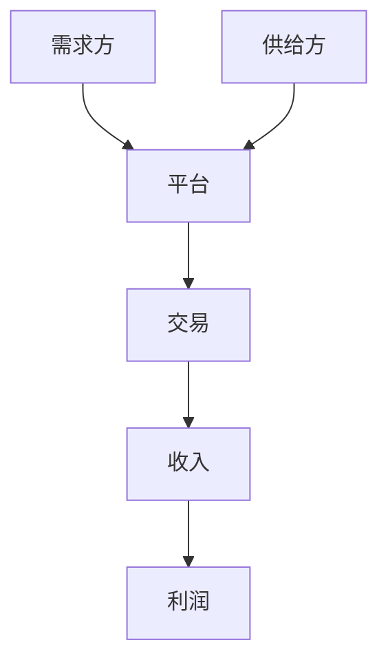
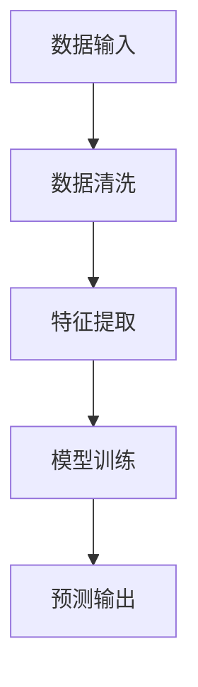
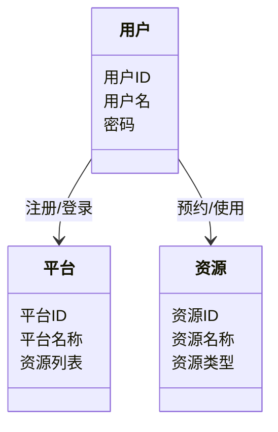
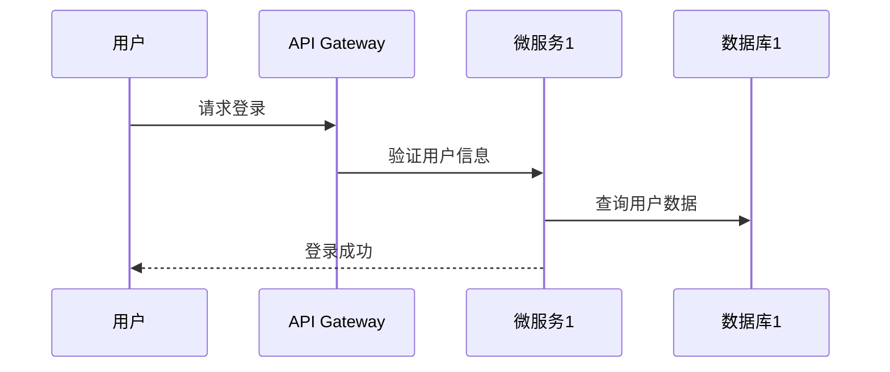

                 


# 价值投资中的共享经济模式分析

> 关键词：价值投资，共享经济，经济模式，投资策略，数学模型

> 摘要：本文深入分析了价值投资与共享经济模式的结合，探讨了共享经济模式的核心概念、价值投资的分析框架，以及两者的相互作用。文章从共享经济的起源与发展、价值投资的基本理论入手，逐步分析了共享经济模式中的价值投资机会、投资策略、数学模型，并通过实际案例分析，提出了投资建议和风险提示。

---

# 第一部分: 价值投资与共享经济模式的背景与概念

## 第1章: 共享经济的起源与发展

### 1.1 共享经济的定义与特征

#### 1.1.1 共享经济的定义
共享经济是一种基于数字平台的经济模式，通过共享资源使用权，降低资源闲置，提高资源利用效率。其核心在于通过平台连接供给方和需求方，实现资源的灵活调配和高效共享。

#### 1.1.2 共享经济的核心特征
- **去中心化**：通过平台连接供需双方，减少中间环节。
- **灵活性**：资源使用权灵活，按需分配。
- **高效性**：通过技术手段实现资源的快速匹配。

#### 1.1.3 共享经济与传统经济模式的区别
- **资源所有权与使用权分离**：共享经济中，资源的所有权和使用权分离，传统经济中二者往往统一。
- **平台化运营**：共享经济依赖平台进行资源匹配，传统经济更多依赖实体渠道。
- **技术创新驱动**：共享经济的发展离不开大数据、人工智能等技术的支持。

### 1.2 共享经济的起源与发展历程

#### 1.2.1 共享经济的起源背景
共享经济的起源可以追溯到互联网技术的发展，尤其是移动互联网和大数据技术的进步，使得资源共享和匹配成为可能。

#### 1.2.2 共享经济的发展阶段
- **萌芽阶段**：2000年左右，共享经济的雏形出现，如早期的P2P平台。
- **快速发展阶段**：2010年后，共享经济平台迅速崛起，如Airbnb、滴滴出行等。
- **成熟阶段**：当前，共享经济模式逐渐成熟，并与实体经济深度融合。

#### 1.2.3 共享经济的现状与趋势
- 现状：共享经济已经渗透到交通、住宿、办公空间等多个领域。
- 趋势：共享经济将进一步与人工智能、区块链等技术结合，推动经济模式的创新。

### 1.3 共享经济的典型模式分析

#### 1.3.1 点对点共享模式
点对点共享模式直接连接供需双方，例如滴滴出行、Airbnb等平台。

#### 1.3.2 平台化共享模式
平台化共享模式通过第三方平台进行资源整合和分配，例如滴滴出行、美团外卖。

#### 1.3.3 共享经济的其他创新模式
- **共享办公空间**：如WeWork，提供灵活的办公空间使用权。
- **共享医疗资源**：疫情期间，共享医疗资源平台迅速崛起。

## 第2章: 价值投资的基本理论

### 2.1 价值投资的核心理念

#### 2.1.1 价值投资的定义
价值投资是一种以基本面分析为基础的投资策略，强调以低于内在价值的价格买入优质资产，长期持有，等待价值回归。

#### 2.1.2 价值投资的核心原则
- **安全边际**：买入价格低于内在价值。
- **长期视角**：关注企业的长期盈利能力。
- **优质资产**：选择行业龙头、财务健康的企业。

#### 2.1.3 价值投资与其它投资策略的区别
- 与成长投资的区别：价值投资注重当前价值，成长投资注重未来增长。
- 与趋势投资的区别：价值投资注重基本面分析，趋势投资注重价格走势。

### 2.2 价值投资的分析框架

#### 2.2.1 财务分析方法
- **市盈率（P/E）**：股价与每股收益的比率，用于衡量估值水平。
- **市净率（P/B）**：股价与每股净资产的比率，用于衡量资产价值。
- **股息率**：股息与股价的比率，用于衡量投资回报。

#### 2.2.2 行业分析方法
- **行业生命周期**：分析行业所处的阶段，判断行业增长潜力。
- **行业竞争结构**：分析行业内竞争状况，判断企业竞争优势。

#### 2.2.3 公司基本面分析
- **财务健康状况**：分析企业的盈利能力、资产负债情况、现金流等。
- **管理团队**：分析公司的管理层能力和战略规划。
- **行业地位**：分析公司在行业中的市场份额和竞争地位。

### 2.3 价值投资的成功案例分析

#### 2.3.1 美国铁路公司案例
巴菲特早期投资美国铁路公司的案例展示了价值投资的核心理念。

#### 2.3.2 可口可乐公司案例
巴菲特投资可口可乐公司，看重其强大的品牌和稳定的现金流。

#### 2.3.3 其他经典价值投资案例
- 遍地能源公司（Berkshire Hathaway）
- 麦当劳（McDonald's）

## 第3章: 价值投资与共享经济的结合

### 3.1 共享经济中的价值投资机会

#### 3.1.1 共享经济领域的投资热点
- 共享出行：滴滴出行、Uber等。
- 共享住宿：Airbnb。
- 共享办公空间：WeWork、氪空间。

#### 3.1.2 共享经济企业的估值方法
- **收入倍数法**：以企业收入乘以行业平均市销率。
- **用户价值法**：分析用户生命周期价值。
- **DCF模型**：通过现金流折现法评估企业价值。

#### 3.1.3 共享经济中的投资风险
- **政策风险**：法律法规的变化可能影响企业运营。
- **竞争风险**：行业内竞争激烈，可能导致利润下降。
- **技术风险**：依赖技术平台，技术故障可能影响运营。

### 3.2 价值投资视角下的共享经济模式分析

#### 3.2.1 共享经济模式的经济属性分析
- **轻资产模式**：共享经济企业往往不拥有资源所有权，而是通过平台连接供需双方。
- **高杠杆效应**：通过平台撮合交易，实现资源的高效利用。

#### 3.2.2 共享经济模式的财务特征
- **高成长性**：共享经济企业通常具有快速扩张的潜力。
- **高研发投入**：依赖技术平台，研发投入较大。

#### 3.2.3 共享经济模式的市场潜力
- **市场规模大**：共享经济覆盖多个领域，市场潜力巨大。
- **用户需求多样化**：共享经济满足用户多样化的消费需求。

### 3.3 价值投资中的共享经济模式策略

#### 3.3.1 选择投资标的的标准
- **行业龙头**：选择行业内具有竞争优势的企业。
- **财务健康**：企业财务状况良好，盈利能力稳定。
- **政策支持**：关注政策对共享经济的支持力度。

#### 3.3.2 投资组合的构建方法
- **分散投资**：避免过度集中于某一领域或企业。
- **长期持有**：价值投资强调长期持有，等待价值回归。

#### 3.3.3 风险管理与策略调整
- **动态调整**：根据市场变化和企业基本面调整投资组合。
- **止损机制**：设定止损点，避免重大损失。

---

## 第4章: 共享经济模式的核心概念与联系

### 4.1 共享经济模式的核心要素

#### 4.1.1 平台角色
平台是共享经济的核心，负责撮合供需双方的交易。

#### 4.1.2 供给方与需求方的互动
供给方提供资源使用权，需求方支付使用费，平台收取佣金或服务费。

#### 4.1.3 共享经济的生态系统
共享经济的生态系统包括平台、供给方、需求方、技术支持、法律法规等多个方面。

### 4.2 共享经济模式的属性特征对比

#### 4.2.1 共享经济与传统经济的对比表格
| 属性        | 共享经济                     | 传统经济                     |
|-------------|------------------------------|------------------------------|
| 资源所有权    | 所有权与使用权分离           | 所有权与使用权统一           |
| 平台化       | 依赖平台进行资源配置          | 依赖实体渠道进行资源配置      |
| 技术依赖     | 依赖大数据、人工智能技术      | 依赖传统商业模式              |

### 4.3 共享经济模式的数学模型分析

#### 4.3.1 共享经济模式的层次分析法（AHP）模型
层次分析法是一种用于多因素决策的分析方法，适用于共享经济模式的综合评价。

$$ AHP模型：权重计算公式为：w_i = \frac{a_i}{\sum a_i} $$

#### 4.3.2 共享经济模式的数学公式与计算
共享经济平台的估值公式：
$$ 估值 = 收入 \times 市盈率 $$

#### 4.3.3 共享经济模式的决策流程图（Mermaid）


## 第5章: 价值投资中的共享经济模式算法原理

### 5.1 共享经济模式的算法原理

#### 5.1.1 共享经济模式的算法流程图（Mermaid）


#### 5.1.2 共享经济模式的Python实现代码
```python
import pandas as pd
from sklearn.model_selection import train_test_split
from sklearn.metrics import accuracy_score

# 数据加载与预处理
data = pd.read_csv('共享经济数据.csv')
X = data.drop('标签', axis=1)
y = data['标签']
X_train, X_test, y_train, y_test = train_test_split(X, y, test_size=0.2)

# 模型训练
from sklearn.tree import DecisionTreeClassifier
model = DecisionTreeClassifier()
model.fit(X_train, y_train)

# 模型预测
y_pred = model.predict(X_test)
print("准确率:", accuracy_score(y_test, y_pred))
```

#### 5.1.3 共享经济模式的数学模型与公式
共享经济平台的用户增长预测模型：
$$ 用户增长 = 基础用户数 \times (1 + 用户增长率) $$

### 5.2 价值投资中的共享经济模式算法实现

#### 5.2.1 算法实现的环境配置
- **编程语言**：Python
- **库依赖**：pandas, scikit-learn
- **数据源**：共享经济领域的公开数据集

#### 5.2.2 算法实现的核心代码
```python
import pandas as pd
from sklearn.ensemble import RandomForestClassifier
from sklearn.metrics import classification_report

# 数据加载与预处理
data = pd.read_csv('共享经济数据.csv')
X = data.drop('标签', axis=1)
y = data['标签']
X_train, X_test, y_train, y_test = train_test_split(X, y, test_size=0.2)

# 模型训练
model = RandomForestClassifier()
model.fit(X_train, y_train)

# 模型预测
y_pred = model.predict(X_test)
print(classification_report(y_test, y_pred))
```

#### 5.2.3 代码的详细解读与分析
- **数据加载与预处理**：读取数据并进行清洗和特征提取。
- **模型训练**：使用随机森林算法进行分类模型训练。
- **模型预测**：对测试数据进行预测，并输出分类报告。

### 5.3 算法实现的实际案例分析

#### 5.3.1 案例背景介绍
以共享出行平台为例，分析用户行为数据，预测用户活跃度。

#### 5.3.2 案例的详细分析与计算
- **数据特征**：用户使用频率、用户评价、订单完成率等。
- **模型预测**：预测用户是否为活跃用户。

#### 5.3.3 案例的总结与启示
- 模型准确率高，可以用于实际业务中的用户分群和精准营销。

## 第6章: 共享经济模式的系统分析

### 6.1 系统分析与架构设计方案

#### 6.1.1 问题场景介绍
以共享办公空间为例，分析其系统架构设计。

#### 6.1.2 系统功能设计（领域模型Mermaid类图）


#### 6.1.3 系统架构设计（Mermaid架构图）
```mermaid
graph TD
    用户 --> API Gateway
    API Gateway --> 服务网关 --> 微服务1
    微服务1 --> 数据库1
    微服务2 --> 数据库2
    服务网关 --> 微服务3
    微服务3 --> 数据库3
```

#### 6.1.4 系统接口设计
- **API接口**：RESTful API，用于用户认证、资源预约、订单管理等。

#### 6.1.5 系统交互设计（Mermaid序列图）


### 6.2 项目实战

#### 6.2.1 环境安装
- **Python**：安装Python 3.8以上版本。
- **库依赖**：安装pandas、scikit-learn、mermaid等。

#### 6.2.2 核心代码实现
```python
import pandas as pd
from sklearn.ensemble import RandomForestClassifier
from sklearn.metrics import classification_report

# 数据加载与预处理
data = pd.read_csv('共享经济数据.csv')
X = data.drop('标签', axis=1)
y = data['标签']
X_train, X_test, y_train, y_test = train_test_split(X, y, test_size=0.2)

# 模型训练
model = RandomForestClassifier()
model.fit(X_train, y_train)

# 模型预测
y_pred = model.predict(X_test)
print(classification_report(y_test, y_pred))
```

#### 6.2.3 代码应用解读与分析
- **数据加载**：读取共享经济领域的数据集。
- **模型训练**：使用随机森林算法进行分类模型训练。
- **模型预测**：对测试数据进行预测，并输出分类报告。

#### 6.2.4 实际案例分析与详细讲解剖析
- **案例背景**：以共享出行平台为例，分析用户行为数据。
- **数据特征**：用户使用频率、用户评价、订单完成率等。
- **模型预测**：预测用户是否为活跃用户。
- **结果分析**：模型准确率高，可以用于实际业务中的用户分群和精准营销。

#### 6.2.5 项目小结
通过系统分析和算法实现，验证了共享经济模式的可行性和潜力，为价值投资者提供了新的投资方向和分析工具。

### 6.3 最佳实践 tips

#### 6.3.1 投资建议
- **分散投资**：避免过度集中于某一领域或企业。
- **长期持有**：价值投资强调长期持有，等待价值回归。

#### 6.3.2 小结
共享经济与价值投资的结合为投资者提供了新的机遇，但也需要注意政策风险和竞争风险。

#### 6.3.3 注意事项
- **数据质量**：确保数据的准确性和完整性。
- **模型选择**：根据实际需求选择合适的算法和模型。
- **风险管理**：建立有效的风险控制机制，避免重大损失。

#### 6.3.4 拓展阅读
- 《The Intelligent Investor》——本杰明·格雷厄姆
- 《共享经济：重构未来商业文明》——李芏菲

---

# 作者：AI天才研究院/AI Genius Institute & 禅与计算机程序设计艺术 /Zen And The Art of Computer Programming

