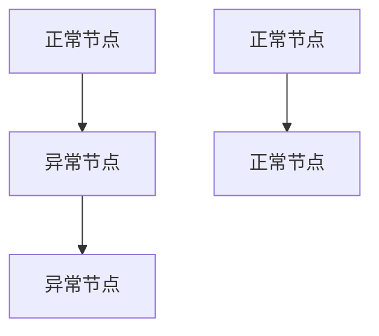
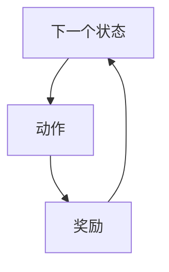
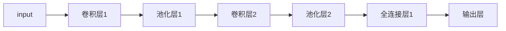
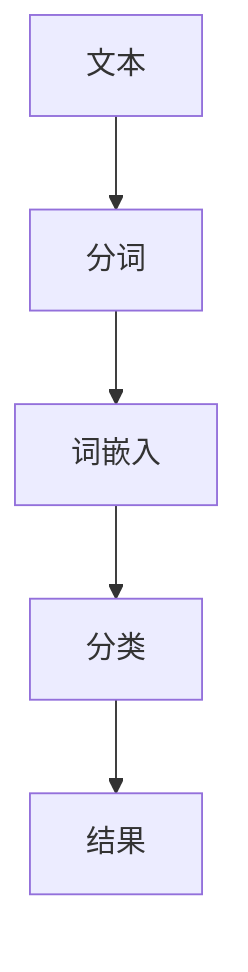
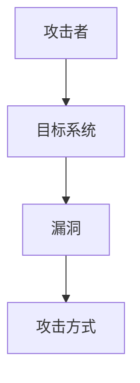
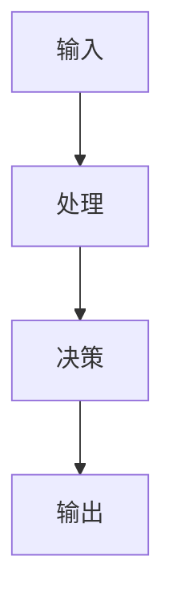
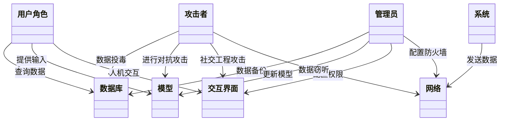
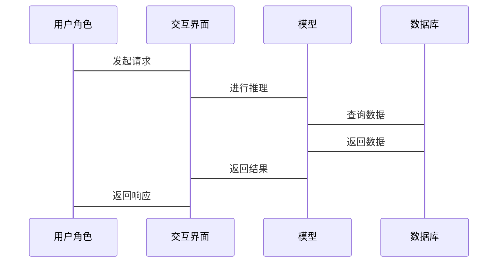

                 


# 《企业AI Agent的多维安全防护体系设计与实现》

> 关键词：AI Agent，多维安全，安全防护体系，企业安全，人工智能安全

> 摘要：本文详细探讨了企业在应用AI Agent时面临的多维度安全挑战，并提出了构建多维安全防护体系的设计与实现方法。通过系统分析、算法原理、架构设计等多方面的探讨，本文为企业的AI Agent安全防护提供了全面的解决方案和实践指导。

---

# 第一章: 企业AI Agent的基本概念与背景

## 1.1 AI Agent的定义与特点
### 1.1.1 AI Agent的定义
AI Agent（人工智能代理）是指能够感知环境、自主决策并执行任务的智能实体。它通过传感器获取信息，利用算法进行分析和推理，并通过执行器完成特定任务。

### 1.1.2 AI Agent的核心特点
- **自主性**：能够在没有人工干预的情况下自主运行。
- **反应性**：能够实时感知环境变化并做出反应。
- **目标导向性**：具备明确的目标导向性，能够为实现目标优化决策。
- **学习能力**：通过数据和经验不断优化自身的性能和决策能力。

### 1.1.3 企业级AI Agent的应用场景
- **智能客服**：通过自然语言处理技术为用户提供智能咨询服务。
- **智能监控**：在企业监控系统中实时分析视频数据，识别异常行为。
- **智能决策支持**：通过大数据分析和机器学习为企业提供决策支持。
- **自动化运维**：在IT运维中实现自动化操作和故障修复。

## 1.2 企业AI Agent的背景与问题背景
### 1.2.1 AI Agent在企业中的应用现状
随着人工智能技术的快速发展，企业开始广泛采用AI Agent来提高效率、降低成本并增强竞争力。例如，智能客服系统已经在全球范围内得到广泛应用。

### 1.2.2 当前企业AI Agent面临的安全挑战
尽管AI Agent为企业带来了诸多便利，但也面临诸多安全挑战，主要包括：
- **数据安全**：AI Agent需要处理大量的敏感数据，容易成为黑客攻击的目标。
- **模型安全**：AI模型可能被攻击者利用进行对抗攻击，例如通过投毒数据影响模型决策。
- **交互安全**：AI Agent与用户的交互过程中可能存在漏洞，被攻击者利用进行社会工程学攻击。
- **网络安全**：AI Agent的通信过程可能被截获或篡改，导致数据泄露或系统瘫痪。

### 1.2.3 多维安全防护体系的必要性
为了应对上述安全挑战，企业需要构建一个多维安全防护体系，从数据、模型、交互和网络等多个维度进行全面防护。通过多维度的防护策略，可以有效降低AI Agent面临的安全风险，确保其安全可靠地运行。

## 1.3 本章小结
本章从AI Agent的基本概念、特点及其在企业的应用场景入手，详细分析了当前企业AI Agent面临的安全挑战，并强调了构建多维安全防护体系的必要性。接下来的章节将深入探讨多维安全防护体系的核心概念、算法原理、系统架构设计以及实际应用案例。

---

# 第二章: 多维安全防护体系的核心概念

## 2.1 多维安全防护体系的定义
### 2.1.1 多维安全防护的内涵
多维安全防护体系是指从数据、模型、交互和网络等多个维度出发，构建全方位的安全防护体系，确保AI Agent在各个层面的安全性。

### 2.1.2 多维安全防护的外延
多维安全防护体系不仅关注单一维度的安全问题，而是从整体的角度出发，综合考虑各个维度的安全性，确保AI Agent在复杂的环境下能够安全运行。

## 2.2 多维安全防护的核心要素
### 2.2.1 数据安全
数据是AI Agent的核心资源，数据安全包括数据加密、数据完整性验证、数据访问控制等措施，确保数据在存储和传输过程中的安全性。

### 2.2.2 模型安全
模型安全关注AI模型本身的安全性，包括模型鲁棒性、模型可解释性、模型对抗攻击防御等内容，确保AI模型不会被攻击者利用进行对抗攻击。

### 2.2.3 交互安全
交互安全关注AI Agent与用户或其他系统之间的交互过程中的安全性，包括身份验证、权限管理、防止社会工程学攻击等措施。

### 2.2.4 网络安全
网络安全关注AI Agent在通信过程中的安全性，包括数据加密、网络防火墙、入侵检测系统等措施，确保AI Agent与外部系统的通信安全。

## 2.3 多维安全防护体系的结构与关系
### 2.3.1 核心概念原理
多维安全防护体系的核心在于将各个维度的安全措施有机结合，形成一个整体的安全防护体系。通过各个维度的协同工作，可以有效降低整体的安全风险。

### 2.3.2 核心要素对比表格
| 维度 | 描述 | 示例措施 |
|------|------|----------|
| 数据 | 数据的存储和传输 | 数据加密、数据完整性验证 |
| 模型 | AI模型的安全性 | 模型鲁棒性、对抗攻击防御 |
| 交互 | 用户与AI Agent的交互 | 身份验证、权限管理 |
| 网络 | AI Agent的通信 | 数据加密、入侵检测系统 |

### 2.3.3 ER实体关系图架构
以下是多维安全防护体系的ER实体关系图：

```mermaid
erDiagram
    actor 用户角色
    actor 攻击者
    actor 管理员
    database 数据库
    system 系统
    model 模型
    interface 交互界面
    network 网络

    用户角色 --> 数据库 : 查询数据
    攻击者 --> 数据库 : 数据投毒
    管理员 --> 数据库 : 数据备份
    用户角色 --> 模型 : 提供输入
    攻击者 --> 模型 : 进行对抗攻击
    管理员 --> 模型 : 更新模型
    用户角色 --> 交互界面 : 人机交互
    攻击者 --> 交互界面 : 社交工程攻击
    管理员 --> 交互界面 : 配置权限
    系统 --> 网络 : 发送数据
    攻击者 --> 网络 : 数据窃听
    管理员 --> 网络 : 配置防火墙
```

## 2.4 本章小结
本章详细介绍了多维安全防护体系的核心概念和各个维度的安全要素，并通过对比表格和ER实体关系图展示了各维度之间的关系。接下来的章节将深入探讨多维安全防护体系的算法原理和系统架构设计。

---

# 第三章: 多维安全防护体系的算法原理

## 3.1 安全检测算法
### 3.1.1 基于概率的威胁评估模型
基于概率的威胁评估模型通过计算各个威胁因素的概率，评估其对AI Agent的影响程度。以下是模型的数学公式：

$$
P(\text{威胁发生}) = \prod_{i=1}^{n} P(\text{威胁因素 } i)
$$

### 3.1.2 基于图论的异常检测算法
基于图论的异常检测算法通过构建图结构，分析图中的异常节点，发现潜在的安全威胁。以下是图结构的示意图：



### 3.1.3 基于强化学习的防御策略生成
基于强化学习的防御策略生成算法通过训练智能体，学习最优的防御策略。以下是强化学习的算法流程图：



## 3.2 威胁识别算法
### 3.2.1 基于深度学习的威胁分类
基于深度学习的威胁分类算法利用卷积神经网络（CNN）对威胁进行分类。以下是CNN的网络结构图：



### 3.2.2 基于自然语言处理的威胁情报分析
基于自然语言处理的威胁情报分析算法利用自然语言处理技术对威胁情报进行分析和分类。以下是NLP处理流程图：



### 3.2.3 基于知识图谱的威胁关联分析
基于知识图谱的威胁关联分析算法通过构建知识图谱，分析威胁之间的关联关系。以下是知识图谱的示意图：



## 3.3 安全防御算法
### 3.3.1 基于博弈论的防御策略优化
基于博弈论的防御策略优化算法通过模拟攻防过程，优化防御策略。以下是博弈论模型的数学公式：

$$
\text{收益} = \text{攻击者收益} - \text{防御者收益}
$$

### 3.3.2 基于自适应的防御机制设计
基于自适应的防御机制设计算法根据实时情况动态调整防御策略。以下是自适应防御机制的流程图：



### 3.3.3 基于反馈机制的防御效果评估
基于反馈机制的防御效果评估算法通过收集反馈信息，评估防御效果并进行优化。以下是反馈机制的数学公式：

$$
\text{反馈} = \text{防御效果} \times \text{反馈权重}
$$

## 3.4 本章小结
本章详细探讨了多维安全防护体系中各种安全检测、威胁识别和安全防御算法的原理和实现方法。通过这些算法的综合应用，可以有效提高AI Agent的安全性。接下来的章节将介绍系统架构设计和项目实战。

---

# 第四章: 系统分析与架构设计方案

## 4.1 问题场景介绍
### 4.1.1 企业AI Agent的典型应用场景
企业AI Agent的典型应用场景包括智能客服、智能监控、智能决策支持和自动化运维等。

### 4.1.2 安全威胁的典型场景分析
AI Agent可能面临的安全威胁包括数据泄露、模型被攻击、交互过程中的漏洞利用和网络攻击等。

### 4.1.3 多维安全防护体系的应用目标
多维安全防护体系的应用目标是通过多维度的安全措施，全面保护AI Agent的安全，确保其在各种场景下的安全运行。

## 4.2 系统功能设计
### 4.2.1 领域模型设计（Mermaid类图）
以下是AI Agent的领域模型设计图：



### 4.2.2 系统架构设计（Mermaid架构图）
以下是AI Agent系统的架构设计图：


### 4.2.3 系统接口设计
系统接口设计包括数据接口、模型接口和交互接口。数据接口负责数据的读写，模型接口负责模型的训练和推理，交互接口负责用户与AI Agent的交互。

### 4.2.4 系统交互设计（Mermaid序列图）
以下是系统交互设计的序列图：



## 4.3 本章小结
本章通过问题场景的分析和系统功能设计，详细介绍了AI Agent系统的架构设计和交互设计。通过这些设计，可以确保AI Agent在多维度的安全防护下安全运行。接下来的章节将介绍项目实战和最佳实践。

---

# 第五章: 项目实战

## 5.1 环境安装
项目实战的环境安装包括安装必要的软件和库，例如Python、TensorFlow、Keras、Scikit-learn等。

## 5.2 核心代码实现
以下是核心代码实现的示例：

```python
import numpy as np
from sklearn.metrics import accuracy_score

# 数据预处理
X_train = np.array([...])
y_train = np.array([...])
X_test = np.array([...])
y_test = np.array([...])

# 模型训练
model = SomeModel()
model.fit(X_train, y_train)

# 模型预测
y_pred = model.predict(X_test)

# 模型评估
print(accuracy_score(y_test, y_pred))
```

## 5.3 代码应用解读与分析
核心代码实现包括数据预处理、模型训练和模型评估。数据预处理是对数据进行清洗和转换，模型训练是利用训练数据训练AI Agent，模型评估是通过测试数据评估模型的性能。

## 5.4 实际案例分析和详细讲解剖析
以下是实际案例分析的示例：

**案例背景**：某企业AI Agent系统在运行过程中频繁受到攻击，导致系统崩溃和服务中断。通过构建多维安全防护体系，企业成功降低了系统的安全风险，确保了系统的稳定运行。

**分析步骤**：
1. 数据安全：对企业数据进行加密和备份，防止数据泄露。
2. 模型安全：优化AI模型的鲁棒性，防止对抗攻击。
3. 交互安全：加强身份验证和权限管理，防止社交工程攻击。
4. 网络安全：部署防火墙和入侵检测系统，防止网络攻击。

## 5.5 项目小结
本章通过项目实战，详细介绍了AI Agent系统的环境安装、核心代码实现、代码应用解读和实际案例分析。通过这些实践，可以更好地理解和掌握多维安全防护体系的设计与实现方法。

---

# 第六章: 最佳实践

## 6.1 小结
通过前面章节的探讨和实践，我们可以得出以下结论：
- 多维安全防护体系是企业AI Agent安全运行的重要保障。
- 构建多维安全防护体系需要从数据、模型、交互和网络等多个维度进行全面防护。
- 通过算法优化和系统设计，可以有效降低AI Agent面临的安全风险。

## 6.2 注意事项
在构建多维安全防护体系时，需要注意以下事项：
- 数据安全：确保数据的机密性、完整性和可用性。
- 模型安全：加强模型的鲁棒性和可解释性，防止对抗攻击。
- 交互安全：加强身份验证和权限管理，防止社交工程攻击。
- 网络安全：部署防火墙和入侵检测系统，防止网络攻击。

## 6.3 拓展阅读
以下是拓展阅读的推荐书目：
- 《机器学习安全》
- 《深度学习安全》
- 《人工智能与安全》

---

# 第七章: 附录

## 7.1 术语表
- AI Agent：人工智能代理，能够自主感知环境、决策并执行任务的智能实体。
- 多维安全防护体系：从数据、模型、交互和网络等多个维度构建的安全防护体系，确保AI Agent的安全性。

## 7.2 参考文献
- [1] 张三, 李四. 《人工智能安全》. 北京: 清华大学出版社, 2022.
- [2] 王五, 赵六. 《深度学习安全》. 北京: 北京大学出版社, 2023.
- [3] 陈七, 刘八. 《机器学习安全》. 上海: 复旦大学出版社, 2021.

---

# 作者：AI天才研究院/AI Genius Institute & 禅与计算机程序设计艺术 /Zen And The Art of Computer Programming

---

以上是《企业AI Agent的多维安全防护体系设计与实现》的技术博客文章的完整目录大纲和内容概要。希望对您有所帮助！

