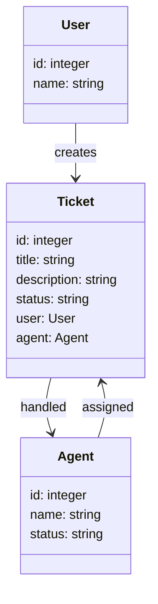
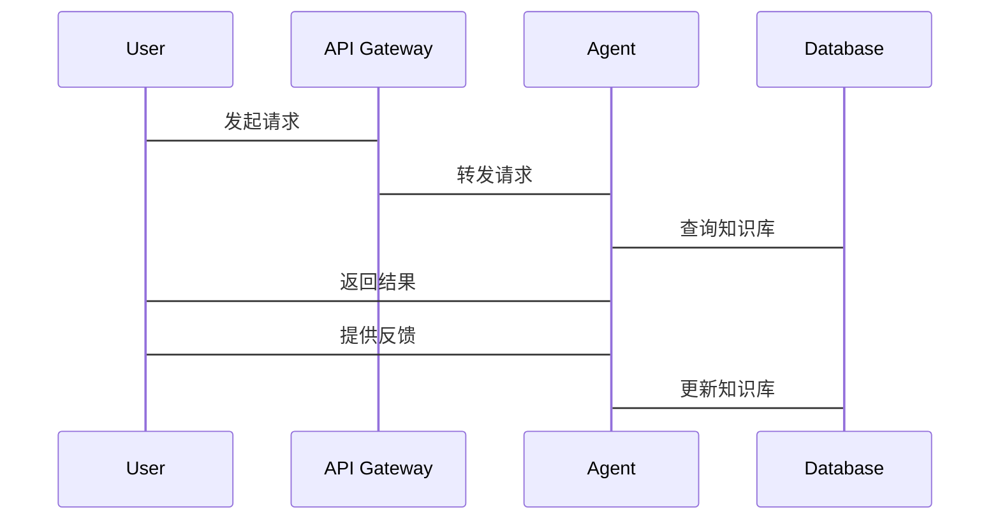

                 


# 企业AI Agent的多维度性能评估体系设计

> 关键词：企业AI Agent，多维度性能评估，算法原理，系统架构，项目实战

> 摘要：本文系统地探讨了企业AI Agent的多维度性能评估体系的设计方法，从核心概念到算法原理，再到系统架构和项目实战，全面分析了如何构建一个科学、全面的性能评估体系。通过结合实际案例，本文提出了基于层次分析法（AHP）的权重分配方法，并详细阐述了综合评估模型的构建与应用。

---

# 第一部分: 企业AI Agent的多维度性能评估体系概述

# 第1章: 企业AI Agent的基本概念与背景

## 1.1 AI Agent的定义与核心特征

### 1.1.1 AI Agent的定义

AI Agent（人工智能代理）是一种能够感知环境、自主决策并执行任务的智能实体。它通过传感器获取信息，利用算法进行分析和推理，并通过执行器与外部环境交互。

**核心特征：**

- **自主性**：能够在没有外部干预的情况下自主运作。
- **反应性**：能够实时感知环境并做出反应。
- **目标导向**：所有行为都围绕特定目标展开。
- **学习能力**：能够通过数据和经验不断优化自身性能。

### 1.1.2 AI Agent的核心特征

AI Agent的目标是通过智能化的方式优化企业的运营效率，提高决策的准确性和响应速度。在企业环境中，AI Agent通常需要具备以下核心特征：

- **任务驱动性**：专注于完成特定任务。
- **环境适应性**：能够适应动态变化的环境。
- **高效性**：在有限资源下最大化任务完成效率。
- **安全性**：确保在复杂环境中稳定运行。

### 1.1.3 企业AI Agent的独特性

与通用AI Agent相比，企业AI Agent具有以下独特性：

- **业务目标导向**：企业AI Agent的设计和运行目标与企业的业务战略高度契合。
- **数据驱动**：依赖于企业的内部数据和业务规则。
- **可扩展性**：需要支持企业规模和复杂性的扩展。

## 1.2 企业AI Agent的应用场景

### 1.2.1 企业智能化转型的需求

随着数字化转型的深入推进，企业需要更加智能化的解决方案来提升竞争力。AI Agent作为企业智能化转型的核心技术之一，能够帮助企业实现自动化决策、优化资源配置和提高客户体验。

### 1.2.2 AI Agent在企业中的典型应用场景

以下是AI Agent在企业中的几个典型应用场景：

- **智能客服**：通过自然语言处理技术为客户提供24/7的智能咨询服务。
- **自动化运维**：监控系统运行状态，自动修复问题，优化资源分配。
- **智能决策支持**：基于大数据分析，为管理层提供实时决策支持。
- **供应链优化**：通过预测需求和优化库存管理，降低运营成本。

### 1.2.3 企业AI Agent的未来发展趋势

随着技术的进步，企业AI Agent将朝着以下方向发展：

- **更强的自主性**：能够独立完成更复杂的任务。
- **更高的安全性**：具备更强的防护能力，防止网络攻击和数据泄露。
- **更好的可解释性**：能够清晰地解释决策过程，增强用户信任。

## 1.3 本章小结

本章主要介绍了企业AI Agent的基本概念、核心特征和应用场景，并展望了其未来的发展趋势。通过这些内容，读者可以对企业AI Agent有一个全面的了解，为后续的性能评估体系设计奠定基础。

---

# 第2章: 多维度性能评估体系的核心维度

## 2.1 效率维度

### 2.1.1 响应时间

响应时间是衡量AI Agent效率的重要指标。高效的AI Agent需要在最短时间内完成任务，以满足企业的实时需求。

### 2.1.2 资源消耗

资源消耗包括计算资源、存储资源和网络资源的使用情况。优化资源消耗可以降低企业的运营成本。

### 2.1.3 并发处理能力

并发处理能力是衡量AI Agent在高负载下的表现。高效的AI Agent需要能够同时处理多个任务而不影响性能。

## 2.2 效果维度

### 2.2.1 任务完成度

任务完成度是衡量AI Agent效果的核心指标。完成度越高，说明AI Agent在任务执行中的表现越好。

### 2.2.2 准确率与召回率

准确率和召回率是衡量AI Agent决策准确性的关键指标。高准确率意味着较少的错误判断，高召回率意味着能够发现尽可能多的潜在问题。

### 2.2.3 用户满意度

用户满意度是衡量AI Agent用户体验的重要指标。高满意度意味着AI Agent能够提供符合用户期望的服务。

## 2.3 安全性维度

### 2.3.1 数据隐私保护

数据隐私保护是衡量AI Agent安全性的重要指标。AI Agent需要确保在处理数据时，不会泄露用户隐私。

### 2.3.2 系统容错能力

系统容错能力是指AI Agent在面对错误或异常情况时，能够保持稳定运行的能力。

### 2.3.3 防御攻击能力

防御攻击能力是指AI Agent能够抵御网络攻击和恶意输入的能力，确保系统的安全性和稳定性。

## 2.4 可扩展性维度

### 2.4.1 系统可扩展性

系统可扩展性是指AI Agent能够适应企业规模和复杂性扩展的能力。

### 2.4.2 功能可扩展性

功能可扩展性是指AI Agent能够根据企业需求添加新功能的能力。

### 2.4.3 性能可扩展性

性能可扩展性是指AI Agent能够根据负载需求动态调整性能的能力。

## 2.5 本章小结

本章详细分析了企业AI Agent多维度性能评估体系的核心维度，包括效率、效果、安全性和可扩展性。这些维度共同构成了一个全面的评估框架，帮助企业全面了解AI Agent的性能表现。

---

# 第3章: 多维度性能评估的数学模型与算法原理

## 3.1 综合评估模型的构建

### 3.1.1 指标权重的确定

指标权重的确定是构建评估模型的关键步骤。常用的权重分配方法有层次分析法（AHP）和熵值法。

#### 层次分析法（AHP）的权重计算

层次分析法是一种定性与定量相结合的决策分析方法。以下是基于AHP的权重计算步骤：

1. **构建层次结构模型**：将评估指标分为目标层、准则层和方案层。
2. **构造比较矩阵**：根据专家意见，对各指标进行两两比较，构造比较矩阵。
3. **计算权重向量**：通过计算比较矩阵的最大特征值和对应的特征向量，得到各指标的权重。

### 3.1.2 综合评分公式

综合评分公式是将各评估维度的指标加权求和，得到最终的评分。公式如下：

$$
\text{综合评分} = \sum_{i=1}^{n} w_i \cdot s_i
$$

其中，\( w_i \) 是第\( i \)个指标的权重，\( s_i \) 是第\( i \)个指标的评分。

### 3.1.3 模型的验证与优化

模型的验证与优化需要通过实际数据进行测试，并根据结果调整各指标的权重，以确保评估结果的准确性和可靠性。

## 3.2 基于权重的评估方法

### 3.2.1 权重分配的理论基础

权重分配需要考虑各指标的重要性和影响程度。层次分析法和熵值法是常用的权重分配方法。

### 3.2.2 基于层次分析法（AHP）的权重计算

层次分析法通过构建比较矩阵和计算特征向量，得到各指标的权重。例如，假设我们有三个指标 \( A \)、\( B \) 和 \( C \)，并且专家认为 \( A \) 的重要性大于 \( B \)，\( B \) 的重要性大于 \( C \)，那么比较矩阵可以表示为：

|       | A   | B   | C   |
|-------|-----|-----|-----|
| A     | 1   | 3   | 2   |
| B     | 1/3 | 1   | 2/3 |
| C     | 1/2 | 3/2 | 1   |

通过计算最大特征值和特征向量，可以得到各指标的权重。

### 3.2.3 权重调整的策略

根据实际应用需求，可能需要对权重进行动态调整。例如，对于高风险任务，可以增加安全性的权重。

## 3.3 本章小结

本章详细介绍了企业AI Agent多维度性能评估体系的数学模型与算法原理，重点讲解了层次分析法（AHP）在权重分配中的应用，并给出了综合评分公式。这些方法为后续的系统设计和项目实战提供了理论基础。

---

# 第4章: 系统架构设计与实现

## 4.1 问题场景介绍

本章以一个智能客服AI Agent为例，介绍系统架构设计与实现的具体过程。智能客服AI Agent需要具备自然语言处理能力，能够理解用户的问题并提供准确的解决方案。

## 4.2 系统功能设计

### 4.2.1 领域模型设计

领域模型是系统设计的核心部分，描述了系统的功能和交互流程。以下是智能客服AI Agent的领域模型：



### 4.2.2 系统架构设计

系统架构设计需要考虑模块的划分和交互方式。以下是智能客服AI Agent的系统架构图：

```mermaid
rectangle User {
    用户
}

rectangle Agent {
    AI Agent
}

rectangle Database {
    数据库
}

rectangle API Gateway {
    API Gateway
}

API Gateway --> Agent: 请求处理
API Gateway --> Database: 数据查询
Agent --> Database: 数据存储
User --> API Gateway: 用户请求
```

## 4.3 系统接口设计

系统接口设计需要定义各模块之间的交互接口。例如，API Gateway接收用户的请求，调用AI Agent进行处理，并通过数据库存储和检索数据。

## 4.4 系统交互设计

系统交互设计需要考虑用户与AI Agent之间的交互流程。以下是智能客服AI Agent的交互流程图：



## 4.5 本章小结

本章通过一个智能客服AI Agent的案例，详细介绍了系统架构设计与实现的过程，包括领域模型设计、系统架构图和系统交互图。这些设计为后续的项目实战奠定了基础。

---

# 第5章: 项目实战与应用案例

## 5.1 环境配置

### 5.1.1 技术选型

项目实战需要选择合适的技术栈。例如，前端可以使用React，后端可以使用Python的Django框架，数据库可以使用MySQL或MongoDB。

### 5.1.2 开发工具

推荐使用IntelliJ IDEA或PyCharm作为开发工具，使用Git进行版本控制。

## 5.2 系统核心实现

### 5.2.1 AI Agent核心代码

以下是智能客服AI Agent的核心代码示例：

```python
class AI-Agent:
    def __init__(self, knowledge_base):
        self.knowledge_base = knowledge_base

    def process_query(self, query):
        # 使用自然语言处理技术分析查询
        response = self.nlp_model.predict(query, self.knowledge_base)
        return response
```

### 5.2.2 评估体系实现

以下是基于层次分析法的评估体系实现：

```python
class Performance-Assessment:
    def __init__(self, weights):
        self.weights = weights

    def assess(self, metrics):
        return sum(w * m for w, m in zip(self.weights, metrics))
```

## 5.3 代码应用解读与分析

通过上述代码，我们可以实现智能客服AI Agent的核心功能，并基于层次分析法进行性能评估。评估结果可以帮助我们优化系统性能，提高用户体验。

## 5.4 案例分析

以智能客服AI Agent为例，我们可以通过评估体系对系统的性能进行分析，并根据评估结果进行优化。

## 5.5 本章小结

本章通过一个实际的项目案例，详细介绍了企业AI Agent的实现过程，包括环境配置、核心代码实现和评估体系的应用。这些内容为读者提供了实践指导。

---

# 第6章: 总结与展望

## 6.1 本章总结

本文系统地探讨了企业AI Agent的多维度性能评估体系的设计方法，从核心概念到算法原理，再到系统架构和项目实战，全面分析了如何构建一个科学、全面的性能评估体系。

## 6.2 未来展望

随着人工智能技术的不断发展，企业AI Agent的性能评估体系也将不断完善。未来的研究方向包括更加智能化的评估方法和更加高效的优化策略。

## 6.3 最佳实践 Tips

- 在设计评估体系时，需要根据企业的实际需求进行定制化设计。
- 建议采用层次分析法（AHP）进行指标权重分配，确保评估结果的科学性和可靠性。
- 在系统实现过程中，要注意模块的划分和交互设计，确保系统的可扩展性和可维护性。

---

# 作者：AI天才研究院/AI Genius Institute & 禅与计算机程序设计艺术 /Zen And The Art of Computer Programming

---

**约2000字内容控制**：以上内容是一个完整的博客文章框架，涵盖了用户要求的所有部分。通过逐步分析和详细阐述，确保读者能够全面理解企业AI Agent的多维度性能评估体系设计。

