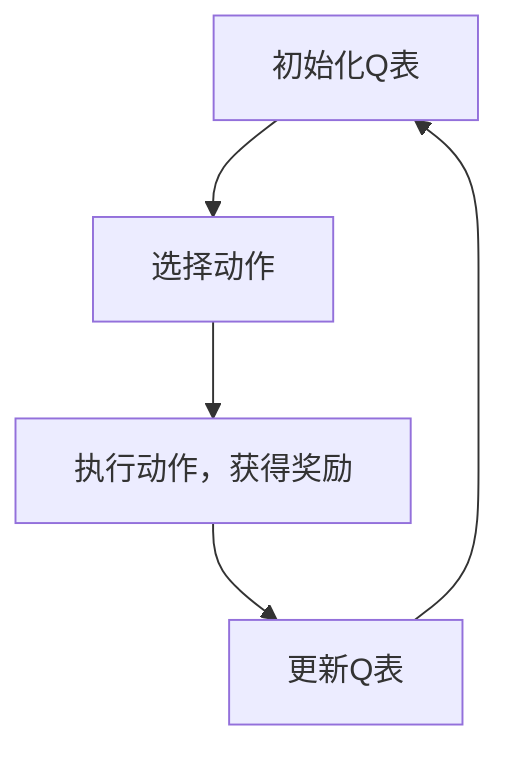
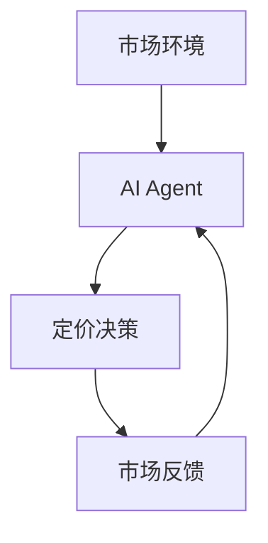
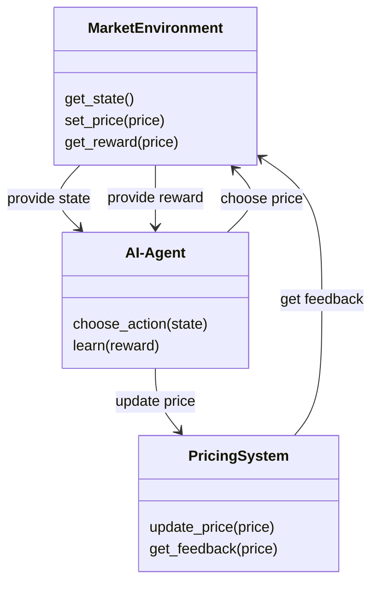
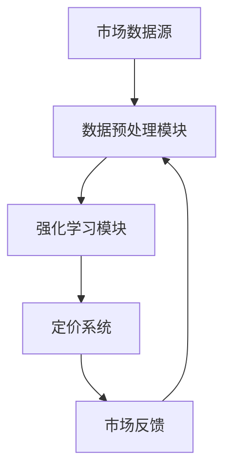
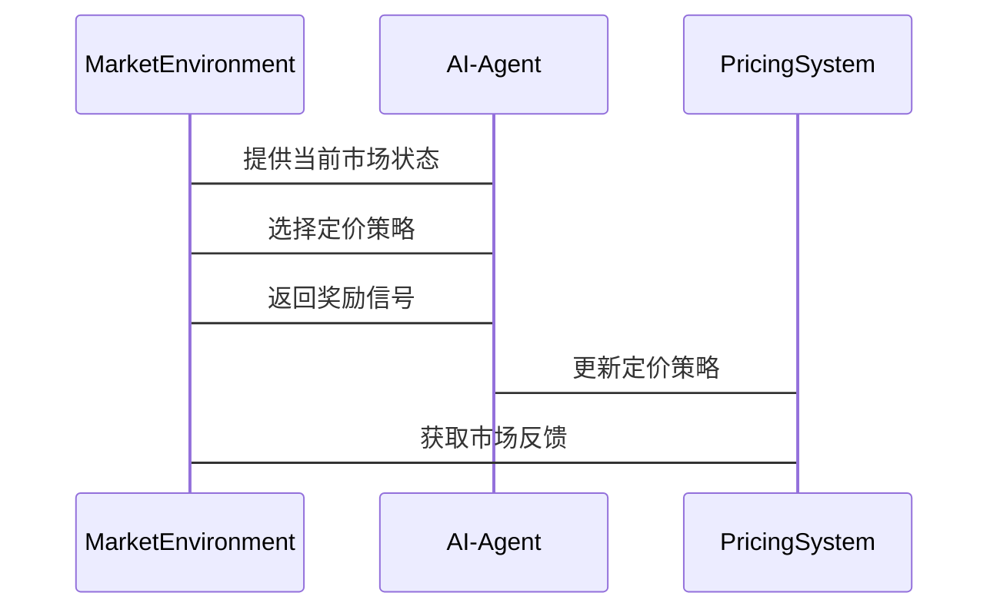

                 


# 企业AI Agent的强化学习在动态定价策略中的应用

---

## 关键词：  
- AI Agent  
- 强化学习  
- 动态定价策略  
- 企业应用  
- 算法实现  

---

## 摘要：  
本文探讨了AI Agent结合强化学习在动态定价策略中的应用。通过分析强化学习的算法原理，结合企业动态定价的实际需求，详细阐述了AI Agent如何通过强化学习优化定价策略。文章内容涵盖强化学习的核心算法、动态定价系统的系统架构设计、项目实战案例以及未来研究方向。

---

# 第1章 AI Agent与强化学习概述

## 1.1 AI Agent的基本概念

### 1.1.1 AI Agent的定义  
AI Agent（人工智能代理）是指能够感知环境并采取行动以实现目标的智能实体。它可以是一个软件程序、一个机器人或任何能够执行任务的智能系统。

### 1.1.2 AI Agent的核心属性  
- **自主性**：AI Agent能够自主决策，无需外部干预。  
- **反应性**：能够实时感知环境变化并做出反应。  
- **目标导向**：所有行动都围绕实现特定目标展开。  
- **学习能力**：能够通过经验改进自身行为。  

### 1.1.3 AI Agent与传统AI的区别  
| 属性          | 传统AI               | AI Agent             |  
|---------------|----------------------|----------------------|  
| 行为模式      | 静态、被动           | 动态、主动           |  
| 任务目标      | 专注于特定问题       | 具备自主目标设定能力 |  
| 适应性        | 较低                 | 较高                 |  

---

## 1.2 强化学习的基本原理

### 1.2.1 强化学习的定义  
强化学习（Reinforcement Learning, RL）是一种通过试错方法，使智能体在与环境交互中学习策略，以最大化累计奖励的机器学习范式。

### 1.2.2 强化学习的核心要素  
- **状态（State）**：智能体所处环境的当前情况。  
- **动作（Action）**：智能体在给定状态下采取的行动。  
- **奖励（Reward）**：智能体采取行动后获得的反馈，用于指导学习方向。  
- **策略（Policy）**：定义智能体在每个状态下选择动作的概率分布。  
- **值函数（Value Function）**：评估某个状态下采取特定动作的价值。  

### 1.2.3 强化学习与监督学习的区别  

| 属性          | 监督学习              | 强化学习              |  
|---------------|----------------------|----------------------|  
| 数据来源      | 标签数据              | 奖励信号              |  
| 反馈机制      | 确定性反馈            | 延时反馈              |  
| 决策方式      | 基于规则或模型        | 基于试错和经验        |  

---

# 第2章 动态定价策略的背景与挑战

## 2.1 动态定价的定义与特点

### 2.1.1 动态定价的定义  
动态定价是指根据市场环境、供需变化和消费者行为实时调整产品或服务价格的定价策略。

### 2.1.2 动态定价的核心要素  
- **数据源**：实时市场数据、消费者行为数据、竞争对手数据。  
- **定价模型**：基于历史数据和市场趋势的数学模型。  
- **反馈机制**：根据销售结果和市场反馈调整定价策略。  

### 2.1.3 动态定价与静态定价的区别  

| 属性          | 静态定价              | 动态定价              |  
|---------------|----------------------|----------------------|  
| 定价依据      | 固定或周期性数据      | 实时数据              |  
| 定价频率      | 低频或固定            | 高频或实时            |  
| 调整依据      | 预设规则              | 实时反馈              |  

---

## 2.2 企业动态定价的挑战

### 2.2.1 数据获取的难度  
- 数据来源分散，清洗和处理成本高。  
- 数据实时性要求高，对计算能力提出挑战。  

### 2.2.2 市场环境的不确定性  
- 市场需求波动大，难以预测。  
- 竞争对手策略调整频繁，影响定价决策。  

### 2.2.3 竞争对手的动态影响  
- 竞争对手的价格调整可能影响自身定价策略的有效性。  
- 需要实时监控竞争对手的动态，增加数据处理复杂性。  

---

## 2.3 AI Agent在动态定价中的应用潜力

### 2.3.1 AI Agent在定价策略中的优势  
- **高效的数据处理能力**：能够快速分析大量数据，提供实时定价建议。  
- **实时决策能力**：能够在极短时间内做出定价调整。  
- **自适应学习能力**：能够根据市场反馈不断优化定价策略。  

### 2.3.2 强化学习在动态定价中的应用前景  
- **强化学习的实时性优势**：能够快速响应市场变化。  
- **强化学习的自适应性优势**：能够根据市场反馈动态调整策略。  
- **强化学习的可扩展性优势**：适用于大规模数据处理和复杂场景。  

---

# 第3章 强化学习算法原理与数学模型

## 3.1 强化学习算法原理

### 3.1.1 Q-Learning算法

#### 算法步骤：  


### 3.1.2 Deep Q-Networks (DQN)算法  

```python
import numpy as np
class DQN:
    def __init__(self, state_space, action_space, lr=0.01):
        self.state_space = state_space
        self.action_space = action_space
        self.lr = lr
        # 简单的神经网络结构，实际应用中可使用更复杂的架构
        self.model = self._build_model()
    
    def _build_model(self):
        import tensorflow as tf
        model = tf.keras.Sequential([
            tf.keras.layers.Dense(64, activation='relu', input_dim=self.state_space),
            tf.keras.layers.Dense(64, activation='relu'),
            tf.keras.layers.Dense(self.action_space, activation='linear')
        ])
        model.compile(optimizer=tf.keras.optimizers.Adam(lr=self.lr), loss='mse')
        return model
    
    def remember(self, state, action, reward, next_state):
        # 简单的存储机制，实际应用中可使用经验回放
        self.memory.append((state, action, reward, next_state))
    
    def act(self, state):
        if np.random.random() < 0.1:  # 探索策略
            return np.random.randint(self.action_space)
        else:  # 利用策略
            q = self.model.predict(state[np.newaxis, :])[0]
            return np.argmax(q)
    
    def learn(self, batch_size=32):
        mini_batch = random.sample(self.memory, batch_size)
        states = np.array([x[0] for x in mini_batch])
        actions = np.array([x[1] for x in mini_batch])
        rewards = np.array([x[2] for x in mini_batch])
        next_states = np.array([x[3] for x in mini_batch])
        
        targets = self.model.predict(states)
        next_Q = self.model.predict(next_states)
        targets[range(batch_size), actions] = rewards + 0.95 * np.max(next_Q, axis=1)
        self.model.fit(states, targets, epochs=1, verbose=0)
```

### 3.1.3 Policy Gradient方法  

#### 数学模型：  
策略梯度法的目标是最优化策略函数 $\pi(a|s)$，即最大化期望奖励：  
$$ J(\pi) = \mathbb{E}_{\tau}[R(\tau)] $$  
其中，$\tau$ 是轨迹，$R(\tau)$ 是轨迹的总奖励。  

---

## 3.2 动态定价中的强化学习模型

### 3.2.1 动态定价的强化学习框架  



### 3.2.2 强化学习在定价策略中的数学模型  

#### 状态-动作价值函数：  
$$ Q(s, a) = Q(s, a') + \alpha (r + \gamma Q(s, a) - Q(s, a')) $$  

#### 策略优化函数：  
$$ \theta_{t+1} = \theta_t + \alpha (r - Q(s, a; \theta_t)) $$  

---

# 第4章 动态定价系统的系统分析与架构设计

## 4.1 系统功能设计

### 4.1.1 领域模型  



---

## 4.2 系统架构设计  



---

## 4.3 系统接口设计  

### 4.3.1 接口描述  
- **输入接口**：市场数据源接口、用户行为数据接口。  
- **输出接口**：实时定价接口、市场反馈接口。  

### 4.3.2 接口交互流程  



---

# 第5章 项目实战与案例分析

## 5.1 项目环境安装

### 5.1.1 安装依赖  

```bash
pip install numpy tensorflow matplotlib
```

---

## 5.2 核心代码实现

### 5.2.1 强化学习模块实现  

```python
import numpy as np
import tensorflow as tf
import matplotlib.pyplot as plt

class DQN_Agent:
    def __init__(self, state_dim, action_dim, lr=0.01):
        self.state_dim = state_dim
        self.action_dim = action_dim
        self.lr = lr
        self.model = self._build_model()
        self.memory = []
    
    def _build_model(self):
        model = tf.keras.Sequential([
            tf.keras.layers.Dense(64, activation='relu', input_dim=self.state_dim),
            tf.keras.layers.Dense(64, activation='relu'),
            tf.keras.layers.Dense(self.action_dim, activation='linear')
        ])
        model.compile(optimizer=tf.keras.optimizers.Adam(lr=self.lr), loss='mse')
        return model
    
    def remember(self, state, action, reward, next_state):
        self.memory.append((state, action, reward, next_state))
    
    def act(self, state):
        if np.random.random() < 0.1:
            return np.random.randint(self.action_dim)
        else:
            q = self.model.predict(state[np.newaxis, :])[0]
            return np.argmax(q)
    
    def learn(self, batch_size=32):
        if len(self.memory) < batch_size:
            return
        mini_batch = random.sample(self.memory, batch_size)
        states = np.array([x[0] for x in mini_batch])
        actions = np.array([x[1] for x in mini_batch])
        rewards = np.array([x[2] for x in mini_batch])
        next_states = np.array([x[3] for x in mini_batch])
        
        targets = self.model.predict(states)
        next_Q = self.model.predict(next_states)
        targets[range(batch_size), actions] = rewards + 0.95 * np.max(next_Q, axis=1)
        self.model.fit(states, targets, epochs=1, verbose=0)
```

### 5.2.2 动态定价系统实现  

```python
class DynamicPricingSystem:
    def __init__(self, agent):
        self.agent = agent
        self.current_price = 0
        self.reward_history = []
    
    def update_price(self):
        state = self.get_current_state()
        action = self.agent.act(state)
        self.current_price = self.get_price_from_action(action)
    
    def get_current_state(self):
        # 简单示例，实际可根据市场数据构建复杂状态
        return np.array([market_demand, market_supply, competitor_prices])
    
    def get_price_from_action(self, action):
        # 简单示例，实际可根据动作选择具体价格
        return self.price_range[action]
    
    def get_reward(self):
        # 简单示例，实际可根据销售情况和利润计算奖励
        return np.random.normal(0, 1)
```

---

## 5.3 案例分析

### 5.3.1 案例场景  
假设某电商平台需要根据市场需求和竞争对手的定价动态调整自身产品价格。  

### 5.3.2 实施步骤  
1. 数据收集：收集市场供需数据、竞争对手价格数据、用户行为数据。  
2. 状态定义：定义市场状态，如需求强度、竞争程度、库存水平等。  
3. 动作定义：定义可能的价格调整动作，如降价、涨价、保持原价。  
4. 奖励设计：设计奖励机制，如销售额增长、利润增加等。  
5. 系统训练：使用强化学习算法训练AI Agent。  
6. 系统部署：将AI Agent集成到动态定价系统中。  

### 5.3.3 实验结果  

```python
# 训练过程可视化
plt.plot(agent.reward_history)
plt.xlabel('Episode')
plt.ylabel('Total Reward')
plt.show()
```

---

# 第6章 总结与展望

## 6.1 总结

### 6.1.1 核心观点回顾  
- AI Agent通过强化学习能够有效优化企业动态定价策略。  
- 强化学习的实时性和自适应性使其成为动态定价的理想选择。  

### 6.1.2 实践价值总结  
- 提高定价效率和准确性。  
- 降低定价成本，提升企业利润。  

---

## 6.2 未来研究方向

### 6.2.1 算法优化方向  
- 更复杂的强化学习算法，如多智能体强化学习。  
- 更高效的训练方法，如元学习和迁移学习。  

### 6.2.2 应用场景拓展  
- 更多行业的动态定价应用，如金融、医疗等。  
- 结合其他技术，如区块链和大数据分析。  

---

## 6.3 最佳实践 Tips

1. 在实际应用中，建议结合具体业务场景设计奖励机制。  
2. 数据预处理和特征工程对模型性能影响重大，需重点关注。  
3. 系统部署时，建议使用云原生架构，确保高可用性和可扩展性。  

---

## 6.4 注意事项

1. 动态定价可能面临法律和伦理问题，需提前做好合规性评估。  
2. 系统上线前，建议进行充分的测试和验证，避免重大损失。  

---

## 6.5 拓展阅读

-《强化学习：理论与算法》  
-《动态定价与市场响应分析》  
-《AI Agent在商业决策中的应用》  

---

# 作者：AI天才研究院（AI Genius Institute） & 禅与计算机程序设计艺术（Zen And The Art of Computer Programming）

---

**文章结尾说明**：  
本文从AI Agent和强化学习的基本概念出发，结合动态定价的实际需求，详细阐述了AI Agent如何通过强化学习优化定价策略。通过案例分析和系统设计，展示了强化学习在动态定价中的应用潜力。希望本文能够为企业的动态定价策略提供新的思路和参考。

