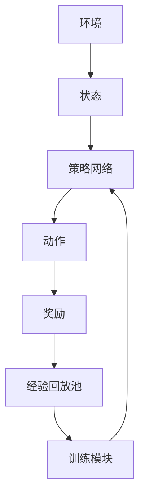

                 

# 企业AI Agent的强化学习应用：持续优化决策

> **关键词**: 企业AI Agent, 强化学习, 决策优化, 算法原理, 企业应用  
> **摘要**: 本文深入探讨了AI Agent在企业中的强化学习应用，分析了强化学习的核心概念、算法原理及其在企业决策优化中的具体应用。通过实际案例和系统架构设计，展示了如何利用强化学习提升企业的决策效率和优化能力。

---

## 第1章: AI Agent与强化学习概述

### 1.1 AI Agent的基本概念

#### 1.1.1 什么是AI Agent
AI Agent（人工智能代理）是指能够感知环境、自主决策并采取行动的智能实体。它可以是一个软件程序、机器人或其他智能系统，通过与环境交互来实现特定目标。

#### 1.1.2 AI Agent的类型
AI Agent可以分为以下几类：
1. **反应式Agent**：基于当前感知做出反应，不依赖历史信息。
2. **认知式Agent**：具有复杂推理和规划能力，能够处理不确定性和模糊性。
3. **学习型Agent**：通过与环境交互学习，改进自身的决策能力。
4. **混合式Agent**：结合上述多种类型的特点。

#### 1.1.3 AI Agent的核心特征
- **自主性**：能够在没有外部干预的情况下运行。
- **反应性**：能够感知环境并实时调整行为。
- **目标导向**：所有行动都围绕实现特定目标展开。
- **学习能力**：通过经验改进决策能力。

### 1.2 强化学习的基本概念

#### 1.2.1 强化学习的定义
强化学习（Reinforcement Learning, RL）是一种机器学习范式，其中智能体通过与环境交互来学习如何做出决策。智能体通过试错机制，最大化累积奖励来优化其行为。

#### 1.2.2 强化学习的核心要素
1. **状态（State）**：环境在某一时刻的描述。
2. **动作（Action）**：智能体在某一状态下采取的行为。
3. **奖励（Reward）**：智能体采取动作后获得的反馈，用于评估动作的好坏。
4. **策略（Policy）**：决定智能体在某一状态下采取哪个动作的规则。
5. **价值函数（Value Function）**：评估某个状态或状态-动作对的价值。

#### 1.2.3 强化学习与监督学习的区别
| 特性 | 监督学习 | 强化学习 |
|------|----------|----------|
| 数据 | 标签数据 | 奖励信号 |
| 目标 | 最小化误差 | 最大化累积奖励 |
| 交互 | 静态数据 | 动态环境 |

### 1.3 企业AI Agent的强化学习应用背景

#### 1.3.1 企业决策优化的挑战
企业在决策过程中面临以下挑战：
1. **复杂性**：决策涉及多个变量，且变量之间相互影响。
2. **不确定性**：环境动态变化，决策结果具有不确定性。
3. **效率**：传统决策方法效率低下，难以应对实时决策需求。

#### 1.3.2 强化学习在企业决策中的优势
1. **数据驱动**：通过与环境交互，智能体能够从经验中学习。
2. **自主优化**：智能体能够在复杂环境中自主优化决策。
3. **实时适应**：能够根据环境变化实时调整决策策略。

#### 1.3.3 当前企业AI Agent的应用现状
AI Agent已经在多个企业场景中得到应用，例如：
1. **供应链管理**：优化库存管理、物流调度。
2. **市场营销**：个性化推荐、广告投放优化。
3. **金融投资**：自动化交易、风险控制。

### 1.4 本章小结
本章介绍了AI Agent和强化学习的基本概念，并分析了强化学习在企业决策优化中的优势和应用背景，为后续内容奠定了基础。

---

## 第2章: 强化学习的核心概念与数学模型

### 2.1 强化学习的基本框架

#### 2.1.1 状态空间
状态空间是智能体可能遇到的所有状态的集合。例如，在一个迷宫导航问题中，状态可以是智能体所在的位置。

#### 2.1.2 动作空间
动作空间是智能体在某一状态下可以采取的所有动作的集合。例如，在游戏《贪吃蛇》中，动作可以是“左转”、“右转”、“前进”。

#### 2.1.3 奖励函数
奖励函数定义了智能体在某一状态下采取某个动作后获得的奖励。奖励函数的设计对于强化学习的效果至关重要。

#### 2.1.4 策略与价值函数
- **策略（Policy）**：表示智能体在某一状态下采取某个动作的概率分布。
- **价值函数（Value Function）**：评估某个状态或状态-动作对的价值。

### 2.2 Markov决策过程（MDP）

#### 2.2.1 MDP的定义
MDP是一个五元组 $(S, A, P, R, \gamma)$，其中：
- $S$：状态空间。
- $A$：动作空间。
- $P$：状态转移概率。
- $R$：奖励函数。
- $\gamma$：折扣因子，用于平衡当前奖励和未来奖励的重要性。

#### 2.2.2 MDP的组成部分
1. 状态空间：智能体可能遇到的所有状态。
2. 动作空间：智能体在某一状态下可以采取的所有动作。
3. 状态转移概率：智能体采取某个动作后转移到下一个状态的概率。
4. 奖励函数：智能体在某一状态下采取某个动作后获得的奖励。

#### 2.2.3 MDP与强化学习的关系
强化学习可以看作是在MDP框架下的优化问题，目标是找到最优策略，使得累积奖励最大化。

### 2.3 数学模型与公式

#### 2.3.1 状态转移概率
状态转移概率$P(s' | s, a)$表示在状态$s$下采取动作$a$后转移到状态$s'$的概率。

#### 2.3.2 价值函数的定义
价值函数$V(s)$表示智能体在状态$s$下采取最优策略时的预期累积奖励。

$$ V(s) = \max_a \left( R(s, a) + \gamma \sum_{s'} P(s' | s, a) V(s') \right) $$

#### 2.3.3 策略函数的定义
策略函数$\pi(a | s)$表示智能体在状态$s$下采取动作$a$的概率。

$$ \pi(a | s) = P(\text{选择动作 } a \text{ 在状态 } s) $$

#### 2.3.4 Q-learning算法的数学表达
Q-learning算法的目标是学习状态-动作对的价值$Q(s, a)$。

$$ Q(s, a) = Q(s, a) + \alpha \left( R(s, a) + \gamma \max_{a'} Q(s', a') - Q(s, a) \right) $$

其中：
- $\alpha$：学习率，控制更新步长。
- $\gamma$：折扣因子，平衡当前奖励和未来奖励。

---

## 第3章: 强化学习算法的原理与实现

### 3.1 策略梯度方法

#### 3.1.1 策略梯度的基本思想
策略梯度方法通过优化策略的参数，使得累积奖励最大化。其核心思想是通过梯度 ascent 更新策略参数，使得目标函数（即累积奖励）的最大化。

#### 3.1.2 策略梯度的实现步骤
1. 初始化策略参数$\theta$。
2. 根据当前策略生成动作$a$。
3. 计算梯度$\nabla_\theta J(\theta)$，其中$J(\theta)$是目标函数。
4. 更新策略参数：$\theta = \theta + \alpha \nabla_\theta J(\theta)$。

#### 3.1.3 策略梯度的优缺点
- 优点：可以直接优化策略，避免值函数的估计。
- 缺点：梯度计算可能较为复杂，且需要处理策略的稳定性问题。

### 3.2 Q-learning算法

#### 3.2.1 Q-learning的基本原理
Q-learning算法通过学习状态-动作对的价值函数$Q(s, a)$，来优化决策策略。智能体通过与环境交互，更新$Q$表，使得$Q(s, a)$逼近最优值。

#### 3.2.2 Q-learning的实现步骤
1. 初始化$Q$表，所有状态-动作对的初始值为0。
2. 在每个时间步：
   - 根据当前状态$s$选择动作$a$。
   - 执行动作$a$，观察下一个状态$s'$和奖励$R$。
   - 更新$Q(s, a)$：$Q(s, a) = Q(s, a) + \alpha (R + \gamma \max_a Q(s', a) - Q(s, a))$。

#### 3.2.3 Q-learning的收敛性分析
在离策情况下，Q-learning算法可以收敛到最优策略，前提是满足探索率递减和步长衰减等条件。

### 3.3 深度强化学习

#### 3.3.1 深度强化学习的定义
深度强化学习是将深度学习与强化学习结合，利用神经网络来近似策略或价值函数。

#### 3.3.2 DQN算法的原理
DQN（Deep Q-Network）算法通过使用两个神经网络来近似Q值函数：主网络和目标网络。主网络负责更新，目标网络负责稳定更新过程。

#### 3.3.3 DQN算法的实现步骤
1. 初始化主网络$Q_main$和目标网络$Q_target$，参数相同。
2. 在每个时间步：
   - 根据$Q_main$选择动作$a$。
   - 执行动作$a$，观察下一个状态$s'$和奖励$R$。
   - 将经验$(s, a, R, s')$存储在经验回放池中。
   - 从经验回放池中随机采样一批经验，计算目标值$y = R + \gamma \max_a Q_target(s', a)$。
   - 使用随机梯度下降更新$Q_main$，使其逼近$y$。
   - 定期同步$Q_main$和$Q_target$的参数（软更新）。

### 3.4 强化学习算法的比较

| 特性         | 策略梯度 | Q-learning | DQN         |
|--------------|----------|------------|-------------|
| 是否需要值函数 | 否       | 是         | 是（神经网络） |
| 是否需要探索 | 是       | 是         | 是（经验回放） |
| 适用场景     | 连续动作 | 离散动作   | 复杂环境     |

---

## 第4章: 企业AI Agent的强化学习应用分析

### 4.1 企业决策优化的场景分析

#### 4.1.1 供应链管理
AI Agent可以通过强化学习优化库存管理、物流调度和供应商选择。

#### 4.1.2 营销策略
AI Agent可以根据市场反馈动态调整广告投放、价格策略和客户分群。

#### 4.1.3 资源分配
AI Agent可以优化企业内部资源分配，例如人力资源、资金分配和设备使用。

### 4.2 AI Agent在企业决策中的应用案例

#### 4.2.1 供应链优化案例
某企业通过AI Agent和强化学习优化供应链管理，成功降低了库存成本15%。

#### 4.2.2 营销策略优化案例
某企业利用AI Agent动态调整广告投放策略，广告点击率提高了20%。

#### 4.2.3 资源分配优化案例
某企业通过强化学习优化设备使用，设备利用率提高了10%。

### 4.3 强化学习在企业决策中的优势

#### 4.3.1 高效性
强化学习能够在较短时间内找到近似最优解，适合实时决策场景。

#### 4.3.2 精准性
通过与环境交互，强化学习能够根据实时反馈调整策略，提高决策精准度。

#### 4.3.3 可扩展性
强化学习算法能够扩展到更大的状态和动作空间，适合复杂的企业决策场景。

### 4.4 本章小结
本章分析了强化学习在企业决策优化中的应用场景和优势，通过实际案例展示了其在供应链管理、营销策略和资源分配中的价值。

---

## 第5章: 企业AI Agent强化学习系统的架构设计

### 5.1 系统架构概述

#### 5.1.1 系统整体架构
企业AI Agent强化学习系统通常包括以下几个模块：
1. **环境接口**：与外部环境交互，获取状态和奖励。
2. **策略网络**：负责生成动作或优化策略。
3. **经验回放池**：存储历史经验，用于离线训练。
4. **训练模块**：负责更新策略或Q值函数。
5. **执行模块**：根据当前策略执行动作。

#### 5.1.2 各模块的功能描述
- **环境接口**：负责与外部环境交互，获取状态和奖励。
- **策略网络**：基于当前状态生成动作，或优化策略参数。
- **经验回放池**：存储历史经验，包括状态、动作、奖励和下一个状态。
- **训练模块**：根据经验回放池中的数据，更新策略网络或Q值函数。
- **执行模块**：根据策略网络生成的动作执行实际操作。

#### 5.1.3 系统的交互流程
1. 系统初始化，加载策略网络和经验回放池。
2. 系统根据当前状态生成动作。
3. 系统执行动作，观察下一个状态和奖励。
4. 系统将经验存储在经验回放池中。
5. 系统根据经验回放池中的数据更新策略网络或Q值函数。

### 5.2 系统功能设计

#### 5.2.1 系统整体架构设计
企业AI Agent强化学习系统的整体架构如下图所示：

#### 5.2.2 系统功能模块设计
1. **环境接口模块**：负责与外部环境交互，获取状态和奖励。
2. **策略网络模块**：负责生成动作或优化策略。
3. **经验回放池模块**：存储历史经验，用于训练。
4. **训练模块**：负责更新策略网络或Q值函数。

#### 5.2.3 系统交互流程设计
1. 系统初始化，加载策略网络和经验回放池。
2. 系统根据当前状态生成动作。
3. 系统执行动作，观察下一个状态和奖励。
4. 系统将经验存储在经验回放池中。
5. 系统根据经验回放池中的数据更新策略网络或Q值函数。

### 5.3 本章小结
本章详细介绍了企业AI Agent强化学习系统的整体架构和功能设计，为后续的系统实现奠定了基础。

---

## 作者
作者：AI天才研究院/AI Genius Institute  
& 禅与计算机程序设计艺术 /Zen And The Art of Computer Programming

