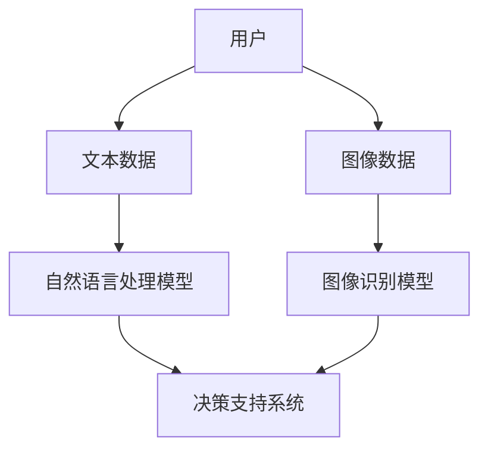
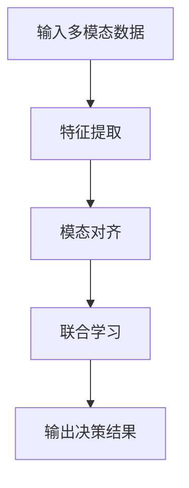
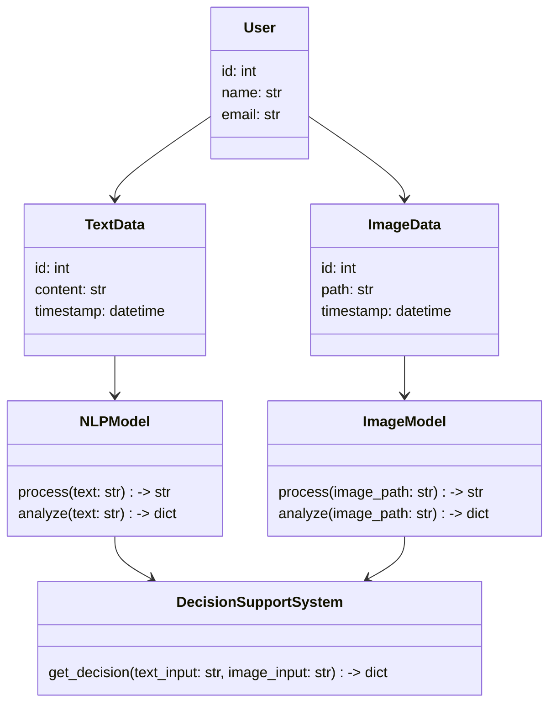
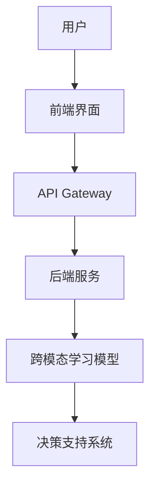
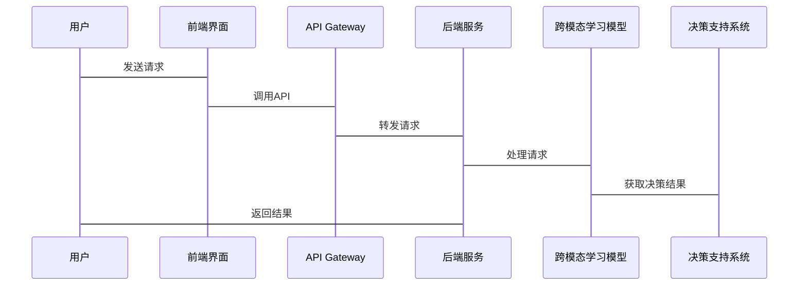

                 


# 企业AI Agent的跨模态学习：融合非结构化数据的决策支持

## 关键词：AI Agent，跨模态学习，非结构化数据，决策支持，深度学习

## 摘要：  
本文深入探讨了企业AI Agent在跨模态学习中的应用，特别是在融合非结构化数据方面。通过分析跨模态学习的核心概念、算法原理和系统架构，结合实际项目实战，本文详细阐述了如何利用多模态数据提升企业决策支持能力。文章还提供了丰富的技术细节和代码示例，帮助读者理解并实现跨模态学习在企业中的应用。

---

## 第一部分: 背景介绍

### #1: AI Agent的基本概念

#### 1.1 AI Agent的定义与特点
- **定义**: AI Agent（人工智能代理）是指能够感知环境、执行任务并做出决策的智能体。它可以自主地与用户或系统交互，并根据输入信息做出响应。
- **特点**:
  - **自主性**: 能够自主决策和行动。
  - **反应性**: 能够实时感知环境并做出反应。
  - **目标导向**: 具备明确的目标，能够为用户解决问题。

#### 1.2 AI Agent在企业中的作用
- **客户支持**: 通过自然语言处理技术，帮助企业提供高效的客户服务。
- **业务流程自动化**: 利用AI Agent自动化处理重复性任务，提升效率。
- **数据驱动的决策支持**: 基于多模态数据，为企业提供精准的决策支持。

### #2: 跨模态学习的背景与意义

#### 2.1 跨模态学习的定义
- 跨模态学习是指在同一学习任务中，结合多种数据模态（如文本、图像、语音等）进行信息处理和学习的方法。

#### 2.2 跨模态学习的核心思想
- 通过融合不同模态的数据，提升模型的表达能力和泛化能力。

#### 2.3 跨模态学习在企业中的应用价值
- **提升决策精度**: 通过融合多模态数据，提供更全面的决策支持。
- **增强用户体验**: 通过多模态交互，提升用户体验。
- **提高业务效率**: 通过自动化处理多模态数据，提升业务效率。

### #3: 非结构化数据的重要性

#### 3.1 非结构化数据的定义
- 非结构化数据是指没有固定结构、难以用数据库表结构表示的数据，如文本、图像、语音等。

#### 3.2 非结构化数据的类型与特点
- **文本数据**: 包括自然语言文本、日志等。
- **图像数据**: 包括图片、视频等。
- **语音数据**: 包括音频、语音记录等。
- **特点**:
  - **多样性**: 数据类型多样。
  - **复杂性**: 数据结构复杂，难以处理。
  - **信息丰富性**: 非结构化数据通常包含丰富的语义信息。

### #4: 企业AI Agent的应用场景

#### 4.1 客户服务与支持
- 通过自然语言处理和语音识别技术，提供智能客服支持。

#### 4.2 业务流程自动化
- 通过AI Agent自动化处理订单、审批等业务流程。

#### 4.3 数据驱动的决策支持
- 通过融合多模态数据，提供精准的市场分析、风险评估等决策支持。

---

## 第二部分: 跨模态学习的核心概念与联系

### #5: 跨模态学习的原理

#### 5.1 跨模态学习的基本原理
- 跨模态学习的核心是通过多模态数据的融合，提升模型的学习能力和表达能力。

#### 5.2 跨模态学习的关键技术
- **多模态对齐**: 将不同模态的数据对齐到同一个语义空间。
- **联合学习**: 在多模态数据上进行联合建模，提升模型的泛化能力。

#### 5.3 跨模态学习的实现步骤
1. 数据采集与预处理。
2. 多模态数据对齐。
3. 联合学习模型训练。
4. 决策结果输出。

### #6: 跨模态学习的核心概念对比

#### 6.1 不同模态数据的特征对比
| 模态类型 | 数据特点 | 示例 |
|----------|----------|------|
| 文本      | 高维、稀疏 | 文本数据、日志数据 |
| 图像      | 高维、密集 | 图片数据、视频数据 |
| 语音      | 高维、时序 | 音频数据、语音记录 |

#### 6.2 跨模态学习与单模态学习的对比
| 对比维度 | 跨模态学习 | 单模态学习 |
|----------|------------|------------|
| 数据输入 | 多模态数据 | 单一模态数据 |
| 模型能力 | 融合多模态信息 | 仅依赖单一模态信息 |
| 决策精度 | 更高 | 较低 |

#### 6.3 跨模态学习与多模态学习的对比
| 对比维度 | 跨模态学习 | 多模态学习 |
|----------|------------|------------|
| 学习目标 | 融合多模态信息，提升决策精度 | 处理多模态数据，不强调融合 |
| 应用场景 | 需要多模态数据融合的场景 | 多模态数据处理的场景 |

### #7: 跨模态学习的ER实体关系图


---

## 第三部分: 跨模态学习的算法原理

### #8: 跨模态学习算法的流程

#### 8.1 多模态对齐算法


#### 8.2 基于深度学习的跨模态对齐算法
```python
import torch
import torch.nn as nn

class CrossModalAligner(nn.Module):
    def __init__(self, embed_dim, hidden_dim):
        super(CrossModalAligner, self).__init__()
        self.text_encoder = nn.LSTM(embed_dim, hidden_dim, batch_first=True)
        self.img_encoder = nn.Conv2d(embed_dim, hidden_dim, kernel_size=3, stride=1, padding=1)
        self.align_layer = nn.Linear(hidden_dim, hidden_dim)
    
    def forward(self, text_input, img_input):
        text_features, _ = self.text_encoder(text_input)
        img_features = self.img_encoder(img_input)
        aligned_features = self.align_layer(text_features + img_features)
        return aligned_features
```

#### 8.3 跨模态学习的数学模型
$$ \text{损失函数} = \lambda_1 \text{CE}(p, y) + \lambda_2 \text{KL}(q, p) $$
其中：
- $\text{CE}$ 表示交叉熵损失。
- $\text{KL}$ 表示KL散度。
- $\lambda_1$ 和 $\lambda_2$ 是超参数，用于平衡不同损失项的权重。

---

## 第四部分: 系统分析与架构设计

### #9: 系统功能设计

#### 9.1 领域模型类图


### #10: 系统架构设计

#### 10.1 系统架构图


### #11: 系统接口设计

#### 11.1 API接口
```python
class APIInterface:
    def __init__(self, model):
        self.model = model
    
    def process_request(self, text_input, image_input):
        result = self.model.get_decision(text_input, image_input)
        return result
```

#### 11.2 序列图


---

## 第五部分: 项目实战

### #12: 环境安装

```bash
pip install torch
pip install transformers
pip install matplotlib
pip install scikit-learn
```

### #13: 系统核心实现源代码

#### 13.1 跨模态对齐模型
```python
import torch
import torch.nn as nn
import torch.optim as optim

class CrossModalAligner(nn.Module):
    def __init__(self, embed_dim, hidden_dim):
        super(CrossModalAligner, self).__init__()
        self.text_encoder = nn.LSTM(embed_dim, hidden_dim, batch_first=True)
        self.img_encoder = nn.Conv2d(embed_dim, hidden_dim, kernel_size=3, stride=1, padding=1)
        self.align_layer = nn.Linear(hidden_dim, hidden_dim)
    
    def forward(self, text_input, img_input):
        text_features, _ = self.text_encoder(text_input)
        img_features = self.img_encoder(img_input)
        aligned_features = self.align_layer(text_features + img_features)
        return aligned_features

# 训练过程
model = CrossModalAligner(embed_dim=512, hidden_dim=256)
optimizer = optim.Adam(model.parameters(), lr=1e-4)
criterion = nn.MSELoss()

for epoch in range(num_epochs):
    for batch in dataloader:
        optimizer.zero_grad()
        text_input, img_input, labels = batch
        outputs = model(text_input, img_input)
        loss = criterion(outputs, labels)
        loss.backward()
        optimizer.step()
```

### #14: 代码应用解读与分析
- **文本编码器**: 使用LSTM对文本数据进行编码，提取文本特征。
- **图像编码器**: 使用卷积神经网络对图像数据进行编码，提取图像特征。
- **对齐层**: 将文本和图像特征对齐，并进行联合学习。

### #15: 实际案例分析

#### 15.1 案例背景
某企业希望利用跨模态学习技术，结合客户提供的文本和图像数据，提供精准的市场分析报告。

#### 15.2 实施步骤
1. 数据采集与预处理。
2. 模型训练与优化。
3. 模型部署与应用。

#### 15.3 分析结果
通过跨模态学习，企业能够更精准地分析市场趋势，提升决策效率。

### #16: 项目小结

---

## 第六部分: 最佳实践

### #17: 小结

### #18: 注意事项
- **数据质量**: 确保输入数据的高质量，避免噪声干扰。
- **模型调优**: 根据实际需求，对模型进行参数调优。
- **安全与隐私**: 注意数据安全和隐私保护。

### #19: 拓展阅读
- [《Deep Learning》- Ian Goodfellow](https://www.deeplearningbook.org/)
- [《Pattern Recognition and Machine Learning》- Christopher M. Bishop](https://www.springer.com/gp/book/9781846281488)

---

## 作者：AI天才研究院/AI Genius Institute & 禅与计算机程序设计艺术 /Zen And The Art of Computer Programming

---

**摘要**：本文系统地探讨了企业AI Agent在跨模态学习中的应用，重点分析了非结构化数据在决策支持中的作用。通过理论分析、算法实现和项目实战，本文为读者提供了全面的技术指导，帮助读者理解并掌握跨模态学习在企业中的实际应用。

