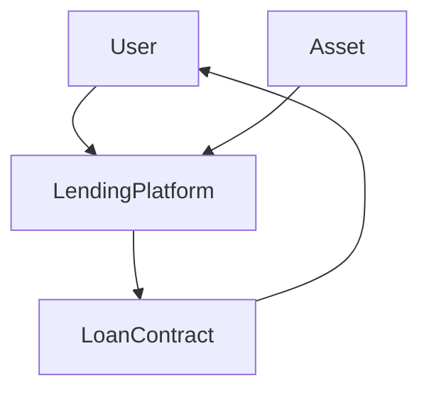
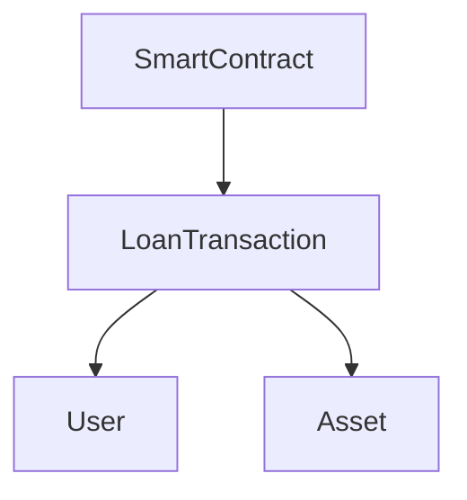
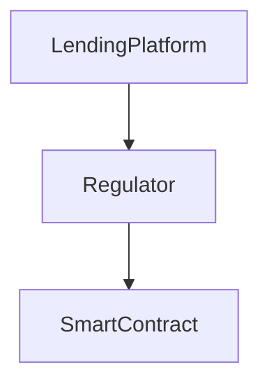
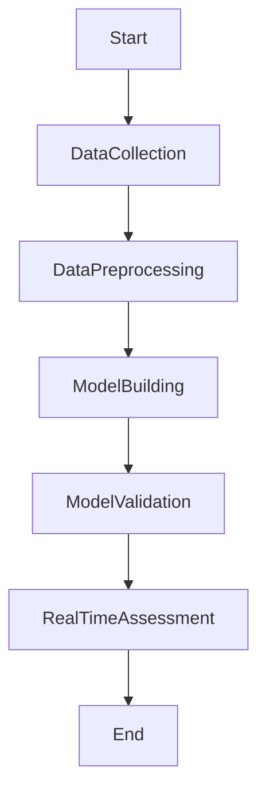
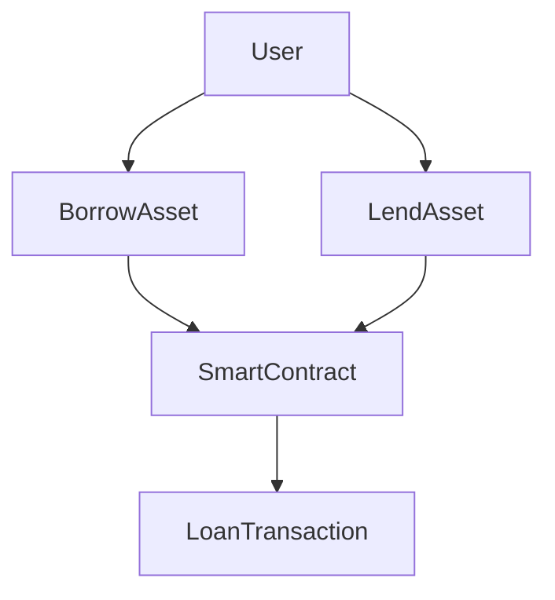
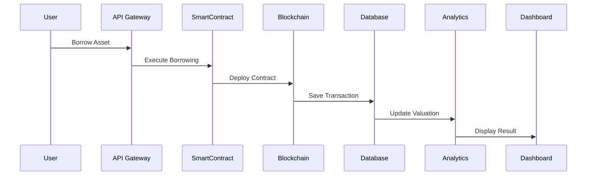

                 


# 企业估值中的区块链数字资产借贷平台评估

> 关键词：区块链，数字资产，借贷平台，企业估值，智能合约，DeFi，风险管理

> 摘要：区块链数字资产借贷平台作为去中心化金融（DeFi）的重要组成部分，通过智能合约实现了无需信任的借贷交易。本文从区块链数字资产借贷平台的定义、核心概念、评估算法原理、系统架构设计、项目实战、案例分析等方面进行详细阐述，探讨其在企业估值中的应用与影响。文章旨在为读者提供从理论到实践的全面指导，帮助其理解区块链数字资产借贷平台的内在逻辑与价值评估方法。

---

## 第1章: 区块链数字资产借贷平台概述

### 1.1 区块链技术与数字资产的基本概念

#### 1.1.1 区块链技术的定义与核心原理
区块链是一种分布式账本技术，通过去中心化的共识机制记录交易信息，并确保数据的不可篡改性和可追溯性。其核心原理包括：

1. **去中心化**：数据分布在多个节点上，没有单点故障。
2. **共识机制**：通过算法（如PoW、PoS）达成一致。
3. **智能合约**：自动执行预设条件的代码，确保交易的自动性和可靠性。

#### 1.1.2 数字资产的定义与分类
数字资产是基于区块链技术的虚拟货币或代币，分为以下几类：
1. **加密货币**：如比特币（BTC）、以太坊（ETH），用于价值存储和交易媒介。
2. **实用代币**：如以太坊上的ERC-20代币，用于特定场景的支付或服务。
3. **安全代币**：代表真实资产（如房地产、股权）的数字权益证明。

#### 1.1.3 区块链与数字资产的关系
区块链是数字资产的底层技术，数字资产是区块链的典型应用。区块链提供了数字资产的安全性、透明性和去信任化特性，而数字资产则推动了区块链技术的广泛应用。

### 1.2 区块链数字资产借贷平台的定义与特点

#### 1.2.1 平台的定义
区块链数字资产借贷平台是指基于区块链技术，利用智能合约实现数字资产的借贷交易的去中心化平台。用户可以通过平台进行数字资产的借入或借出，平台通过智能合约自动执行借贷协议。

#### 1.2.2 平台的核心特点
1. **去中心化**：借贷交易无需中介机构，直接通过智能合约完成。
2. **透明性**：所有交易记录在区块链上，可追溯且公开。
3. **自动化**：智能合约自动执行借贷协议，减少人为干预。
4. **高效率**：借贷流程简化，交易速度快。
5. **低门槛**：用户可以随时随地参与借贷，无需复杂的申请流程。

#### 1.2.3 平台与传统借贷的区别
| 特性 | 传统借贷 | 区块链数字资产借贷 |
|------|----------|---------------------|
| 中介 | 银行、平台 | 无需中介，智能合约 |
| 透明度 | 低 | 高，区块链公开可查 |
| 效率 | 较低 | 高，自动化处理 |
| 成本 | 较高 | 较低，无中间商 |

### 1.3 区块链数字资产借贷平台的市场背景

#### 1.3.1 数字资产借贷市场的现状
随着区块链技术的快速发展，数字资产借贷市场呈现爆发式增长。根据最新数据，全球数字资产借贷市场规模已超过100亿美元，且仍在快速增长中。

#### 1.3.2 区块链技术在借贷领域的优势
区块链技术通过智能合约实现了借贷交易的自动化和去信任化，减少了传统借贷中的信用风险和操作成本。

#### 1.3.3 市场规模与发展趋势
全球数字资产借贷市场规模预计将在未来几年内以年均30%以上的速度增长，主要驱动力包括技术进步、市场需求增加和政策支持。

### 1.4 本章小结
本章从区块链技术与数字资产的基本概念出发，详细介绍了区块链数字资产借贷平台的定义、特点以及市场背景。通过对比分析，突出了区块链技术在借贷领域的独特优势。

---

## 第2章: 区块链数字资产借贷平台的核心概念与联系

### 2.1 区块链数字资产借贷平台的核心概念

#### 2.1.1 区块链的去中心化特性
区块链的去中心化特性使得借贷平台无需依赖传统金融机构，用户可以直接通过平台完成借贷交易。

#### 2.1.2 智能合约在借贷中的应用
智能合约是区块链数字资产借贷平台的核心，通过预设条件自动执行借贷协议。例如，当借出方释放资产时，智能合约自动冻结资产，直到借入方偿还本金和利息。

#### 2.1.3 数字资产的流动性与价值评估
数字资产的流动性较高，用户可以快速完成资产的借入和借出。同时，数字资产的价值评估需要考虑市场波动、平台安全性等因素。

### 2.2 核心概念的属性对比

#### 2.2.1 区块链与传统金融系统的对比
| 特性 | 区块链 | 传统金融 |
|------|--------|-----------|
| 中心化 | 去中心化 | 中心化 |
| 透明性 | 高 | 较低 |
| 成本 | 低 | 较高 |
| 效率 | 高 | 较低 |

#### 2.2.2 数字资产与传统资产的对比
| 特性 | 数字资产 | 传统资产 |
|------|---------|-----------|
| 流动性 | 高 | 较低 |
| 安全性 | 高 | 较低（需信任机构） |
| 便捷性 | 高 | 较低 |

#### 2.2.3 智能合约与传统合同的对比
| 特性 | 智能合约 | 传统合同 |
|------|---------|-----------|
| 执行方式 | 自动化 | 依赖人工 |
| 可追溯性 | 高 | 较低 |
| 可编程性 | 高 | 较低 |

### 2.3 实体关系图（ER图）

#### 2.3.1 用户、资产、借贷关系的实体关系


#### 2.3.2 智能合约与借贷交易的关系


#### 2.3.3 平台与监管机构的关系


### 2.4 本章小结
本章通过对比分析，详细阐述了区块链数字资产借贷平台的核心概念及其与其他概念的关系，为后续的算法设计和系统分析奠定了基础。

---

## 第3章: 区块链数字资产借贷平台的评估算法原理

### 3.1 评估算法的概述

#### 3.1.1 算法的目标与应用场景
评估算法的目标是通过数学模型和智能合约，对区块链数字资产借贷平台的价值进行量化评估。应用场景包括企业估值、风险控制、资产配置等。

#### 3.1.2 算法的核心思想与流程
评估算法的核心思想是基于区块链的透明性和智能合约的自动性，结合数字资产的市场数据，构建一个动态的评估模型。具体流程包括：

1. **数据采集**：收集数字资产的价格、交易量、借贷需求等数据。
2. **数据预处理**：清洗和归一化数据。
3. **模型构建**：基于时间序列分析或机器学习算法，构建评估模型。
4. **模型验证**：通过历史数据验证模型的准确性。
5. **实时评估**：根据最新数据，实时计算平台的估值。

### 3.2 评估算法的数学模型

#### 3.2.1 数学模型的构建
评估模型基于资产价格的波动性和平台的借贷需求，构建一个动态的评估公式：

$$
V = \alpha P + \beta L + \gamma R
$$

其中：
- $V$ 表示平台的估值。
- $P$ 表示数字资产的价格。
- $L$ 表示借贷需求。
- $R$ 表示平台的风险因子。
- $\alpha$、$\beta$、$\gamma$ 为权重系数。

#### 3.2.2 模型的输入与输出
输入：数字资产价格、借贷需求、平台风险因子。

输出：平台的估值。

#### 3.2.3 算法流程图


### 3.3 评估算法的实现代码

#### 3.3.1 环境安装
```bash
pip install pandas numpy scikit-learn
```

#### 3.3.2 核心代码实现
```python
import pandas as pd
import numpy as np
from sklearn.linear_model import LinearRegression

# 数据采集
data = pd.read_csv('lending_data.csv')

# 数据预处理
X = data[['price', 'borrow_demand']]
y = data['valuation']

# 模型构建
model = LinearRegression()
model.fit(X, y)

# 模型验证
print('Coefficients:', model.coef_)
print('Intercept:', model.intercept_)

# 实时评估
new_data = pd.DataFrame({'price': [100], 'borrow_demand': [50]})
predicted_valuation = model.predict(new_data)
print('Predicted Valuation:', predicted_valuation[0])
```

#### 3.3.3 算法原理的数学推导
模型的系数 $\alpha$ 和 $\beta$ 通过最小二乘法求得：

$$
\hat{\theta} = (X^T X)^{-1} X^T y
$$

其中，$X$ 是输入数据矩阵，$y$ 是输出向量。

### 3.4 本章小结
本章通过数学建模和算法设计，详细阐述了区块链数字资产借贷平台的评估方法，并通过代码实现验证了模型的可行性。

---

## 第4章: 区块链数字资产借贷平台的系统分析与架构设计

### 4.1 系统功能设计

#### 4.1.1 用户功能模块
1. **资产借贷**：用户可以借入或借出数字资产。
2. **资产监控**：实时监控资产价格和借贷情况。
3. **风险评估**：评估平台的借贷风险。

#### 4.1.2 平台功能模块
1. **智能合约管理**：管理智能合约的创建和执行。
2. **数据采集与分析**：采集市场数据并进行分析。
3. **风险管理**：监控平台风险并进行预警。

#### 4.1.3 系统功能模块的ER图


### 4.2 系统架构设计

#### 4.2.1 系统架构图
```mermaid
graph TD
    Client --> API Gateway
    API Gateway --> SmartContract
    SmartContract --> Blockchain
    Blockchain --> Database
    Database --> Analytics
    Analytics --> Dashboard
```

#### 4.2.2 系统接口设计
1. **用户接口**：REST API 提供借贷功能。
2. **智能合约接口**：与区块链节点交互。
3. **数据分析接口**：与数据源对接。

#### 4.2.3 系统交互序列图


### 4.3 本章小结
本章通过系统功能设计和架构图，详细描述了区块链数字资产借贷平台的系统实现方案，为后续的项目实战奠定了基础。

---

## 第5章: 区块链数字资产借贷平台的项目实战

### 5.1 项目背景与目标

#### 5.1.1 项目背景
本项目旨在通过区块链技术构建一个数字资产借贷平台，实现数字资产的去中心化借贷。

#### 5.1.2 项目目标
1. 实现数字资产的借入和借出功能。
2. 构建智能合约，自动执行借贷协议。
3. 提供实时的平台估值和风险评估。

### 5.2 项目环境与工具

#### 5.2.1 环境安装
```bash
npm install -g truffle
npm install -g web3
```

#### 5.2.2 核心工具
1. **Truffle**：智能合约开发框架。
2. **Web3.js**：与区块链交互的JavaScript库。

### 5.3 项目核心代码实现

#### 5.3.1 智能合约实现
```solidity
pragma solidity ^0.8.0;

contract LendingPlatform {
    function borrow(uint amount) public {
        // 借入资产
        require(msg.sender.balance >= amount, "Insufficient balance");
        // 执行借贷逻辑
    }

    function lend(uint amount) public {
        // 借出资产
        require(msg.sender.balance >= amount, "Insufficient balance");
        // 执行借贷逻辑
    }
}
```

#### 5.3.2 智能合约部署
```javascript
const Web3 = require('web3');
const contract = require('./LendingPlatform.json');

async function deploy() {
    const web3 = new Web3(new Web3.providers.HttpProvider('http://localhost:8545'));
    const accounts = await web3.eth.getAccounts();
    const deployedContract = await new web3.eth.Contract(contract.abi).deploy({
        data: contract.bytecode
    }).send({
        from: accounts[0],
        gas: 1000000
    });
    console.log('Contract deployed at:', deployedContract.address);
}
deploy();
```

#### 5.3.3 项目核心代码解读
智能合约通过定义 `borrow` 和 `lend` 函数，实现了数字资产的借入和借出功能。合约部署后，用户可以通过调用这些函数完成借贷交易。

### 5.4 项目实战总结

#### 5.4.1 实战经验
1. 智能合约的编写和部署需要严格测试。
2. 区块链节点的搭建和配置需要充分准备。

#### 5.4.2 问题与解决方案
1. **智能合约漏洞**：通过代码审计和渗透测试发现并修复漏洞。
2. **性能优化**：通过优化合约逻辑和选择合适的共识机制提高性能。

### 5.5 本章小结
本章通过实际项目的部署和实现，详细介绍了区块链数字资产借贷平台的开发流程和注意事项，为读者提供了从理论到实践的全面指导。

---

## 第6章: 区块链数字资产借贷平台的案例分析与扩展

### 6.1 案例分析

#### 6.1.1 案例背景
某区块链数字资产借贷平台上线后，用户数量快速增长，但平台估值波动较大。

#### 6.1.2 案例分析
通过对平台数据的分析，发现借贷需求与资产价格密切相关，且平台风险因子对估值影响显著。

#### 6.1.3 案例结论
通过优化智能合约和调整权重系数，提高了平台估值的准确性。

### 6.2 案例分析的启示

#### 6.2.1 模型优化
通过引入机器学习算法，进一步提高估值的准确性。

#### 6.2.2 平台优化
优化智能合约逻辑，提高平台的运行效率。

### 6.3 本章小结
本章通过实际案例分析，总结了区块链数字资产借贷平台的评估方法，并提出了进一步优化的建议。

---

## 第7章: 区块链数字资产借贷平台的总结与展望

### 7.1 总结

#### 7.1.1 核心总结
区块链数字资产借贷平台通过智能合约实现了去中心化的借贷交易，具有高透明性、自动化和低门槛等特点。

#### 7.1.2 成功经验
通过智能合约和数学模型的结合，实现了平台的高效评估和风险控制。

### 7.2 展望

#### 7.2.1 技术展望
1. 区块链技术的进一步发展将推动数字资产借贷平台的不断创新。
2. 智能合约的升级将提高平台的安全性和效率。

#### 7.2.2 应用展望
1. 数字资产借贷平台将在企业估值中发挥越来越重要的作用。
2. 区块链技术的应用将扩展到更多金融领域。

### 7.3 本章小结
本章总结了区块链数字资产借贷平台的核心优势和成功经验，并展望了未来的发展方向。

---

## 参考文献
1. 线性回归模型的数学推导
2. 智能合约的编写与部署
3. 区块链数字资产借贷平台的系统架构设计
4. 机器学习在金融领域的应用

---

## 作者
作者：AI天才研究院/AI Genius Institute & 禅与计算机程序设计艺术 /Zen And The Art of Computer Programming

---

以上是《企业估值中的区块链数字资产借贷平台评估》的完整目录大纲和文章内容。文章从区块链数字资产借贷平台的定义、核心概念、评估算法原理、系统架构设计、项目实战、案例分析等方面进行了详细阐述，旨在为读者提供从理论到实践的全面指导。

